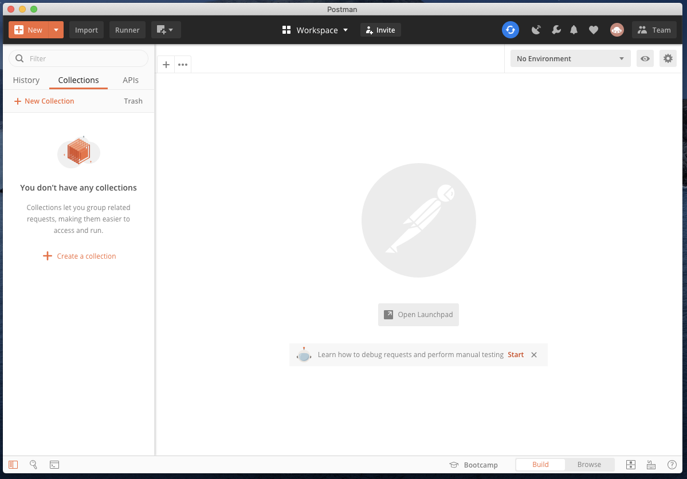
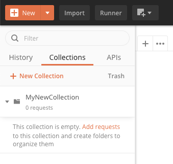
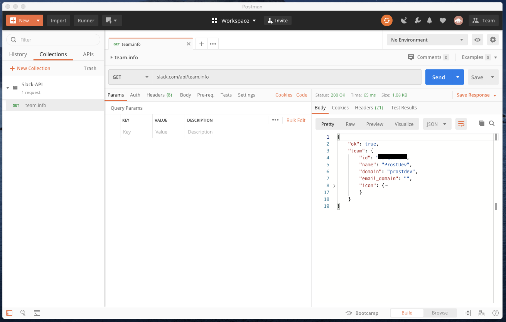
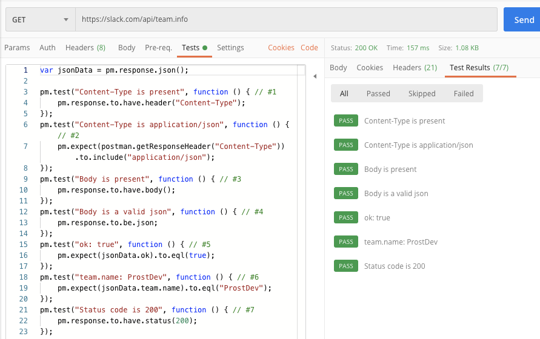
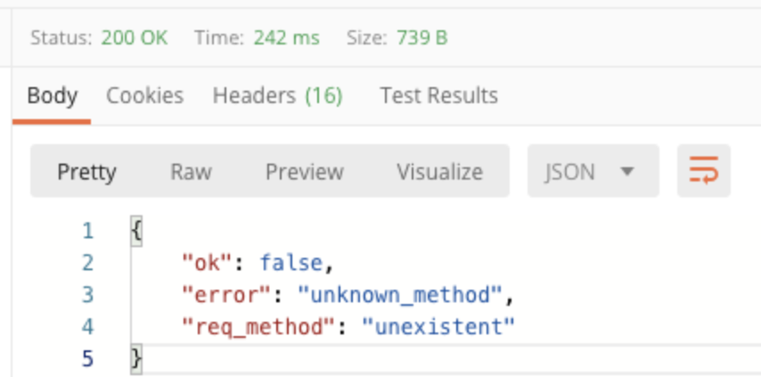
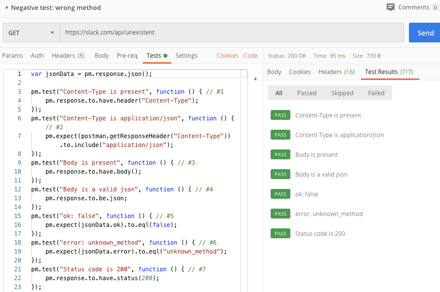
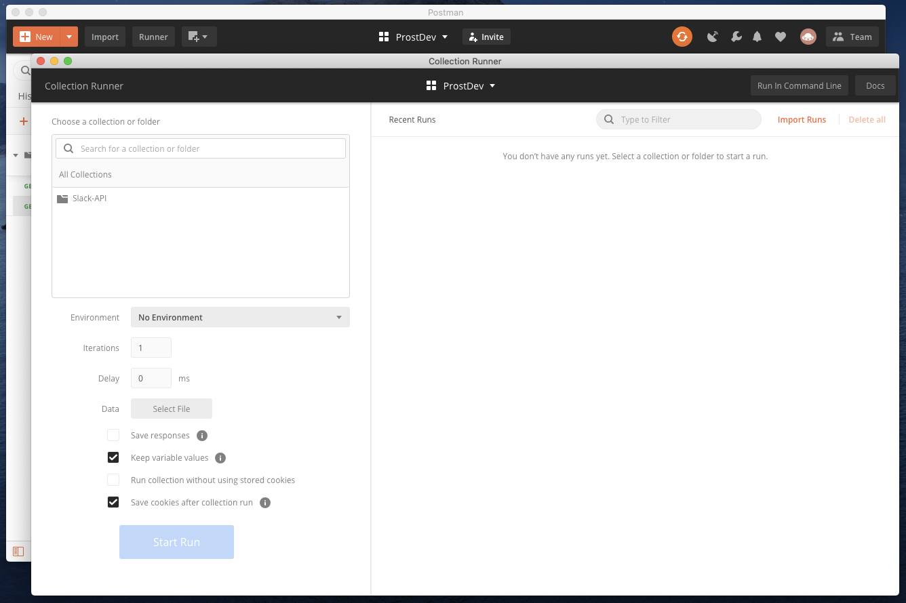
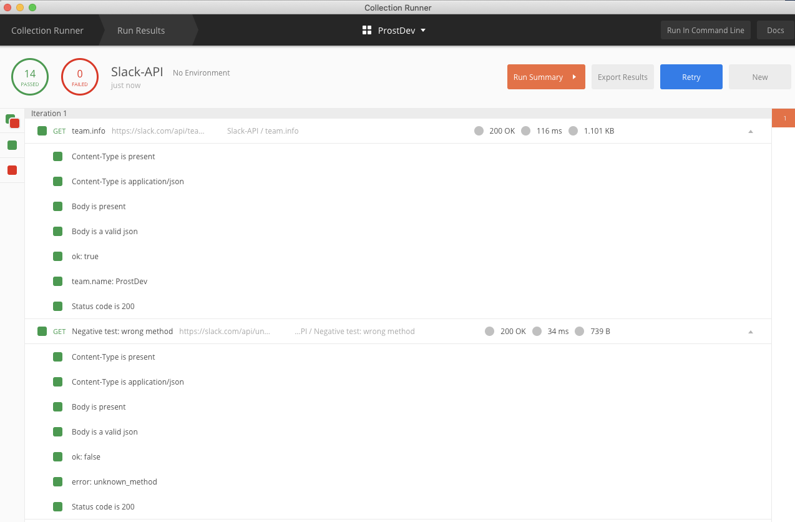

*Gist file with the tests script and GitHub repository with the Postman collection can be found at the end of the post.*

There are different types of software tests that a team can build to make sure that the final product will work as expected.

However, in this post, we’ll focus on one particular type: Regression Testing.

## What is Regression Testing?

Regression testing is a type of software testing, in which tests are created to ensure that a new change to the code did not break existing functionality.

Let’s illustrate this definition with a metaphor: Imagine that you have a car that works perfectly fine; and you know this, because you checked that everything was working:

- Do the lights turn on? Yes.
- Does the car start? Yes.
- Does the air conditioner work? Yes.
- Do the windows go down and up? Yes.
- Does the radio work? Yes.
- Are my tires pumped up? Yes.

Now, let’s say that you installed some neon lights to your car and then when you tried to turn the car on, but guess what? It didn’t work! The lights must’ve done something to the car, because it was working before installing them.

Remember the 6 tests that you performed before, to make sure that your entire car was working? Well, now that you installed the neon lights to the car, let’s do these tests once more…

- Do the lights turn on? **No**.
- Does the car start? **No**.
- Does the air conditioner work? **No**.
- Do the windows go down and up? **No**.
- Does the radio work? **No**.
- Are my tires pumped up? Yes.

So, a lot of them are failing now, and the ones that are failing are relying on the car’s battery to be able to work properly. It’s possible that when you installed the neon lights, something went wrong and it messed with the battery. You got to this conclusion by paying attention to the failed tests; and you were able to isolate this, because you did one additional test that didn’t have anything to do with the battery, and it did not fail.

This set of 6 tests, are actually regression tests. Why? Because you are performing different tests to make sure that the whole car is working properly, after you added new functionality to it. If you add more detailed tests, you will ensure even more that the car doesn’t break with a future change.

## Creating basic tests with Postman

You can download Postman for free from their website: [https://www.postman.com/downloads/](https://www.postman.com/downloads/)

Once you have it, open it, and it will look something like this:



On the left side, you have the menu to create a new collection. Collections are basically the folders where you can keep your requests. Let’s create one by clicking on “Create a collection”, and name it however you want.



Now, if you click “Add requests”, you can start creating specific calls to your API. I’ll be creating some tests for the Slack API.

Here I’m sending a request to `slack.com/api/team.info`, and I’m correctly getting a response back.



I will create some tests for this request, to make sure that the response I get from this call is always successful. To make sure that this is the case, I want to check the following:

- That the Content-Type header is present in the response.
- That the Content-Type header in the response is of “application/json”.
- That there is a response body.
- That the response body is in a JSON format.
- That the response body contains “ok”: true.
- That the team.name in the response is “ProstDev”.
- That the response status is 200 OK.

I go to the request’s “Tests” tab and I create the previous 7 tests in code (Note that Postman scripts are based on JavaScript), then I simply run the request again and see if the tests passed or failed from the “Test Results” tab:



As you can see, all of them passed as expected.

But this is only one request that can be done to the Slack API, if I were to test more, or most of the functionality from it, I would have to add **at least** one request per method, each with their own set of tests. The number of tests and the number of requests depend on the amount of detail that you want to achieve with the testing, or how many different results you can get from each request.

The previous request was checking that the response was a "successful" response - this means, no error whatsoever. But now I'm going to create a *negative scenario* - this means that the response that I'm expecting to get is supposed to be an error, because I'm testing that an incorrect request **does** return an error. So, for this incorrect request, I'll add tests that check that I am indeed getting an error back, and that I am actually getting the error that I was expecting to receive.

Here’s the response I get when trying to call `slack.com/api/unexistent`:



This time we received “ok”: false in the response, and an error that specifies “unknown_method”. You will notice, however, that the status code remained as 200 and we didn’t receive any of the other possible error codes (3xx, 4xx, 5xx). This is Slack’s specific design for their API. We will create some tests that check for all these as well.



We copy/pasted the same tests we had before, but made some minor tweaks to match our response for the negative scenario. We changed test [#5](https://www.prostdev.com/blog/hashtags/5) to search for “ok”: false instead of “ok”: true, and test [#6](https://www.prostdev.com/blog/hashtags/6) to search for “error”: “unknown_method”. Note that we didn’t have to modify test [#7](https://www.prostdev.com/blog/hashtags/7), because the status code is still 200, even though the request returned an error.

Now, in real life, you’d have created a lot more requests and tests to make sure that the API would not break with new functionality. Once all your tests are created, you don’t have to run all of them one at a time; you can click on the “Runner” button, located on the top-left side of the app. This will open a new window that looks like this:



Here you can simply select your collection, and click on the blue “Run” button at the bottom. Postman’s Runner will run all of your requests and tests, and will give you a visual report:



In this case, all our tests were successful. How would this help me in the future?

Let’s imagine that you, as a developer, introduce a new functionality to the Slack API. You’re sure that everything is working, but before continuing with the process of pushing your code to the remote repository, you run the set of Regression Tests, using Postman’s Runner. If even one of the tests fails, you’ll know that you broke some functionality that you weren’t aware of; so, you have to go back to the code and fix that error. After you fix it, you have to run all the tests again to make sure that everything works; and so on, and so on, until all of the tests are passing and your new functionality is working as expected.

Let’s do a quick recap of what we learned today:

- Regression Testing is one type of software testing, in which tests are created to ensure that a new change to the code did not break existing functionality.
- Postman is a great tool to create regression tests for your API, and you can use Postman’s Runner every time that you need to add new features, to make sure that you did not break any existing functionality.

Stay tuned for more posts to use Postman as your testing tool! I really recommend it, and you’ll see why ;)

*Prost*!

-Alex

### GitHub repository

[ProstDev GitHub - Postman Collections Examples](https://github.com/ProstDev/postman-collections-examples)

### More links

- [HTTP Status Codes](https://www.restapitutorial.com/httpstatuscodes.html)
- [Postman](https://www.postman.com/)
- [Download Postman](https://www.postman.com/downloads/)
- [Slack API](https://api.slack.com/)
- [Slack API - team.info method](https://api.slack.com/methods/team.info)

Gist file with the first tests script (successful request):

```js
var jsonData = pm.response.json();

pm.test("Content-Type is present", function () { 
    pm.response.to.have.header("Content-Type");
});

pm.test("Content-Type is application/json", function () { 
    pm.expect(postman.getResponseHeader("Content-Type")).to.include("application/json");
});

pm.test("Body is present", function () { 
    pm.response.to.have.body();
});

pm.test("Body is a valid json", function () { 
    pm.response.to.be.json;
});

pm.test("ok: true", function () { // #5
    pm.expect(jsonData.ok).to.eql(true);
});

pm.test("team.name: ProstDev", function () { // #6
    pm.expect(jsonData.team.name).to.eql("ProstDev");
});

pm.test("Status code is 200", function () { // #7
    pm.response.to.have.status(200);
});
```
