*GitHub repository with the Mule Project can be found at the end of the post.*

In this blog post we will be *gathering* the *scattered* thoughts by routing them into a singular direction. You would have probably guessed it by now, we will be discussing an Enterprise Integration Pattern for Message Routing called the Scatter-Gather. We will first try to understand the concept of Scatter-Gather and then demonstrate its ability with the help of MuleSoft ESB connector for the same. The goal of this post is to follow a very basic and simplistic approach, before diving further into the concept. If you are someone who doesn’t like a lot of text, the depicted pictures will whisper the secret, in parallel.

## What is Scatter-Gather?

As described in [Enterprise Integration Patterns,](https://www.enterpriseintegrationpatterns.com/patterns/messaging/BroadcastAggregate.html) Scatter-Gather is a Message routing pattern which broadcasts messages to multiple recipients and aggregates the response back in a single message. In simple words, the messages are executed in parallel (scatter) and response from each execution is bundled (gathered) as one single message.

Below picture depicts the same regarding Scatter-Gather:

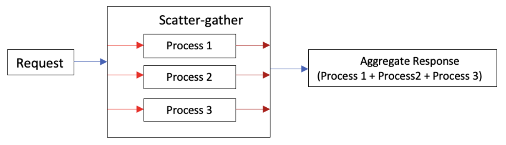

> [!NOTE]
> Response of individual processes are independent of each other.

## When to use Scatter-Gather?

Depends on what you are trying to achieve, if it’s a [Fork-Joined model](https://en.wikipedia.org/wiki/Fork%E2%80%93join_model) (imagine a fork) or Multicast scenario, where the messages are required to be communicated simultaneously, Scatter-Gather is a better choice, in case of “[Fire-Forget”](https://www.enterpriseintegrationpatterns.com/patterns/conversation/FireAndForget.html) model use asynchronous processing blocks, as there is no standard requirement to gather all the response in given time. If performance is a parameter (most certainly), Scatter- Gather pattern helps to immensely cut down the processing duration and improves the performance.

## How does Scatter-Gather work?

As already explained in the above section, Scatter-Gather will execute the messages in Parallel a.k.a. concurrent processing, meaning sending the messages to desired routes at the same time through a parallel thread pool. While a particular message is being processed, the remaining messages should wait for the completion of the message. In other words, the Scatter-Gather processing will be completed only when all the messages are fully processed.

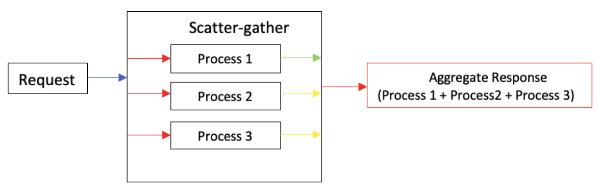

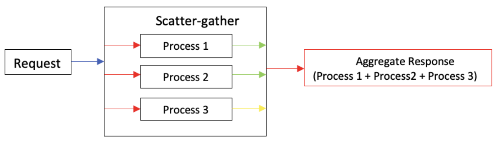

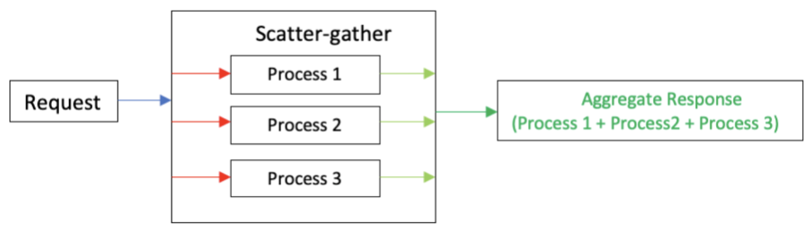

### Quiz 1:

What is the Total time taken for the completion of the Scatter-Gather process below?

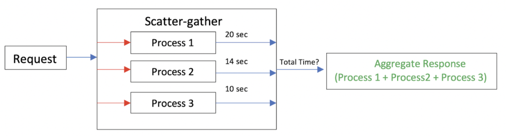

## Why use the Scatter-Gather Integration Pattern?

It may turn out to be a simple decision on why to use the Scatter-Gather pattern when compared to sequential processing, although the responses retrieved can be the same in both cases. Sequential processing should be considered when there is an interdependency of the processes up on their responses, meaning response from process 1 is required for process 2 to complete.

In cases where the process responses are independent of each other, parallel processing can be efficiently executed. If using sequential processing, in case of one message/process failure the complete processing will come to halt. This may be a valid business scenario to end the process, whereas in case of scatter-gather the responses will include or exclude the error cases (scenario based) therefore avoiding a complete meltdown.

### Quiz 2:

Scatter-Gather halts the processing of the messages if any one of the routing processes fail.

*Answer: True or False.*

We started with scattered thoughts about the pattern and now we have reached a state of composed thoughts, which were pretty *scattered* to begin with. Next, we will attempt to demonstrate our understanding through a MuleSoft (Mule 4) usage of Scatter-Gather Component. I won’t go deep into the specifics of Mule 4 Scatter-Gather Router as it has been explained very well in [MuleSoft documentation](https://docs.mulesoft.com/mule-runtime/4.3/scatter-gather-concept).

## Mule 4 Scatter-Gather Connector Example

In the below example, a mule Scatter-Gather router invokes the three flows concurrently and aggregates the response as a new payload. *A point to note is Scatter-Gather block should have at least two routes to process.* The combined response is captured through Mule Transform Message component, where-in we flatten the payload to an array object. The output resultant payload of Scatter-Gather is an Object of Object.

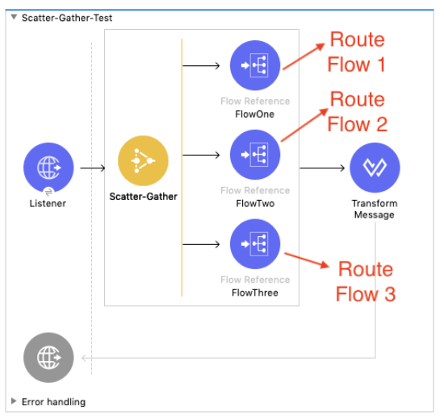

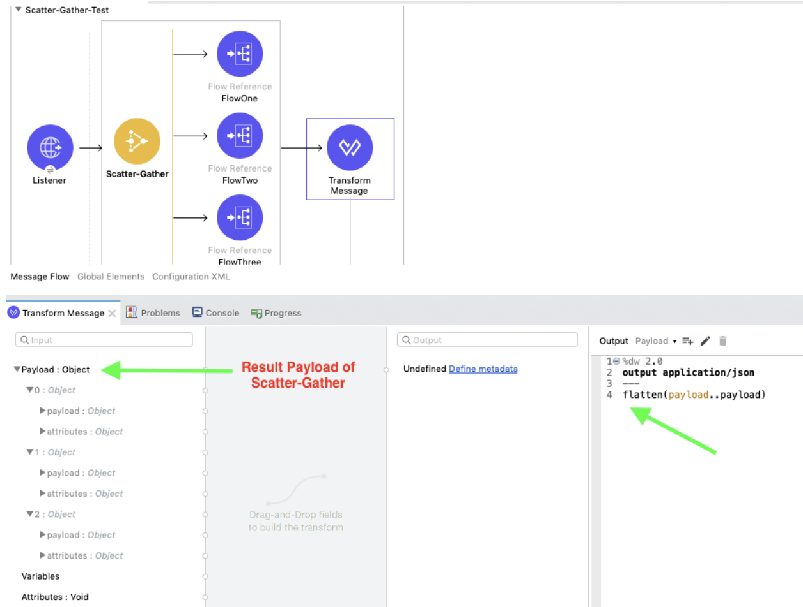

**Scatter-Gather Output Payload:**

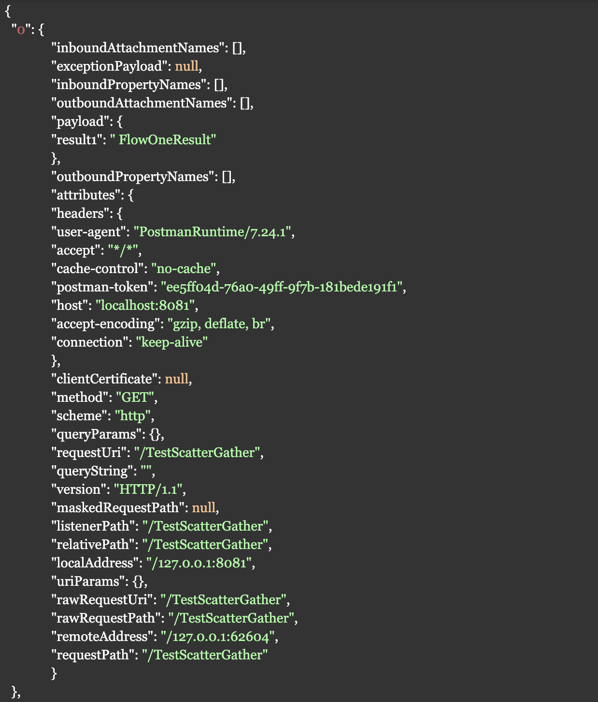

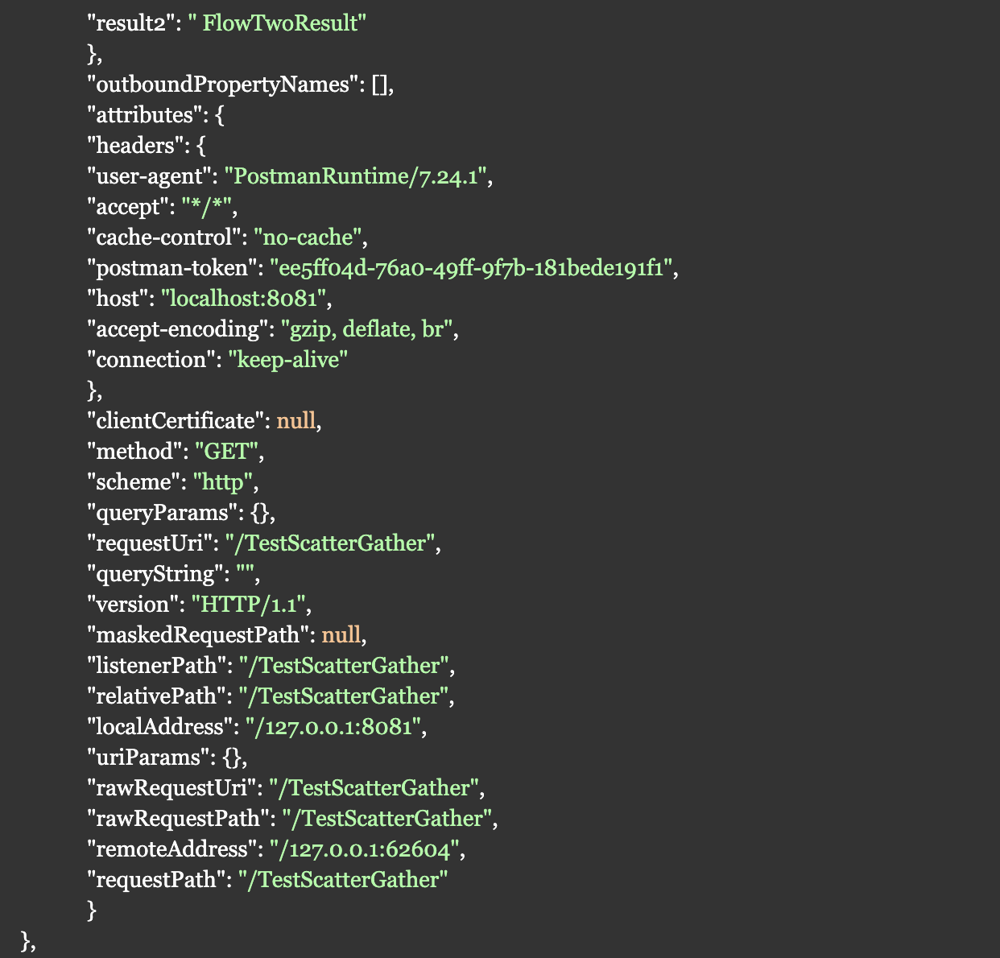

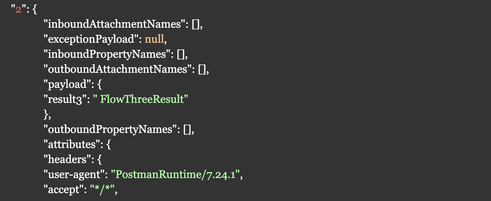

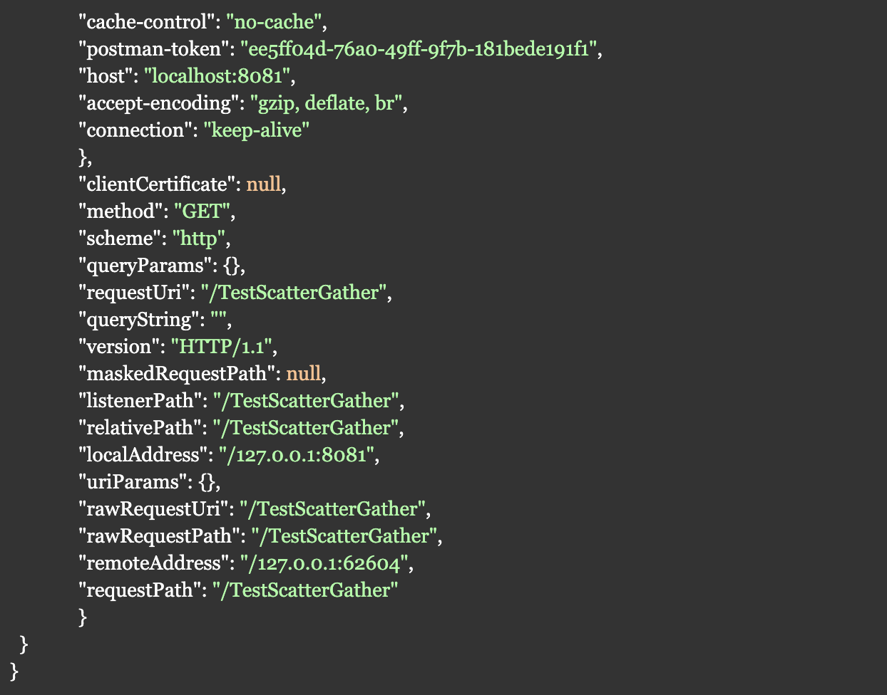

The payload size is 3 after the Scatter-Gather processing is complete.

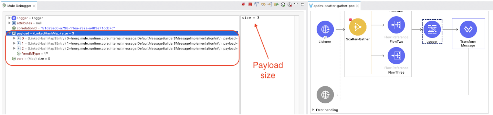

### Result of Scatter-Gather:

The flow has been tested using POSTMAN.

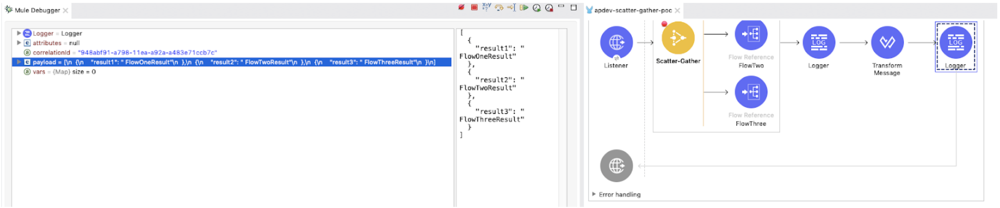

The debug process shows that the Scatter-Gather output payload has been aggregated (remember, we have flattened the payload to make it an array object).

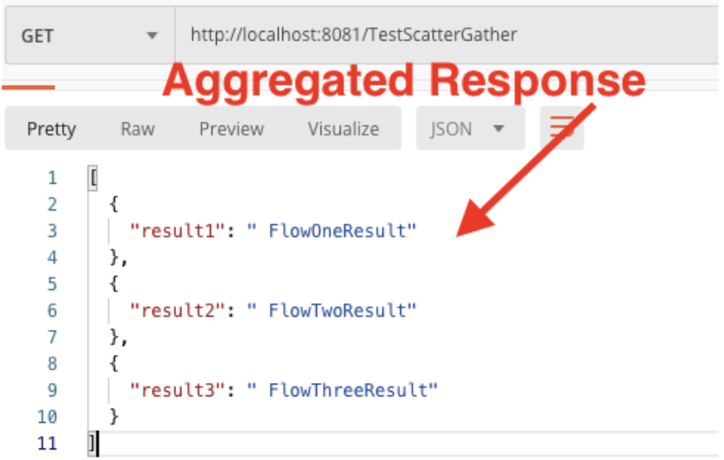

The example shown above is a very simple case of implementing and understanding Scatter-Gather Pattern. In the [next post](https://www.prostdev.com/post/scatter-gather-integration-pattern-mule-4-part-2), we shall add more twists with different service call routings and discuss the topic of error handling in case Mule 4 Scatter-Gather. Until then, try to find your reflections of the *scattered* thoughts.

Oh wait! The quiz? Yes!

The answer to the first quiz is **20 seconds** and the second is **False**; Scatter-Gather doesn’t halt the processes abruptly with an effective error handling in place, indeed it will gather all the route information including the route which has errored and aggregates the results as output. In order to retrieve only successful route payload and ignore errors from Scatter-Gather processing, this can be efficiently handled using Mule 4 error handling process. We shall discuss the Scatter-Gather error handling cases in our next post.

I hope you enjoyed the post. Please subscribe to ProstDev for more exciting topics.

Hasta luego, amigos!

## References

- [Enterprise Integration Patterns - Fire-and-Forget](https://www.enterpriseintegrationpatterns.com/patterns/conversation/FireAndForget.html)
- [Enterprise Integration Patterns - Scatter-Gather](https://www.enterpriseintegrationpatterns.com/patterns/messaging/BroadcastAggregate.html)
- [Enterprise Integration Patterns Using Mule](https://docs.mulesoft.com/mule-runtime/4.3/understanding-enterprise-integration-patterns-using-mule)
- [Mule Docs - Scatter-Gather Router](https://docs.mulesoft.com/mule-runtime/4.3/scatter-gather-concept)

## GitHub repository

[ProstDev GitHub - Scatter-Gather Example](https://github.com/ProstDev/apdev-scatter-gather-example)
