Hey Muleys,

In this post, I will explain how to implement IoT with a MuleSoft use case. I would like you to try out some new use cases and publish them. I hope this article helps you to implement them!

First of all, why should you use MuleSoft to implement IoT? Why not use other integration platforms? Quick answer: Ease of Integration and Speed of Delivery.

Let's dive in.

Make sure to watch the videos posted at the end of the article! You will get a full idea on how easy it is to implement IoT with MuleSoft.

## What is IoT?

The Internet of Things (IoT) is the inter-network of physical devices, vehicles, buildings, and other items embedded with electronics, software, sensors, actuators, and network connectivity that enable these objects to collect and exchange data.

Simplified: IoT is about connecting software with hardware!

**MuleSoft + IoT:**

- The Mule engine can be embedded directly into IoT devices, which enables data exchange for the devices by connecting to IoT cloud services and backend apps in the cloud.
- The Mule Runtime engine can be used to expose APIs on any IoT device. Mule APIs can be deployed on IoT devices and turn them on and off.
- In this article we will discuss about IoT and how it can be used with MuleSoft, and how Mule APIs can be deployed on IoT devices.

## Use Case

When a user passes a receiver’s number in the URL, the receiver should read the current local temperature details to his mobile and on successful receiving of details on his mobile, a green LED light should be blinked. In case of any issue in receiving the details, the red LED light should be blinked instead.

**How does it work internally?**

When you hit this endpoint:

```
http://localhost:8081/test?toNumber=919999999999
```

- The request is sent to the Mule application.
- The receiver’s number is stored in a variable.
- The Mule application connects to Raspberry PI (IoT device) and senses the temperature using a temperature sensor.
- The temperature is stored in a variable.
- The Mule application sends the details to the receiver’s mobile number using the Twilio Connector.
- If the data is received as expected, a green LED light is blinked, otherwise it will be a red LED light.

## Let's cook the recipe

**Required Software:**

- [Raspberry Pi OS (previously called Raspbian OS)](https://www.raspberrypi.org/downloads/raspbian/)
- [SD Memory Card Formatter](https://www.sdcard.org/downloads/formatter/)
- [Xming Display Server](https://xming.en.softonic.com/)
- [Win32 Disk Imager](https://win32diskimager.download/)
- [PuTTY](https://www.putty.org/)
- [WinSCP](https://winscp.net/eng/download.php)
- [Mule Standalone Server](https://www.mulesoft.com/lp/dl/mule-esb-enterprise)

**Required Hardware:**

- Raspberry Pi 3
- Micro SD Card of 16GB
- Ethernet Cable or HDMI cable (in this use case we are using ethernet cable)
- Adapter Charger for Raspberry Pi 3: Available in electronic stores or any e-commerce websites as a combo.

I was able to find everything [here](https://www.amazon.in/gp/product/B07C6SN8PL/ref=ppx_yo_dt_b_search_asin_title?ie=UTF8&psc=1).

**Resistors:**

- 4k7 ohms (4.7k) - 1 (used for temp sensor)
- 22k ohms: 2 in total (used for RED and GREEN LED lights)
- Jumper wires: Male – Female (10 for safe side)
- 1 Bread Board
- Temperature Sensor: DS18B20 model
- 1 red LED light
- 1 green LED light

## Part 1 - Setting up your environment

Before starting with the Raspberry PI setup, we have to follow these steps.

**Step 1: Download and Install Raspberry Pi OS / Raspbian OS**

Download Raspbian OS (URL can be found in Required Software above). Select “Raspbian Buster with desktop and recommended software”. It’s almost 2.5 GB.

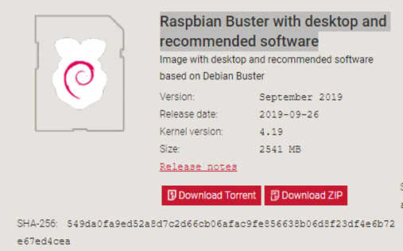

While it’s downloading, insert your micro SD card into your system and format it using the SD Card formatter.

Now extract the downloaded Raspbian OS into your local. You can see only one file of the type Disk Image.

We can’t unzip them normally. That’s the reason we use Win32 disk imager: to extract and copy them to the Micro SD card.

Open the Win32 disk imager and you will see that the destination folder will be automatically detected (the SD card). Just select the file where you have extracted Raspbian and click on write. It takes around 9 mins to finish. Once it’s done it will say that the writing was successful.

Now your OS is copied successfully in your SD card.

**Step 2: Enable SSH**

The SSH command provides a secure encrypted connection between two hosts over an insecure network. This connection can also be used for terminal access, file transfers, and for tunneling other applications.

Since we need to see what’s happening in the Raspberry PI, we will need a UI to see this. In order to set this up, we need to have SSH enabled.

Go to the SD card folder where you can see the extracted files (they were extracted using Win32 disk imager). Now just create a text file and name it as ssh.

After creating this, you can remove the SD Card from your PC.

**Step 3: Network and Sharing**

Now we need to connect our Raspberry device to our system. As I said before, we have 2 ways. One is using an HDMI cable which requires WiFi sharing, a monitor, a keyboard and a mouse to perform operations. To go for the alternative, it’s better to use an ethernet cable which helps us to get connected with our PC itself.

For this article, we are using ethernet connectivity.

After ejecting the SD card from the PC, mount the SD card to your Raspberry PI. See the slot where it needs to be inserted (usually it will be on the downside of the device). Plug the adaptor and switch it on.

Now connect the ethernet cable: one side should be connected to the Raspberry PI and the other to your PC. Make sure your PC is already connected to WiFi or internet before plugging the ethernet cable.

Once the ethernet cable is plugged to your PC. Go to the Network and Sharing center. You will see an unidentified network. You can refer to the next screenshot.

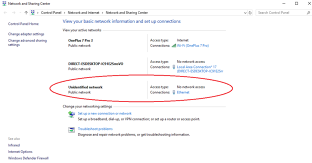

Click on the internet connection which you have already connected to and click on WiFi – properties.

Go to Sharing and make sure the 2 options in Internet Connection Sharing are checked. Also see that Home networking connection is automatically generated with the name “Ethernet” (you can go through the video I shared at the end to verify these steps).

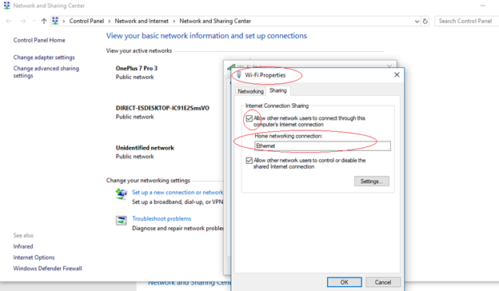

Click on unidentified network (ethernet). Go to Properties and double click on Internet Protocol Version 4 (TCP/IPv4). Under “Use the following IP address” see that an IP address is automatically shown. Copy that IP address as we will be using the same IP to connect to the Raspberry PI.

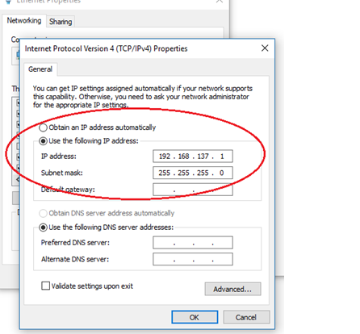

**Step 4: Connect to the Raspberry PI using PuTTY**

Before connecting using PuTTY, make sure you have open Xming (assuming it's already been downloaded and installed). You can open PuTTY after this.

Include the following configuration:

Hostname: `raspberrypi.mshome.net` (this is the default hostname for Raspberry Pi. You can also use the IP address generated above, but it’s better to use the mentioned hostname)

Port: 22

Go to SSH and include the following configuration:

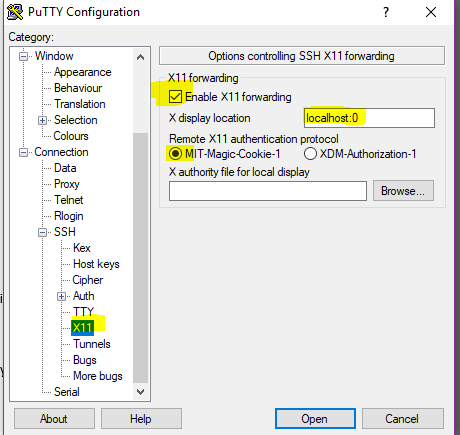

Save with any name. Now you’re ready to connect to the device.

Click on Open. You will get a security alert warning. Click on yes to proceed.

A cmd prompt is popped out asking to login. You can select the default login details like the following:

Login as: pi

Password: raspberry

Now you are connected to the “pi” user of your Raspberry device.

To see a graphical view of your device (generally another system which runs on Raspbian OS) you can use the below command in PuTTY command:

```bash
pi@raspberrypi : $ startlxde
```

Now your Xming opens!


Leave your LXTerminal pinned on your desktop. Open the Terminal and type the below command:

```bash
pi@raspberrypi : $ sudo raspi-config
```

A blue prompt appears. It has option1 to change password. Make sure you change the password and finish off.

**Step 5: Install Java 8**

We need to install Java version 8. By default, Java and Python are already installed when we download Raspbian OS. If you check the version (using the java -version command), we can see the Java 11.x version is already installed. We have some permission issues with this version. This is why we need to install Java 8 for this use case. Before installing, you will need to uninstall Java 11. Use below commands for uninstalling java 11 and then installing java 8 accordingly.

To uninstall Java 11:

```bash
pi@raspberrypi : $ sudo apt-get purge openjdk*
```

To install Java 8:

```bash
pi@raspberrypi : $ sudo apt-get install openjdk-8-jdk
```

Now check the Java version again. It will show Java 8.

We have set up our Raspberry OS. All 5 steps are related to Raspberry and have nothing to do with Mule installation. These are common steps for setting up a Raspberry PI device.

## Part 2 - Setting up Raspberry PI with Mule

**Step 1: Installing Mule Standalone Server**

Open a browser in Xming (in the Raspberry PI). Go to the link I shared in the Required Software to download Mule Standalone Server.

While it’s downloading, we shall create a new user with the name “mule”. All MuleSoft operations are carried out by this user (this is not mandatory but it’s good to create one).

To create a Mule user type the following commands:

```bash
pi@raspberrypi : $ sudo su –

root@raspberrypi : # useradd -s /bin/bash -d /home/mule -U -G sudo mule

root@raspberrypi : # passwd mule

New Password:

Retype New Password:
```

Your “mule” user is now created successfully.

Now you need to create a director and give all necessary permissions. For this, use the following commands:

```bash
root@raspberrypi : # mkdir /home/mule /opt/mule

root@raspberrypi : # chown mule:mule /opt/mule

root@raspberrypi : # exit

logout
```

Now it's time to look at the Mule Standalone Server. Your Mule Standalone will be located in the Downloads folder of the PI user.

Follow these commands next:

```bash
pi@raspberrypi : $ cd /home/pi/Downloads

pi@raspberrypi :~/ Downloads$ chmod 777 *

pi@raspberrypi :~/ Downloads$ su -mule

Password: <enter your password and click enter> 

mule@raspberrypi :~$ cd /home/pi/Downloads

mule@raspberrypi : /home/pi/Downloads$ cp mule-ee-distribution-standalone-4.2.2.zip /opt/mule

mule@raspberrypi : /home/pi/Downloads$ cd /opt/mule

mule@raspberrypi : /opt/mule$ unzip mule-ee-distribution-standalone-4.2.2.zip

mule@raspberrypi : /opt/mule$ cd mule-ee-distribution-standalone-4.2.2

mule@raspberrypi : /opt/mule/mule-ee-distribution-standalone-4.2.2$ cd /opt/mule
```

Mule runtime uses the Tanuki Service Wrapper, which allows a Java-based application (that’s right, such as Mule runtime) to be started as a Windows Service or UNIX daemon. However, out-of-the-box, the bundled Service Wrapper is not optimized for Raspberry Pi’s ARM architecture. Therefore, the next step is to download the Armhf port of the Java Service Wrapper and patch the bundled Service Wrapper by copying a few required files to the Mule runtime directory.

Additional config files needed:

```bash
mule@raspberrypi:/opt/mule $ wget https://download.tanukisoftware.com/wrapper/3.5.34/wrapper-linux-armhf-32-3.5.34.tar.gz

tar zxf wrapper-linux-armhf-32-3.5.34.tar.gz

mule@raspberrypi:/opt/mule $ cp ./wrapper-linux-armhf-32-3.5.34/lib/libwrapper.so ./mule-standalone-4.2.2/lib/boot/libwrapper-linux-armhf-32.so

mule@raspberrypi:/opt/mule $ cp ./wrapper-linux-armhf-32-3.5.34/lib/wrapper.jar ./mule-standalone-4.2.2/lib/boot/wrapper-3.2.3.jar 

mule@raspberrypi:/opt/mule $ cp ./wrapper-linux-armhf-32-3.5.34/bin/wrapper ./mule-standalone-4.2.2/lib/boot/exec/wrapper-linux-armhf-32
```

Exit current terminal and re-open it. It comes with pi user

```bash
mule@raspberrypi:/opt/mule $ cd mule-enterprise-standalone-4.2.2

mule@raspberrypi:/opt/mule/mule-enterprise-standalone-4.2.2$ cd conf

mule@raspberrypi:/opt/mule/mule-enterprise-standalone-4.2.2/conf $ vi wrapper.conf
```

The mule file comes in edited format. Change below lines as mentioned and save it:

```
## Initial Java Heap Size (in MB)
wrapper.java.initmemory=256

## Maximum Java Heap Size (in MB)
wrapper.java.maxmemory=512
```

Final step:

```bash
mule@raspberrypi:/opt/mule/mule-enterprise-standalone-4.2.2 $ cd bin

mule@raspberrypi:/opt/mule/mule-enterprise-standalone-4.2.2/bin $ ./mule
```

The server is up and running now:

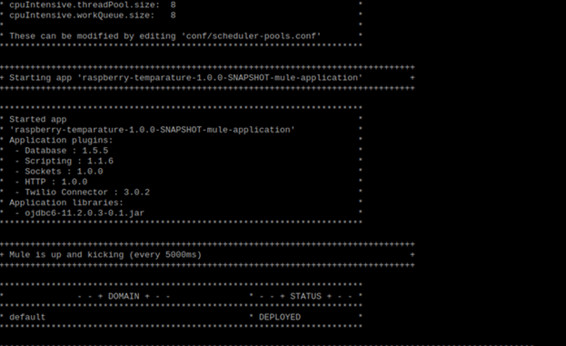

**Step 2: Developing the Mule Application**

Now we shall develop a RESTful application in your local (Windows) system. And then run the application which generates a snapshot jar file.

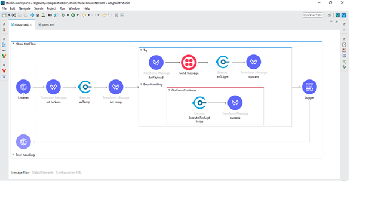

Connectors used:

- Groovy script: This component is used to run python scripts. Use operation groovy.
- Twilio: This component is used to send a message to the user.
- Transform Message: Setting variables and structuring the message before sending to twilio.

> [!NOTE]
> You are not writing any Python scripts in the Mule application. The Python scripts to light the LEDs and sense temperature are already written and placed in a specified location. The location path is given in the groovy scripts.

Make sure to give a proper message structure before sending to Twilio, since it expects a specific format containing these fields: body, to, from, message.

Also make sure you have a developer account with Twilio and make sure whatever number you are using is already registered with Twilio. Messages are sent only to registered numbers.

If you are not okay with using Twilio, you can build your own use case. Like printing the temperature instead.

Code for the developed app is pasted at the end of this article.

Run your application. Once it’s deployed locally, copy the jar file generated inside the target folder and paste it into your Raspberry device folder using WinSCP.

To do this, open WinSCP, use the same host and port details from the ones you used for PuTTY. It will ask for username and password. Enter username as “pi” and the previously specified password.

Copy the file from your Windows PC into the /home/pi/Downloads folder of your Raspberry PI.

**Step 3: Connections in Raspberry PI**

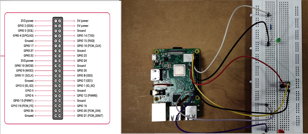

Remember – Physical numbering is different from GPIO pin number. Watch the video for the details on how to create these connections. You can refer to the following pictures.

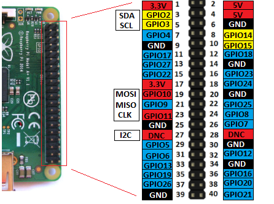

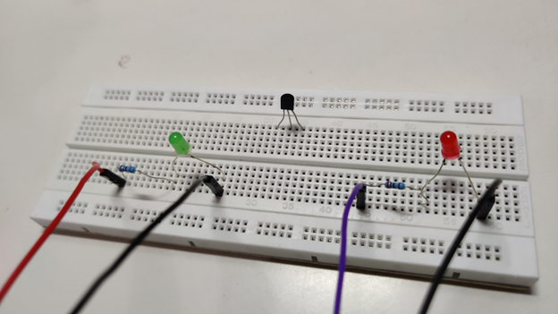

Connection with Jumper wires:

> [!NOTE]
> physical numbering is normal 1,2,3…42

GPIO is different. For the connections please go with physical numbering. In the Python script you can see GPIO pin numbers. Do not get confused.

**Green LED light:**

GPIO Numbering:

- Voltage: GPIO17
- Ground: Any nearest ground pin

Physical Number:

- Voltage: 11th pin
- Ground: 14th pin

**Red LED light:**

GPIO Numbering:

- Voltage: GIPO26
- Ground: Any nearest ground pin

Physical Number:

- Voltage: 37th pin
- Ground: 39th pin

**Temperature sensor:**

GPIO Numbering:

- Voltage: 3V3
- Ground: Any nearest ground pin
- Data: GPIO 4

Physical Number:

- Voltage: 1st pin
- Ground: 6th pin
- Data: 7th pin

> [!IMPORTANT]
> Before executing the Python scripts via Mule app, make sure you run the Python scripts independently (Python is already installed when Raspbian OS is installed).

```bash
$ python /home/pi/Downloads workingTemp.py
```

Open LxTerminal:

```bash
pi@raspberrypi: ~ $ cd /home/pi/Downloads

pi@raspberrypi: ~/Downloads $ chmod 777 raspberry-temperature-new-1.0.0-SNAPSHOT-mule-application.jar

pi@raspberrypi: ~/Downloads $ chmod a+x raspberry-temperature-new-1.0.0-SNAPSHOT-mule-application.jar
```

Write Python Scripts:

greenLight.py:

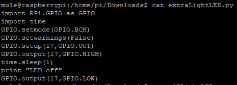

redLight.py:

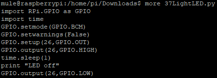

Temperature.py:

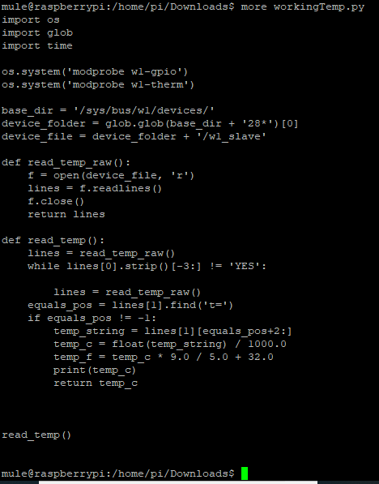

Give permissions to Python scripts:

```bash
pi@raspberrypi: ~/Downloads $ chmod 777 greenLight.py
pi@raspberrypi: ~/Downloads $ chmod a+x greenLight.py

pi@raspberrypi: ~/Downloads $ chmod 777 redLight.py
pi@raspberrypi: ~/Downloads $ chmod a+x redLight.py

pi@raspberrypi: ~/Downloads $ chmod 777 temp.py
pi@raspberrypi: ~/Downloads $ chmod a+x temp.py
```

Final step:

```bash
pi@raspberrypi: ~/Downloads $ su -mule

Password: <enter password>

mule@raspberrypi: ~ $ cd /home/pi/Downloads 

mule@raspberrypi:cd /home/pi/Downloads$ cp raspberry-temperature-new-1.0.0-SNAPSHOT-mule-application.jar /opt/mule/mule-enterprise-standalone-4.2.2/apps
```

As the server is already up and running, the app is successfully deployed.

## Videos

- For success: [Blink green LED on success](https://youtu.be/pEvFYxv8Hq0)
- For failure: [Blink red LED on failure](https://youtu.be/HJGBqjTURco)
- For connections on breadboard: [Raspberry Pi connection to breadboard](https://youtu.be/qTg3k8hxG6k)
- For full setup: [Mule 4 standalone server on Raspberry Pi](https://youtu.be/TLOL9hwjNsY)

## Hardware Pictures

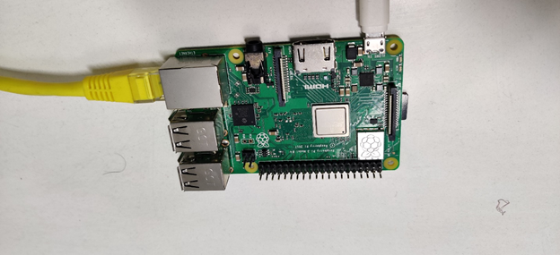

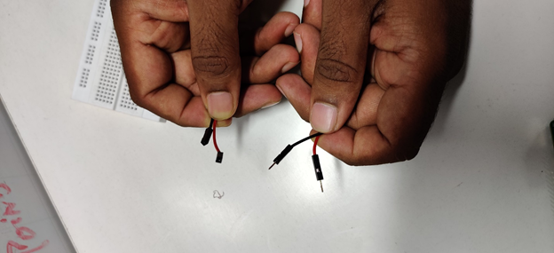

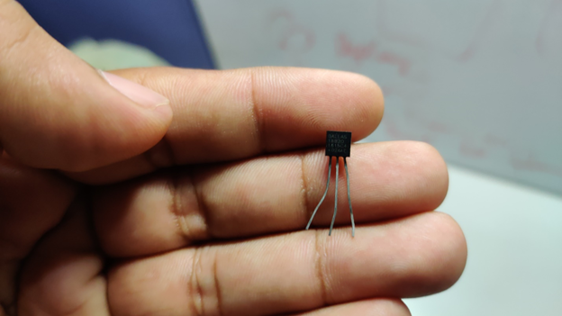

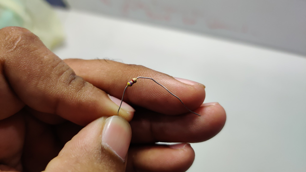

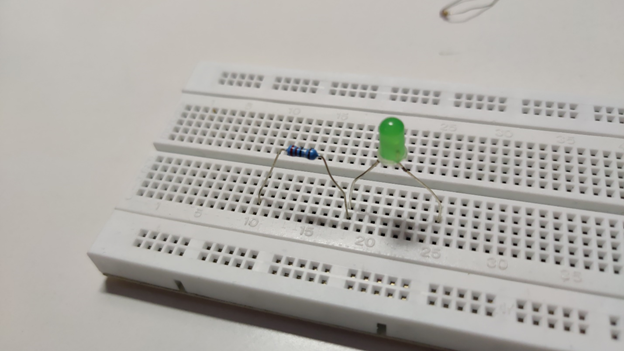

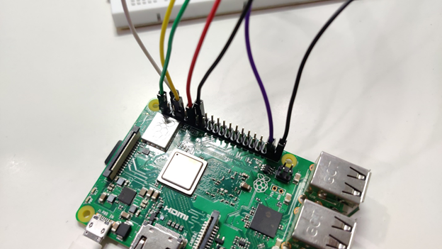

## Mule App Code

```xml
<?xml version="1.0" encoding="UTF-8"?>

<mule xmlns:db="http://www.mulesoft.org/schema/mule/db" xmlns:twilio-connector="http://www.mulesoft.org/schema/mule/twilio-connector"
	xmlns:scripting="http://www.mulesoft.org/schema/mule/scripting"
	xmlns:ee="http://www.mulesoft.org/schema/mule/ee/core" xmlns:http="http://www.mulesoft.org/schema/mule/http" xmlns="http://www.mulesoft.org/schema/mule/core" xmlns:doc="http://www.mulesoft.org/schema/mule/documentation" xmlns:xsi="http://www.w3.org/2001/XMLSchema-instance" xsi:schemaLocation="http://www.mulesoft.org/schema/mule/core http://www.mulesoft.org/schema/mule/core/current/mule.xsd
http://www.mulesoft.org/schema/mule/http http://www.mulesoft.org/schema/mule/http/current/mule-http.xsd
http://www.mulesoft.org/schema/mule/ee/core http://www.mulesoft.org/schema/mule/ee/core/current/mule-ee.xsd
http://www.mulesoft.org/schema/mule/scripting http://www.mulesoft.org/schema/mule/scripting/current/mule-scripting.xsd
http://www.mulesoft.org/schema/mule/twilio-connector http://www.mulesoft.org/schema/mule/twilio-connector/current/mule-twilio-connector.xsd
http://www.mulesoft.org/schema/mule/db http://www.mulesoft.org/schema/mule/db/current/mule-db.xsd">
	<http:listener-config name="HTTP_Listener_config" doc:name="HTTP Listener config" doc:id="1f79f7af-0874-4818-9b31-9a77b3c14240" >
		<http:listener-connection host="0.0.0.0" port="8081" />
	</http:listener-config>
	<scripting:config name="Scripting_Config" doc:name="Scripting Config" doc:id="2c707185-8159-47fe-b8f1-8d191a236a00" />
	<twilio-connector:config name="Twilio_Connector_Config" doc:name="Twilio Connector Config" doc:id="d345e33c-10c6-44cf-b6fe-6808702e6f12" property_username="xxxxxxxxxxxxxxxxxxxxxxxxxxxxxxxx" property_password="xxxxxxxxxxxxxxxxxxxxxxxxxxxxxxxx" >
		<twilio-connector:connection />
	</twilio-connector:config>

	<flow name="nbuw-testFlow" doc:id="85f9e606-ef49-4298-8781-ee3eca55a48f" >
		<http:listener doc:name="Listener" doc:id="2f4ac9e4-1891-4a2d-9956-b5f1be11e757" path="/test" config-ref="HTTP_Listener_config"/>
		<ee:transform doc:name="set toNum" doc:id="66813c22-07ad-4498-b485-306971767031" >
			<ee:message >
			</ee:message>
			<ee:variables >
				<ee:set-variable variableName="toNum" ><![CDATA[attributes.queryParams.toNum]]></ee:set-variable>
			</ee:variables>
		</ee:transform>
		<scripting:execute doc:name="exTemp" doc:id="07be3954-f861-4c04-8949-cb56d5c5a669" engine="groovy">
			<scripting:code >def command = "python /home/pi/Downloads/workingTemp.py"
println "$command"
def cmd=command.execute()</scripting:code>
		</scripting:execute>
		<ee:transform doc:name="set temp" doc:id="39b19cc4-84a9-45ff-b649-43e4c0e4f257" >
			<ee:message >
			</ee:message>
			<ee:variables >
				<ee:set-variable variableName="temp" ><![CDATA[%dw 2.0
output text/plain
---
payload.inputStream default '10']]></ee:set-variable>
			</ee:variables>
		</ee:transform>
		<try doc:name="Try" doc:id="8a673a17-2459-4b9b-b9b1-343d65111442" >
			<ee:transform doc:name="twPayload" doc:id="f120c417-895e-4e29-a28d-61c17f5b2804" >
				<ee:message >
					<ee:set-payload ><![CDATA[%dw 2.0
output application/json
---
{
	Body: "Hi,Temperature is :" ++ vars.temp as String ++ ".Mule is on Fire",
	From: "+16156714137",

	To: "+" ++ vars.toNum
} as Object

{
	class : "org.mule.modules.twilio.pojo.sendmessagerequest.MessageInput"
}
]]></ee:set-payload>
				</ee:message>
			</ee:transform>
			<twilio-connector:send-message doc:name="Send message" doc:id="ae911091-1cf9-4ed8-9bbd-4cbb2d40bb39" config-ref="Twilio_Connector_Config" account-sid="AC458d2ec378410589ff55a3ebabb355c7" />
			<scripting:execute doc:name="exGLight" doc:id="232b2300-360e-47b7-9acc-6795f8026d63" engine="groovy">
				<scripting:code >def command = "python /home/pi/Downloads/greenLight.py"
println "$command"
def cmd=command.execute()</scripting:code>
			</scripting:execute>
			<ee:transform doc:name="success" doc:id="2b15cf27-8ba6-41e5-a2de-7ac190ff7476" >
				<ee:message >
					<ee:set-payload ><![CDATA['Temperature Recorded and sent message']]></ee:set-payload>
				</ee:message>
			</ee:transform>
			<error-handler >
				<on-error-continue enableNotifications="true" logException="true" doc:name="On Error Continue" doc:id="ee3458e6-a18b-4da7-a0a8-260bb82f1b4b" >
					<scripting:execute doc:name="Execute RedLigt Script" doc:id="d4d9f4b6-3da9-44a6-a23f-6e90204b0d60" engine="groovy">
						<scripting:code >def command = "python /home/pi/Downloads/redLight.py"
println "$command"
def cmd=command.execute()</scripting:code>
					</scripting:execute>
					<ee:transform doc:name="sucsess" doc:id="cd71422c-a826-49f4-afe6-2fbe53d60ca7" >
						<ee:message >
							<ee:set-payload ><![CDATA['Temperature Recorded but Message  sending failed message']]></ee:set-payload>
						</ee:message>
					</ee:transform>
				</on-error-continue>
			</error-handler>
		</try>
		<logger level="INFO" doc:name="Logger" doc:id="cec8bb89-d4a9-4660-9c65-8b862395eb39" message="#[payload]"/>
	</flow>
</mule>
```

Hope this article helps you to do some real time use cases!

Happy Learning!!

Yours, Sravan Lingam :)
