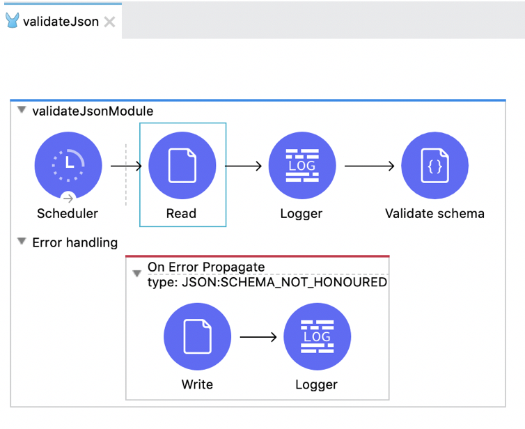
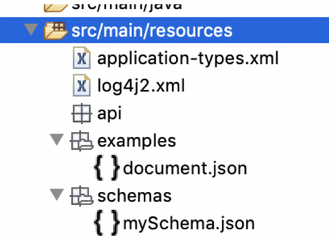
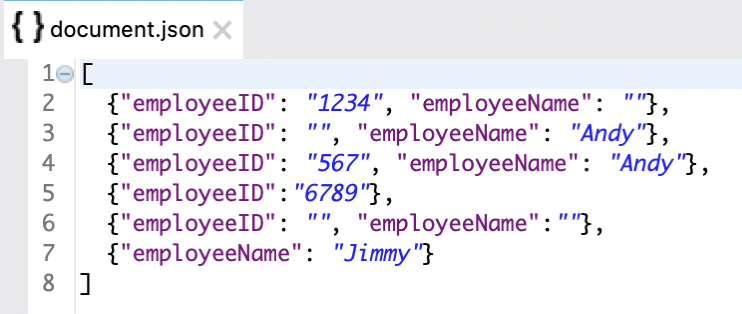
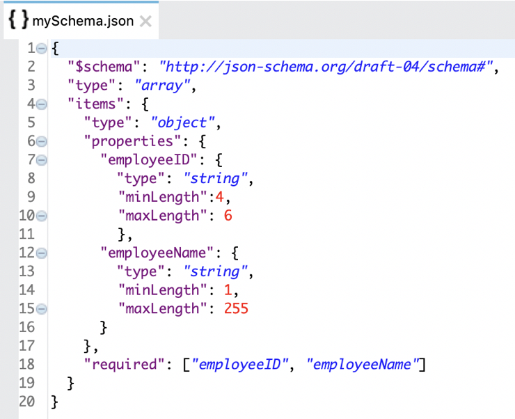
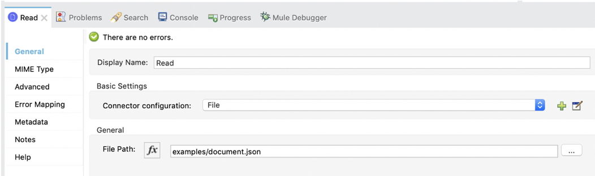
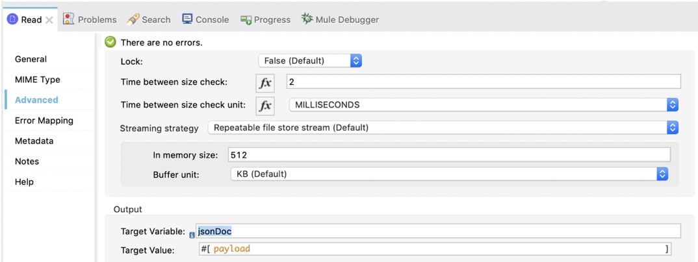
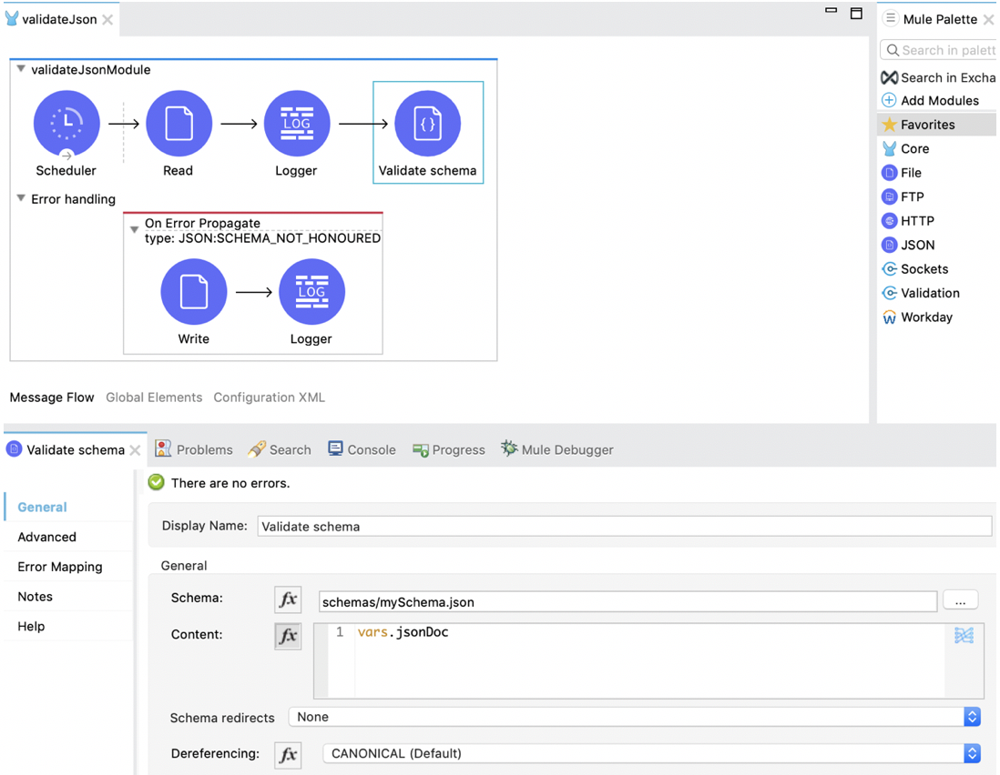
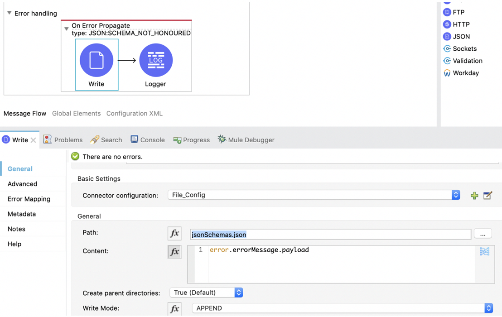
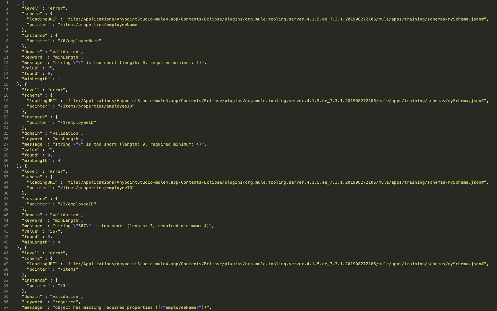
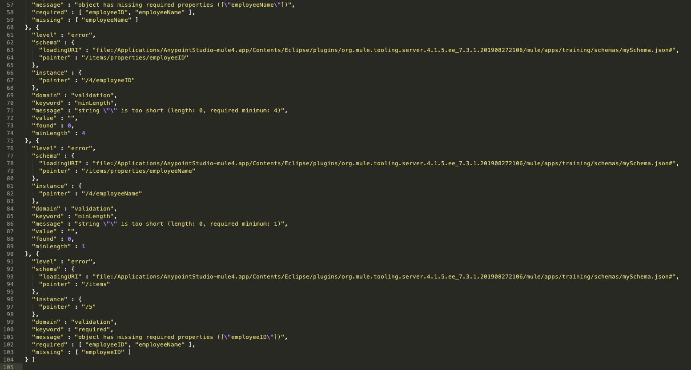

*GitHub repository with the Mule Project can be found at the end of the post.*

The JSON Module Connector is used to validate a JSON Payload against the predefined JSON Schema of your choice. Since schema validation falls outside the scope of DataWeave Functionality, the JSON Module can be used.

To use the JSON module, add it manually to your Mule app in Anypoint Studio or Design Center; or, if you want to use Maven, you can add the following dependency into your `pom.xml` file:

```xml
<dependency>
	<groupId>org.mule.modules</groupId>
	<artifactId>mule-json-module</artifactId>
	<version>RELEASE</version>
	<classifier>mule-plugin</classifier>
</dependency>
```

For better understanding of how the JSON Module works, I did a proof of Concept. Below is the screenshot of the flow which includes the JSON Module component.



To validate the JSON payload, I need an example JSON file (in my case, `document.json`) and I would need the JSON schema file (`mySchema.json`) to validate my example JSON file against it. Since I chose to read the `document.json` file, I placed it below `src/main/resources/examples`:



The `document.json` file looks like this:



The schema against which the `document.json` file would be validated is defined as below:



A fixed frequency scheduler is set to run the flow every few seconds/minutes. The `document.json` file is read using the File Read operation as shown below:



Once the file is read, the payload is saved in the Target Variable *jsonDoc* as shown below:



After the file is saved in the *jsonDoc* variable, it is validated against the schema using the JSON Module as shown below:



As per our example, `document.json` does not match `mySchema.json`, so, it throws a `JSON:SCHEMA_NOT_HONOURED` exception. This exception is caught in the error handler and the `error.errorMessage.payload` is written to a file as shown below:



The file will contain the following error message payload:





The JSON Module can throw any of these exceptions:

- `JSON:INVALID_INPUT_JSON`
- `JSON:INVALID_SCHEMA`
- `JSON:SCHEMA_NOT_FOUND`
- `JSON:SCHEMA_NOT_HONOURED`

Some JSON schemas might reference other schemas through a public URI. However, you might not want to fetch those schemas from the internet, mainly for performance and security reasons.

The JSON Module has an option to redirect the schema, which lets you replace an external reference with a local one, without the need to modify the schema itself.

The JSON Module also has an option called "Allow Duplicate Keys", which when set true, it will allow the duplication of keys; otherwise, it will fail.

This is why the JSON Module is a very useful component for schema validation. Enjoy the benefits of using this component :)

Thank you for reading.

-Pravallika Nagaraja

## GitHub repository

[ProstDev GitHub - JSON Module Component Mule 4](https://github.com/ProstDev/JSONModuleComponentMule4)
