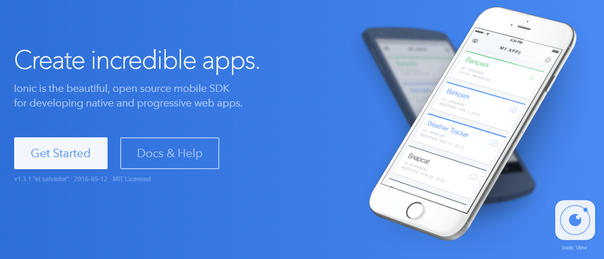
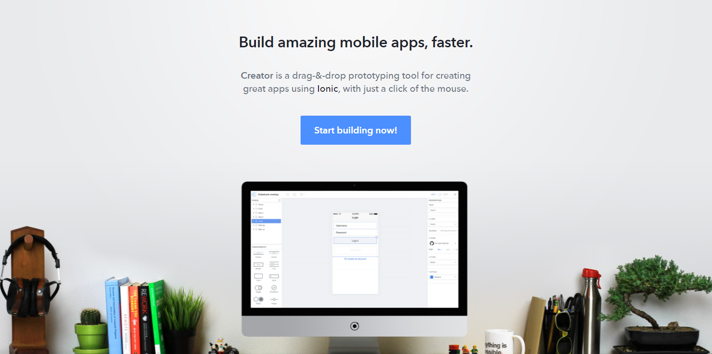
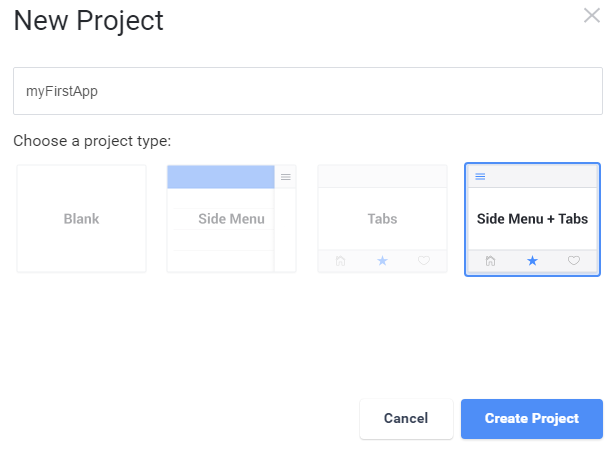
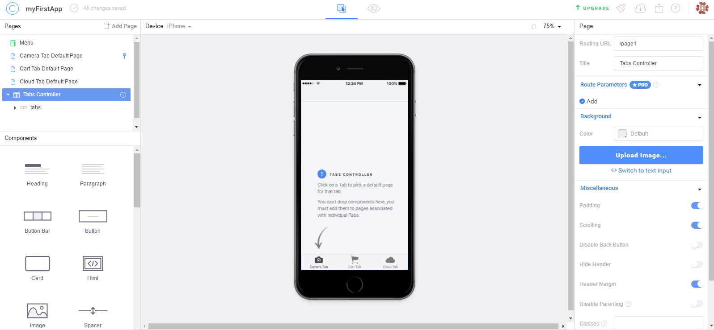

We’re not supposed to judge a book by its cover, but what happens when you try to get the online menu of your favorite restaurant and you can’t even find their webpage? Or what if you want to get a tattoo, but you can’t find the tattooer’s Facebook page? You may think they’re not professional enough, or they’re not “official”. In today’s world, mobile apps are as important as having an official site for your company, and creating them gets easier and easier. Today we can create a website in minutes and we don’t even have to write a single code line at all! What if you could create a mobile app in some weeks, or months?

## This is Ionic!

If you’re thinking of creating a new app and you’re worried about choosing Android or iOS, or if you’re a designer and you don’t want to learn how to program an app for two or more different operating systems, then you should check out this framework. You just have to worry about basic HTML, CSS, and Javascript (that, if you want a more personalized app). Besides, you will be learning [Angular](https://angularjs.org/)as you write your new app.

> Ionic builds on top of Angular to create a powerful SDK well-suited for building rich and robust mobile apps for the app store and the mobile web. Ionic not only looks nice, but its core architecture is built for serious app development.

Once you have a progress on your app and want to try it, you can either run it as a Web App, or use *Cordova* or *Phonegap* for deployment. You can develop one app and get it running on Android or iOS without having to work twice!

> Ionic is modeled off of standard native mobile development SDKs, bringing the UI standards of native apps together with the full power and flexibility of the open web. Ionic runs inside [Cordova](http://cordova.apache.org/) or [Phonegap](http://phonegap.com/) to deploy natively, or as a Progressive Web App. Develop once, deploy *everywhere*.

But that’s not it. Let me introduce you to [Creator](http://ionic.io/products/creator).

If you’re not into programming, you can always choose to use this tool that Ionic created just for you. You can start a mobile app just by clicking some buttons, and using this friendly *drag and drop* interface.

Just click a button for a new project,

write the name of your project, choose its type, and one more click to create it.

And now, you have your new app ready to be personalized!

You can choose your device, you can see a preview, you can export your app, and more.

> Your time is precious. **Creator** has your back. Spend more time on building a great app experience, and less time managing separate code bases and devices.
Export cross-platform mobile prototypes that look, feel, and perform amazing across all modern phones and devices.

Wether you like code or design, I think this framework is ideal for mobile apps. There is a lot of documentation, if you prefer reading. There are YouTube tutorials, if you learn better that way, or you can just start by yourself!

This is just an example of how easy it is to get along with new technologies. If you’re a fan of learning new things, then you will never be bored in this world. New programming languages, new architectures, new tools, new frameworks are being developed right now. One thing is for sure: if you work in this area and you like to learn once and stick with it forever, you will never succeed. Something new comes out, gets popular for some seconds, and then it’s replaced by something newer. I encourage you to continue learning every day, even if it’s just a fun fact you didn’t know before.

I hope this post was of your interest, and if you already knew all this, you can contact me and tell me more about it, maybe I don’t know something that you do. Also, if I wrote something wrong, please let me know! I’m human too 🙂

Thank you so much for reading! Now go get a beer and say Prost!

-Alex.
