This post guides you through building an AI-powered API using Ollama and MuleSoft. You'll start by installing Ollama locally, designing and implementing the API, and testing it in your development environment. With ngrok, you'll expose the API publicly, and finally, deploy it to CloudHub for production use.

For guidance, you can follow along using [this GitHub repository](https://github.com/ProstDev/mac-ollama-proj).

## 1 - Install Ollama locally

- Go to [ollama.com](http://ollama.com) and follow the prompts to install in your local computer
- Make a note of which version you started running (like llama3 or llama3.2)
- To verify ollama is running, you should either be able to interact with it in the terminal or you should be able to run "ollama list" or "ollama ps"
- We will verify the local installation in MuleSoft before deploying to CloudHub

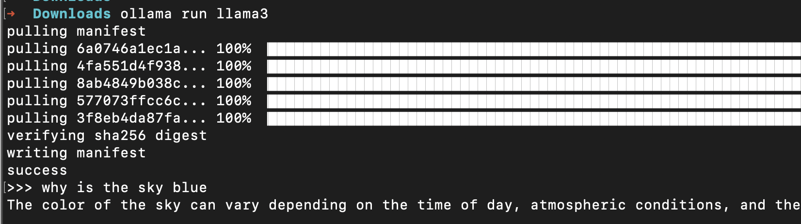

## 2 - Create the API specification

- Open Anypoint Code Builder > Design an API
- Name it MAC-Ollama-API
- Select REST API > RAML 1.0
- **Create Project**
- Paste the following into this RAML file

```yaml
#%RAML 1.0
title: MAC-Ollama-API
version: 1.0.0
description: Simple API to connect a Mule application and Ollama locally using the MAC project.
mediaType: application/json

/chat:
    post:
        body:
            description: The question to ask Ollama
            type: string
            example: "Hello!"
        responses:
            200:
                description: The response from Ollama
                body:
                    type: string
                    example: Hey! How's it going?
```

- Publish to Exchange using the Command Palette in VS Code (cmd+shift+P or ctrl+shift+P)

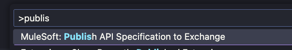

- You can leave all the defaults (organization, project name, version, etc.) and wait for it to be published

## 3 - Implement the API

- Select **Yes** to implement this API in ACB
- Name it mac-ollama-proj, select the folder where you want to keep this, select Mule Runtime 4.8 and Java 17
- Once the project finishes loading, open the `mac-ollama-proj.xml` file under `src/main/mule`
- Click on the **Flow List** button and switch to the one that starts with "post"

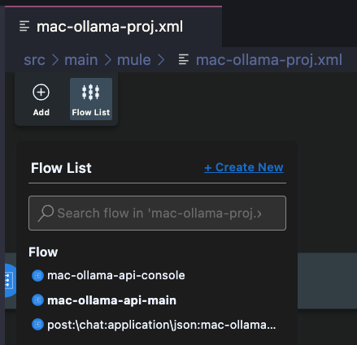

- Remove the logger from the flow
- Click on the plus button to add a new connector
- Click on the Exchange button to search in Exchange

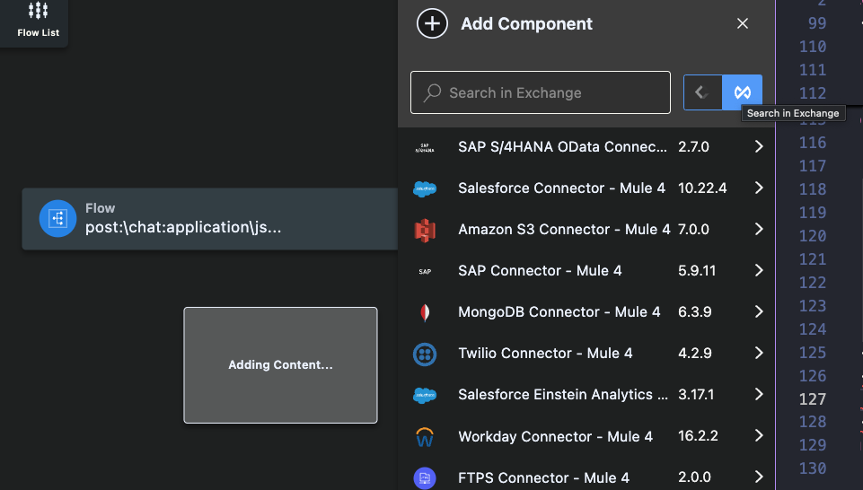

- Search for the MuleSoft AI Chain module and click on it
- Select the **Chat answer prompt** connector

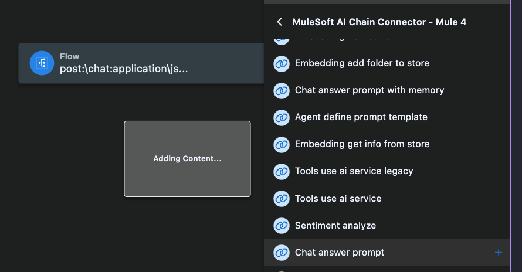

- Click on the new connector from the canvas
- Click on the plus button next to the Connection Config

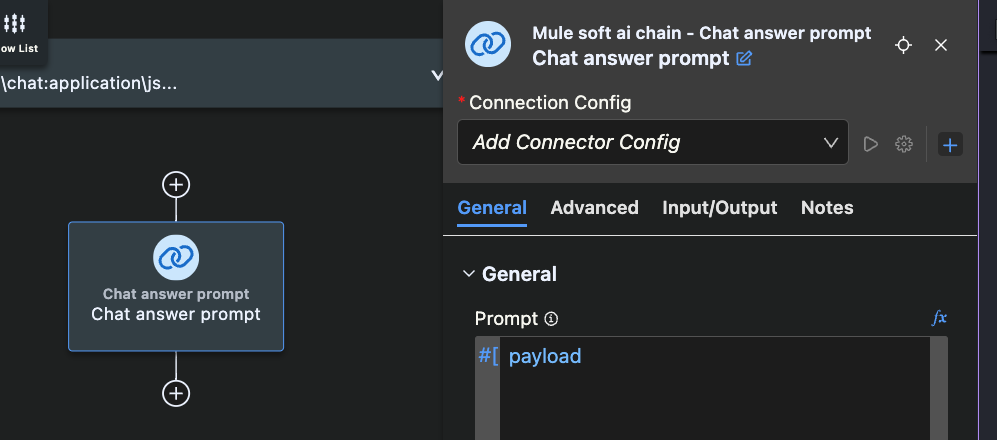

- Add the following details:

| Setting | Value | Notes |
|---|---|---|
| Name | `MAC_Config` |  |
| LLM type | OLLAMA |  |
| Config type | Configuration Json |  |
| File path | `mule.home ++ "/apps/" ++ app.name ++ "/llm-config.json"` | *Make sure to click on the fx button to make this a formula instead of a hardcoded value |
| Model name | llama3 | *This will depend on the model you installed locally |
| Temperature | 0.7 |  |
| LLM timeout | 60 |  |
| LLM timeout unit | SECONDS (Default) |  |
| Max tokens | 500 |  |

> [!NOTE]
> This post was created when the MAC project was on version 1.0.0. This functionality may change in future versions.

- Click Add
- Back in the canvas, click on the plus button at the end to add a new connector
- Add a Transform
- Set it up like the following:

```dataweave
output application/json
---
payload
```

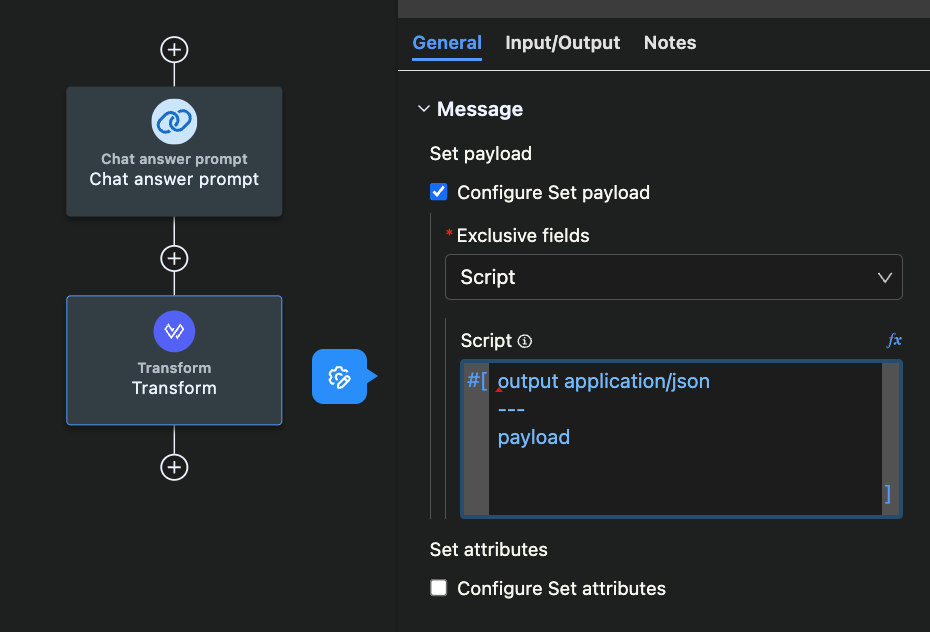

> [!NOTE]
> If you see a red line/dot at the beginning of the script like in the previous screenshot, head to the XML view and remove the surrounding #[ ]

- You can add some loggers at the beginning and/or at the end of the flow to show the input/output payloads from the console
- The Global Configuration / MAC Connection Config should look like the following (located at the beginning of the XML file):

```xml
<ms-aichain:config configType="Configuration Json" filePath='#[mule.home ++ "/apps/" ++ app.name ++ "/llm-config.json"]' llmType="OLLAMA" modelName="llama3" name="MAC_Config"></ms-aichain:config>
```

- The flow should look like the following (located at the end of the XML file):

```xml
<flow name="post:\chat:application\json:mac-ollama-api-config">
    <logger doc:name="Logger" doc:id="ezzhif" message="#[payload]" />
    <ms-aichain:chat-answer-prompt config-ref="MAC_Config" doc:id="mmoptd" doc:name="Chat answer prompt"></ms-aichain:chat-answer-prompt>
    <ee:transform doc:name="Transform" doc:id="czdqgi">
        <ee:message>
            <ee:set-payload>
                <![CDATA[output application/json
---
payload.response]]>
            </ee:set-payload>
        </ee:message>
    </ee:transform>
    <logger doc:name="Logger" doc:id="rzhuiw" message="#[payload]" />
</flow>
```

- Create a new file called `llm-config.json` under `src/main/resources` and paste the following:

```json
{
    "OLLAMA": {
        "OLLAMA_BASE_URL": "http://localhost:11434"
    }
}
```

## 4 - Test the app locally

- Run the application locally
- Once it has started, send a POST request to [localhost:8081/api/chat](http://localhost:8081/api/chat) with a JSON body including your question

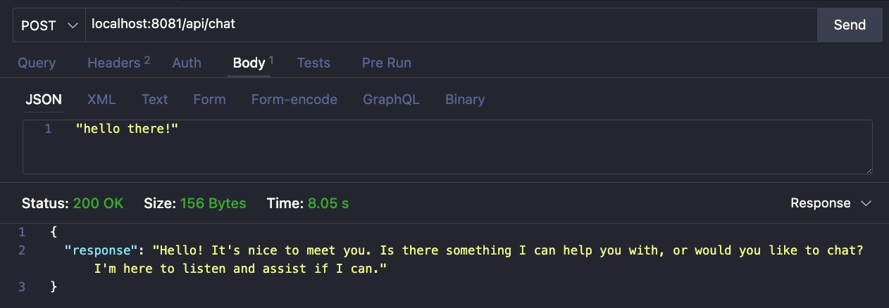

- If everything was successful, continue to the next step. Otherwise, please troubleshoot before continuing
- Stop the app

## 5 - Use ngrok for the public endpoint

- Download and install [ngrok](https://download.ngrok.com/mac-os) to make your Ollama endpoint publicly available from the internet. This way, CloudHub will be able to access the URL since it's not only in your local (localhost:11434)
- Run the following from your Terminal:

```bash
ngrok http 11434 --host-header="localhost:11434"
```

- Copy the address from the Forwarding field

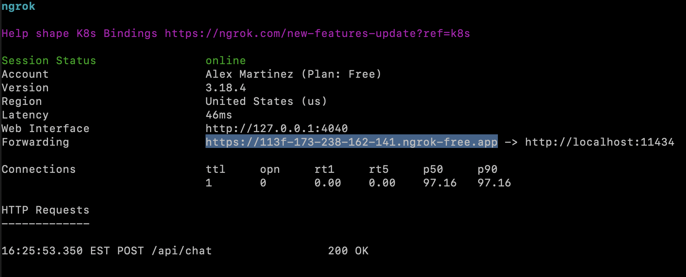

- Paste it in your `llm-config.json` file under `src/main/resources`

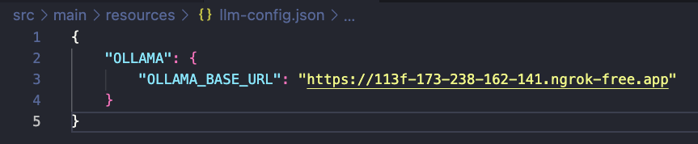

- Save the file and run the app again to verify everything still works correctly
- Stop the app once you verify it works

## 6 - Deploy to CloudHub

- If everything still works, you are ready to deploy to CloudHub
- Go to your `pom.xml` file and change the version to 1.0.0 (remove the SNAPSHOT)

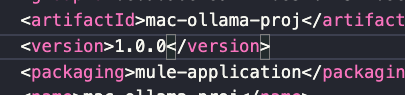

- Save the file
- Head to your `mac-ollama-proj.xml` file and click on the Deploy to CloudHub button

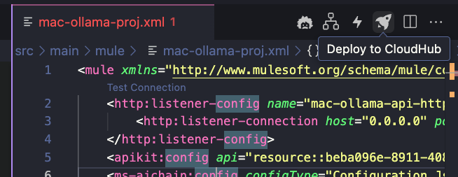

- Select CloudHub 2.0
- Select the `US-EAST-2` (or whichever region is available on your account)
- Select the Sandbox environment
- Make sure everything looks good in the newly created `deploy_ch2.json` file and click on Deploy
- Select the Runtime version (including the patch)
- It will first publish the project to Exchange (as an application)
- After that, it will be deployed to CloudHub
- If you're experiencing a lot of issues deploying from ACB, you can also take the generated JAR from the target/ folder and deploy it manually to Runtime Manager
- Once the deployment is done, get the Public Endpoint from your application and call it to verify the app works

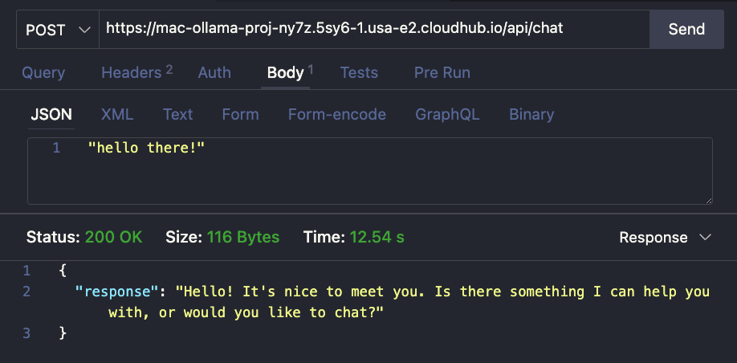

Subscribe to receive notifications as soon as new content is published ✨

💬 Prost! 🍻
