*GitHub repository with the project can be found at the end of the post.*

Once we start developing applications in MuleSoft and we keep our code stored in any source control platform like Github, Bitbucket, GitLab, or Azure; as a developer and as a best practice, we look into automating the process to deploy our applications to either CloudHub or an On-Premise server.

In this post I will explain how a MuleSoft application can be automatically deployed into CloudHub or an On-Premise server from Azure DevOps as our main Continuous Integration (CI) and source control platform.

## Creating a new project in Azure

The first step would be to setup our project in Azure DevOps, for this you need a Microsoft account. You can get one [here](https://dev.azure.com/).

Then, we can create a new project, provide a name and a description, as well as set the privacy settings. By default you can set it as "private".

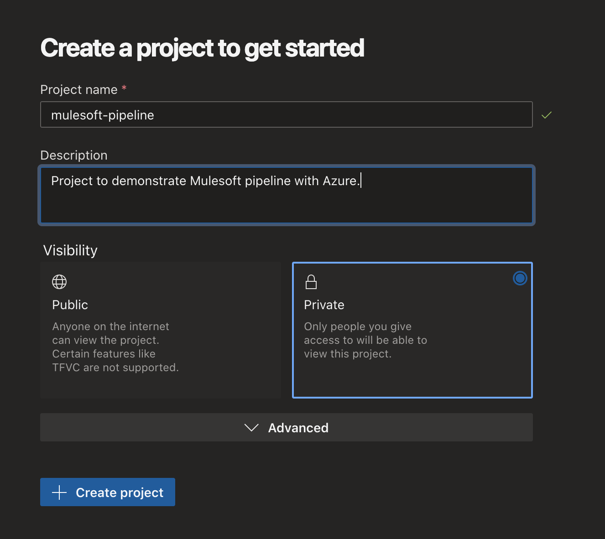

Once it is created, we can go into the main page and locate the "Repos" section. Once we see the page, we can use the information to send our code directly from our local environment.

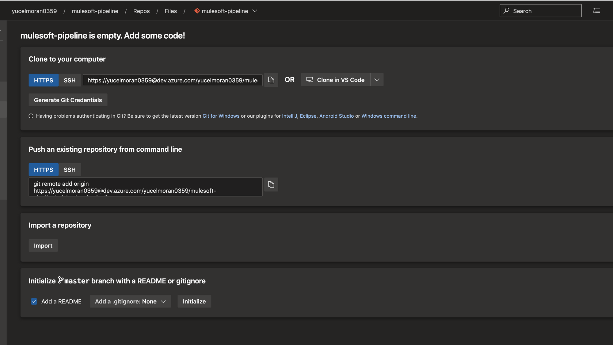

Just before actually pushing any code we can create a pretty simple endpoint that we can hit later to verify it’s all working. Let's create a simple RAML definition in Anypoint Platform:

```yaml
#%RAML 1.0
title: Sample API

/persons:
  get:
    responses:
      200:
        body:
          application/json:
            example: |
              [{
                "id": 1,
                "name": "Edgar Moran",
                "username": "emoran",
                "email": "yucel.moran@some.test",
                "address": {
                  "street": "Kulas Light",
                  "suite": "Apt. 556",
                  "city": "Gwenborough",
                  "zipcode": "92998-3874",
                  "geo": {
                    "lat": "-37.3159",
                    "lng": "81.1496"
                  }
                }}]
```

Then we can generate the flows in our project. Right click on the RAML file > Mule > Generate Flows from Local REST API.

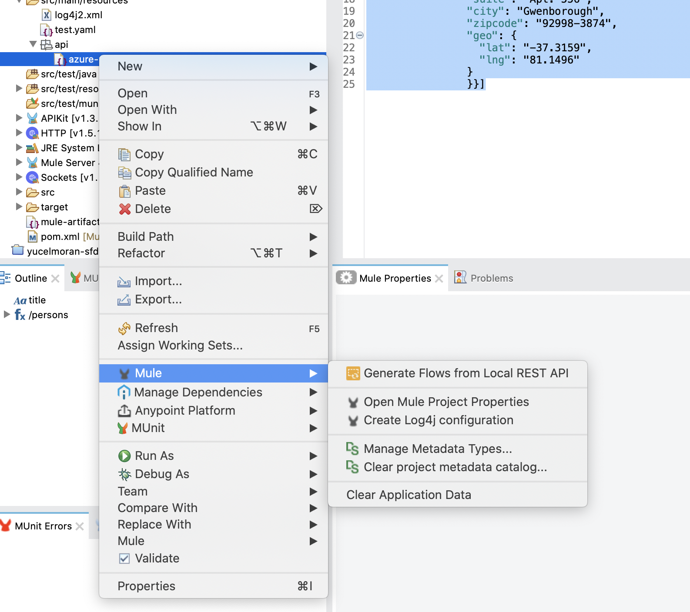

Once we have our flow generated, we can proceed to create our `test.yaml` file in order to identify any value we want to attach to our environment.

It will look just like this:

```yaml
http:
  port: "8081"
environment: "[TEST]"
```

I will create a `global.xml` configuration file to keep my configurations. I will add a Configuration Properties element:

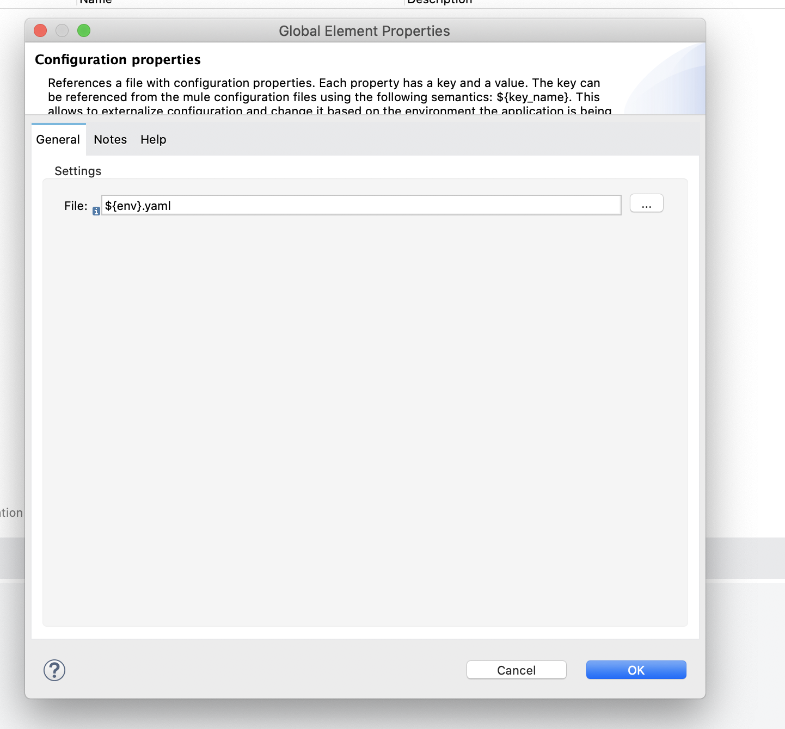

After that, we can create a Global Property, in this case called env which will allow us to know which environment we are working on.

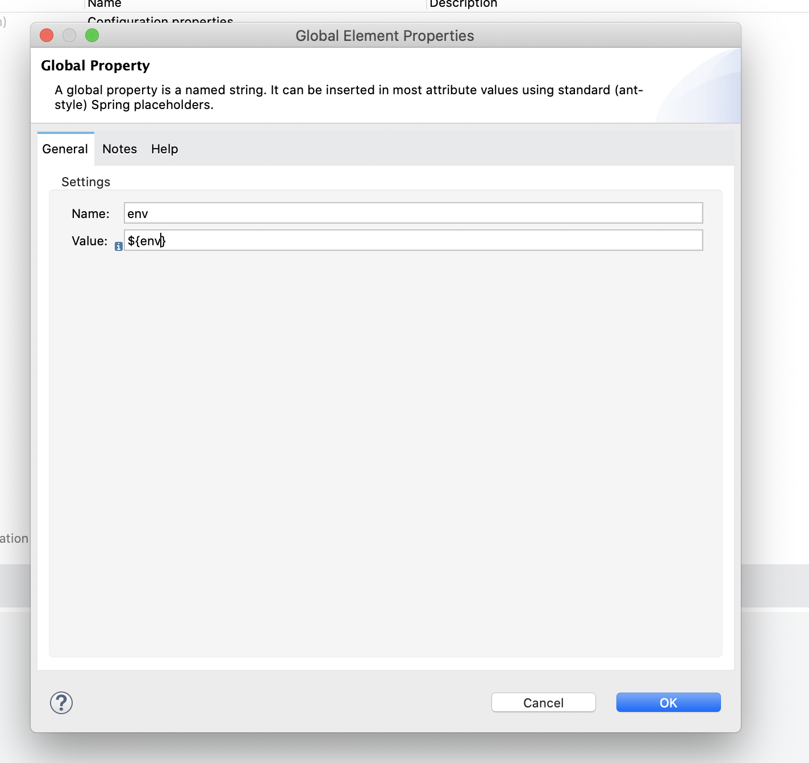

I know, a lot of steps, right? But let's try to make it right, just before our final check to verify everything is working. Let's add an environment variable called env in our Run Configuration.

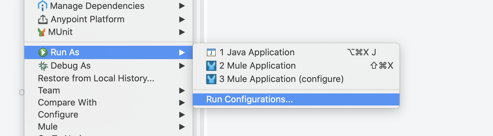

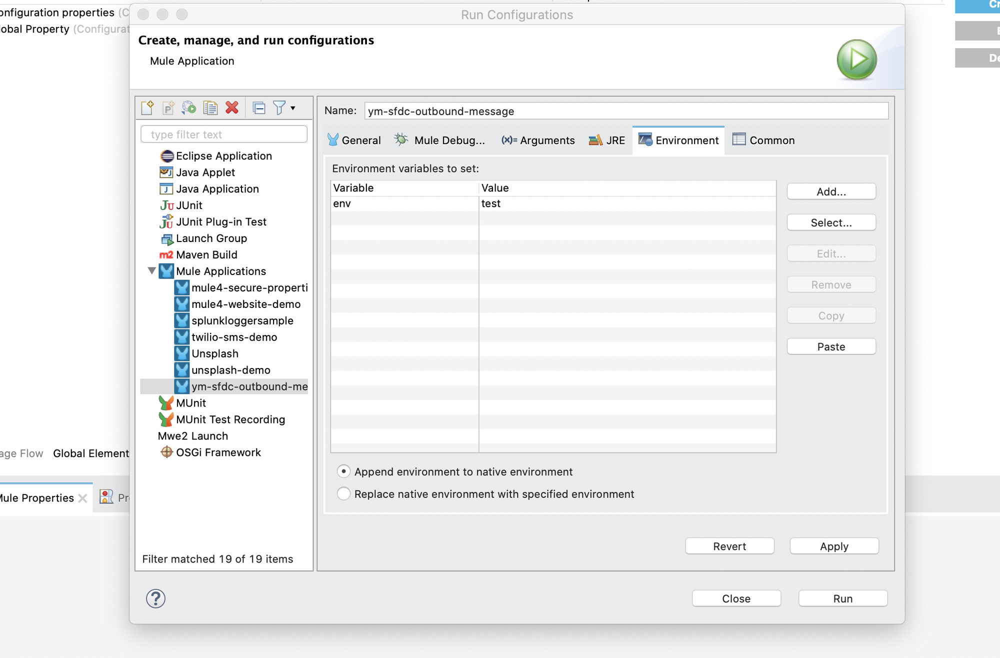

Now let's run the project. If everything was correctly set up, you'll see your project deployed!

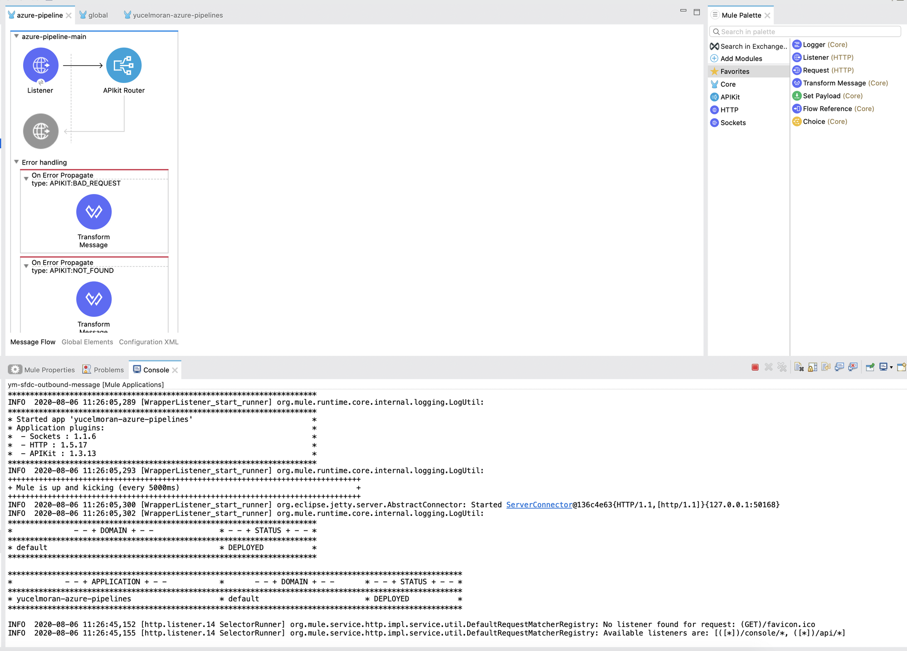

We can start pushing our first version of this working code into our Azure repository, so let's do that.

## Generating a personal access token to push our code to Azure

Let's go back into the Azure DevOps main project page:

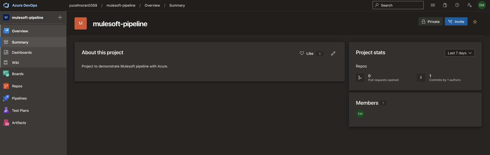

And let's create a personal access token:

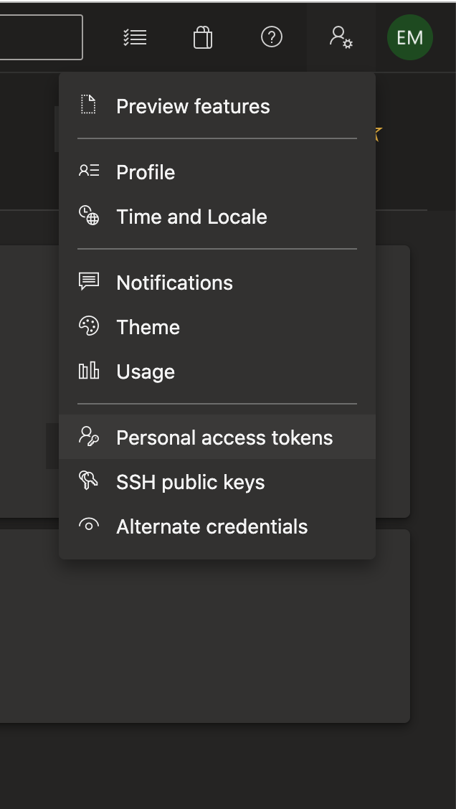

Click con Create a new token. You'll see a bunch of options, select the actions and permissions you consider are the best depending on your needs.

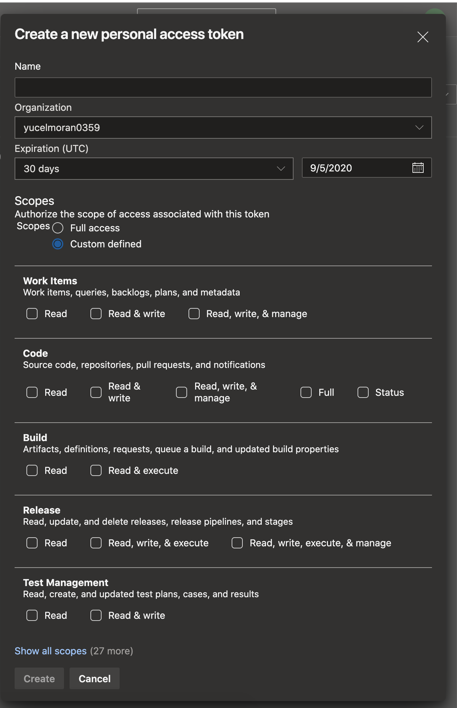

Once created, you'll have a new token which becomes your project password, so keep it safe!

Now we can push our code. If the terminal asks you for a password, use the token you just generated and your code should be on master.

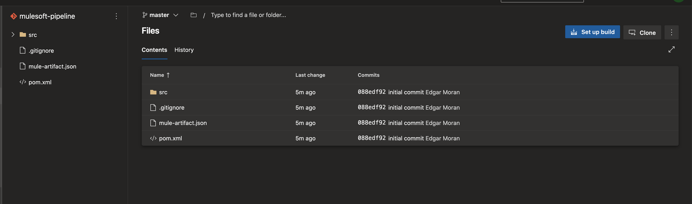

All right, so we have our code already in Azure. Now let's create a new branch for our repository, just let's call it test based from master and let's create another one as a developer branch called emoran.

It's important to mention that during this sample on emoran branch we will review the build and in the test branch we will deploy to CloudHub.

## Creating an Artifact

Before creating our pipeline we need to make sure we have the right information in our `settings.xml` and our `pom.xml` files. This artifact will allow us to get the Distribution Management piece we need to set in our project.

For this, we will need to go into our main project page, and locate the artifact option on the left, then we need to click on "Connect to feed". We select maven and then it will show the information we need to put in place in our `settings.xml` and `pom.xml` files.

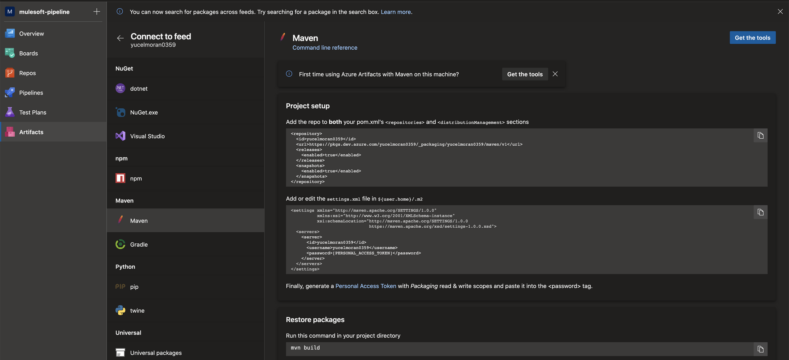

## Preparing the settings.xml and pom.xml files

The next task will be to prepare our files in order to make sure we will be able to build and deploy our application into CloudHub.

Here's how my `settings.xml` file looks like:

```xml
<?xml version="1.0" encoding="UTF-8"?>
<settings xmlns="http://maven.apache.org/SETTINGS/1.0.0" xmlns:xsi="http://www.w3.org/2001/XMLSchema-instance" xsi:schemaLocation="http://maven.apache.org/SETTINGS/1.0.0 http://maven.apache.org/xsd/settings-1.0.0.xsd">
   <servers>
      <server>
         <id>yucelmoran-azure-pipeline</id>
         <username>yucelmorans</username>
         <!-- Treat this auth token like a password. Do not share it with anyone, including Microsoft support. -->
         <!-- The generated token expires on or before 17/11/2019 -->
         <password>${azure.password}</password>
      </server>
      <server>
         <id>MuleRepository</id>
         <username>${nexus.username}</username>
         <password>${nexus.password}</password>
      </server>
   </servers>
   <profiles>
      <profile>
         <id>Mule</id>
         <activation>
            <activeByDefault>true</activeByDefault>
         </activation>
         <repositories>
            <repository>
               <id>yucelmoran-azure-pipeline</id>
               <url>https://pkgs.dev.azure.com/yucelmorans/yucelmoran-azure-pipeline/_packaging/yucelmoran-azure-pipeline/maven/v1</url>
               <releases>
                  <enabled>true</enabled>
               </releases>
               <snapshots>
                  <enabled>true</enabled>
               </snapshots>
            </repository>
            <repository>
               <id>MuleRepository</id>
               <name>MuleRepository</name>
               <url>https://repository.mulesoft.org/nexus-ee/content/repositories/releases-ee/</url>
               <layout>default</layout>
               <releases>
                  <enabled>true</enabled>
               </releases>
               <snapshots>
                  <enabled>true</enabled>
               </snapshots>
            </repository>
         </repositories>
      </profile>
   </profiles>
</settings>
```

and here's the `pom.xml`:

```xml
<?xml version="1.0" encoding="UTF-8"?>
<project xmlns="http://maven.apache.org/POM/4.0.0" xmlns:xsi="http://www.w3.org/2001/XMLSchema-instance" xsi:schemaLocation="http://maven.apache.org/POM/4.0.0 http://maven.apache.org/maven-v4_0_0.xsd">
   <modelVersion>4.0.0</modelVersion>
   <groupId>com.emoran</groupId>
   <artifactId>yucelmoran-azure-pipeline</artifactId>
   <version>1.0.0-SNAPSHOT</version>
   <packaging>mule-application</packaging>
   <name>yucelmoran-azure-pipeline</name>
   <properties>
      <project.build.sourceEncoding>UTF-8</project.build.sourceEncoding>
      <project.reporting.outputEncoding>UTF-8</project.reporting.outputEncoding>
      <app.runtime>4.3.0</app.runtime>
      <mule.maven.plugin.version>3.3.5</mule.maven.plugin.version>
      <mule.tools.version>1.7</mule.tools.version>
   </properties>
   <scm>
      <connection>scm:git:git@ssh.dev.azure.com:v3/yucelmorans/yucelmoran-azure-pipeline/yucelmoran-azure-pipeline</connection>
      <developerConnection>scm:git@ssh.dev.azure.com:v3/yucelmorans/yucelmoran-azure-pipeline/yucelmoran-azure-pipeline</developerConnection>
      <url>https://yucelmorans@dev.azure.com/yucelmorans/yucelmoran-azure-pipeline/_git/yucelmoran-azure-pipeline</url>
   </scm>
   <distributionManagement>
      <repository>
         <id>yucelmoran-azure-pipeline</id>
         <url>https://pkgs.dev.azure.com/yucelmorans/yucelmoran-azure-pipeline/_packaging/yucelmoran-azure-pipeline/maven/v1</url>
      </repository>
   </distributionManagement>
   <build>
      <plugins>
         <plugin>
            <groupId>org.apache.maven.plugins</groupId>
            <artifactId>maven-clean-plugin</artifactId>
            <version>3.0.0</version>
         </plugin>
         <plugin>
            <groupId>org.mule.tools.maven</groupId>
            <artifactId>mule-maven-plugin</artifactId>
            <version>${mule.maven.plugin.version}</version>
            <extensions>true</extensions>
            <configuration>
               <cloudHubDeployment>
                  <uri>https://anypoint.mulesoft.com</uri>
                  <muleVersion>4.3.0</muleVersion>
                  <!-- Deploy User Parameter -->
                  <username>${anypoint.username}</username>
                  <password>${anypoint.password}</password>
                  <!-- Environment Parameter -->
                  <environment>Sandbox</environment>
                  <applicationName>yucelmoran-azure-pipeline</applicationName>
                  <workerType>Micro</workerType>
                  <objectStoreV2>true</objectStoreV2>
                  <properties>
                     <env>${env}</env>
                  </properties>
               </cloudHubDeployment>
            </configuration>
            <executions>
               <execution>
                  <id>deploy</id>
                  <phase>deploy</phase>
                  <goals>
                     <goal>deploy</goal>
                  </goals>
               </execution>
            </executions>
         </plugin>
         <plugin>
            <groupId>org.codehaus.mojo</groupId>
            <artifactId>buildnumber-maven-plugin</artifactId>
            <version>1.1</version>
            <executions>
               <execution>
                  <id>buildnumber</id>
                  <phase>validate</phase>
                  <goals>
                     <goal>create</goal>
                  </goals>
               </execution>
            </executions>
            <configuration>
               <format>{0,number}</format>
               <items>
                  <item>buildNumber</item>
               </items>
               <doCheck>false</doCheck>
               <doUpdate>false</doUpdate>
               <revisionOnScmFailure>unknownbuild</revisionOnScmFailure>
            </configuration>
         </plugin>
         <plugin>
            <groupId>org.mule.tools.maven</groupId>
            <artifactId>mule-app-maven-plugin</artifactId>
            <version>${mule.tools.version}</version>
            <extensions>true</extensions>
         </plugin>
         <plugin>
            <groupId>org.apache.maven.plugins</groupId>
            <artifactId>maven-install-plugin</artifactId>
            <version>2.5.2</version>
         </plugin>
         <plugin>
            <groupId>org.apache.maven.plugins</groupId>
            <artifactId>maven-deploy-plugin</artifactId>
            <version>2.8.2</version>
         </plugin>
      </plugins>
   </build>
   <dependencies>
      <dependency>
         <groupId>org.mule.connectors</groupId>
         <artifactId>mule-http-connector</artifactId>
         <version>1.5.17</version>
         <classifier>mule-plugin</classifier>
      </dependency>
      <dependency>
         <groupId>org.mule.connectors</groupId>
         <artifactId>mule-sockets-connector</artifactId>
         <version>1.1.6</version>
         <classifier>mule-plugin</classifier>
      </dependency>
      <dependency>
         <groupId>org.mule.modules</groupId>
         <artifactId>mule-soapkit-module</artifactId>
         <version>1.2.6</version>
         <classifier>mule-plugin</classifier>
      </dependency>
      <dependency>
         <groupId>org.mule.modules</groupId>
         <artifactId>mule-apikit-module</artifactId>
         <version>1.3.13</version>
         <classifier>mule-plugin</classifier>
      </dependency>
   </dependencies>
   <repositories>
      <repository>
         <id>yucelmoran-azure-pipeline</id>
         <url>https://pkgs.dev.azure.com/yucelmorans/yucelmoran-azure-pipeline/_packaging/yucelmoran-azure-pipeline/maven/v1</url>
         <releases>
            <enabled>true</enabled>
         </releases>
         <snapshots>
            <enabled>true</enabled>
         </snapshots>
      </repository>
      <repository>
         <id>MuleRepository</id>
         <name>MuleRepository</name>
         <url>https://repository.mulesoft.org/nexus-ee/content/repositories/releases-ee/</url>
         <layout>default</layout>
         <releases>
            <enabled>true</enabled>
         </releases>
         <snapshots>
            <enabled>true</enabled>
         </snapshots>
      </repository>
      <repository>
         <id>mulesoft-release</id>
         <name>mulesoft release repository</name>
         <layout>default</layout>
         <url>http://repository.mulesoft.org/releases/</url>
         <snapshots>
            <enabled>false</enabled>
         </snapshots>
      </repository>
   </repositories>
   <pluginRepositories>
      <pluginRepository>
         <id>mulesoft-release</id>
         <name>mulesoft release repository</name>
         <layout>default</layout>
         <url>http://repository.mulesoft.org/releases/</url>
         <snapshots>
            <enabled>false</enabled>
         </snapshots>
      </pluginRepository>
      <pluginRepository>
         <id>MuleRepository</id>
         <name>MuleRepository</name>
         <url>https://repository.mulesoft.org/nexus-ee/content/repositories/releases-ee/</url>
         <layout>default</layout>
      </pluginRepository>
   </pluginRepositories>
</project>
```

Basically, we are specifying where is our repository for source control, and then we specify where we want to deploy our application with the cloudHubDeployment configuration into the mule-maven-pluging tag.

We can verify everything works using this command:

```bash
mvn clean install -s settings.xml -e
```

## Creating a pipeline

Now we can create our pipeline configuration. Find the Pipelines options and select "Create Pipeline."

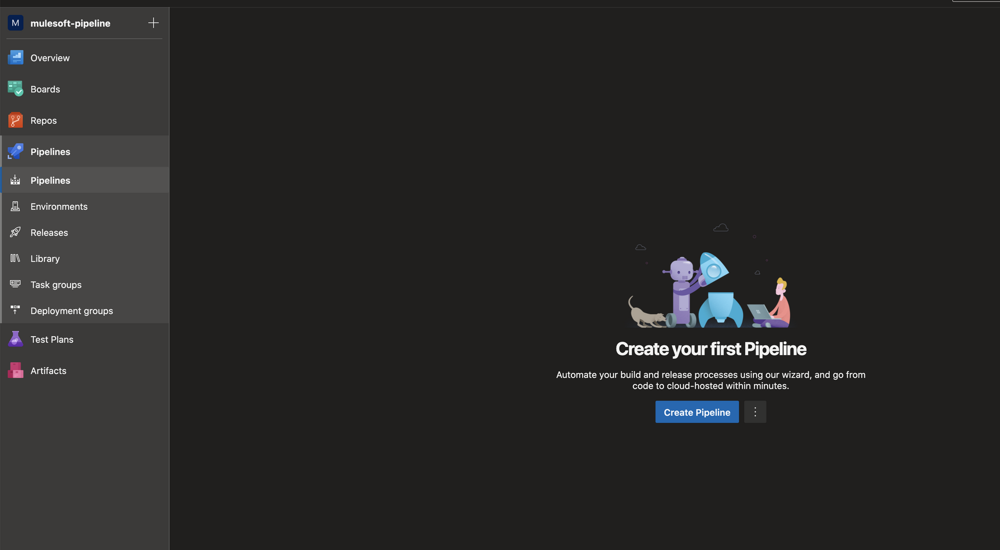

Select the Azure Repos Git option and select your repository from your project.

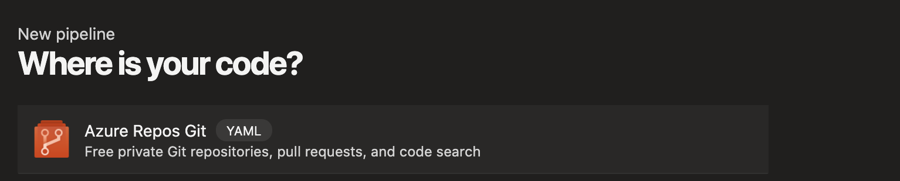

In the next step we can select Maven and then a template yaml file would be generated (we will change this eventually).

```yaml
# Maven
# Build your Java project and run tests with Apache Maven.
# Add steps that analyze code, save build artifacts, deploy, and more:
# https://docs.microsoft.com/azure/devops/pipelines/languages/java

trigger:
- master

pool:
  vmImage: 'ubuntu-latest'

steps:
- task: Maven@3
  inputs:
    mavenPomFile: 'pom.xml'
    mavenOptions: '-Xmx3072m'
    javaHomeOption: 'JDKVersion'
    jdkVersionOption: '1.8'
    jdkArchitectureOption: 'x64'
    publishJUnitResults: true
    testResultsFiles: '**/surefire-reports/TEST-*.xml'
    goals: 'package'
```

When you finish, the new yaml file will appear as part of your code. We need to modify the script, leaving it this way:

```yaml
# Maven
# Aurthor: Edgar Moran
# Build your Java project and run tests with Apache Maven.
# Add steps that analyze code, save build artifacts, deploy, and more:
# https://docs.microsoft.com/azure/devops/pipelines/languages/java

trigger:
- test 
- emoran

pool:
  vmImage: 'ubuntu-latest'

steps:
- task: Maven@3
  condition: and(succeeded(), eq(variables['Build.SourceBranch'], 'refs/heads/test'))
  inputs:
    mavenPomFile: '$(system.defaultWorkingDirectory)/pom.xml'
    mavenOptions: '-Xmx3072m'
    javaHomeOption: 'JDKVersion'
    jdkVersionOption: '1.8'
    jdkArchitectureOption: 'x64'
    publishJUnitResults: true
    testResultsFiles: '**/surefire-reports/TEST-*.xml'
    goals: 'clean deploy -Danypoint.username=$(ANYPOINT_USERNAME) -Danypoint.password=$(ANYPOINT_PASSWORD) -Denv=test -Dazure.password=$(AZURE_TOKEN) -Dnexus.username=$(NEXUS_UERNAME) -Dnexus.password=$(NEXUS_PASSWORD) -s settings.xml -e'

- task: Maven@3
  inputs:
    mavenPomFile: '$(system.defaultWorkingDirectory)/pom.xml'
    mavenOptions: '-Xmx3072m'
    javaHomeOption: 'JDKVersion'
    jdkVersionOption: '1.8'
    jdkArchitectureOption: 'x64'
    publishJUnitResults: true
    testResultsFiles: '**/surefire-reports/TEST-*.xml'
    goals: 'clean install -Dazure.password=$(AZURE_TOKEN) -Dnexus.username=$(NEXUS_UERNAME) -Dnexus.password=$(NEXUS_PASSWORD) -s settings.xml -e'
```

It’s important to set the variables we will use during deployment, for example: credentials to login to nexus repositories in case we need to, credentials for Anypoint Platform and the personal token we created in Azure.

Once we create our pipeline we can select the option Variables.

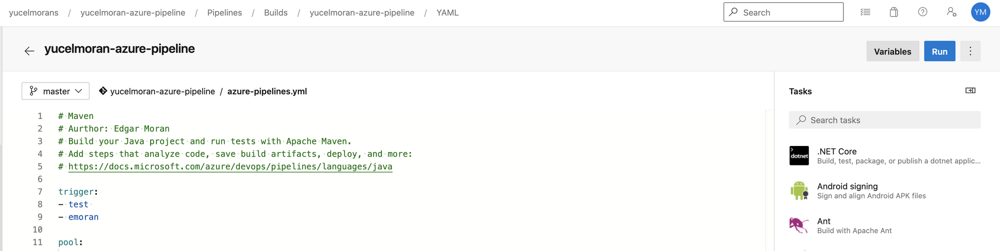

Finally, let's create as many as we need, according to what we need from our yaml file.

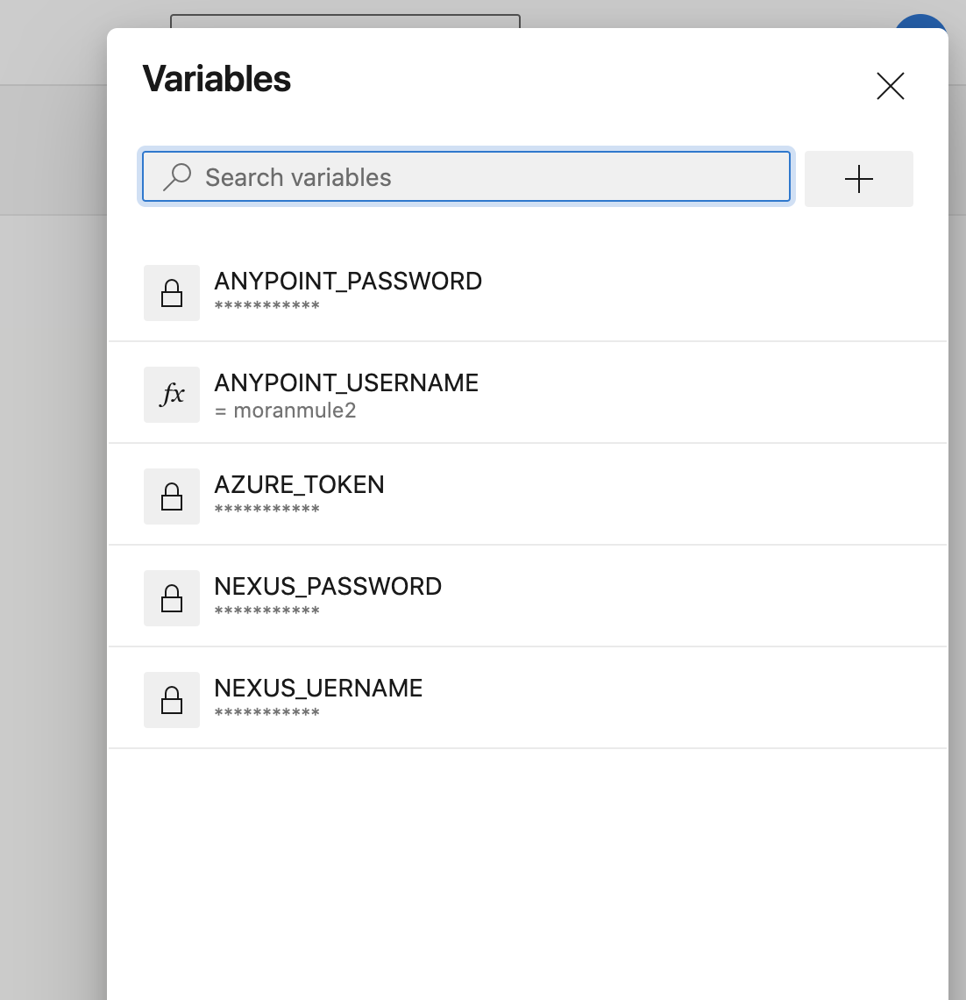

Now the last piece of the puzzle is basically to send a change from source control to Azure on the first step (sending a change to the emoran branch, for example).

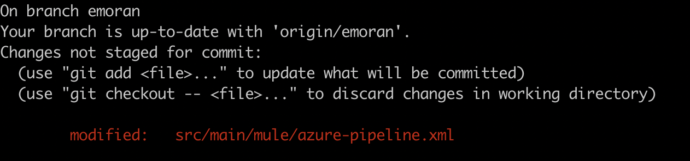

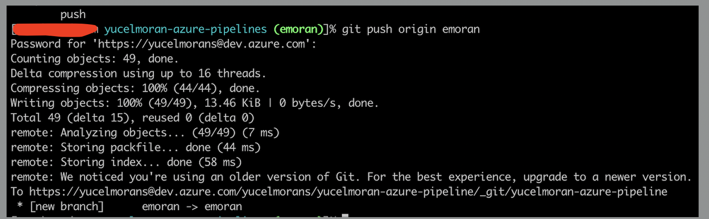

We'll see our pipeline running for emoran.

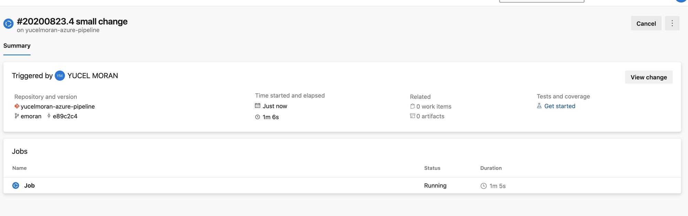

When it finishes, we'll see a *clean install build* command for this branch.

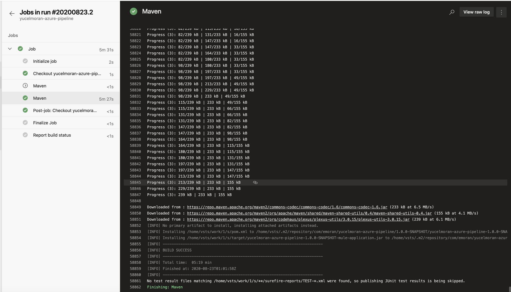

Now all happens in source control, so if we want to deploy our application to CloudHub, then, we need to promote our changes from emoran to the test branch.

Let's create a Pull Request in Azure, from emoran to test:

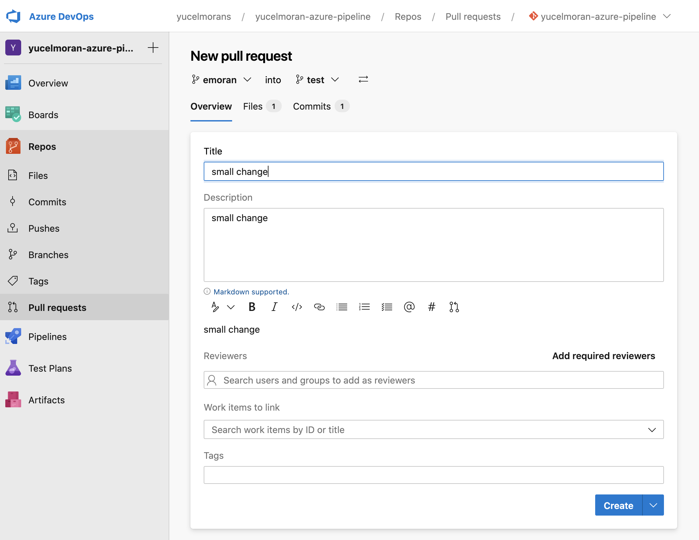

Once we click on Create, then we need to complete the Pull Request and Merge Request in order to trigger the pipeline.

When the pipeline that we ran for test finishes, we can see the deployment happened this time:

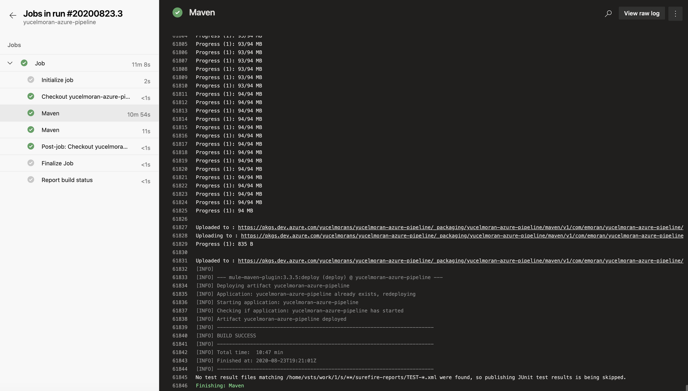

So now we can go to Anypoint Platform and see our app deploying.

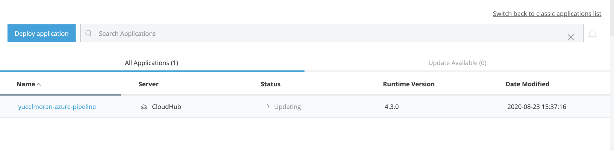

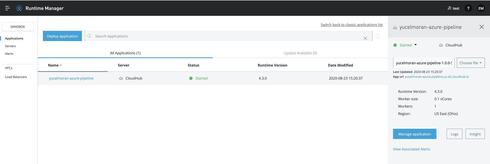

Finally, with this you can set as many branches you need and try other processes along.

## GitHub repository

Hope this helps others to set their process. You can find the complete code [here](https://github.com/emoran/mule4-yucelmoran-azure-pipeline).

Hope to hear from you on comments and let me know if this was helpful.
