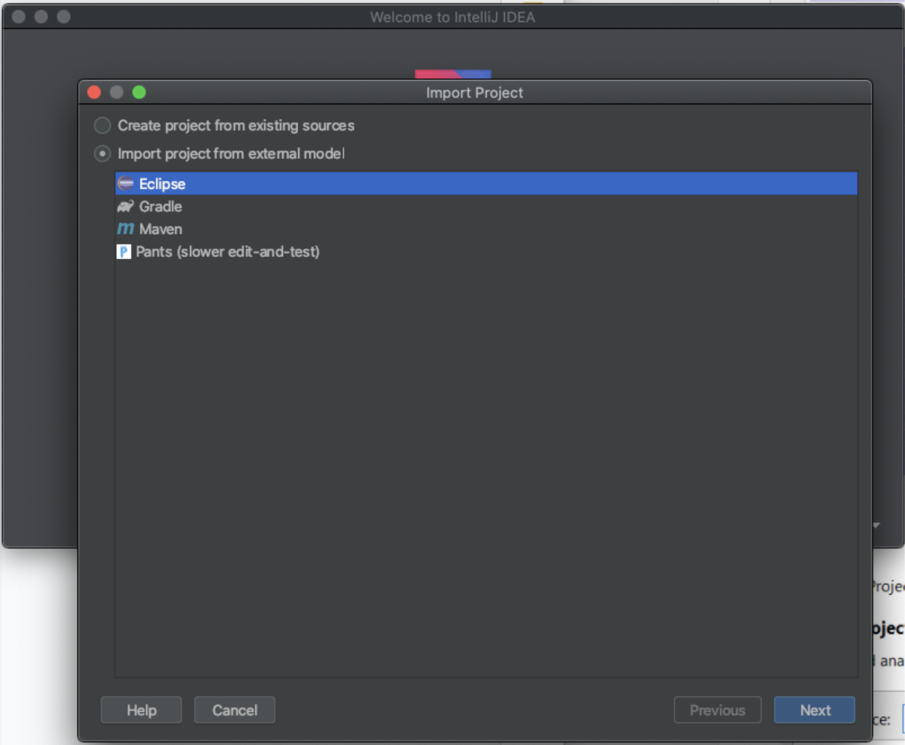
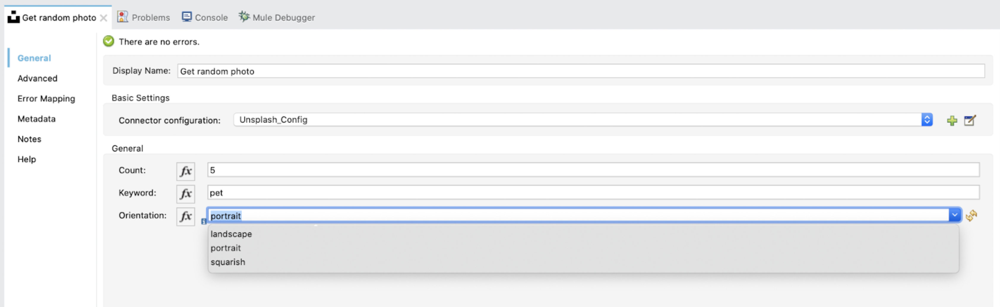
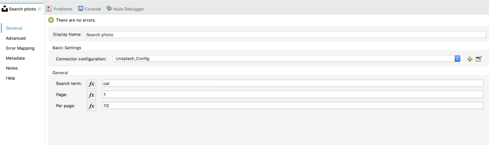
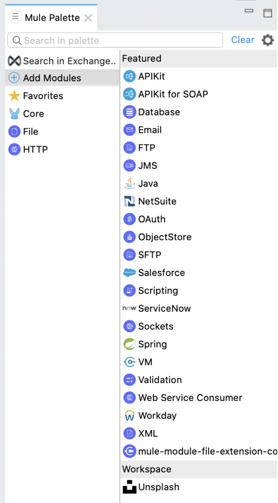
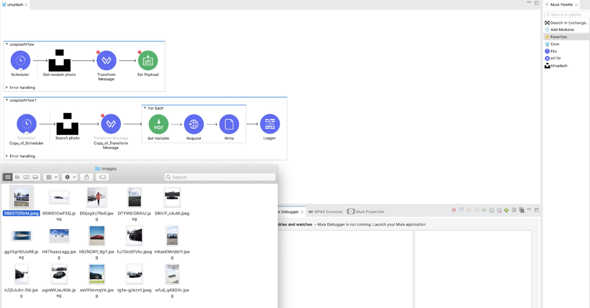

*GitHub repositories with the projects can be found at the end of the post.*

## What is Unsplash?

Unsplash is a website dedicated to sharing stock photography under the Unsplash license. Since 2021, it has been owned by Getty Images. The website claims over 207,000 contributing photographers and generates more than 17 billion photo impressions per month on their growing library of over 2 million photos.

Basically Unsplash allows you to download images for free and use them under Unsplash license on your web pages and projects.

Personally I’m a big fan of this community. I’ve been uploading photographs for the last couple years and it’s really amazing how many of the images uploaded have been used in a number of sites like BuzzFeed, Adobe Spark and Trello. Also many people share on Twitter and email how they wanna use my images.

Unsplash has a [REST API](https://unsplash.com/documentation) that provides a bunch of nice features like image search, photo actions, collections, topics and users. Basically you can use all these actions to create any kind of automated application.

This time I have created a new custom connector for Mule 4 to use a couple operations (Get Random Photo and Search Photos).

## Creating the custom connector

Creating a custom module (connector) is easier than you think, so let me list the steps I followed.

1. Executing the maven archetype command generate in your terminal.

```bash
mvn org.mule.extensions:mule-extensions-archetype-maven-plugin:generate
```

2. Then a few questions need to be answered related to the project.

```
Enter the name of the extension:
Enter the extension's groupId:
Enter the extension's artifactId:
Enter the extension's version: 1.0.0
Enter the extension's main package:
```

3. Run the mvn eclipse:eclipse command in the terminal, so this way when we can import our projects and let it be recognized by the IDE (in case you are using Eclipse IDE). I personally like IntelliJ IDEA.

4. Import the generated project into the IDE. In my case, since I’m using the IntelliJ IDEA I select the maven project (*it’s easier if the IDE is in charge of pulling the maven dependencies into the project*).



Finally, the connector is imported and we are able to start working on it.

5. Now for this specific connector we are going to use only two of the auto-generated java classes: **UnsplashConfiguration** and **UnsplashOperations.**

- **UnsplashConfiguration.** Allows to set up any general parameter we might use. In this case we needed to set the Unsplash Access Key required for API calls.
- **UnsplashOperations**. Here we will specify our first operations in the connector. We should be able to include more operations later. For now we will only have **GetRandomPhoto** and **SearchPhoto.**
  - **GetRandomPhoto.** Will retrieve a random picture from the API.
  - **SearchPhoto.** Will let you search based on a keyword and retrieve some picture information.

## Get Random Photo

This operation will allow you to get a random set of photos from Unsplash and be able to specify some additional attributes like count (number of images you want to retrieve), keyword (specify the keyword for images you want to get from Unsplash) and orientation (it can be portrait, landscape or squarish). The connector will show the operations this way:



## Search Photo

The search operation allows you to search photos on the Unsplash API specifying a few optional attributes like **search terms** (this will tell the search the photos you are looking for), **page** (specify the page you are in), and **per page (**tells how many records per page you want).



## Installing the Mule module

The installation is really easy. Basically we just need to run the command:

```bash
mvn clean install
```

After running the command from terminal or IntelliJ IDEA, the new module will appear on the add modules palette.



Then we just need to drag and drop the module for our project. In this specific case I have created a simple application that uses both operations. Search operation in this case contains a foreach component that allows you to get the photo from Unsplash API and place the actual image in your local directory.

Here is a sample of images downloaded from Search:



## GitHub repository

You can get both projects from the repositories:

Connector: [https://github.com/emoran/mule4-unsplash-connector](https://github.com/emoran/mule4-unsplash-connector)

Connector implemented code: [https://github.com/emoran/unsplash-connector-implementation](https://github.com/emoran/unsplash-connector-implementation)

Hope you enjoy this project and hopefully it will help with any type of project / integration you’re working on.
