Apache Kafka is a very popular streaming service, and I could say that it is the leader in the market. Is part of the Apache Initiative, but vendors like Confluent offer a managed service that can be very powerful for organizations who are looking to start using the platform, without the need to control/manage the underlined infrastructure.

But there are other options for streaming services that can be also useful for organizations who don’t want to get too much into the Kafka complexity. And in my case, since I am constantly working with Oracle Cloud Infrastructure, I’ve found a very interesting option for Kafka in Oracle Streaming Service.

Oracle Streaming Service is a managed service running on top of Oracle Cloud. Is a serverless service, that users just need to provision and start creating streams/partitions that can be used for multiple purposes.

With MuleSoft, it is common to have the need to connect to a Kafka Topic to consume a stream of messages. I’ve found that a very common scenario, for example in Retail, where they need to constantly send information from their Point-of-Sale to a central location. And if you think of a retailer who has multiple branches all over the country, then a stream makes a lot of sense. And for integration purposes, to have MuleSoft in the middle to enrich, transform and ultimately push the information to a system-of-records, then this mix of platforms offers you a very strong alternative.

In this article we will show how to connect MuleSoft with Oracle Streaming Service, using the Kafka compatibility mode that this Oracle service offers.

The first thing we need to do is to create a stream in Oracle Cloud:

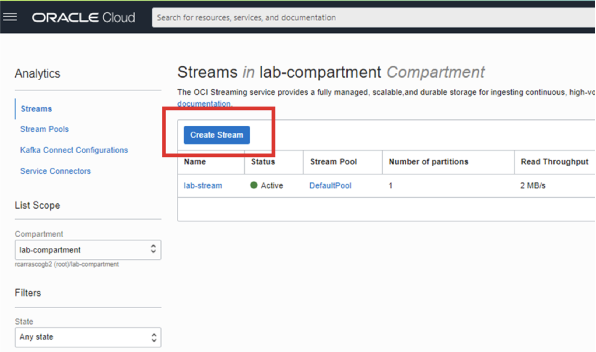

That is a very straight-forward step, we just need to click on that blue button and fill in these parameters:

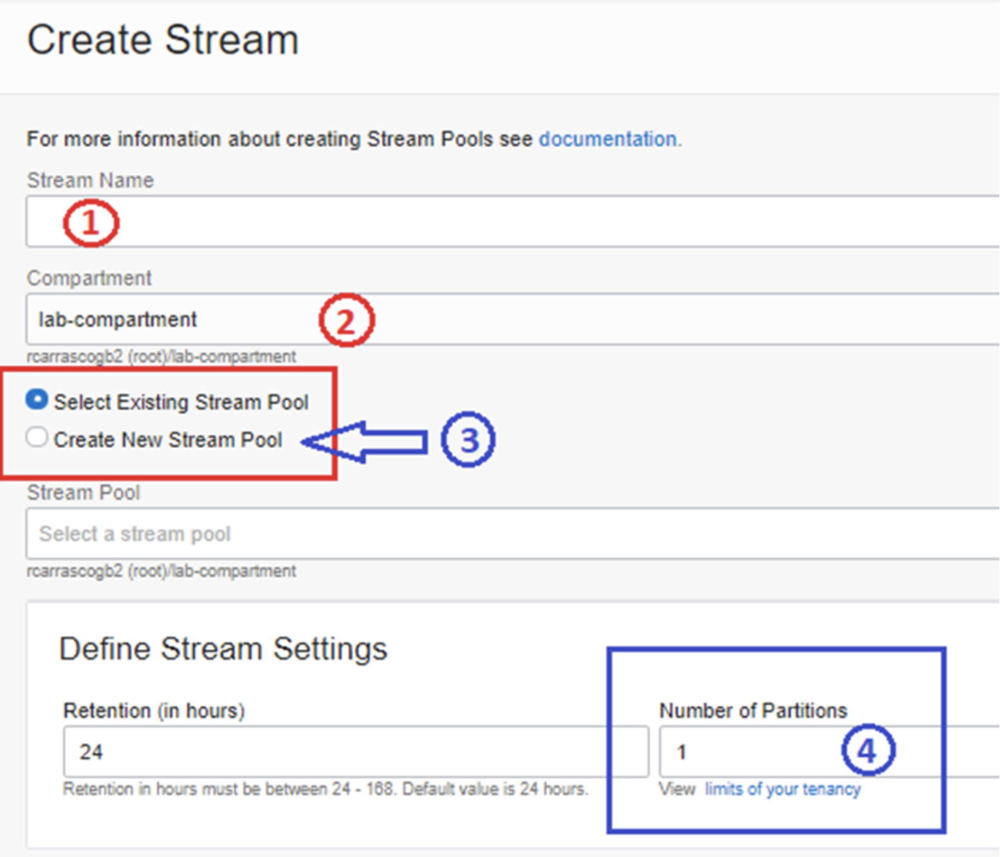

- The name for your stream
- Select the compartment where you want to create the stream
- Create a New Stream Pool
- Define the number of partitions

And that’s it. You don’t need to worry about anything extra.

Now, let’s move to MuleSoft.

Imagine we need to create a MuleSoft application that consumes the stream that we have just created.

MuleSoft does not have a connector to OCI Streams, but it does have a connector for KAFKA. Let’s look to a very simple application:

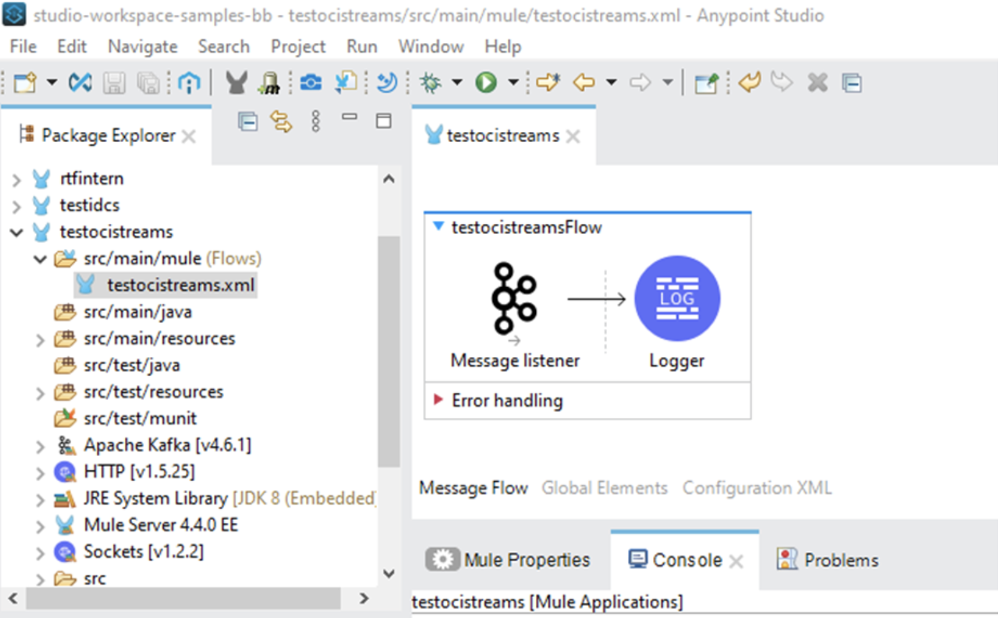

As you can see, we are using the KAFKA connector. We have the Message listener processor to listen into the stream and a simple Logger processor to print in the log file the payload/message.

Now let’s see what the connector connection is going to ask us:

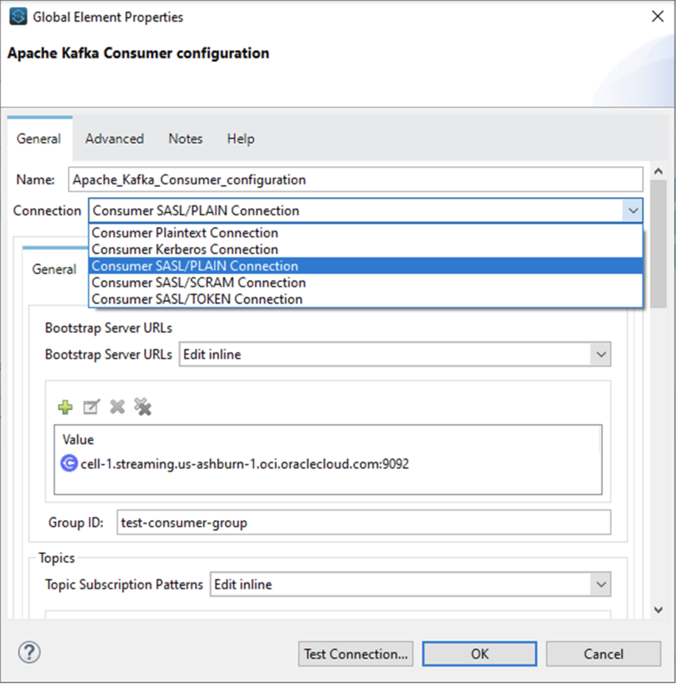

The first thing to highlight is the Connection type. It offers different options:

a) Consumer Plaintext Connection

b) Consumer Kerberos Connection

**c) Consumer SASL/PLAIN Connection**

d) Consumer SASL/SCRAM Connection

e) Consumer SASL/TOKEN Connection

The one we need to use is **option c**.

Also notice that we need to configure the bootstrap server, and as you can see, we’ve already filled in that information. We will show you where we get that info in the next paragraphs.

After that, we need to define our **Group ID**. That is something you need to define, in my case: `test-consumer-group`.

If we scroll down a little bit more, we will find the following parameters:

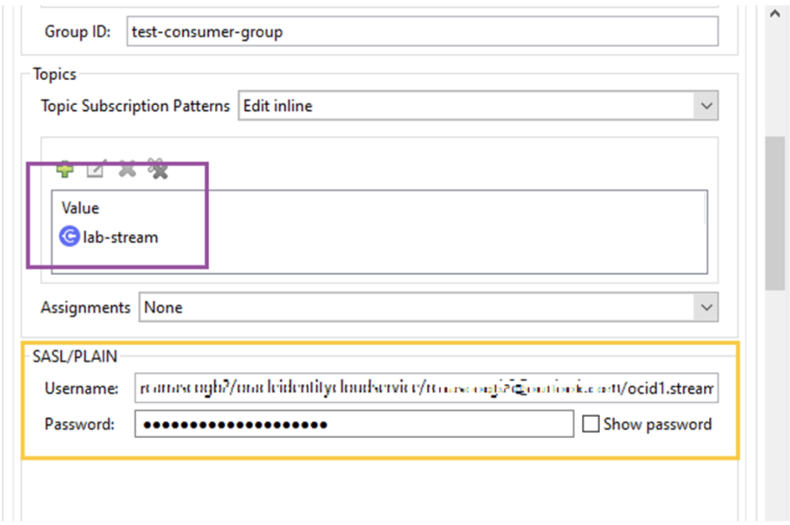

Which is:

- Topics. In my case `lab-stream`
- **SASL/PLAIN**. Which is the username that has access to the streaming service, and the password which is the AUTH Token that you will create in the next steps.

Then, a particular step that can be tricky, is that we need to tell the connector settings that we want to use **SSL**, and for that, we need to go to this tab:

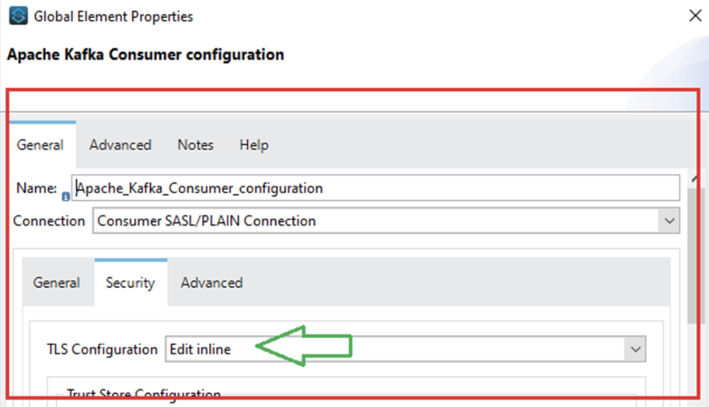

And enable the TLS Configuration. Even though there will be no configuration at this tab, just please enable it.

And that’s it, that is all we need.

But the normal question will be: **but from where can I get that information from the OCI Streaming Service?** Well, let’s get back to the OCI Console and click on the Default Pool of your newly created stream:

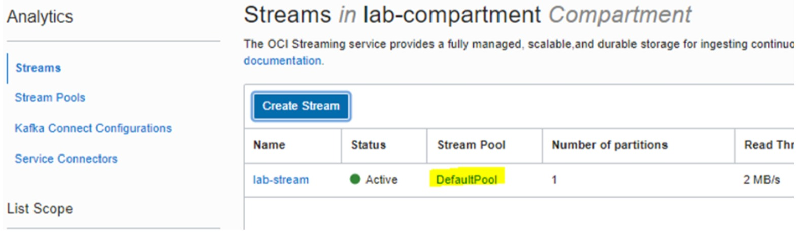

Once there, at the left of the screen:

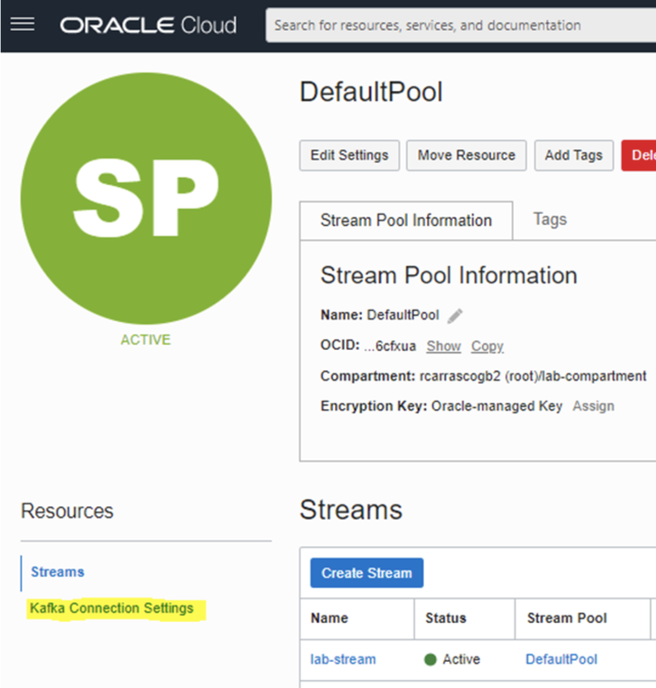

Click on the Kafka Connection Settings, It will show you this:

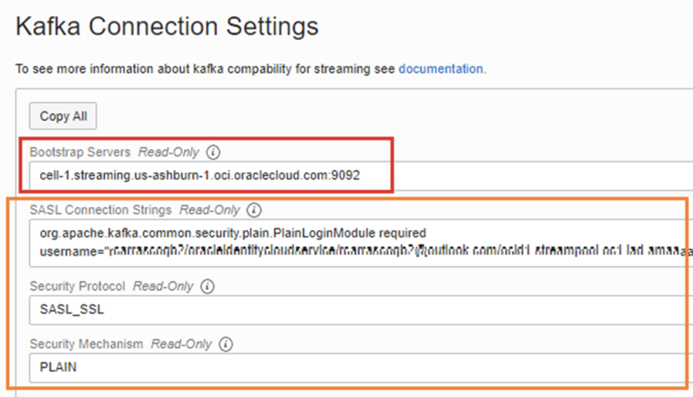

The bootstrap server is what we input in the connection window in MuleSoft.

The username is the one that appears in the SASL Connection String box. Look to the element username, and copy the whole string, it will be something similar to this:

```
pedrito/oracleidentitycloudservice/pedrito@me.com/ocid1.streampool.oc1.iad.gz2gqeeegfljtyb2zr6cfxua
```

And for the **password**, you need to create an `AUTH_TOKEN`. For that regard, go to the user page:

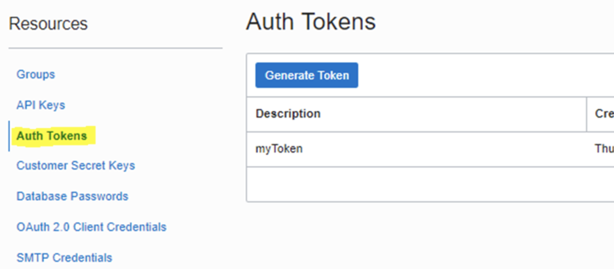

Click on the **Auth Tokens**, and generate a new one. Write it down immediately, since this is going to be the only time you will see it.

Now we are ready to run our application in our Anypoint Studio and start consuming the stream.

Let’s produce a message from the Streaming Service console:

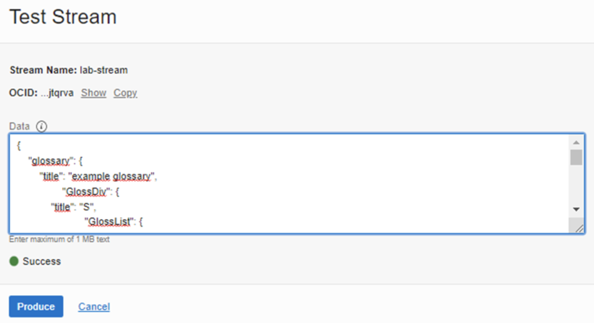

And from the Console output in our Anypoint Studio we can see the message being consumed:

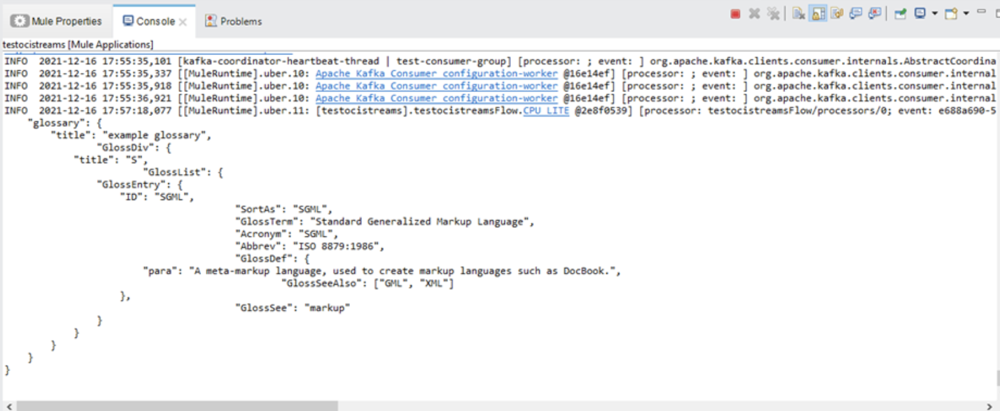

What do you think?

This article is focused on highlighting MuleSoft’s KAFKA connector, to be used with OCI Streaming Services.
