MuleSoft is so flexible and modern in such a way, that for deployment models where the customer needs to have control over the infrastructure, and CloudHub is not an option (maybe regulations concerns) it offers on premise deployments such as:

- MuleSoft Standalone
- MuleSoft Runtime Fabric
- MuleSoft Private Cloud Edition

The first two are a hybrid model, where the control plane remains in the cloud (MuleSoft) and the runtime plane is deployed on premise or in a computer on top of a cloud provider (Google, AWS, Oracle, Microsoft, Digital Ocean, etc).

For Standalone, it’s the common MuleSoft runtime running directly at the OS level, which supports clustering, grouping of runtimes, etc. There is nothing extra on this type of deployment, it is basically to download the software, unzip it and run it. I am being practical right here, but in essence that is what you have to do in order to have it running on your own hardware. In this case the responsibility to maintain, patch, upgrade, operate the runtime is at the customer end; the control plane remains a MuleSoft responsibility, but ultimately where the workloads are running (runtime plane) is all at customer’s.

Private Cloud Edition, is the option where you have both the Runtime Plane and the Control Plane at your end; you are in charge of maintaining everything. You install it, you patch it, you upgrade it, you monitor it, etc. But you have most of the capabilities at your disposal, similar to CloudHub; there are some differences, but in general it is very compatible with what you get in CloudHub. You can decide how much compute to assign to a specific MuleSoft application, or the amount of replicas, in a very similar CloudHub fashion.

Then you have MuleSoft Runtime Fabric (RTF), which is the option we want to elaborate through this article. Runtime Fabric, as previously mentioned, is a hybrid deployment model. You still have the Control Plane in the cloud but the workloads (runtime plane) are running at the customer end.

The main thing here with RTF is that the infrastructure that is behind the scenes running the fabric is a Kubernetes-based implementation (Kubernetes [https://kubernetes.io](https://kubernetes.io/)).

But before thinking that this may be very complicated, continue reading this article where you will realize that some of the complexity that is coming to your mind right now, is going to get reduced.

Let us start with the installation process, which is always time consuming because of the pre-requisites that we need to fulfill every time we install something on premise. With RTF is no exception, you need to have all the pre-requisites in place in order to start installing. But the good news is that it is very well documented.

You will identify two ways of installing RTF:

1. **On top of an existent Kubernetes cluster that you already have**. For example, on top of AWS, GKE, AKE. This option is the best one if you want to leverage from what you already have in terms of Kubernetes. The installation documentation is here [https://docs.MuleSoft.com/runtime-fabric/latest/install-self-managed](https://docs.mulesoft.com/runtime-fabric/latest/install-self-managed).

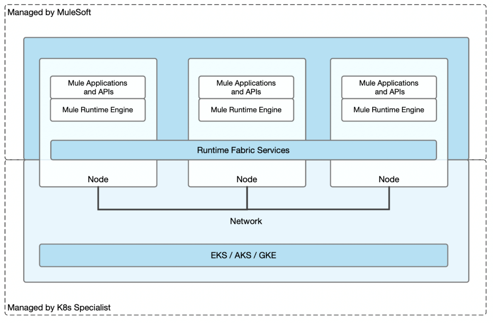

2. **Manual Installation**. This option is where you want to install RTF on top of your hardware, either if it is at your datacenter or on the compute at your cloud provider. This article is based on the manual installation and can be useful for you in case you do not have an existent Kubernetes cluster and want to test RTF.

This manual installation is also useful to understand the dynamics behind RTF and is a very good option for customers who don't have a current Kubernetes cluster, but want to have a flexible/dynamic deployment model.

The official documentation is this one: [https://docs.MuleSoft.com/runtime-fabric/1.9/install-manual](https://docs.mulesoft.com/runtime-fabric/1.9/install-manual).

## Infrastructure Summary

I am going to use Oracle Cloud Infrastructure to explain the pre-requisites and part of the installation process. Why Oracle Cloud Infrastructure? I think it is a very good option for this demo and very simple to use.

What I am using from Oracle Cloud Infrastructure (OCI) is the following:

- Compute Instances
- Storage
- Load Balancers
- Virtual Networks and Subnets
- Security access rules (firewall)

In this case I will use a three nodes RTF cluster, where:

- One of the nodes is acting as the Controller
- Two nodes are going to represent the Workers

## Compute & Storage

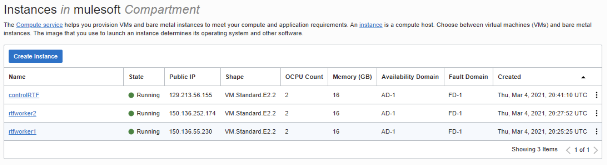

Operative system can be any of the following:

- Red Hat (RHEL) v7.4, v7.5, v7.6, v7.7, v7.8, v7.9, v8.0, v8.1, v8.2, v8.3
- CentOS v7.4, v7.5, v7.6, v7.7, v7.8, v7.9, v8.0, v8.1, v8.2, v8.3
- Ubuntu v18.04 (using Runtime Fabric Appliance version 1.1.1625094374-7058b20 or later)

I am using CentOS.

Within those instances I need to take care of this:

- Disable swap memory.
- Ensure that chrony (system clocks) status is in sync.

I have provisioned storage to attach it to those compute instances:

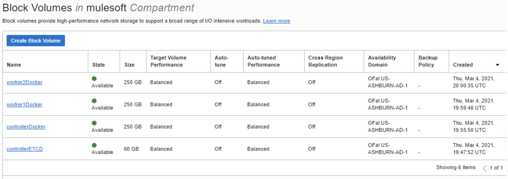

The storage is distributed in the following way:

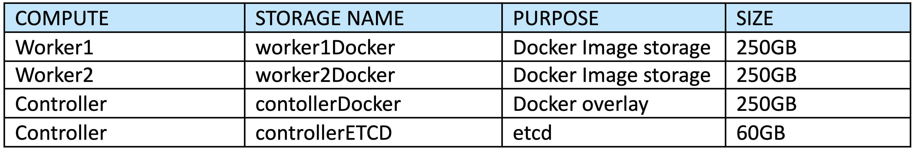

The storage is just presented to the compute instance but is not formatted. The installation process will take it from there, format and attach it in the way RTF needs it.

The storage for the controller, is for the following purpose:

- A minimum of 60 GiB dedicated disk with at least 3000 provisioned IOPS to run the etcd ([https://etcd.io/](https://etcd.io/)) distributed database. This translates to a minimum of 12 Megabytes per second (MBps) disk read/write performance.
- A minimum of 250 GiB dedicated disk with 1000 provisioned IOPS for Docker overlay and other internal services. This translates to a minimum of 4 MBps disk read/write performance.

For the workers:

- A minimum of 250 GiB dedicated disk with at least 1000 provisioned IOPS for Docker overlay and other internal services. This translates to a minimum of 4 MBps disk read/write performance.
- Having 250 GiB ensures there is enough space to run applications, cache docker images, provide temporary storage for running applications, and provide log storage.

In the local disk:

- A minimum of 80 GiB dedicated disk for the operating system.
- A minimum of 20 GiB for /tmp directory.
- A minimum of 8 GiB for /opt/anypoint/runtimefabric directory.
- A minimum of 1 GiB for /var/log/ directory.

## Networking

Regarding networking, I have this VCN:

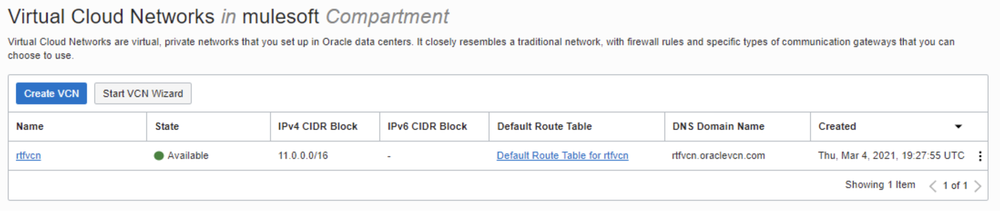

I have a large CIDR Block 11.0.0.0/16 but you can use a smaller one. Just keep in mind the following:

> The pod CIDR block must not overlap with IP addresses that pods or servers use to communicate. If services within the cluster or services that you installed on nodes need to communicate with an IP range that overlaps the pod or service CIDR block, a conflict can occur. If a CIDR block is in use, but pods and services do not use those IP addresses to communicate, there is no conflict. If you deploy more than one cluster, each cluster can reuse the same IP range, because those addresses exist within the cluster nodes, and cluster-to-cluster communications is relayed on the external interfaces.

*Taken from the official documentation:* [https://docs.MuleSoft.com/runtime-fabric/1.9/install-prereqs](https://docs.MuleSoft.com/runtime-fabric/1.9/install-prereqs)*.*

Also, within that VCN, I have a couple of subnets:

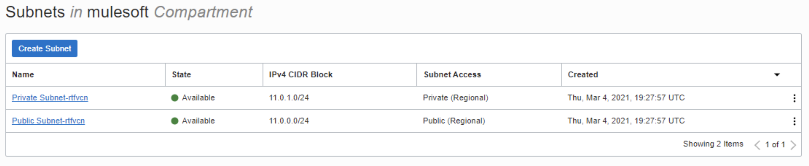

One is private and one public. For our scenario, in order to have access to the compute instances, all VMs are part of the Public subnet. Here is the summary:

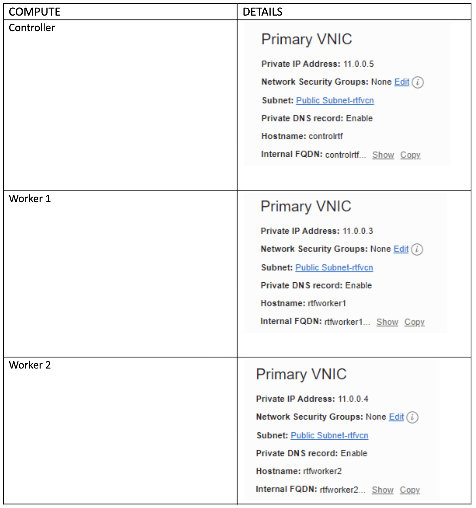

My computer instances have the following characteristics:

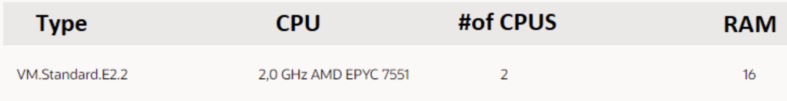

All compute instances are interconnected and need to be visible among each other though several ports and protocols. Those ports and protocols, in my case in Oracle Cloud Infrastructure, are reflected through a Security List. Which would be the equivalent to the configuration you have to put in place in your firewall.

The summary is described in the following table:

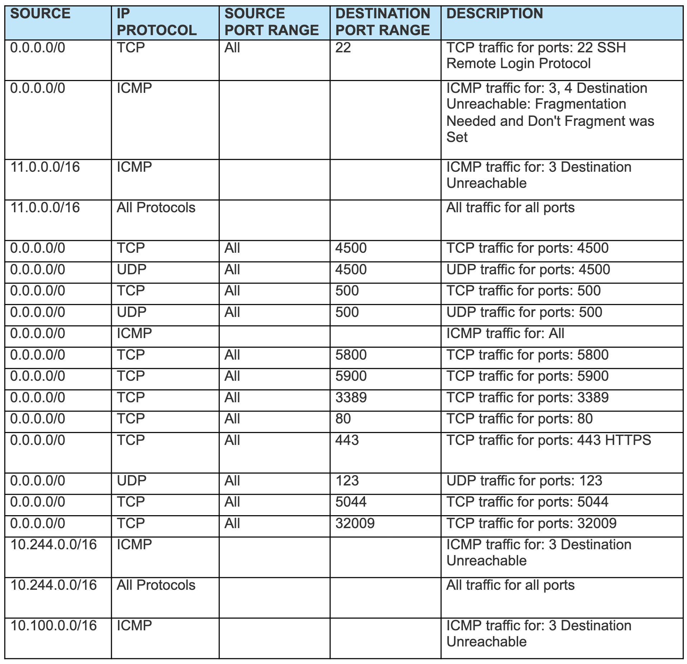

As mentioned, that was all defined in my Default Security List:

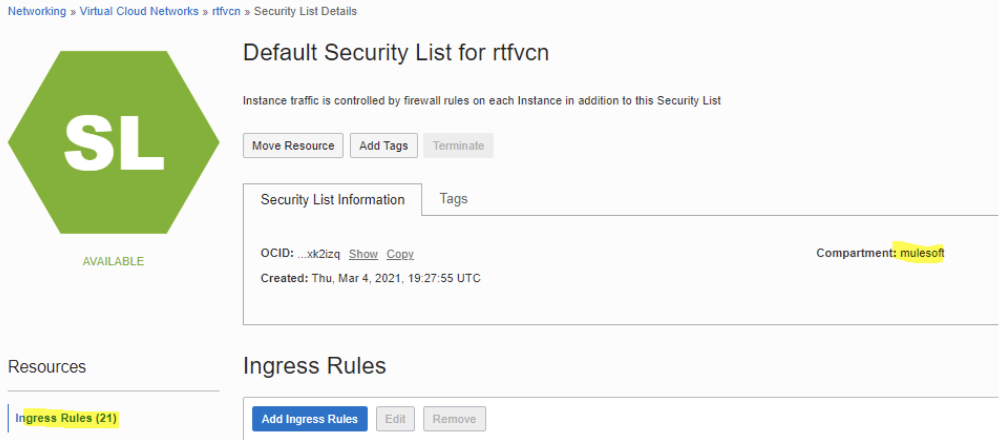

Another relevant thing is that both controllers and workers need to have access to the Control Plane, and therefore to the Internet to reach certain hostnames. Keep in mind that we are working with a hybrid model and the runtime plane needs access to the control plane for several purposes:

- Monitoring
- Access to the image repository
- Access to Runtime Manager
- Access to API Manager
- Etc

Within our infrastructure (OCI) we have an Internet Gateway that gives us access to the internet:

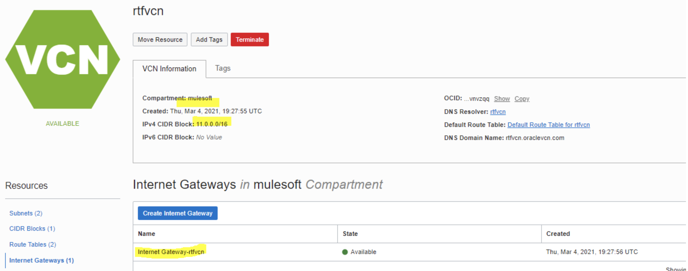

In my case with that simple Internet Gateway I get access to the internet from within my compute instances. In your case you may control this, and just enable access to the specific list of locations.

That specific list is the following:

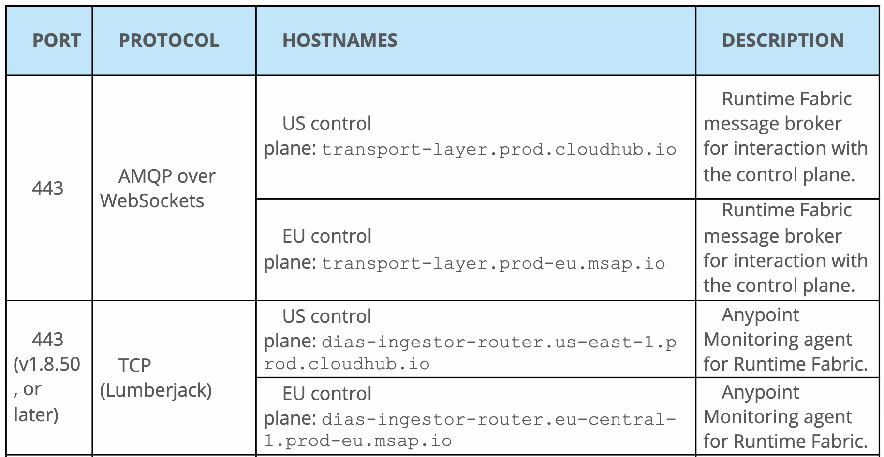

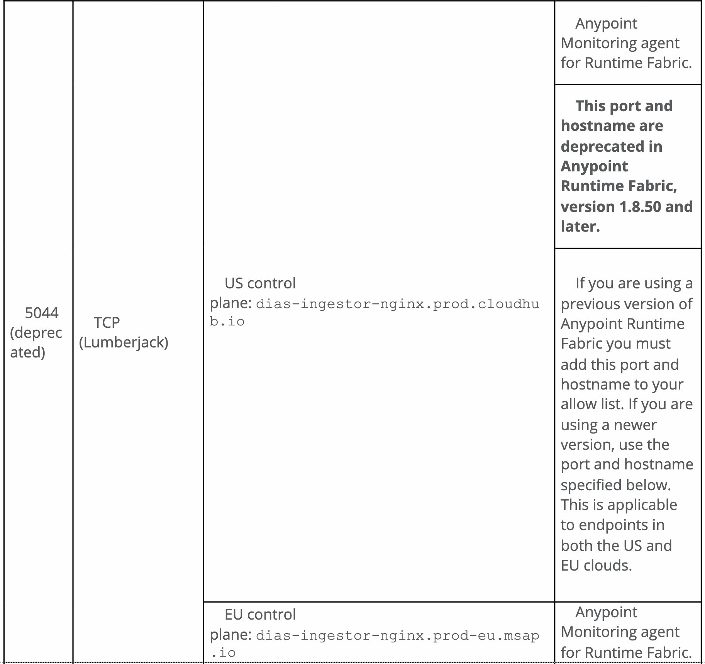

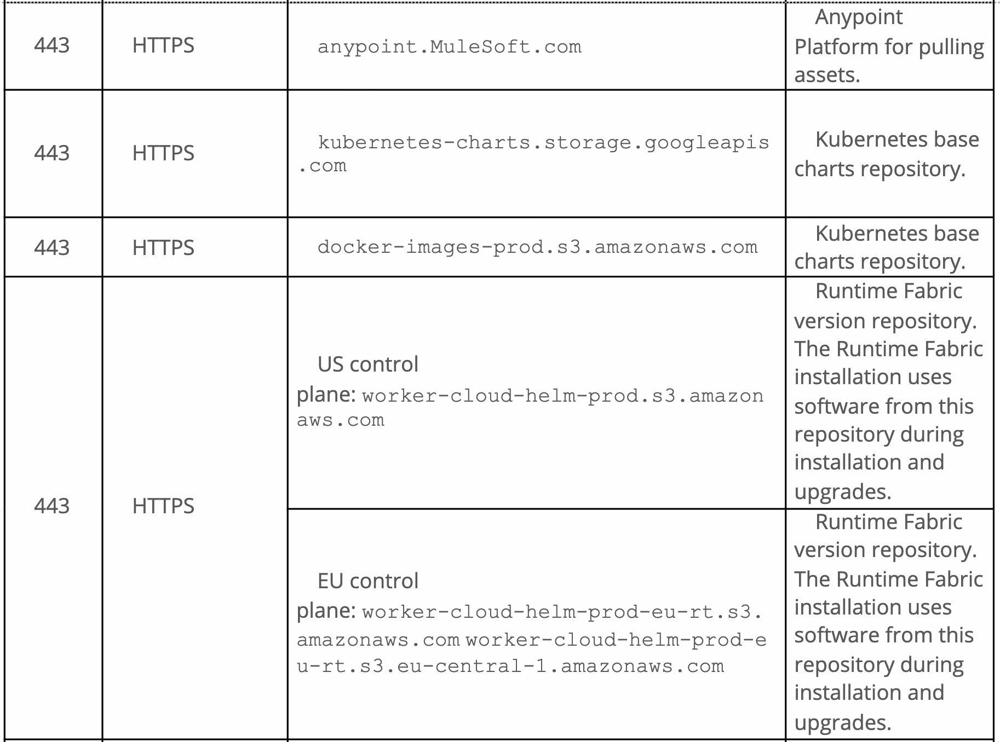

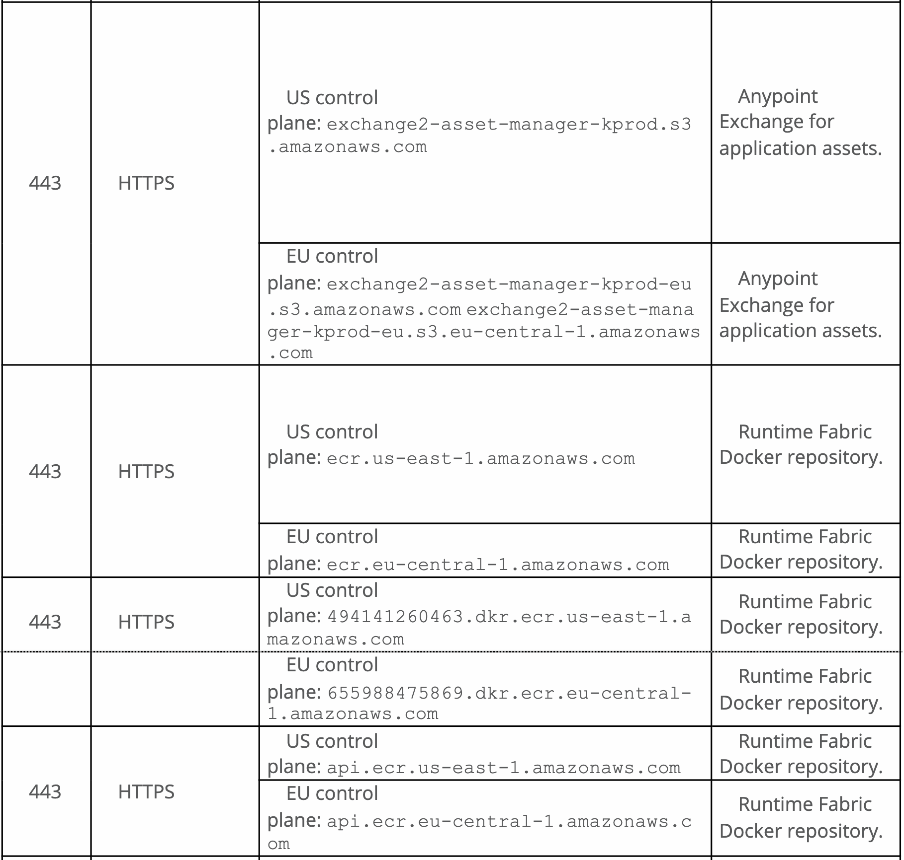

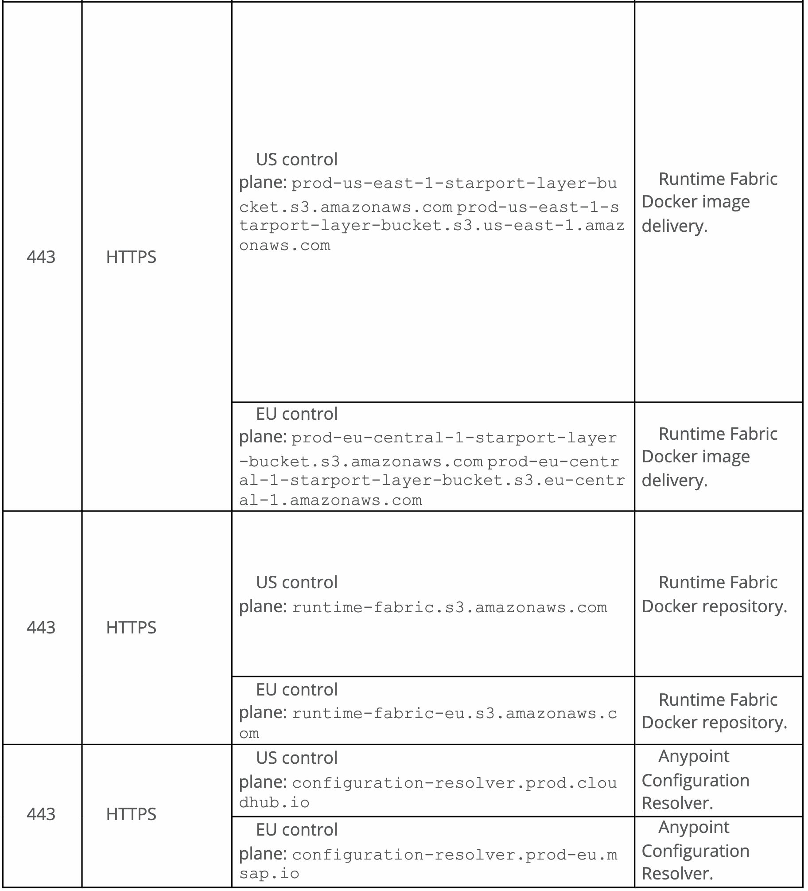

Depending on if you are in the US or EU control plane, you will need to reach some of those locations. All this information is here: [https://docs.MuleSoft.com/runtime-fabric/1.9/install-prereqs](https://docs.mulesoft.com/runtime-fabric/1.9/install-prereqs) try to follow the official documentation to avoid any error.

## Installation Process

Again, this article does not replace the official documentation. We are just trying to give you a glimpse of the whole process and share with you that the whole installation process is very accessible. And you can execute within hours, trust us.

The first step is to declare in the Anypoint Platform web console that you want to create an RTF. That is a very simple step, just go here:

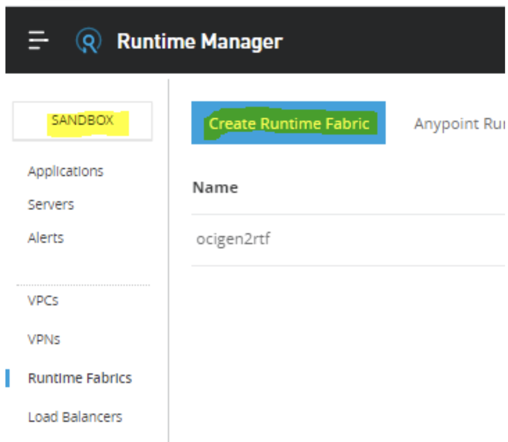

Select your environment, and then click on the Create Runtime Fabric button. A similar screen as the following will appear:

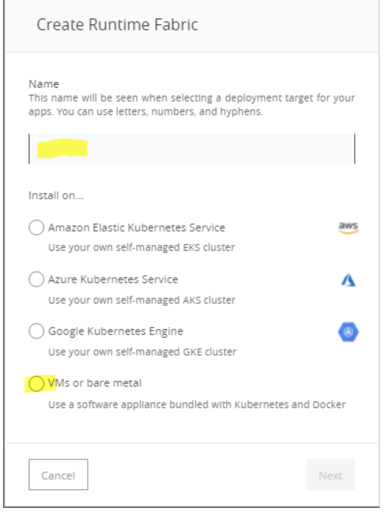

Give a name and select the VMs or bare metal radio button. Once you do that, this screen will appear:

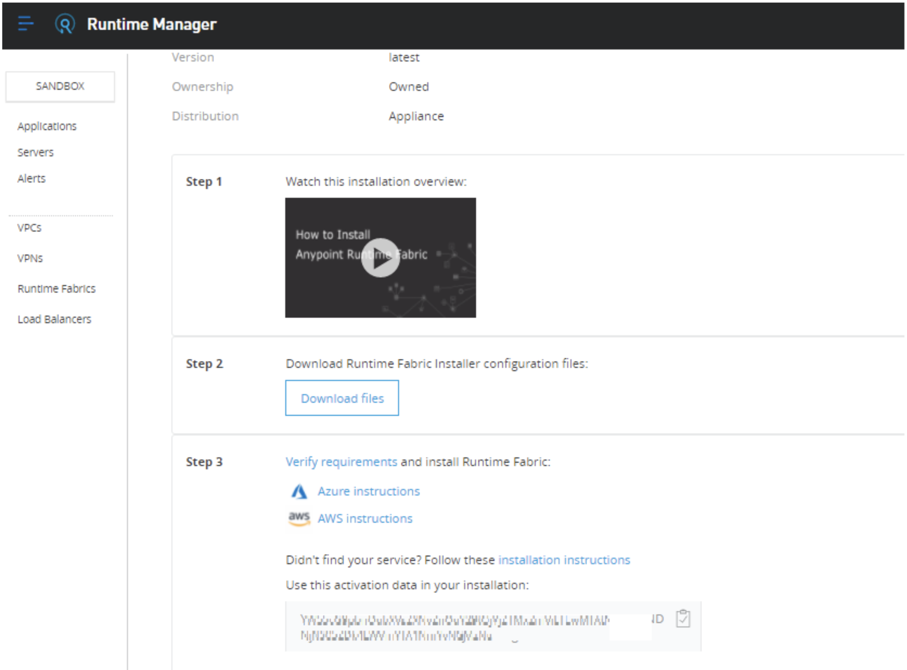

Look at step 2 and step 3.

Step 2 will download the required installation files, and Step 3 is your activation data for your installation. Please copy that and put it in a safe place.

Once you download the file (a similar name to this rtf-install-scripts-20210709-b48dec6.zip), upload it to the three servers (controller, worker1, worker2).

Now unzip it:

```bash
mkdir -p ./rtf-install-scripts && unzip rtf-install-scripts.zip -d ./rtf-install-scripts
```

If this is for a PoC or demo purposes you can execute everything with root, but if this is for business usage then create a user and make it sudoer.

Now that you’ve uploaded the installation scripts to every server, you are just a few steps away to install the Fabric.

The installation is all based on scripts. The controller is the leader of all the work we are about to explain.

I always like to understand first what I am going to execute, and then get into the box and do the work. Let’s do it.

- We need to describe where we want to execute things and which role the different computes are going to take. And we will do it through setting a group of variables. Those variables will describe your intentions on deploying RTF. Some of those variables are optional.
- Once those variables are set, one of the scripts that we have downloaded and then uploaded to our compute instances, is going to generate the config and the snippets to execute on every compute (controller, worker), depending on what you have defined on step 1.
- The first snippet is executed on the controller.
- Workers snippets can be executed in parallel, and will report themselves with the controller.

Those are the high-level steps and a good way to understand what you are going to execute.

Now let’s take a look to the variables we need to set:

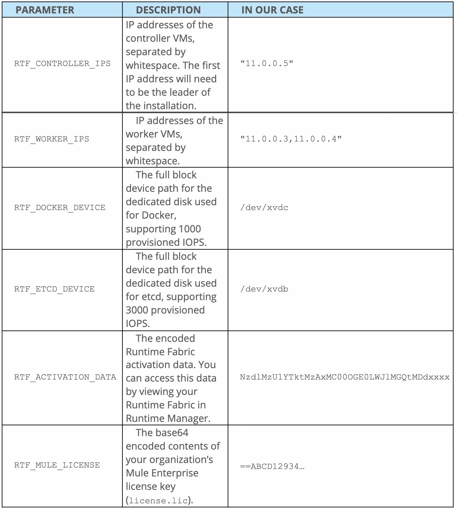

From all the information that is described in the previous table, up to this point you have all the information needed, but the `RTF_MULE_LICENSE`. The `RTF_MULE_LICENSE` is a file with extension `.lic` that you should have in case you have a valid and active subscription with MuleSoft.

Once you have the file at your disposal, execute this:

```bash
base64 -w0 license.lic
```

The output from that command is what you must set as the `RTF_MULE_LICENSE` variable value.

The `RTF_ETCD_DEVICE` and `RTF_DOCKER_DEVICE` need to point to the volumes (storage) that we have provisioned in previous steps.

## Installation Execution

Now it is time to execute the installation process.

At this point we have some understanding of what we are about to execute and it is time to put all the pieces in place.

1. Go to the folder where you have unzipped the installer $HOME/rtf-install-scripts/

2. Set the environment variables and generate the configuration

```bash
RTF_CONTROLLER_IPS='11.0.0.5' \
RTF_WORKER_IPS='11.0.0.3 11.0.0.4' \
RTF_DOCKER_DEVICE='/dev/xvdc' \
RTF_ETCD_DEVICE='/dev/xvdb' \
RTF_ACTIVATION_DATA='f653432342-54433$4322' \
RTF_MULE_LICENSE='adfafasfasfasfasfasfdasdsff==' \
./generate-configs.sh
```

3. The execution of the previous step is going to generate and output like this:

```bash
=========================================================
Runtime Fabric configuration generator
=========================================================

Cluster topology: 1 controllers, 2 workers

Instructions:
 1. Create /opt/anypoint/runtimefabric directory and ensure it is writable from your ssh login
 2. Copy each snippet below and execute on the appropriate machine
 3. For each node, copy the init.sh script to the installation directory
    eg scp scripts/init.sh <user>@node-ip:/opt/anypoint/runtimefabric
 4. Execute sudo init.sh  on each node. This should be done first on the leader (first controller) node, then concurrently on the other nodes
 5. The nodes will join to the IP address given for the first controller and form your Runtime Fabric cluster. This process can take 10-25 minutes

Note: You can monitor the progress of the installation on any of the nodes with tail -f /var/log/rtf-init.log

11.0.0.5:
=========================================================
mkdir -p /opt/anypoint/runtimefabric && cat > /opt/anypoint/runtimefabric/env <<EOF
 RTF_PRIVATE_IP=11.0.0.5
 RTF_NODE_ROLE=controller_node
 RTF_INSTALL_ROLE=leader
 RTF_INSTALL_PACKAGE_URL=
 RTF_ETCD_DEVICE=/dev/xvdb
 RTF_DOCKER_DEVICE=/dev/xvdc
 RTF_TOKEN='my-cluster-token'
 RTF_NAME='runtime-fabric'
 RTF_ACTIVATION_DATA='f653432342-54433$4322'
 RTF_MULE_LICENSE='adfafasfasfasfasfasfdasdsff=='
 RTF_HTTP_PROXY=''
 RTF_NO_PROXY=''
 RTF_MONITORING_PROXY=''
 RTF_SERVICE_UID=''
 RTF_SERVICE_GID=''
 POD_NETWORK_CIDR='10.244.0.0/16'
 SERVICE_CIDR='10.100.0.0/16'
 INTERNAL_INTERFACE='eth0'
 DISABLE_SELINUX='false'
EOF

11.0.0.3:
=========================================================
mkdir -p /opt/anypoint/runtimefabric && cat > /opt/anypoint/runtimefabric/env <<EOF
 RTF_PRIVATE_IP=11.0.0.3
 RTF_NODE_ROLE=worker_node
 RTF_INSTALL_ROLE=joiner
 RTF_DOCKER_DEVICE=/dev/xvdc
 RTF_TOKEN='my-cluster-token'
 RTF_INSTALLER_IP=11.0.0.5
 RTF_HTTP_PROXY=''
 RTF_NO_PROXY=''
 RTF_MONITORING_PROXY=''
 RTF_SERVICE_UID=''
 RTF_SERVICE_GID=''
 POD_NETWORK_CIDR='10.244.0.0/16'
 SERVICE_CIDR='10.100.0.0/16'
 DISABLE_SELINUX='false'
EOF

11.0.0.4:
=========================================================
mkdir -p /opt/anypoint/runtimefabric && cat > /opt/anypoint/runtimefabric/env <<EOF
 RTF_PRIVATE_IP=11.0.0.4
 RTF_NODE_ROLE=worker_node
 RTF_INSTALL_ROLE=joiner
 RTF_DOCKER_DEVICE=/dev/xvdc
 RTF_TOKEN='my-cluster-token'
 RTF_INSTALLER_IP=11.0.0.5
 RTF_HTTP_PROXY=''
 RTF_NO_PROXY=''
 RTF_MONITORING_PROXY=''
 RTF_SERVICE_UID=''
 RTF_SERVICE_GID=''
 POD_NETWORK_CIDR='10.244.0.0/16'
 SERVICE_CIDR='10.100.0.0/16'
 DISABLE_SELINUX='false'
EOF
```

4. Every snippet needs to get executed on the specified node. As you can see is going to set a group of variables and write them in a file with the name **env**.

5. Now execute the following on every node:

```bash
mkdir -p /opt/anypoint/runtimefabric && cp ./rtf-install-scripts/scripts/init.sh /opt/anypoint/runtimefabric/init.sh && chmod +x /opt/anypoint/runtimefabric/init.sh
```

6. The previous command is just going to create a directory, copy the `init.sh` script into that newly created directory and finally gives execution rights to the `init.sh` file

7. Now just execute this in the controller node:

```bash
sudo /opt/anypoint/runtimefabric/init.sh
```

8. The installation process will start, keep eye on the output until you see this:

```bash
10 / 17: Create cluster
================================================
Extracting installer package...
Thu Mar  4 23:13:33 UTC Starting enterprise installer
Thu Mar  4 23:13:33 UTC Preparing for installation...
Thu Mar  4 23:14:06 UTC Installing application runtime-fabric:1.1.1606942735-3f99c37
Thu Mar  4 23:14:06 UTC Starting non-interactive install
Thu Mar  4 23:14:08 UTC Successfully added "controller_node" node on 11.0.0.5
Thu Mar  4 23:14:08 UTC All agents have connected!
Thu Mar  4 23:14:09 UTC Starting the installation
Thu Mar  4 23:14:10 UTC Operation has been created
Thu Mar  4 23:14:11 UTC Execute preflight checks
Thu Mar  4 23:14:31 UTC Configure packages for all nodes
Thu Mar  4 23:14:38 UTC Bootstrap all nodes
Thu Mar  4 23:14:39 UTC Bootstrap master node controlrtf
Thu Mar  4 23:14:40 UTC Pull packages on master node controlrtf
Thu Mar  4 23:15:24 UTC Install system software on master nodes
Thu Mar  4 23:15:25 UTC Install system package teleport:3.0.6 on master node controlrtf
Thu Mar  4 23:15:33 UTC Install system package planet:5.5.63-11313 on master node controlrtf
Thu Mar  4 23:15:34 UTC Wait for Kubernetes to become available
Thu Mar  4 23:15:54 UTC Bootstrap Kubernetes roles and PSPs
Thu Mar  4 23:15:56 UTC Configure CoreDNS
Thu Mar  4 23:15:57 UTC Create user-supplied Kubernetes resources
Thu Mar  4 23:15:59 UTC Populate Docker registry on master node controlrtf
Thu Mar  4 23:16:29 UTC Wait for cluster to pass health checks
Thu Mar  4 23:16:30 UTC Install system application dns-app:0.3.2
Thu Mar  4 23:16:50 UTC Install system application logging-app:5.0.7
Thu Mar  4 23:17:02 UTC Install system application monitoring-app:5.5.23
Thu Mar  4 23:17:21 UTC Install system application tiller-app:5.5.2
Thu Mar  4 23:17:42 UTC Install system application site:5.5.56
Thu Mar  4 23:18:34 UTC Install system application kubernetes:5.5.56
Thu Mar  4 23:18:35 UTC Install user application
Thu Mar  4 23:18:36 UTC Install application runtime-fabric:1.1.1606942735-3f99c37
Thu Mar  4 23:19:04 UTC Connect to installer
Thu Mar  4 23:19:07 UTC Enable cluster leader elections
Thu Mar  4 23:19:12 UTC Operation has completed
Thu Mar  4 23:19:13 UTC Installation succeeded in 5m5.504331546s

Cluster endpoints:
    * Authentication gateway:
        - 11.0.0.5:32009
    * Cluster management URL:
        - https://11.0.0.5:32009

Done.
...
```

9. Once you see this, execute it on the workers. You can do it in parallel:

```bash
sudo /opt/anypoint/runtimefabric/init.sh
```

10. To see the progress of the execution, check this log:

```bash
/var/log/rtf-init.log
```

11. To validate that the installation has finished, this file should had been created:

```bash
/opt/anypoint/runtimefabric/.state/init-complete
```

With the RTF installation you also install Ops Center, which is a web application where you can manage your RTF cluster. The access information for Ops Center is in the `/var/log/rtf-init.log` file, you will see something like this:

```bash
11 / 17: Generate Ops Center credentials
================================================
user admin@runtime-fabric created
Ops Center access:
URL:      https://11.0.0.5:32009/web
User:     admin@runtime-fabric
Password: qT9IHqDjOkMwL0ZEvtBWbzvjWTkJmlhEzK
```

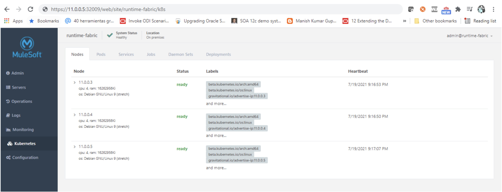

With this you have successfully installed RTF on top of Oracle Cloud Infrastructure.

You can also see the status of your Runtime fabric at [https://anypoint.mulesoft.com](https://anypoint.mulesoft.com/).

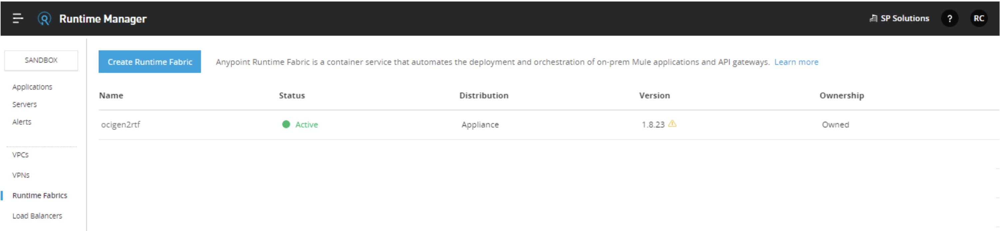

If you click at your RTF name:

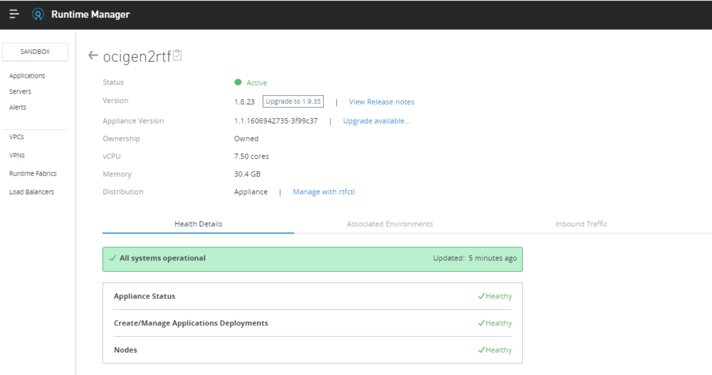

In our next chapter of this article, we will learn the basics for our RTF management operation through:

- Ops Center
- rtfctl cli
- kubectl
