This is the second part of a series of articles focused on MuleSoft Runtime Fabric. In our [previous article](https://www.prostdev.com/post/mulesoft-runtime-fabric-deployed-on-oracle-cloud-infrastructure-oci-part-1), we’ve described how to deploy a full MuleSoft Runtime Fabric on top of Oracle Cloud Infrastructure. Now is the time to learn some mechanisms to manage that cluster.

We are going to describe some tips about how to:

- The process of deploying an application into the Runtime Fabric
- The process to review the logs produced by the deployment process
- Basic but useful commands to understand what is happening within the Runtime Fabric (namespaces, pods, secrets, etc)
- Consolidate the log files into an external system (we are going to use Papertrail for our article)
- Destroy pods
- Test our applications
- The usage of the rtfctl CLI

Plus, a set of tips that are going to be useful for you while managing and maintaining your Runtime Fabric.

Let’s start from the beginning.

## How to know if my cluster is up and running

There are different ways to validate the health of your runtime fabric. Let’s elaborate on a couple of them:

- Via Anypoint Platform console ([https://anypoint.mulesoft.com](https://anypoint.mulesoft.com/))
- Via the rtfctl CLI. We will get into some details with this one

For the first option, you can get a very quick view by going into Runtime Manager -> Runtime Fabrics:

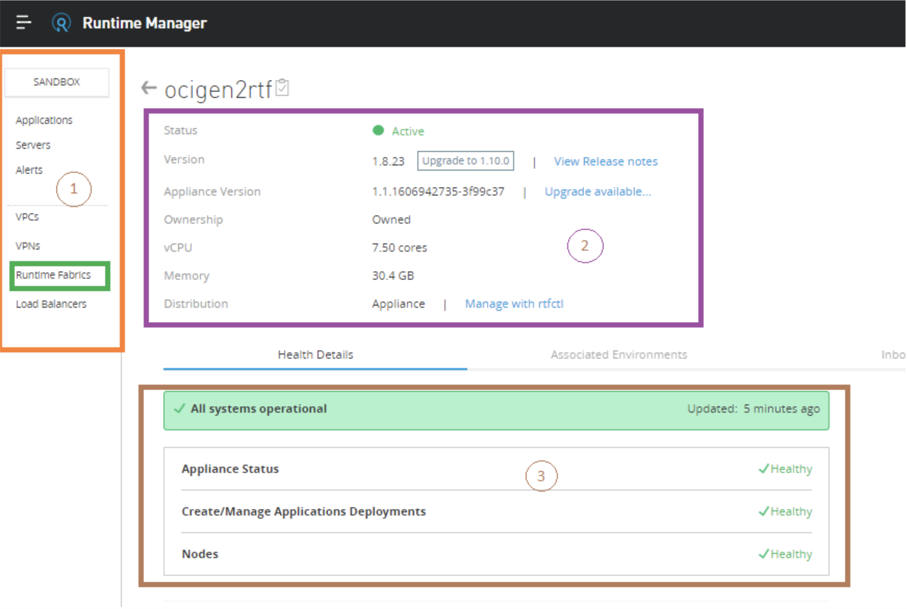

In the first block (circle number 1) you will have the option/link for Runtime Fabrics. In the second block (the purple one or number two in the image), you will get a summary of your Runtime Fabric, and finally, in the third block (the brown one or number 3) you will get a little bit of information like Application Status, Deployments, and Nodes.

Let’s get a deeper look into block [#2](https://www.prostdev.com/blog/hashtags/2) (the purple one in the image):

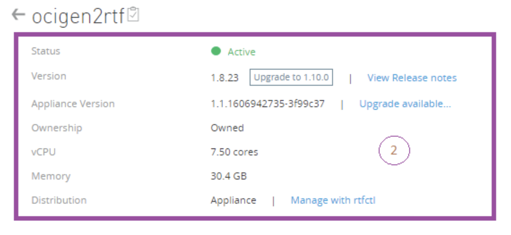

With this piece of information, you can validate:

- That your cluster is Active. The other option is that it can be Degraded (we will elaborate more on that in the next paragraphs) or disconnected. The desired status is Active.
- Then you can see the version of your Runtime Fabric, and it suggests that you upgrade to the latest one. In my case, I could upgrade to 1.10.0. But that will be part of another article in the upcoming future.
- The number of vCPUs that you have for your Runtime Fabric and the Memory.
- And a hyperlink to download the rtfctl CLI.

If you are an operator and want to see how healthy your Runtime Fabric is, with this small section you can get it. Direct and simple.

Now, sometimes things go in directions that we do not control that can make our cluster change its status. In that case in section [#3](https://www.prostdev.com/blog/hashtags/3) (the brown in the previous images) you can get some useful detail:

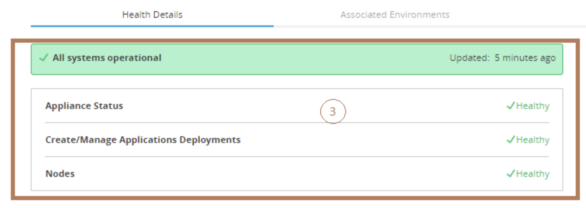

If something is wrong with the Application Status, your Deployments, or an event with your Nodes, you can get that detail from here. For example, the following image is from a Degraded cluster:

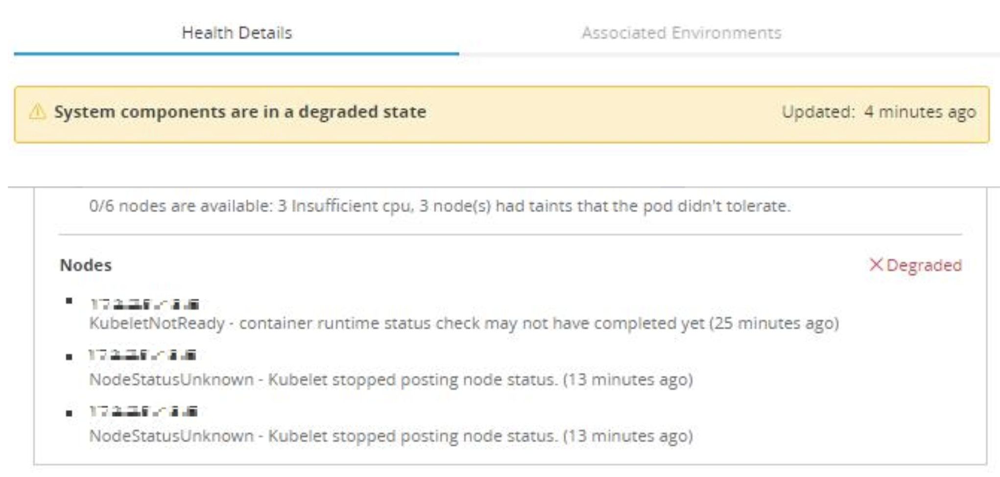

As you can see, some of the errors that are causing the cluster to be in Degraded status are described in the different sections, in this case: in the Nodes section. For this error, something is wrong with our nodes, to the point that there is no status from them; they are probably down.

Now let’s do something similar with RTFCTL CLI.

## RTFCTL CLI

Since the very beginning of the computing era, the command-line interface (CLI) has been the common place to manage systems. But in this modern era, CLIs have become even more popular; and it is true to say that sometimes it is much more natural to use those CLIs rather than expecting a web-based console. For MuleSoft Runtime Fabric, there is an alternative for that, and that is called rtfctl.

The official documentation is here: [https://docs.mulesoft.com/runtime-fabric/latest/install-rtfctl](https://docs.mulesoft.com/runtime-fabric/latest/install-rtfctl)

If you want to install it, you have the following options:

Windows:

```bash
curl -L https://anypoint.mulesoft.com/runtimefabric/api/download/rtfctl-windows/latest -o rtfctl.exe
```

MacOS (Darwin):

```bash
curl -L https://anypoint.mulesoft.com/runtimefabric/api/download/rtfctl-darwin/latest -o rtfctl
```

Linux:

```bash
curl -L https://anypoint.mulesoft.com/runtimefabric/api/download/rtfctl/latest -o rtfctl
```

(Quick note: I normally install the rtfctl within the controller nodes of my Runtime Fabrics cluster.)

Once you have it, make it available in your PATH (either Windows or Linux), and you can start using it.

The available commands are:

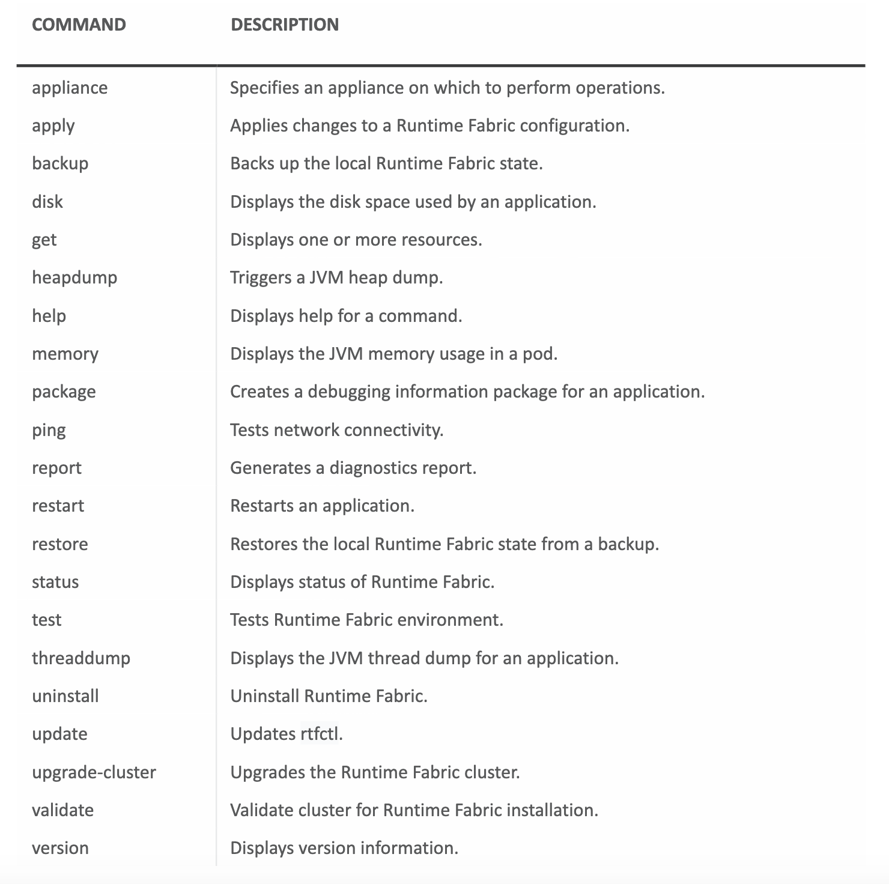

(Taken from the official documentation [https://docs.mulesoft.com/runtime-fabric/latest/install-rtfctl](https://docs.mulesoft.com/runtime-fabric/latest/install-rtfctl)).

As you can see, there are a lot of options, from getting to know the status of your cluster, to upgrading it.

Let’s start from the most basic one:

```bash
sudo rtfctl status
```

That command will return the following:

```
Using proxy configuration - (proxy "", no proxy "0.0.0.0/0,.local,0.0.0.0/0,.local,,0.0.0.0/0,.local,0.0.0.0/0,.local")"
Using 'US' region

transport-layer.prod.cloudhub.io:443 ✔
https://anypoint.mulesoft.com  ✔
https://worker-cloud-helm-prod.s3.amazonaws.com  ✔
https://exchange2-asset-manager-kprod.s3.amazonaws.com  ✔
https://ecr.us-east-1.amazonaws.com  ✔
https://494141260463.dkr.ecr.us-east-1.amazonaws.com  ✔
https://prod-us-east-1-starport-layer-bucket.s3.amazonaws.com  ✔
https://prod-us-east-1-starport-layer-bucket.s3.us-east-1.amazonaws.com  ✔
https://runtime-fabric.s3.amazonaws.com  ✔
configuration-resolver.prod.cloudhub.io:443  ✔
tcp://dias-ingestor-nginx.prod.cloudhub.io:5044  ✔
State:   active
Version:   1.1.1606942735-3f99c37
Nodes:
  controlrtf (11.0.0.5) :
    Status: healthy
  rtfworker1 (11.0.0.3) :
    Status: healthy
  rtfworker2 (11.0.0.4) :
    Status: healthy

SERVICE                  HEALTHY
agent                    true
deployer                 true
mule-clusterip-service   true
resource-cache           true
registry-creds           true
certificate-renewal      true

CERTIFICATE   EXPIRES AT
client        2022-03-12 02:08:43 +0000 UTC (199 days)
rtfctl newer version 0.3.135 available; current version 0.3.102. Please use `rtfctl update` to update.
```

It is quite similar to what you get from the Anypoint Platform Web UI. Basically, it is telling us the status/state of our cluster, in this case: **Active**. And it also tells us the health of the controller and the workers, here:

```
Nodes:
  controlrtf (11.0.0.5) :
    Status: healthy
  rtfworker1 (11.0.0.3) :
    Status: healthy
  rtfworker2 (11.0.0.4) :
    Status: healthy
```

One crucial thing for this type of deployment (as described in our [previous](https://www.prostdev.com/post/mulesoft-runtime-fabric-deployed-on-oracle-cloud-infrastructure-oci-part-1) article) is the connectivity to the Control Plane.

In a controlled environment where you have no limitations to connect to the internet, there is no problem to reach the control plane, but for enterprise deployments where you are behind a corporate firewall, you need to be sure that you can connect to all the different endpoints that the Runtime Fabric needs. Those endpoints are very well documented in the official documentation: [https://docs.mulesoft.com/runtime-fabric/1.3/install-port-reqs](https://docs.mulesoft.com/runtime-fabric/1.3/install-port-reqs)

Specifically the section: Port IPs and Hostnames to Add to the Allowlist.

As explained in our previous article, you must have connectivity to all those endpoints (depending on your region). But, sometimes, your cluster is not able to reach those endpoints, and one way to validate that it is running is the following command:

```bash
sudo ./rtfctl test outbound-network
```

And the output is this:

```
Using proxy configuration - (proxy "", no proxy "0.0.0.0/0,.local,0.0.0.0/0,.local,,0.0.0.0/0,.local,0.0.0.0/0,.local")"
Using 'US' region

transport-layer.prod.cloudhub.io:443  ✔
https://anypoint.mulesoft.com  ✔
https://worker-cloud-helm-prod.s3.amazonaws.com  ✔
https://exchange2-asset-manager-kprod.s3.amazonaws.com  ✔
https://ecr.us-east-1.amazonaws.com  ✔
https://494141260463.dkr.ecr.us-east-1.amazonaws.com  ✔
https://prod-us-east-1-starport-layer-bucket.s3.amazonaws.com  ✔
https://prod-us-east-1-starport-layer-bucket.s3.us-east-1.amazonaws.com  ✔
https://runtime-fabric.s3.amazonaws.com  ✔
configuration-resolver.prod.cloudhub.io:443  ✔
tcp://dias-ingestor-nginx.prod.cloudhub.io:5044   ✔
```

With that, you can validate if your Runtime Fabric is fully connected to the control plane. If any of those are not responding, you will notice that your cluster will change into a **Degraded** state.

Some of those endpoints can be obvious, for example, [https://anypoint.mulesoft.com](https://anypoint.mulesoft.com/) is the one serving most of the calls (API Manager and Exchange to give you an example). But some others like the amazonaws.com endpoints are used as the docker image repository. What we are trying to explain is that all of them have a specific purpose and will lead the Runtime Fabric to different behaviors.

Another useful command is the one used to update your MuleSoft license.lic file. Remember that MuleSoft is a subscription-based platform and every year a new license.lic file is generated. That means that every year you need to update it in your Runtime Fabric. In order to do that, you can execute these two commands:

1. Transform the content of the license.lic file into base64 format with this command:

```bash
base64 -w0 license.lic
```

2. With the base64 string execute this:

```bash
sudo ./rtfctl apply mule-license BASE64_ENCODED_LICENSE
```

3. And if you want to check/validate the license:

```bash
sudo ./rtfctl get mule-license
```

## Deploy applications to the Runtime Fabric

The deployment process is no different from what you have for CloudHub or even for a Standalone, from the Runtime Manager perspective. There are key differences to understand, not only for the deployment configuration but the dynamics that happen during and after the deployment. In this section, we will go into those differences.

Let’s keep it simple, and let’s deploy an application using Runtime Manager from [https://anypoint.mulesoft.com](https://anypoint.mulesoft.com/). The name of the application is myRTFapp. And it contains a very simple structure:

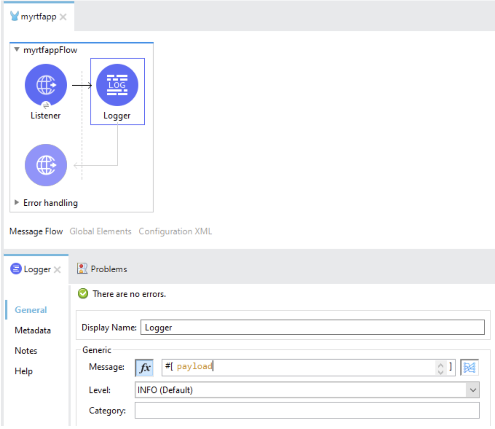

Our listener is configured to serve on port 8081 (HTTP). Since we are on Runtime Fabric, your listener must be listening on 8081 or 8082.

The logger is going to be valuable for what we are going to explain in the next paragraphs. But first, let’s go through the deployment process.

From the Runtime Manager perspective, the process itself is similar to CloudHub or Standalone Hybrid Model. You have to go into Runtime Manager and deploy the application, selecting your Runtime Fabric as your target:

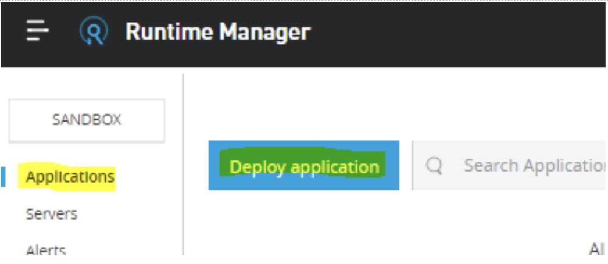

And then:

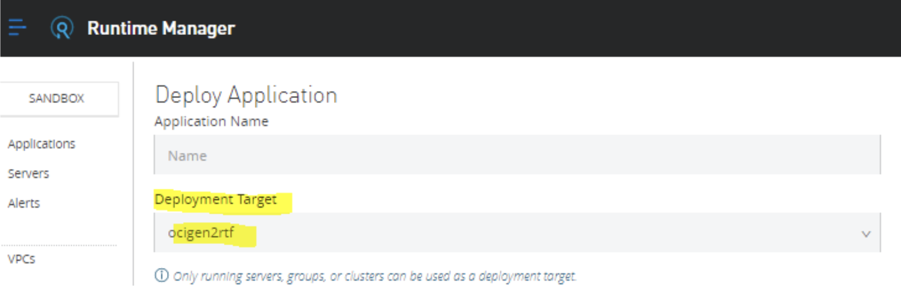

Once you select an RTF-based deployment target, you will get the following different options that you can decide to configure/use while making the deployment:

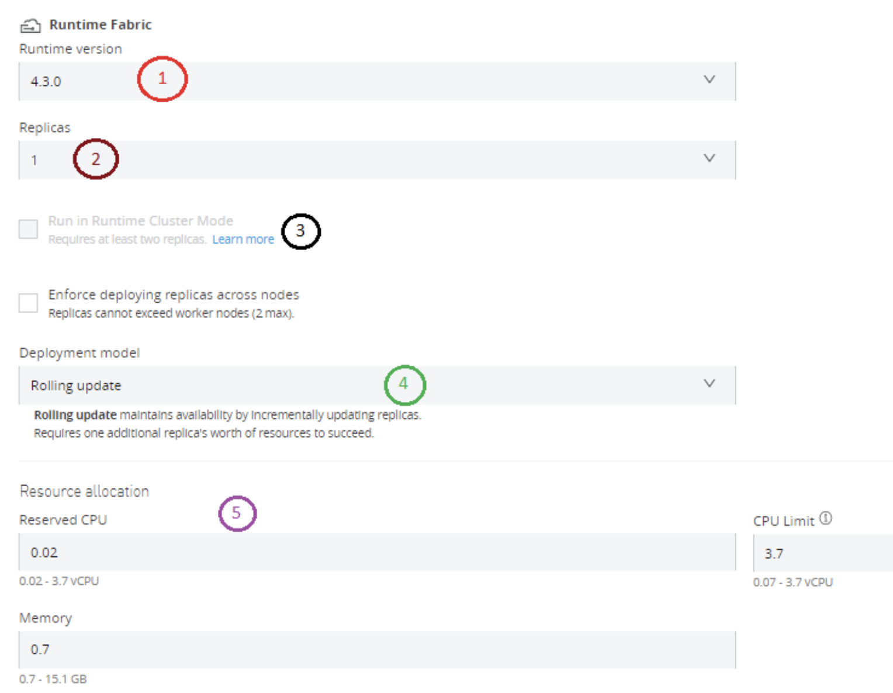

- You can decide the runtime version for your applications. That means that on top of Runtime Fabric you can have different applications using different MuleSoft Runtime versions.
- Replicas: This is the desired number of replicas for your application. That means that your application is replicated and therefore can distribute its load along with those replicas. But also, that means that the Runtime Fabric will have to ensure to have those replicas up and running since that is the desired state for your application. That is one of the benefits of this deployment model.
- You can run your application in cluster mode. Clustering is one of the options for MuleSoft Runtime, and that is possible to have in Runtime Fabric. If you check that box, your application will run in cluster mode. The checkbox will be enabled if you choose to have more than 1 replica for your application. That makes sense since in order to have a cluster you need at least two nodes.
- Deployment Model: This is very useful when you are introducing a change to your application. The rollout will be incremental, updating replica by replica. This will translate into zero downtime for your application.
- Reserved CPU, CPU Limit, and Memory. You can decide the amount of computing power your application needs.

You can also configure specific properties for your application, just as you have it for CloudHub. And you can also configure the JVM properties for the Runtime.

After you click on the **deployment** button several things happen behind the scenes:

- The application/artifact is registered on Exchange.
- A Docker-based image is uploaded to the Image Repository (AWS).
- The Runtime Fabric creates the deployment using the image created in step [#2](https://www.prostdev.com/blog/hashtags/2).
- The application gets deployed on top of the Runtime Fabric and a Pod with two containers is created:
  - One container holds the MuleSoft Runtime with your application.
  - The second container is a sidecar for the application, for monitoring purposes.

The result at the Runtime Fabric level is the following:

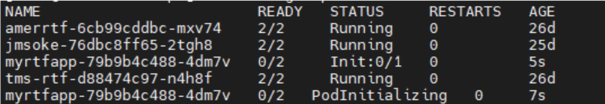

It starts initializing your pod, in this case: myrtpapp-79b9b4c488. Then it will transition into:

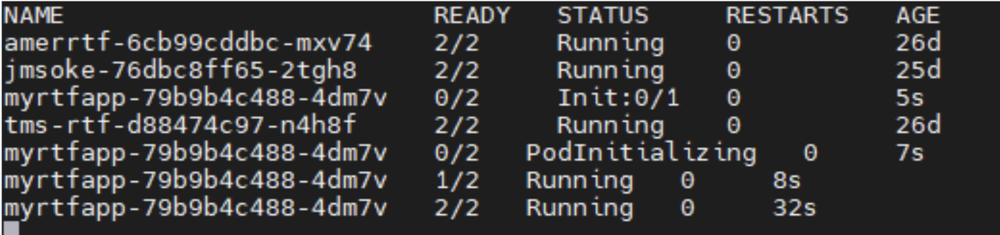

As you can see it started one of the containers (after 8 seconds) and then the second container (after 32 seconds). Those are the two containers that we explained in the previous paragraph. Once you see that both containers are READY and the STATUS is Running, your application is ready to be used.

And from the Anypoint Web Console, you have:

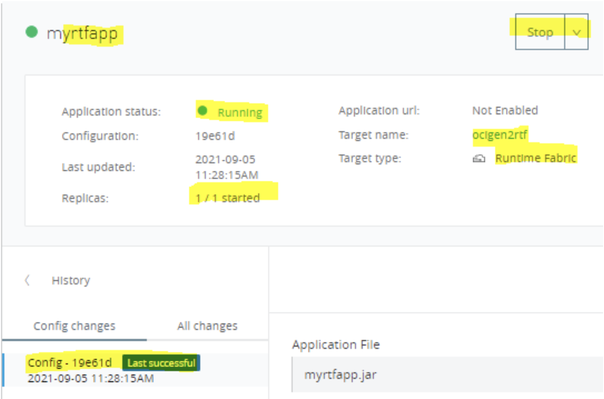

Up to this point, your deployment process is done. In the next section, we will learn how to get the logs from a particular application.

## Get the log files from my applications and the RTF platform

The application is now running in your RTF. It is deployed in a pod and is serving requests. But before getting into the log files, there is something relevant to notice and is related to the RTF underlying infrastructure: Kubernetes.

If you are familiar with Kubernetes, one of the main concepts and elements is the namespaces, which are a logical way to organize your applications. For our RTF-based deployment model, that is important, since a namespace will represent an Anypoint environment (for example Sandbox, Production). Therefore, when you deploy an application since you decide in which environment to deploy it, you need to know the ID for that environment in order to perform some actions at the RTF level.

> [!NOTE]
> the following commands are executed from the controller node.

Let’s explain it with some commands:

```bash
kubectl get namespaces
```

This will return the list of namespaces for your RTF:

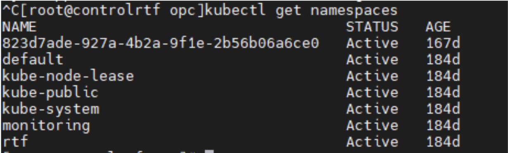

The first namespace that was returned is: 823d7ade-927a-4b2a-9f1e-2b56b06a6ce0. Which is our SANDBOX environment at Anypoint. How do I know that? Let’s get it from the Web Console.

From the API Manager menu:

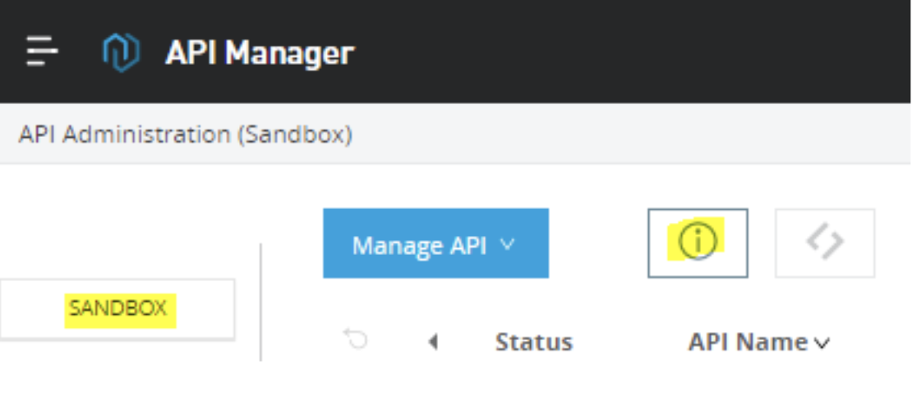

Click on the desired environment, and then click the button with the exclamation mark. It will return the environment information:

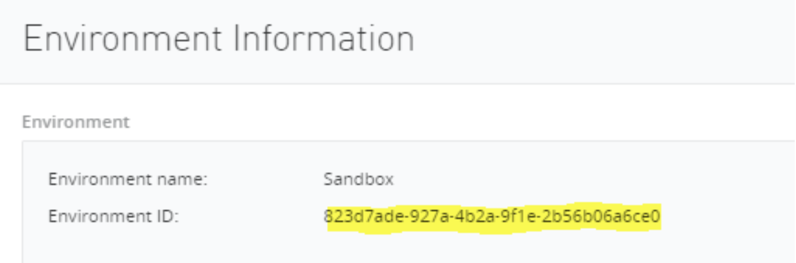

Among other things, the environment ID, which matches with the namespace that we’ve explained.

An RTF can be associated with one or more environments, it is up to you how you want to organize your applications and environments. That option is available from the RTF configuration page:

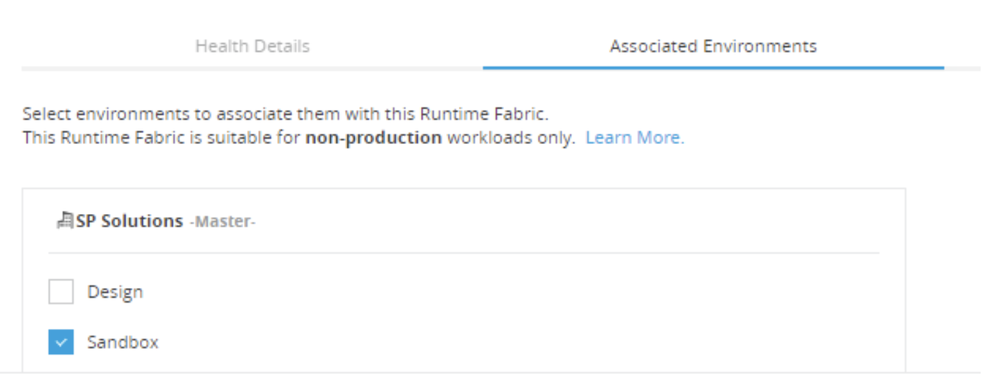

In my case, Sandbox is the only environment associated with my RTF, and that is why we just see that namespace.

With this explanation in mind, we will learn how to get the logs from our applications.

1. The first step is to get the namespace of the environment where you deployed your application.

2. With the namespace ID, we will execute:

```bash
kubectl get pods -n <namespace>
```

In our case:

```bash
kubectl get pods -n 823d7ade-927a-4b2a-9f1e-2b56b06a6ce0
```

This will return the list of created pods in that namespace. Since every pod is a MuleSoft Application, it will return the list of applications:

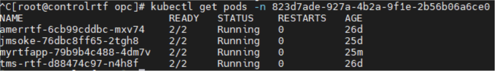

In this case, we have 4 applications running on top of our RTF. You will notice that it is the very same list and status that you get from the web console:

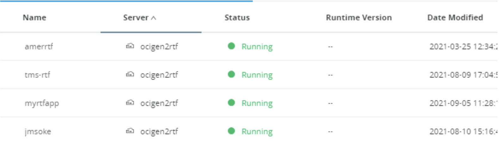

3. Now that you have the list of applications, you can get the log files from a specific application using the next command:

```bash
kubectl logs deploy/<app-name> -n <namespace> -c app
```

In our case:

```bash
kubectl logs deploy/myrtfapp -n 823d7ade-927a-4b2a-9f1e-2b56b06a6ce0 -c app
```

Please notice that the app-name is the name that you decided to use when you deployed the application. Which happens to be the name of the POD, but without the random ID created by Kubernetes.

4. After executing the command, you will get the runtime log, which is the normal log file from your MuleSoft runtime:

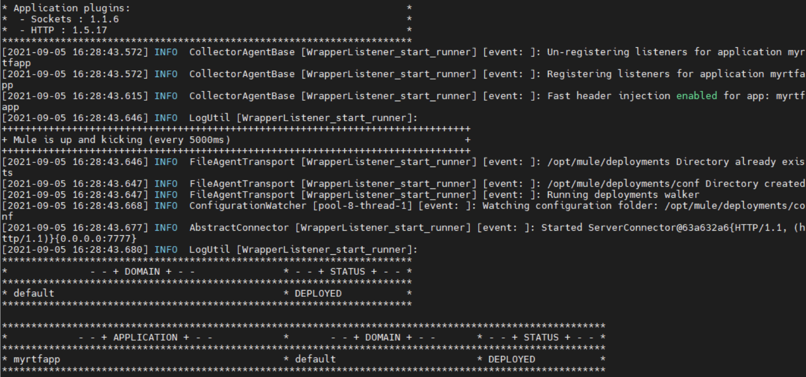

5. But if you want to have the log file open while you make a request to your application in order to see what it’s writing, you can use the following command (which is like a tail -f):

```bash
kubectl logs deploy/<app-name> -n <namespace> -c app --follow
```

In our case:

```bash
kubectl logs deploy/myrtfapp -n 823d7ade-927a-4b2a-9f1e-2b56b06a6ce0 -c app --follow
```

With that command, the log file will be in your terminal. If you make a request you will see what the log reports.

6. For example, remember that we mentioned that our sample app had a logger processor that will print the whole payload? Let’s make a call to it and see the result in our log file. Let’s first get the IP of the Pod (in this case I will make a call directly to the pod, just for demo purposes, but in real life, you will have to do it using your ingress controller). To get the IP of the pod, execute this:

```bash
kubectl get pods -n <namespace> -o wide
```

In our case:

```bash
kubectl get pods -n823d7ade-927a-4b2a-9f1e-2b56b06a6ce0 -o wide
```

And the result is:

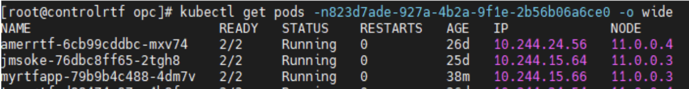

The IP is the range of the CIDR block or the pods' network that we explained in our previous [article](https://www.prostdev.com/post/mulesoft-runtime-fabric-deployed-on-oracle-cloud-infrastructure-oci-part-1).

Our application is being served at IP: 10.244.15.66 and port 8081. And the resource path: /myrtf

Let's send a POST with some payload to it:

```bash
curl -X POST http://10.244.15.66:8081/myrtf -d '{"message":"Hello RTF"}'
```

In our log file:

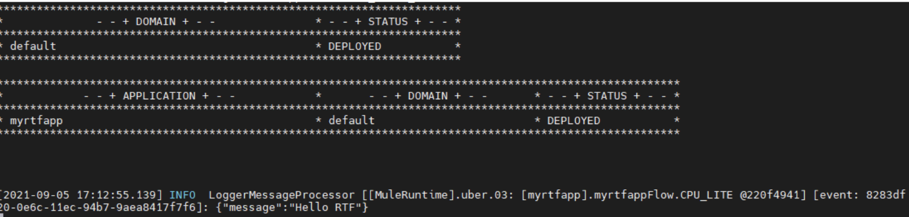

That is from the application perspective, but what about the logs of the agent that performs the deployments into RTF? Let's imagine that something went wrong during the deployment, and you want to learn what happened. You can use this command to get the logs of that agent:

```bash
kubectl -n rtf logs -f deployment/agent
```

You will notice that when you execute that command, a lot of log entries will be retrieved. You can either save them to a file and then do some research on it, or consolidate all your RTF log files (both the platform and applications) into Splunk, Elasticsearch, or a Syslog platform. We will elaborate a little bit more in the next section.

Other useful commands, but now from the rtfctl perspective, are the ones that are related to how to retrieve:

- HEAP dumps from your application.
- THREAD dumps from your application.

Sometimes it is useful to get into that level, and you can achieve it using the following commands:

```bash
sudo ./rtfctl heapdump <appname> <outputDUMPfile>
sudo ./rtfctl threaddump <appname>
```

For example:

```bash
sudo ./rtfctl threaddump myrtfapp
```

The output is:

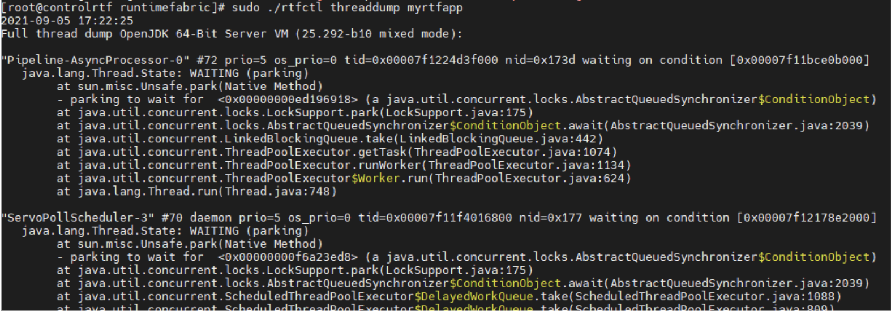

(It is much larger, but we just want you to see that it is a normal thread dump from your app)

```bash
sudo ./rtfctl heapdump myrtfapp dump.dmp
```

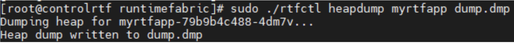

At this point, you may be wondering if it would be easier to consolidate most of the log files of our platform into a single place. That is completely possible with RTF and is very straightforward to configure.

Just go to your RTF at the Anypoint Platform Web Console:

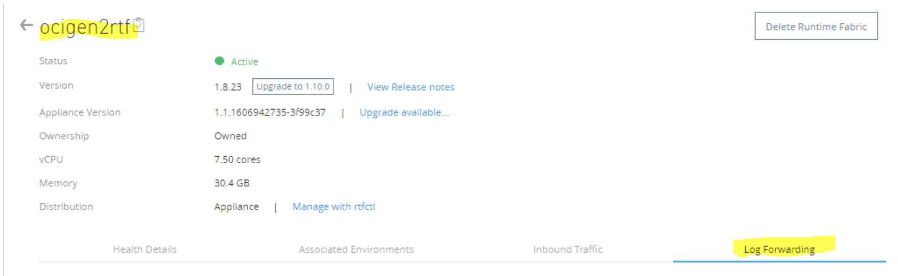

In that tab you will see this:

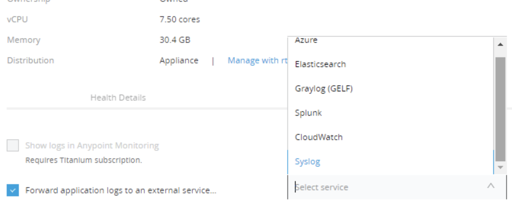

As you can see, there are several options for this. In our case we will use Syslog:

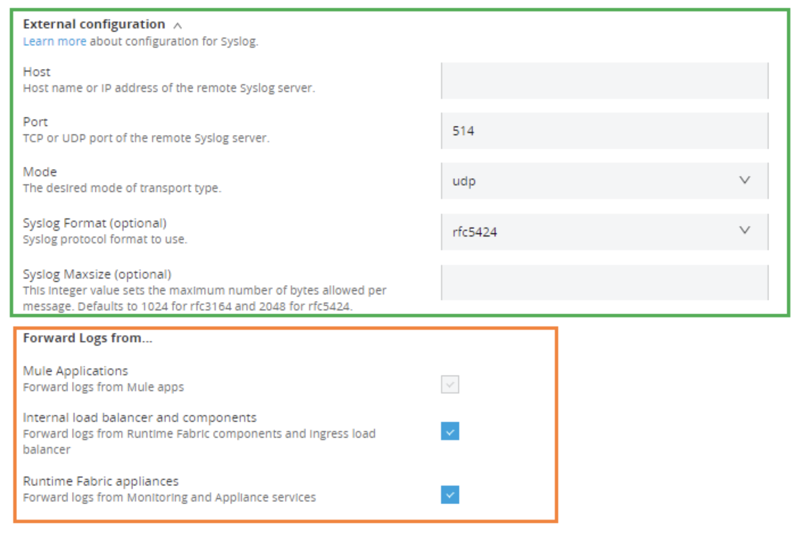

The green square is for the connectivity information you need to input and is related to your SYSLOG server. And also for the format of the syslog, in our case, we will use the format rfc5424.

The orange square is for you to decide which logs you want to send to the syslog server. You will notice that there are several options. Decide on what fits better for you. In our example, we will send everything to the PaperTrail syslog UDP server.

Once you’ve configured it you can send a text message:

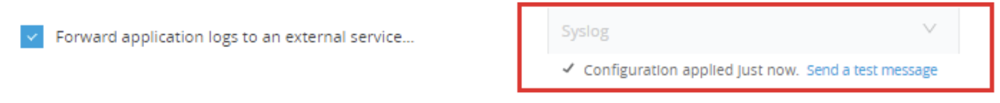

Once you click on it at the top right corner you will get:

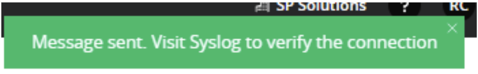

And after that, you can see the events being sent. Most of these events are from the platform itself:

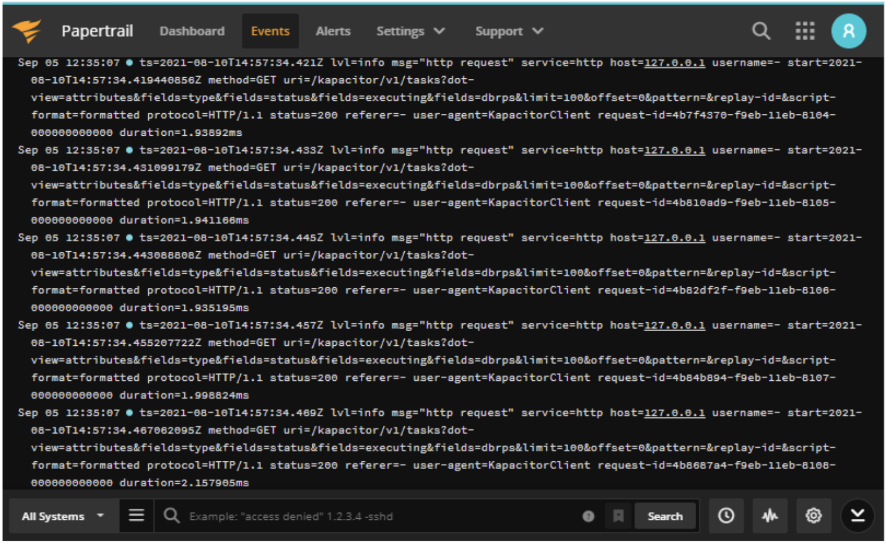

But we can filter it with the name of our application; myrtfapp:

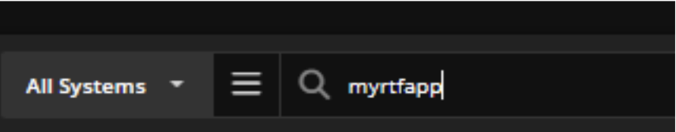

Let’s send a request to our app and we will see the log file in Papertrail:

```bash
curl -X POST http://10.244.15.66:8081/myrtf -d '{ "array": [ 1, 2, 3 ], "boolean": true, "color": "gold", "null": null, "number": 123, "object": { "a": "b", "c": "d" }, "string": "Hello World" }'
```

And at PaperTrail:

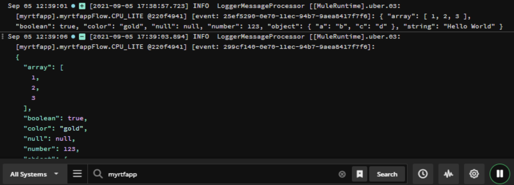

Now let’s see how to get inside a pod.

## How to get inside a pod

Sometimes you will have to get within a pod in order to do a particular activity. For example: to test connectivity to an external resource. Or just because you are curious, and you want to see what is inside of it.

In order to get into the pod, execute this command:

```bash
kubectl exec --stdin --tty <podname> -n <namespace> -- /bin/bash
```

In this case, we are using the entire pod name. For example:

```bash
kubectl exec --stdin --tty myrtfapp-79b9b4c488-4dm7v -n 823d7ade-927a-4b2a-9f1e-2b56b06a6ce0 -- /bin/bash
```

Once you execute this, the command prompt will be returned and you will be inside the pod:

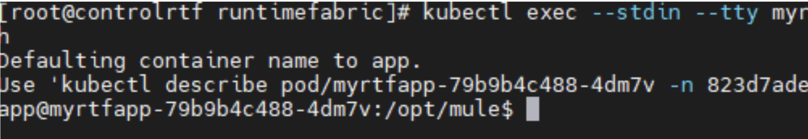

As you can see in the image, I am inside the pod. If I execute:

```bash
ps -fea
```

I will see the java process executing my MuleSoft Runtime:

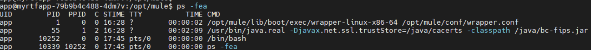

You can move to the apps folder and see your application:

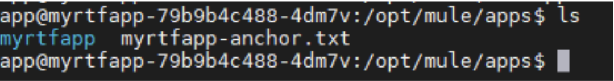

You cannot write or modify anything. You do not need it, that is the beauty of this. If you need to change something, for example, JVM properties. You will do it from the console, and a new POD will be created with such a configuration.

## Conclusion and next steps

With this article, we finalized this small series of two articles about RTF on top of Oracle Cloud Infrastructure.

You’ve learned some very basic but useful commands. You now have a glimpse of how the underlying RTF infrastructure works, and how it is related to Kubernetes.

We will continue writing about RTF. Our next article will be targeted at the Operation Center web console, which is also very useful for management purposes.

We will also explain the upgrade process of an RTF. Stay tuned!
