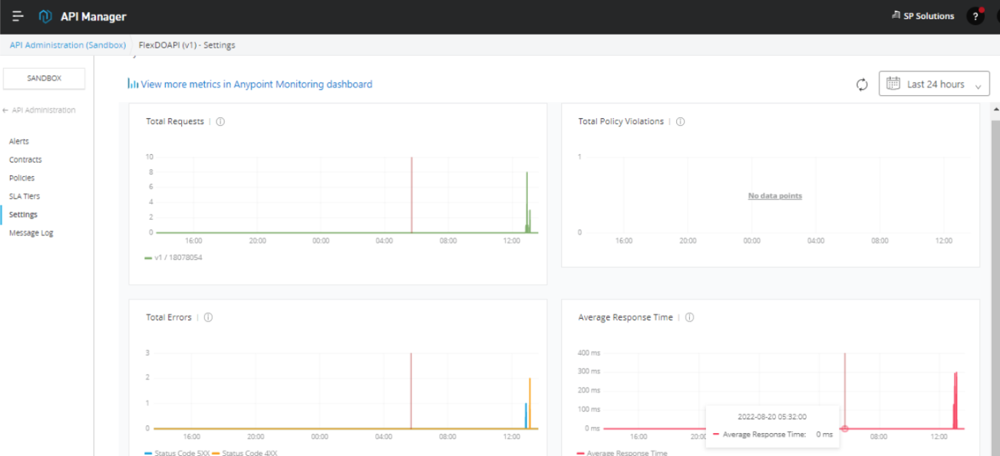
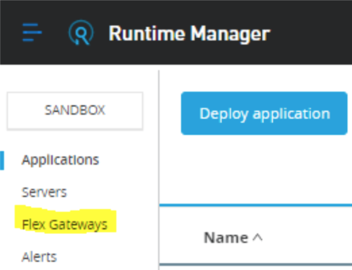
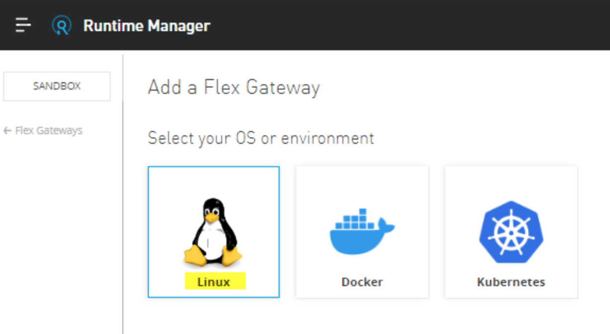
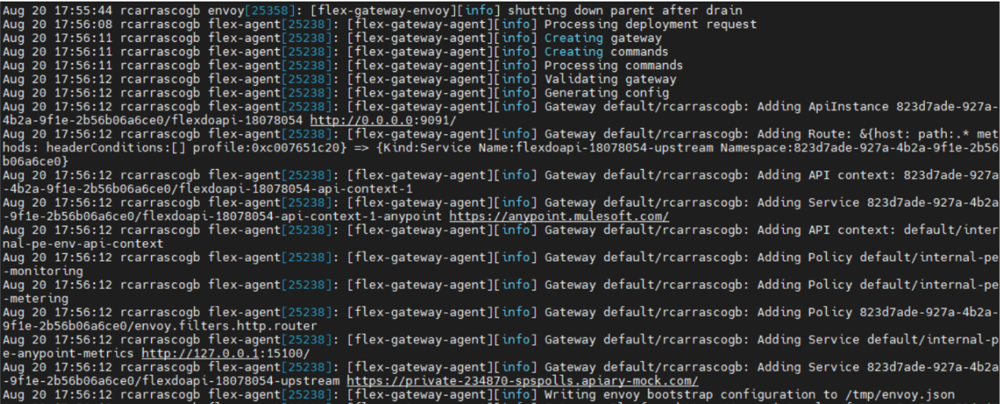
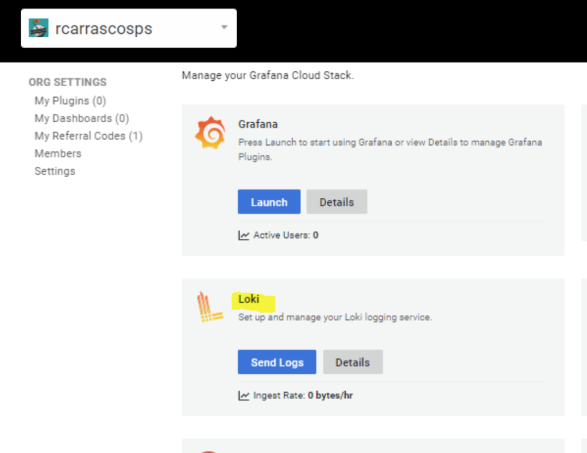
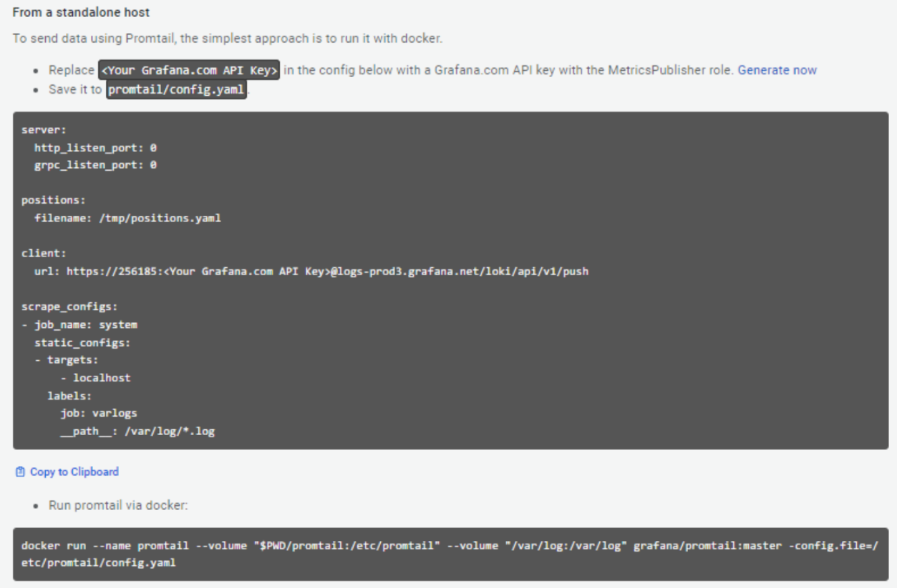
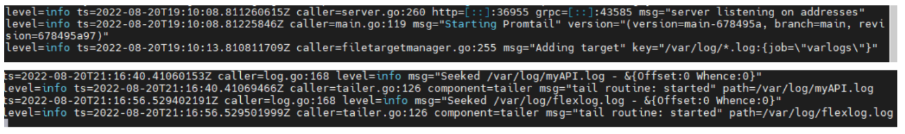
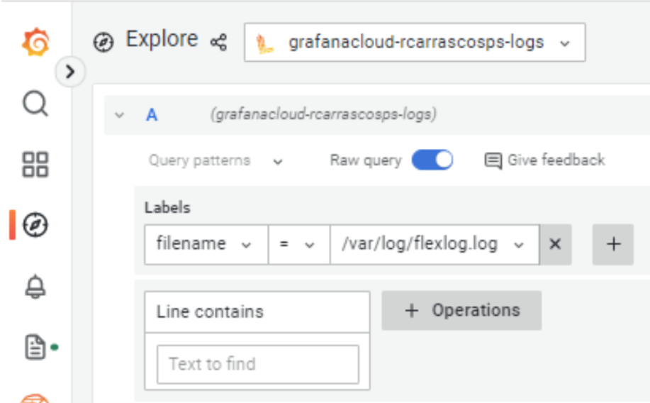
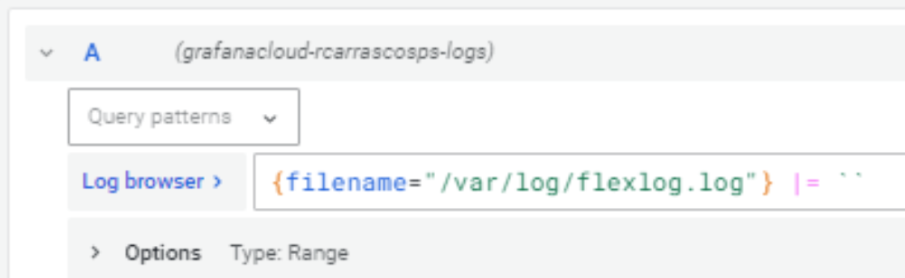
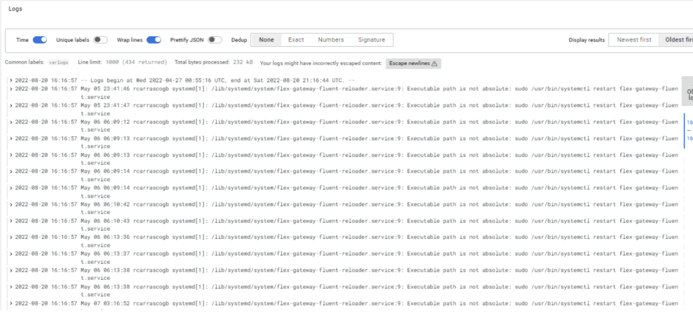

I’ve been writing about the MuleSoft Flex gateway for the past months, and you can find it here: [https://medium.com/@rcarrascosps](https://medium.com/@rcarrascosps)

But one of the most common things to take care of is about consolidating logs and making them part of a greater initiative where you need to have a single pane of glass where you can get information about the health of your system, but also about your services, APIs, microservices, etc.

The Flex gateway is going to be part of a greater solution, it will be very improbable that it will be seating just by itself. If you are using it is because you are managing multiple APIs in multiple places. And it is also very probable that your transactions are a mix of APIs calls that goes from one API to another which makes it complicated to trace, diagnose, to monitor.

MuleSoft Flex gateway is a very lightweight piece of software that you can configure in both connected mode and local mode. Where the connected mode has all the advantages of managing your APIs from Anypoint Platform, which makes it very appealing.



And the local mode is where you do not manage your APIs from Anypoint Platform, but directly in the command line of the system (Linux, Kubernetes, docket) where you’ve installed the gateway.

To understand more about those modes you can take a look at my articles or the official documentation: [https://docs.mulesoft.com/gateway/1.1/flex-gateway-overview](https://docs.mulesoft.com/gateway/1.1/flex-gateway-overview)

This series of articles (this is the first one) is targeted to integrate the Flex Gateway with Grafana Labs. In particular with Loki and Tempo. And this first article is related to Loki.

Grafana Loki is part of the different components that Grafana Labs offer for log consolidation. It can be integrated with a lot of popular open-source and enterprise solutions such as Elasticsearch (logstash), Splunk, etc. You can learn from Grafana Loki here: [https://grafana.com/oss/loki/](https://grafana.com/oss/loki/)

What we will learn in this short article is how to send the Flex Gateway logs (at least the agent log) into Grafana Loki and then analyze them, search them, and explore them from the Grafana console.

## Prerequisites

The prerequisites for following this article are

- Anypoint Platform instance
- Install a Flex Gateway either in connected or local mode
- Have access to the Flex Gateway logs
- Grafana Cloud free-tier account
- Promptail agent to point it to Flex Gateway
- And that’s it

Let’s go step by step and first install a Flex Gateway into a Linux System.

## Install a Flex Gateway instance

Go to [https://anypoint.mulesoft.com](https://anypoint.mulesoft.com/), head into Runtime Manager, and click on Flex Gateways.



Then add a gateway and choose Linux (I will use that option for now).



And then follow the instructions listed there, which are the following.

> [!NOTE]
> these commands apply to Flex Gateway version 1.1.0. If you want to work on a different version, the instructions might be different.

```bash
curl -XGET https://flex-packages.anypoint.mulesoft.com/ubuntu/pubkey.gpg | sudo apt-key add -
echo "deb https://flex-packages.anypoint.mulesoft.com/ubuntu $(lsb_release -cs) main" \
  | sudo tee /etc/apt/sources.list.d/mulesoft.list
sudo apt update
sudo apt install -y flex-gateway
```

Then execute this and change &lt;gateway-name> with any name you choose. The token and organization IDs are going to be different than the ones listed here because they have your own credentials:

```bash
sudo flexctl register <gateway-name> \
  --token=ffb21bee-a718-77d56750e88 \
  --organization=f7-4c08-96a3-c9013a01d871 \
  --connected=true \
  --output-directory=/usr/local/share/mulesoft/flex-gateway/conf.d
```

And finally, start it and check its status:

```bash
sudo systemctl start flex-gateway

systemctl list-units flex-gateway*
```

Pretty much that should take less than 4 minutes. Just that simple.

## Get access to the Flex Gateway logs

Now that the gateway is installed, you can check from the Linux system the log files of it. Let’s focus on one specific which is the gateway log file. And in the next articles, I will focus on the specific APIs logs. Every API can be configured to have its log file, and we will see it in our next article.

But to keep things simple we will use the Gateway log. To get access to it, create a directory. For example:

```bash
mkdir $HOME/flex-gateway/logs
```

Inside this directory, execute:

```bash
journalctl -u flex-gateway-* > flexlog.log
```

You will have the log file in $HOME/flex-gateway/logs/flexlog.out

And you will get something like this:



Now let’s configure Grafana Loki.

## Grafana Loki configuration

You need a Grafana free tier account. You can get it here: [https://grafana.com/products/cloud/](https://grafana.com/products/cloud/)

Once you get your account, go to the cloud console (for example [https://grafana.com/orgs/](https://grafana.com/orgs/)&lt;YourOrganizationName>)

And there, click on this:



Click on the Send Logs blue button and follow these instructions:



What we’ve just done is configure the promtail agent to send logs into Grafana Loki. That is a very lightweight agent that in this case is running inside docker. The configuration is very simple, we just need to identify the directory of the log files that we want to send to Loki, and that’s it:

```bash
docker run --name promtail --volume "$PWD/promtail:/etc/promtail" --volume "$HOME/flex-gateway/logs:/var/log" grafana/promtail:master -config.file=/etc/promtail/config.yaml
```

The output for that is:



And if we go to Grafana Explorer, and select the Loki logs data source:



Write that simple query in the builder mode or the coding mode:



And you will get this:



And now you can start to imagine how much you can do, once you have it in Grafana.

As I’ve mentioned, this is a very simple example. The true value will be when we start reading the APIs’ specific log files. That will be in the second article of this series.
