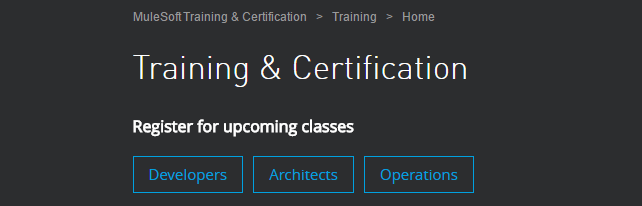

Do you sometimes feel like you want to get a certification, but you’re not sure about which one? Or maybe you do, but you have to spend some money just to start the learning process and then pay some more to get the exam. Maybe you start paying for the classes, but then you decide it’s not really what you wanted, so you feel obligated to finish because you already paid for it, but not because it’s what you’d like to do… Some other scenarios come to my mind, but you got the idea.

If you ever had some of these problems, or you just want to get a new certification in a new technology, then, you should read this post!

## -MuleSoft? -Yes! MuleSoft!

Yeah, it sounds really nice, but, what **is** this *MuleSoft?*

MuleSoft is the name of the company that created these technologies that help to integrate services. I’ll talk more about what they do and some examples later in this post.

About the name, you got it right… Their representative animal is a Mule! But why?

> The “mule” in our name comes from the drudgery, or “donkey work,” of data integration that our platform was created to escape. Also, like a mule, we deliver the strength of a donkey to haul the heavy workload, and the speed of a racehorse to get it done quickly. MuleSoft fits the bill.

Its name is Max, by the way. Max the Mule.

## Awesome! But… what is it that they do?

They help their clients to achieve a customizable integration with their APIs. It is convenient, because the development can be done without actually touching a line of code and just dragging-and-dropping the components into the MuleSoft Application (using [Anypoint Studio](https://www.mulesoft.com/platform/studio): an IDE based on Eclipse).

You can design an API before starting the actual development with [API Designer](https://www.mulesoft.com/platform/api/anypoint-designer), and get the chance to test it before implementing it, using the API Console and the Mocking Service that is integrated with the designer. You can even create tests the very same way you develop the application (with drag-and-drop), using [MUnit](https://www.mulesoft.com/platform/munit-integration-testing). These are just some examples of all the products that MuleSoft offers, you can find the full list in their official website: [www.mulesoft.com](https://www.mulesoft.com/).

## And… what about the trainings?

Finally, we get to the coolest part!

There is a catalog for different trainings and some of them can get you a certification.

Some of them are not free, or have to be taken with an instructor. **BUT!!!** We started this post talking about the costs and the regrets. Hopes and dreams, and stuff…

There **is** a 5-days online fundamentals course for you to take whenever it suits you better. It is called [Anypoint Platform Development: Fundamentals](https://training.mulesoft.com/course/development-fundamentals-mule4). The only thing you need to do is to watch the videos and practice with the instructor. You will also receive pdfs with the content.

After you finish the training, you will get a voucher in order to take the certification exam for free. Yes. You only have to complete the training, study and practice on your own, and get certified! You have 2 attempts to pass the exam.

My advice, practice and read a LOT before taking it. If you don’t make it in the first attempt, don’t worry, you still have another, but take that as a sign and investigate a little bit more about what you didn’t know how to answer.

I really hope I could get your attention on a new technology. Even if you don’t get a certification or register to a training, I’m glad you stayed ’til the end of the post and now you have an idea of what MuleSoft is, what it does, and how can you learn.

I have to get this out of my chest… I actually completed the training I mentioned before, it was not that easy because of my schedule, but it was really fun, each step of the way. I highly recommend it, even if you don’t want to follow this career path. It opens your mind to a new world (if you’re not familiar with integration technologies), and gives you a newer perspective. I had so much fun using the API Designer, it was the best of the training, in my opinion.

Thank you for reading, guys! Get a beer for me, I just got some teeth removals, so I can’t.

Don’t forget to say Prost!

-Alex
