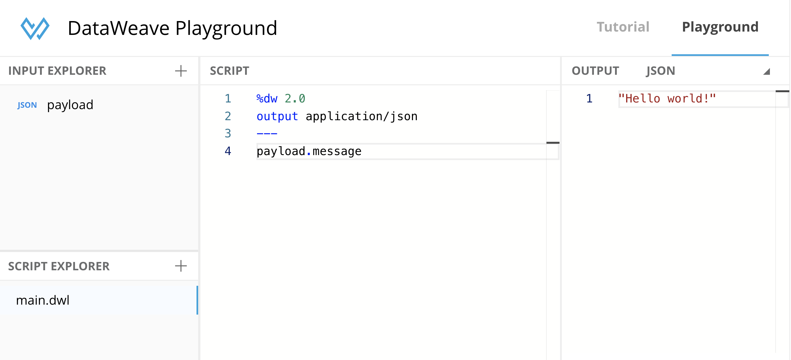
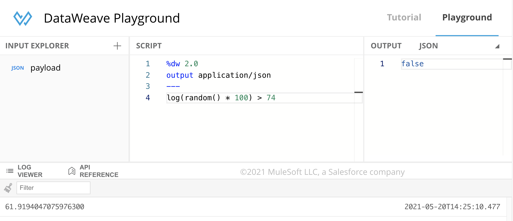
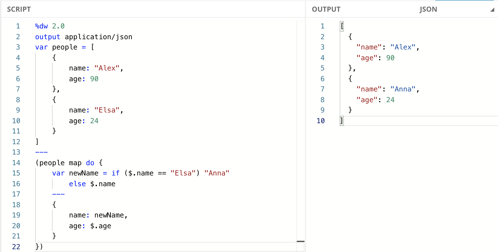

It took me some time to find and fully understand how to use these “hacks” *(they’re not really hacks, but they’ve made my life so much easier, so I’ll call them hacks)*. Trust me; they’re truly worth it, especially if you’re just starting to learn DataWeave.

- Using the DataWeave Playground
- Using the “dw” output
- Using the “log” function
- Using the “do” statement
- Assigning types to variables and functions

## 1. Using the DataWeave Playground

This is my absolute favorite tool, and I really hope more functionality gets added into it (*cough, cough, a DataWeave Notebook, please?).* I use this tool ALL the time.

This is basically a tool that lets you experiment with DataWeave without doing it from Anypoint Studio. You can find the docker image to install in your local machine in this post (no previous Docker experience needed) - [How to run locally the DataWeave Playground Docker Image](https://www.prostdev.com/post/how-to-run-locally-the-dataweave-playground-docker-image)*.*

But wait! Before you do that, the awesome DataWeave team already created an online site that you can access without having to run Docker. Check it out here: [https://developer.mulesoft.com/learn/dataweave](https://developer.mulesoft.com/learn/dataweave)



## 2. Using the “dw” output

When you’re working with certain data types, like JSON, you don’t have the same visibility as some of the values’ types. For example, JSON converts the Dates into Strings. You can’t be absolutely sure about the exact type of output unless you follow the code. Here’s an example:

```dataweave
%dw 2.0
output application/json
---
"2000-01-01" as Date // "2000-01-01"
```

(I’m adding in the comments the output that I’m getting)

Simply by looking at “2000-01-01”, you’re not sure if it’s a String or a Date (without looking at the code, of course).

If I remove the “as Date” coercion, the output remains the same.

```dataweave
%dw 2.0
output application/json
---
"2000-01-01" // "2000-01-01"
```

Now try changing the “json” output for a “dw” output and see the magic.

Without coercion:

```dataweave
%dw 2.0
output application/dw
---
"2000-01-01" // "2000-01-01"
```

With coercion:

```dataweave
%dw 2.0
output application/dw
---
"2000-01-01" as Date // |2000-01-01|
```

Ah! You can see the difference now!

And that’s not all. By using this output, you can also see a function’s definition. Here’s an example of the “[plusplus](https://docs.mulesoft.com/mule-runtime/4.3/dw-core-functions-plusplus)” function:

```dataweave
%dw 2.0
output application/dw
---
++ // (arg0:Array | String | Object | Date | LocalTime | Date | Time | Date | TimeZone | LocalDateTime | TimeZone | LocalTime | TimeZone, arg1:Array | String | Object | LocalTime | Date | Time | Date | TimeZone | Date | TimeZone | LocalDateTime | TimeZone | LocalTime) -> ???
```

Pretty cool, right?

## 3. Using the “log” function

Isn’t it frustrating when a small part of your script is not working, and you’re not sure why? You can’t actually debug it like you’d debug a Mule Flow. But guess what? You *can* output expressions into the console.

Let’s say that I have the following script:

```dataweave
%dw 2.0
output application/json
---
(random() * 100) > 74
```

I’m either getting true or false (Boolean, not String), depending on whether the randomly generated number is more than 74 or not, but I don’t know what the actual random number is.

Well, I can use the “[log](https://docs.mulesoft.com/mule-runtime/4.3/dw-core-functions-log)” function to see which number it is. And the best part? Adding this into my script doesn’t affect anything I do. I don’t have to add a new variable only for the log. I can just surround the value that I want to log into the console in parentheses.

```dataweave
%dw 2.0
output application/json
---
log(random() * 100) > 74
```

This is what it looks like from the DataWeave Playground:



You can experiment a bit with it to see what you can and can’t do with this function. For example, you can’t do this:

```dataweave
%dw 2.0
output application/json
---
log(if(true)) "ok" else "not ok" // Invalid input '"', expected Function Call
```

## 4. Using the “do” statement

You can create a local context by using the “[do](https://docs.mulesoft.com/mule-runtime/4.3/dataweave-flow-control#control_flow_do)” statement. This includes variables, functions, and the script. This way, you can have variables inside your functions that are not accessible outside of the function. I use this a lot to not end up with a lot of global variables that can’t be re-used for other purposes.

Consider this script:

```dataweave
%dw 2.0
output application/json
var people = [
    {
        name: "Alex",
        age: 90
    },
    {
        name: "Elsa",
        age: 24
    }
]
---
(people map do {
    var newName = if ($.name == "Elsa") "Anna"
        else $.name
    ---
    {
        name: newName,
        age: $.age
    }
})
```



If we wanted to re-use the "newName" variable from outside of this context (set by "do"), we would receive an error because the variable only exists inside the context where it was created.

```dataweave
(people map do {
    var newName = if ($.name == "Elsa") "Anna"
        else $.name
    ---
    {
        name: newName,
        age: $.age
    }
}) + newName // Unable to resolve reference of: `newName`.
```

In this example, I created a context inside the “map” function, but notice how I need to re-declare the object for the map. This is because there’s a new script section inside the “map” (right under the three dashes (---). A regular map would look like this:

```dataweave
people map {
    name: $.name,
    age: $.age
}
```

I don’t need to add additional curly brackets (&#123; &#125;) in the regular map. But because I opened a new context, I need to treat the new space just like a regular script.

You *can* continue creating more contexts inside contexts, but please **don’t** do this. :D

I’m not sure if this will create performance issues later, but it doesn’t look good, and you may end up with “[Spaghetti code](https://en.wikipedia.org/wiki/Spaghetti_code).”

It took me some time and practice to get used to this statement. The best way to master it is to use it frequently over several days (not only a lot of times in one day but for many days).

## 5. Assigning types to variables and functions

When I first started developing in DataWeave, I didn’t assign any [type](https://docs.mulesoft.com/mule-runtime/4.3/dataweave-type-system) to the functions or variables I was creating because it’s not really needed. Here’s an example:

```dataweave
%dw 2.0
output application/json
var str: String = "Hello"
fun concat(str1: String, str2: String): String = str1 ++ str2
---
concat(str, " World!") // "Hello World!"
```

As you can see, my variable “str”, the two parameters of the “concat” function, and even the return type of the function itself, are all of type “String.”

This has helped me in different ways:

**1.** I don’t get confused when I have a big script and forget which kind of data a variable was. I can easily look at the data type I assigned to it.

**2.** My mistakes and potential bugs are reduced because I know exactly what kind of data I *could* get back. For example, when you use a [selector](https://docs.mulesoft.com/mule-runtime/4.3/dataweave-selectors) like the Index selector, it *is* possible that the data you get is a Null, instead of the data you were expecting.

```dataweave
%dw 2.0
output application/json
fun getValue(array: Array<Number>, index: Number): Number | Null = array[index] // Return type can be a Number (because it's an array of numbers), but it can also be a Null if the index wasn't found. Hence the “Number | Null” union.
---
getValue([1, 2, 3], 5)
```

**3.** I get early errors in my script before deploying and running my Mule App, saving me time.

**4.** It’s easier for the next developer to understand what the code is doing by looking at the data types.

**5.** Probably the best thing of all is that I learned how to use [Function Overloading](https://docs.mulesoft.com/mule-runtime/4.3/dataweave-functions#overloading-functions) when I’m expecting different functionality depending on the data type.

```dataweave
%dw 2.0
output application/json
fun concat(value1: String, value2: String): String = value1 ++ value2
fun concat(value1: Number, value2: Number): String = (value1 as String) ++ (value2 as String)
fun concat(value1: Any, value2: Any): String = "Other types"
---
{
   strings: concat("Hello", " World!"), // Hello World!"
   numbers: concat(20, 20), // "2020"
   other: concat({},[]) // "Other types"
}
```

## Recap

- You can use the DataWeave Playground Docker Image locally by following [this post](https://www.prostdev.com/post/how-to-run-locally-the-dataweave-playground-docker-image), or directly using [the public site](https://developer.mulesoft.com/learn/dataweave) (if available).
- Use the output “application/dw” to see the internal data structures or read the definition of a function.
- You can “debug” your script by using the “[log](https://docs.mulesoft.com/mule-runtime/4.3/dw-core-functions-log)” function and output data into the console.
- Create local variables and functions using the “[do](https://docs.mulesoft.com/mule-runtime/4.3/dataweave-flow-control#control_flow_do)” statement.
- Assign [types](https://docs.mulesoft.com/mule-runtime/4.3/dataweave-type-system) to variables and functions to avoid confusion later, reduce mistakes, catch errors early, help the next developer understand your code, and use [Function Overloading](https://docs.mulesoft.com/mule-runtime/4.3/dataweave-functions#overloading-functions) when needed.

I hope these tips help you in your DataWeave journey.

*Prost!*

-Alex
