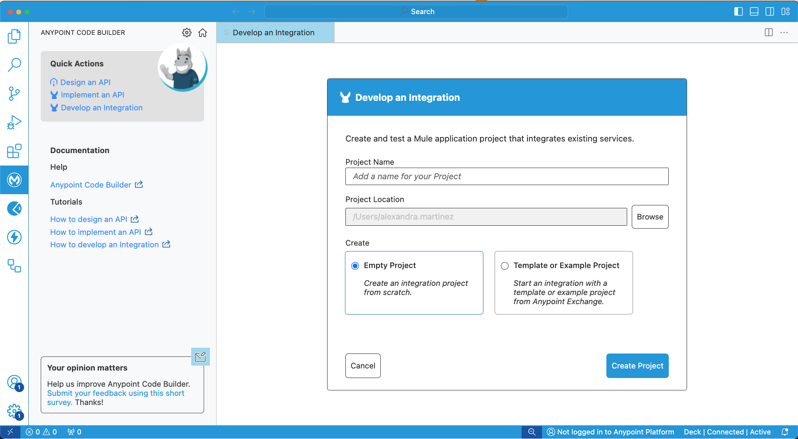
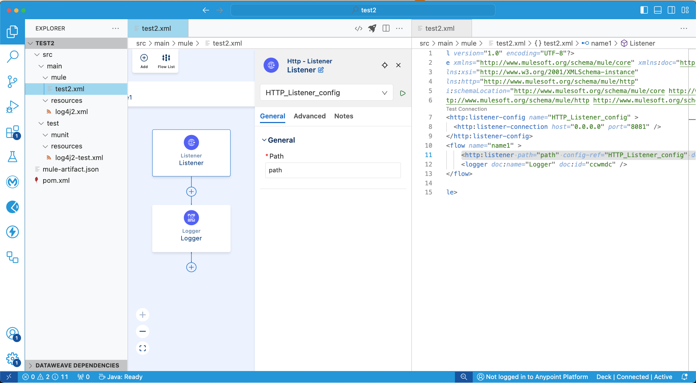
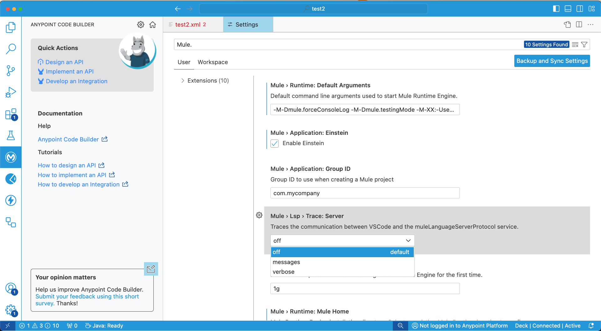
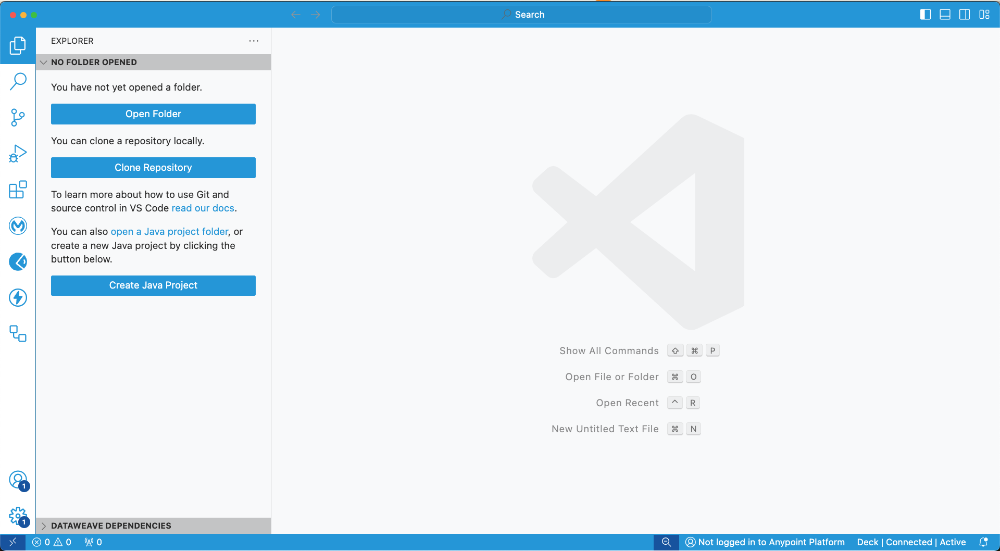
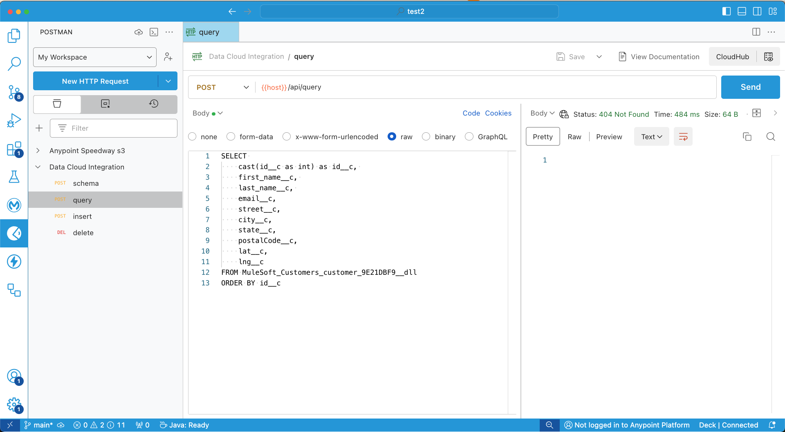
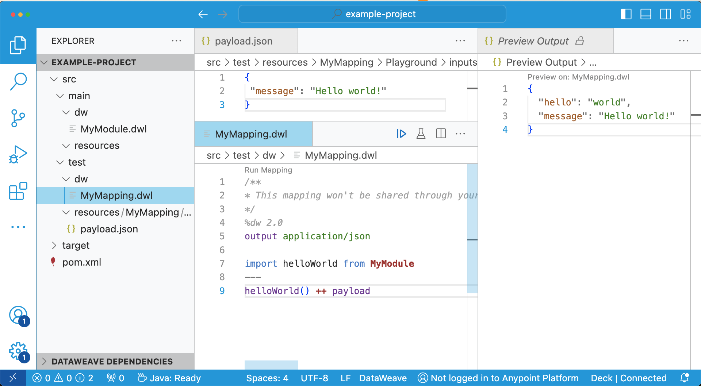
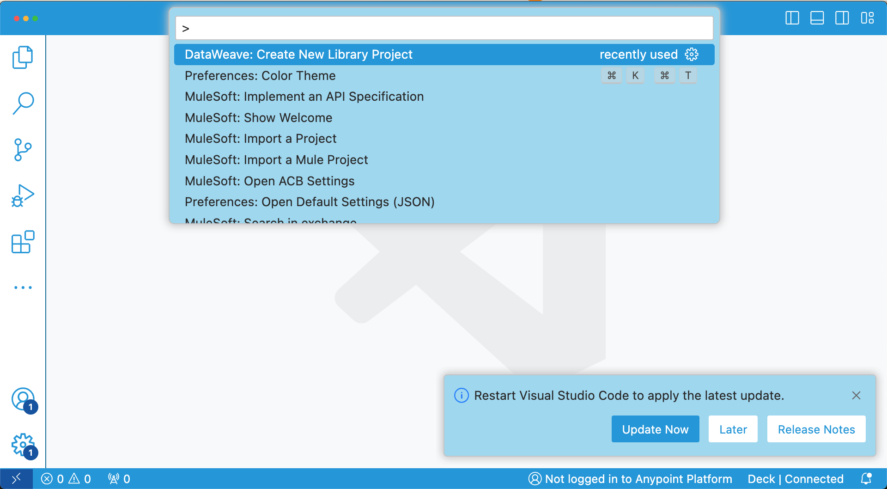

Hello! I just wanted to take a moment to share this news with you all. I created a theme for Visual Studio Code that is inspired by the MuleSoft colors.

Please note that it is NOT an official theme. It's just something I created on my own. I based most colors on Anypoint Platform or other official sites under the [MuleSoft.com](http://MuleSoft.com) domain. However, that doesn't mean they're the official colors :-) I just wanted to mention that.

That said...The theme is already published in the VSCode Marketplace. You can download it and start using it right away!

> [!BUTTON]
> [Download theme](https://marketplace.visualstudio.com/items?itemName=ProstDev.mulesoft-community-theme)

## Contribute

You can start contributing via GitHub whenever you see something is missing or *just not right*. You can either create a Pull Request directly in the [GitHub repository](https://github.com/ProstDev/mulesoft-community-theme) or [raise an issue](https://github.com/ProstDev/mulesoft-community-theme/issues) for me to take a look.

## Overview

Ok, enough chatting. Let's just see some screenshots!

So what do you think??

You can find more information like the color palette and the full list of sections that were customized for this theme in the [Marketplace](https://marketplace.visualstudio.com/items?itemName=ProstDev.mulesoft-community-theme) site.

I am always open to feedback. This was my first version of what I envisioned for this theme. And as you can see, I am not a designer! So, a lot of things can be improved for sure :)

Don't forget to leave a review in Marketplace so I can improve it.

Oh! And this is just the light theme for now. I hope to create a dark theme in the future :D

Thank you!!

Alex
