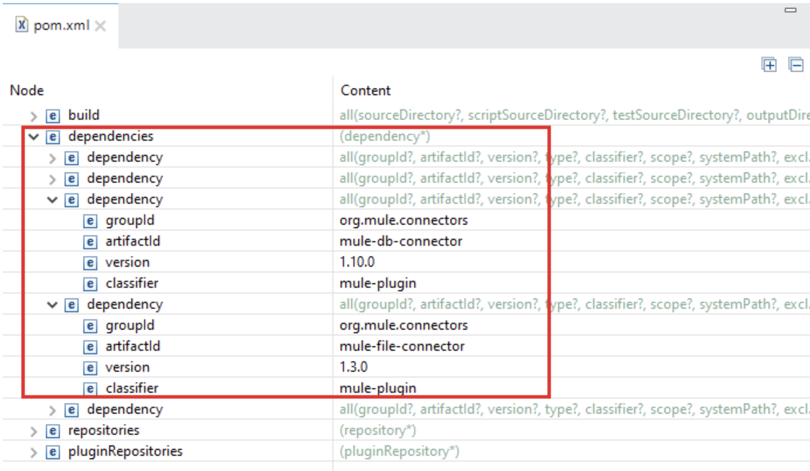
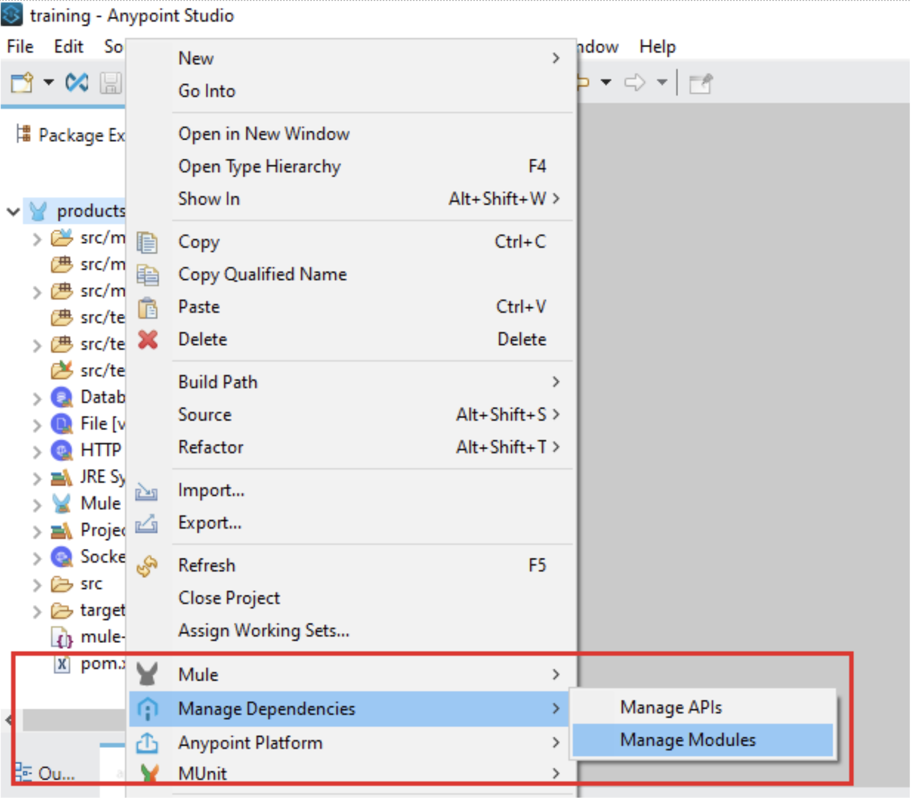
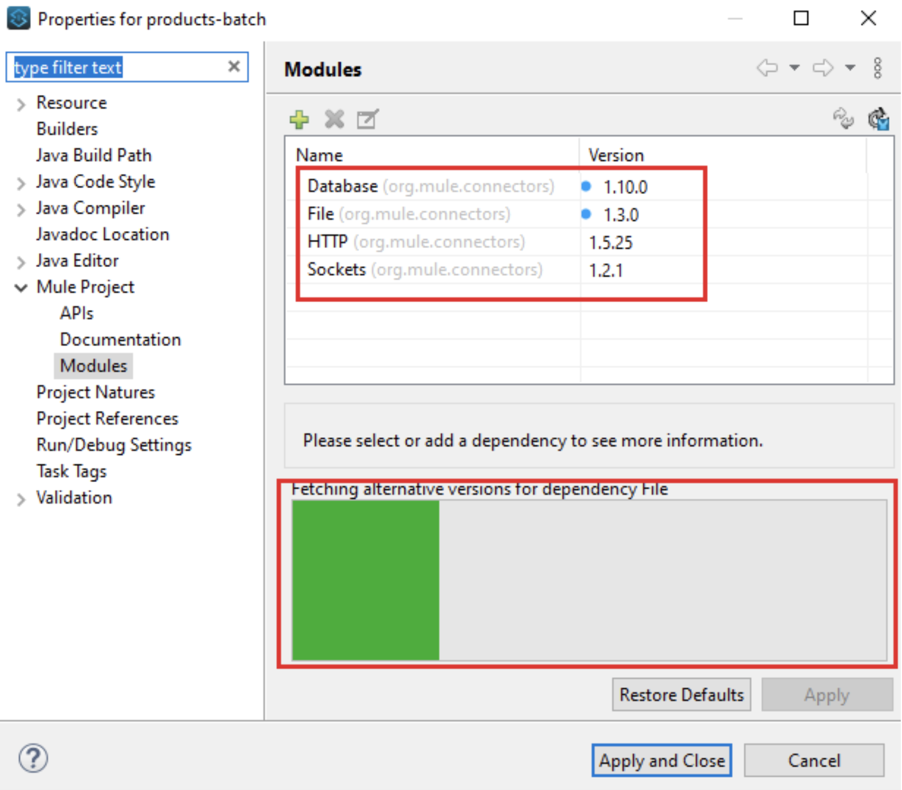
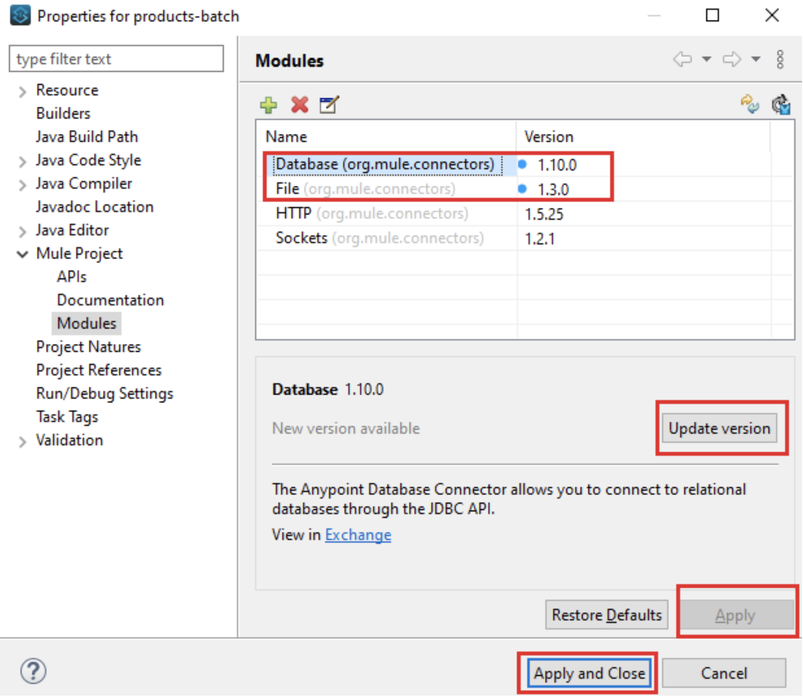
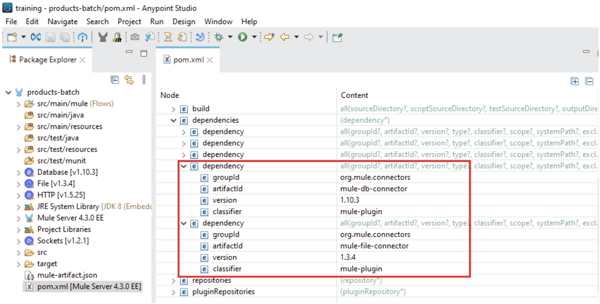
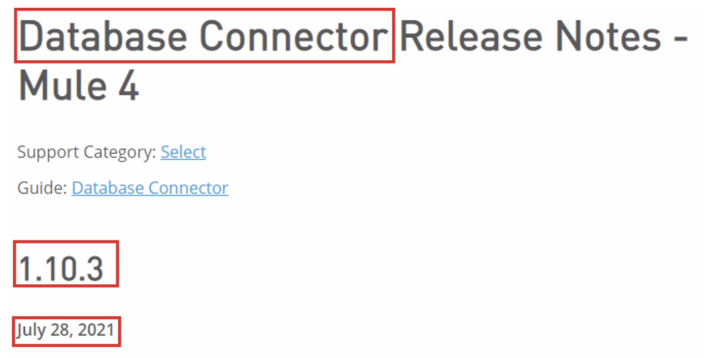
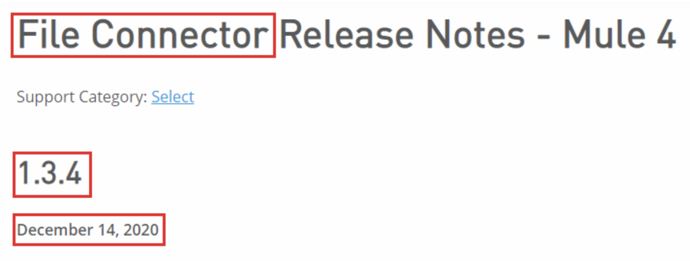

Let’s do a quick and short blog post! This post is about the new Anypoint Studio 7.10.0 version which has been released this past July 29th, 2021.

In this link you will find all the details of this new release:

[https://docs.mulesoft.com/release-notes/studio/anypoint-studio-7.10-with-4.3-runtime-release-notes](https://docs.mulesoft.com/release-notes/studio/anypoint-studio-7.10-with-4.3-runtime-release-notes)

## New features summary

Here is a summary of the new changes introduced in this new version, you will find the same summary within your Anypoint Studio installation at *Help > What’s new in Anypoint Studio?*

**Introducing Metadata Assistant - New**

MuleSoft is making it easier to work with metadata across flows and sub-flows. You can now extract and propagate metadata across sub-flows with a few clicks through a new wizard, where previously this was a laborious manual process.

**Notification center for new versions of connectors - New**

Get recommendations when new connector versions are available so you are on the latest innovation.

**Refactor rename for flows - New**

Now it will be easier to rename flow references. Changes on a flow name will be propagated automatically across flow references.

**Themes - Improvement**

Theme selection got smarter than ever. For new workspaces, it will automatically match your Operating System appearance preference selecting the Light or Dark theme accordingly.

## Notification Center for new versions of connectors

Let’s talk about the new Notification Center for new versions of connectors which is a very cool feature.

Have you ever been asked to update the dependencies of your MuleSoft project? Have you ever noticed that the modules or connectors of your projects are older versions? Have you had problems with not updating your code to the latest versions?

The new notification center solves most of these problems. To use it you simply have to do the following.

Let’s say you are developing a MuleSoft application where you need to use the database and file connectors. You will see in the `pom.xml` file those two dependencies. Similar to this:

As you can see, your project is using version 1.10.0 for the database connector and 1.3.0 for the file connector. Are those the latest version of the connectors? Could this cause an issue in your application? Do you want to verify and update them to the newest versions?

Let’s check it out!

Right-click on your project > Manage Dependencies > Manage Modules:

Automatically, Anypoint Studio will connect with Anypoint Exchange and will fetch all the alternative versions for your connectors:

The blue dots indicate that there are available new versions for those connectors. Then, you need to click on each connector, click on the Update Version button, and finally on Apply and Close button.

You can confirm that the `pom.xml` file is automatically updated with the new dependencies versions.

Finally, you can confirm that the versions of those dependencies are the latest for each connector at the Anypoint Connector Release Notes page:

[https://docs.mulesoft.com/release-notes/connector/anypoint-connector-release-notes](https://docs.mulesoft.com/release-notes/connector/anypoint-connector-release-notes)

Easy, right?

Enjoy and happy coding!
