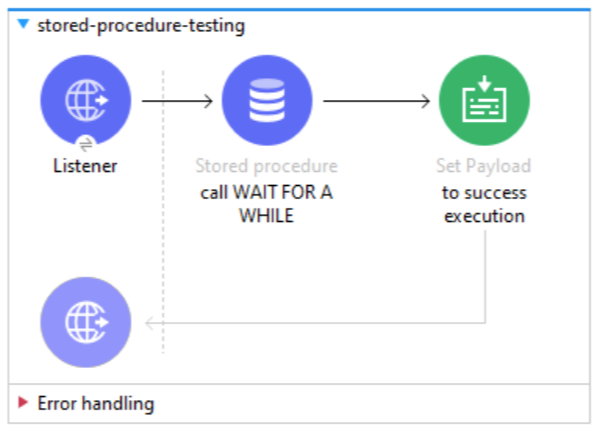
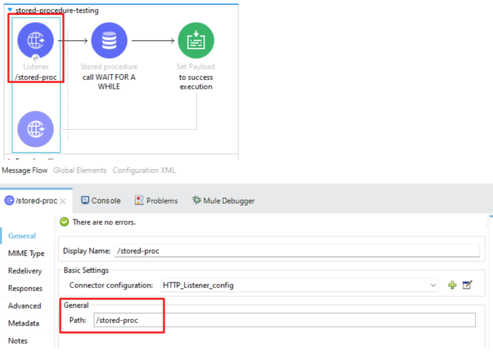
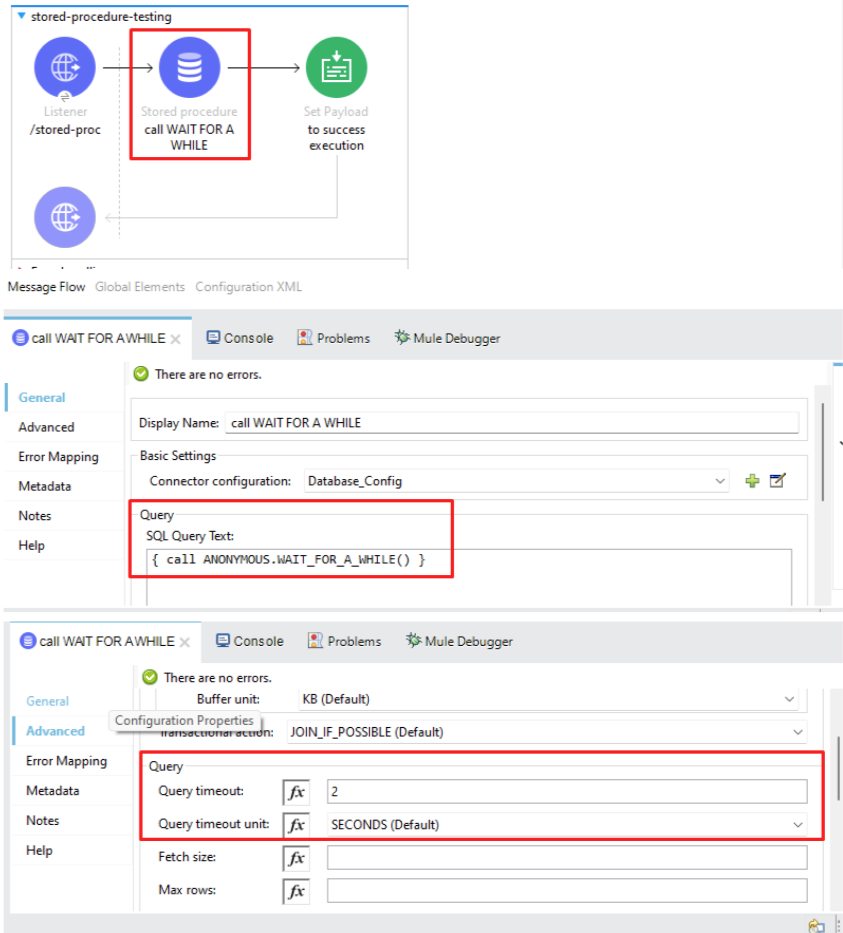
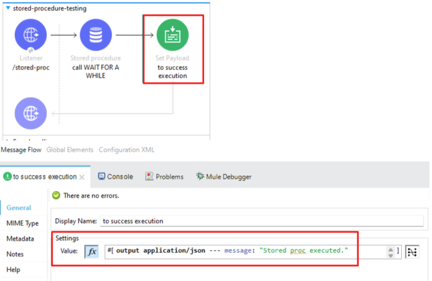
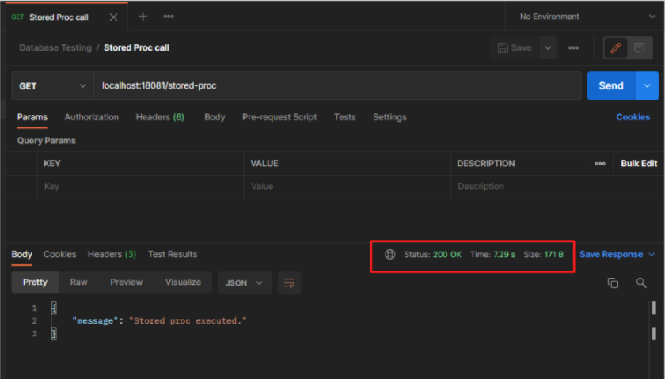
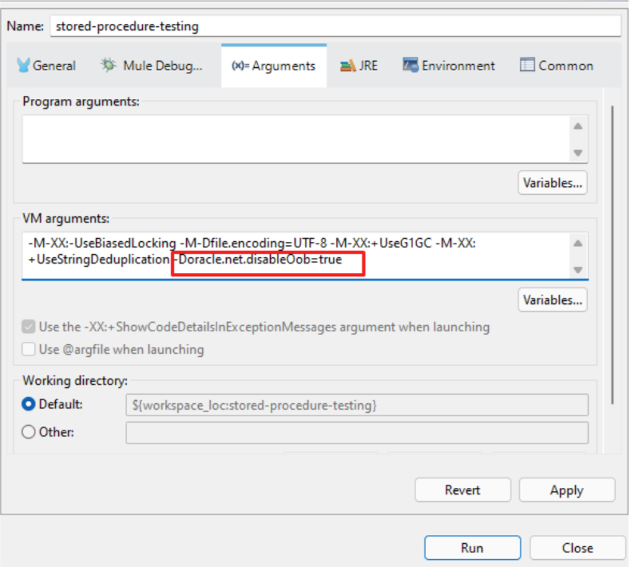
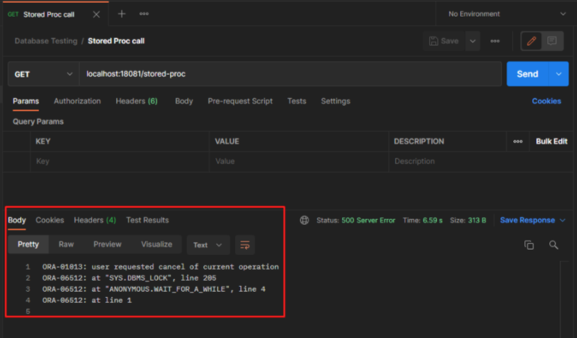

In a recent MuleSoft project, I noticed a problem when trying to run an Oracle stored procedure that took a fair amount of time to complete.

## Context

Even though the query timeout parameter was set in my code, I noticed that the execution of the MuleSoft flow kept waiting for the stored procedure to finish its execution and then continued the execution of subsequent processors in the flow.

Here's an example flow I built to exemplify this behavior.

I have an **HTTP listener** that accepts HTTP requests in the **/stored-proc** resource.

The next processor is the **call to the stored procedure** in the Oracle database. This stored procedure does nothing but wait a random amount of time (from 5 to 10 seconds) and then write a message to the log. This stored procedure was intentionally built that way to simulate long-running execution.

Finally, the flow **sets a success message** to the payload, and it is returned in the **HTTP response**.



I am using a Docker container for the Oracle database. It is always much simpler to set up your environment using Docker containers to avoid installing all the software in a local environment. If you are interested in using this container, you can get it from DockerHub: [https://hub.docker.com/_/oracle-database-enterprise-edition](https://hub.docker.com/_/oracle-database-enterprise-edition)

Or execute the following Docker command:

```bash
docker pull store/oracle/database-enterprise:12.2.0.1
```

## Oracle Stored Procedure

Below is the code I used to create the stored procedure in the database. As I mentioned earlier, the stored procedure only waits a few seconds before writing a message to the database log.

```sql
CREATE OR REPLACE PROCEDURE ANONYMOUS.WAIT_FOR_A_WHILE
IS
BEGIN
  DBMS_LOCK.Sleep(DBMS_RANDOM.VALUE(5,10));
  SYS.DBMS_OUTPUT.PUT_LINE(to_char(sysdate, 'hh24:mi:ss') || ': finished.');
END WAIT_FOR_A_WHILE;
```

## MuleSoft flow configuration

The processors that are part of the flow are configured as follows:

1. The HTTP listener listens on port 18081 and on the /stored-proc resource.



2. The database connector executes the stored procedure and has a configured timeout of 2 seconds. My expectation is that by taking more than 2 seconds, the connector returns an error due to timeout, and the flow execution is interrupted.



3. The set payload only places a message after successfully executing the stored procedure.



## Testing the MuleSoft flow

However, the flow behavior is not as expected. What happens is that the database connector waits for the execution of the stored procedure to finish (regardless of how long the execution takes) and then returns the response message established in the set payload. This indicates that the timeout configuration is not working properly.



The endpoint response takes more than 5 seconds. This is understandable (but not expected) since the stored procedure is waiting between 5 and 10 seconds before returning a response.

## Fixing the issue

The solution to the problem is somewhat simple. Doing some research in the MuleSoft documentation, we can find that the origin of the problem is not our code but the Oracle driver:

[https://help.mulesoft.com/s/article/Database-connector-Query-timeout-not-working-as-expected-on-oracle-database](https://help.mulesoft.com/s/article/Database-connector-Query-timeout-not-working-as-expected-on-oracle-database)

The documentation indicates that if we put the parameter **-Doracle.net.disableOob=true** at runtime startup, this problem will be solved.

To do this in a local environment, it is only necessary to go to the menu: Run > Run Configurations > Arguments and add the parameter in the startup configuration in Anypoint Studio and run the application again.



In the following executions, we will always get an error indicating that the user (in this case the MuleSoft application) canceled the operation with the database. This is because the stored procedure is taking between 5 and 10 seconds to respond and the database connector is waiting a maximum of 2 seconds for the operation to complete.



This means that the timeout parameter is now working properly.

## Conclusion

As a conclusion, we can say that if we have the following mix:

**MuleSoft + Oracle Database long-running executions (queries or stored procedure calls) + Timeout configuration**

It is necessary to configure the Oracle driver parameter at Runtime startup to prevent the database connector from waiting for the execution to finish. Instead, the timeout configuration would be honored.

**Additional notes**:

You can notice that in the second POSTMAN call we have a response time of 6.59 seconds. That is also a problem on the Oracle JDBC driver side of things. The timeout configuration is honored, but the driver takes a long time to get the control back to the MuleSoft app.

This was isolated and tested with a simple Java class and it has the same behavior. So, if you want to solve that problem, you’ll need to raise a ticket with the Oracle support team to solve the whole issue.
