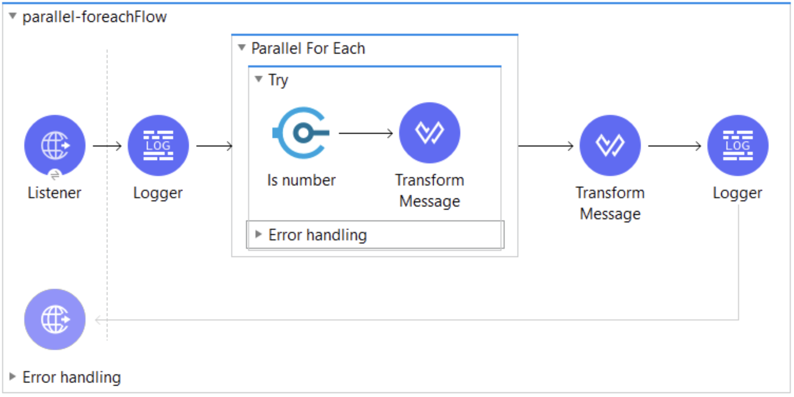
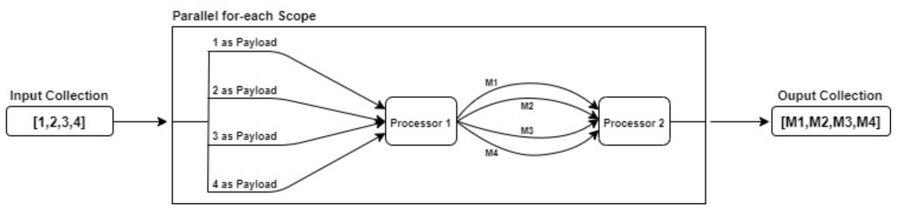
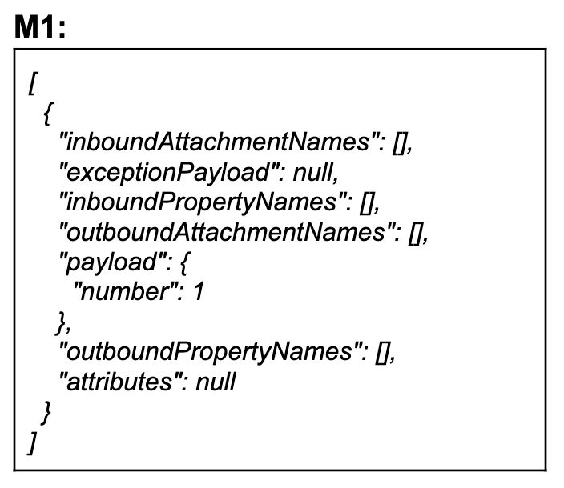
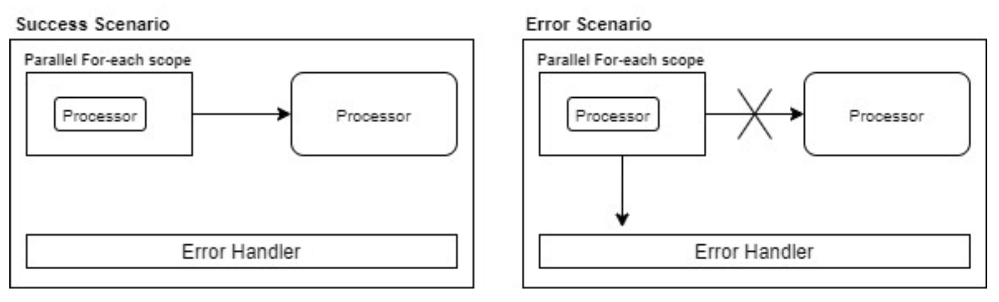
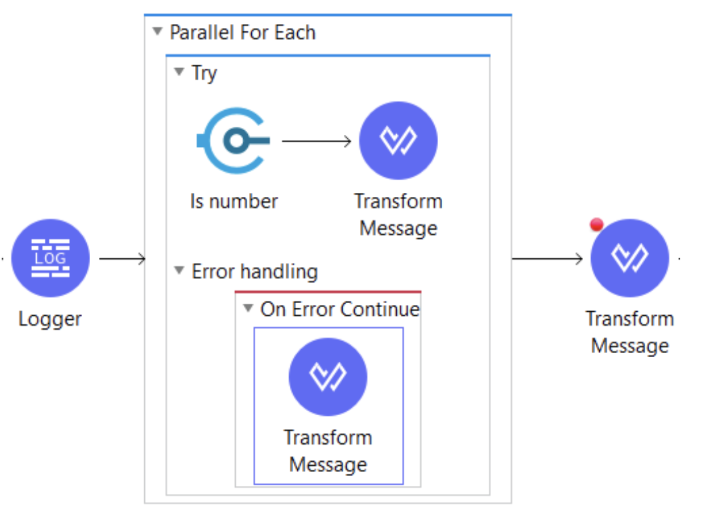

Processing a single element of a collection is a very common scenario and for that, we have the For-each scope and Batch processing in MuleSoft.

In this article, we will talk about a new scope that is called the Parallel For-each scope.

## Parallel For-Each Scope

Like the For-each scope, the Parallel For-each scope also splits the collection of messages into elements. But, unlike the For-each scope, it processes each element simultaneously in separate routes and the result is the collection of all messages aggregated in the same sequence they were before the split.

Looking at the above picture you might be wondering, where are the separate routes? And how are these routes created?

The number of routes is equal to the size of the collection and, unlike the scatter-gather, we cannot see these separate routes visually in the canvas.

**For example:**

The collection configured in the Parallel For-each scope is *[1,2,3,4].* The number of routes Mule runtime will create is 4.

## How does the Parallel For-each work?

As shown in the diagram, the collection gets split inside the Parallel For-each scope and each route is processed simultaneously. The output is the collection of Mule messages.

> [!NOTE]
> The processing of one element is invisible to other elements and creation or modification to an existing variable inside the scope is not visible outside the scope.

## Configuration

The configuration details are well documented in the MuleSoft documentation: [https://docs.mulesoft.com/mule-runtime/4.3/parallel-foreach-scope#configuration](https://docs.mulesoft.com/mule-runtime/4.3/parallel-foreach-scope#configuration)

## Error Handling

All routes continue processing even if there is an exception in one of the routes and then runtime executes the code in the error handler.

> [!NOTE]
> The flow control will not go to the processor placed next to the Parallel For-each scope.

Sometimes we may have a scenario in which we want the flow control to go to the next processor even in case of errors. This functionality can be achieved by using the Try scope and On-Error Continue processor.

## Conclusion

If you want to execute elements of a collection simultaneously without using a batch processing, the Parallel For-each scope is another out of the box solution available in Mule 4.

## References

[https://docs.mulesoft.com/mule-runtime/4.3/parallel-foreach-scope](https://docs.mulesoft.com/mule-runtime/4.3/parallel-foreach-scope)
