A little bird told me that deleting records in Data Cloud is actually not that easy to do. So, I did my research and came up with a Mule application for you all to reuse to (hopefully) make your lives easier when dealing with Data Cloud!

In this first part, we'll go through the Salesforce/Data Cloud settings that we need to set up before even calling Data Cloud through the Mule app.

> *I want to thank* [Mohammad Arsha](https://www.linkedin.com/in/mohammad-arsha-7b18381b6/) *for creating this useful* [article](https://medium.com/another-integration-blog/connect-data-cloud-with-mulesoft-bfad40fe2e8e) *that got me started on the Data Cloud/Salesforce configuration. Keep creating content!*

## Prerequisites

- **Salesforce Account with Data Cloud** - You should have a Salesforce account where you will be able to access Data Cloud. For more info, see [Salesforce Data Cloud](https://www.salesforce.com/products/data/).

## Connected App settings

The first thing we're going to do is to create a Connected App in [Salesforce](https://login.salesforce.com/) to authenticate to Data Cloud. To do this, first enter the **Setup** from the top-right of the screen.

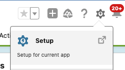

Search for **App Manager** using the Quick Find input from the left and click on **New Connected App** on the top-right of the screen.

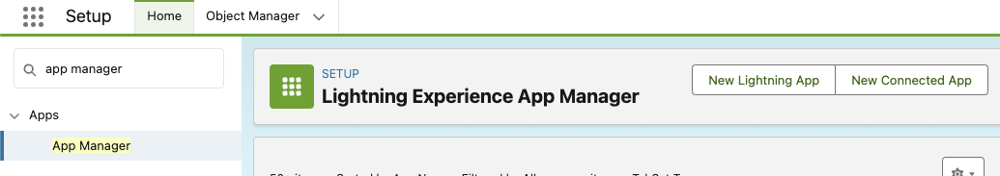

Fill in the following fields and click **Save** and **Continue** once you're done.

| **Field** | **Value** |
|---|---|
| Connected App Name | MuleSoft Integration Connected App |
| API Name | `MuleSoft_Integration_Connected_App` |
| Contact Email | your email |
| Enable OAuth Settings | ✅ |
| Callback URL | [https://login.salesforce.com/services/oauth2/callback](https://login.salesforce.com/services/oauth2/callback) |
| Selected OAuth Scopes | - Access Interaction API resources (`cdp_api`)<br/>- Access all Data Cloud API resources (`cdp_api`)<br/>- Manage Data Cloud Calculated Insight data (`cdp_calculated_insight_api`)<br/>- Manage Data Cloud Identity Resolution (`cdp_identityresolution_api`)<br/>- Manage Data Cloud Ingestion API data (`cdp_ingest_api`)<br/>- Manage Data Cloud profile data (`cdp_profile_api`)<br/>- Manage user data via Web browsers (`web`)<br/>- Perform ANSI SQL queries on Data Cloud data (`cdp_query_api`)<br/>- Perform segmentation on Data Cloud data (`cdp_segment_api`) |
| Enable Client Credentials Flow | ✅ |

In the created Connected App detail page, click on **Manage Consumer Details**

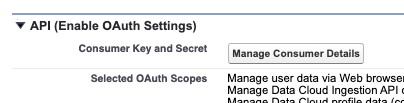

Enter the code sent to your email and click on **Verify**. Once inside the Consumer Details page, click on **Generate** and copy the newly generated **Staged Consumer Key** and **Staged Consumer Secret**. You will use these credentials for your Mule integration. After that, click on **Apply** and **Apply** again. Your staged consumer details should be now your main consumer details.

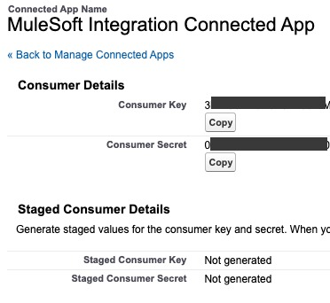

> [!IMPORTANT]
> These credentials will be used as `cdp.consumer.key` and `cdp.consumer.secret` in your Mule application's settings in Anypoint Platform (the properties in Runtime Manager).

You can close this window after you've copied the credentials.

## OAuth settings

Still inside the **Setup** page, search for **OAuth and OpenID Connect Settings** in the Quick Find input box and click on it. Make sure the **Allow OAuth Username-Password Flows** option is **On**.

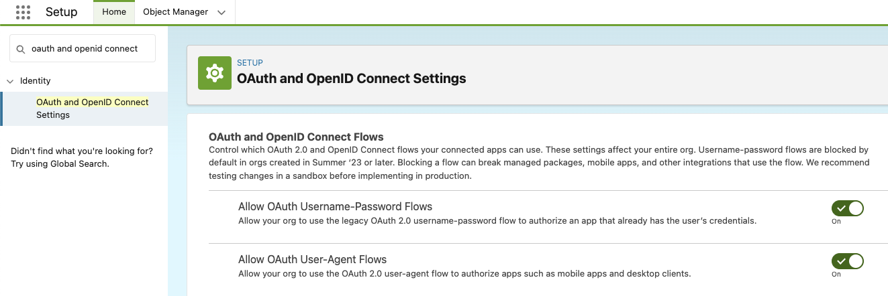

## Ingestion API settings

If you already have an Ingestion API **with a YAML schema**, just take note of the name of the Ingestion API you created. Otherwise, follow the next steps to create one.

Still inside the **Setup** page, search for **Ingestion API** in the Quick Find input box and click on it. Click on **New**.

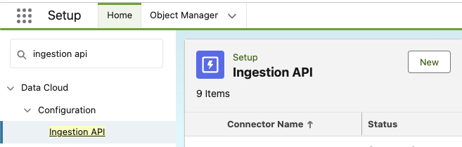

Add a Connector Name like **MuleSoft Ingestion API** and click on **Save**.

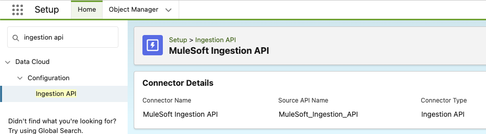

> [!IMPORTANT]
> Take note of the **Source API Name**. This name will be used as the `sourceApiName` query parameter to call the Mule application. In this case, the correct value would be `MuleSoft_Ingestion_API`.

If you already have a YAML schema, upload it here and take note of the name of the object(s). If not, upload the following example schema (the names of the objects are `runner_profiles` and `exercises`).

```yaml
openapi: 3.0.3
components:
  schemas:
    runner_profiles:
      type: object
      properties:
        maid:
          type: number
        first_name:
          type: string
        last_name:
          type: string
        email:
          type: string
        gender:
          type: string
        city:
          type: string
        state:
          type: string
        created:
          type: string
          format: date
    exercises:
      type: object
      properties:
        runid:
          type: number
        datetime:
          type: string
          format: date-time
        km_run:
          type: number
        calories_burned:
          type: number
        duration_minutes:
          type: number
        maid:
          type: number
        type:
          type: string
```

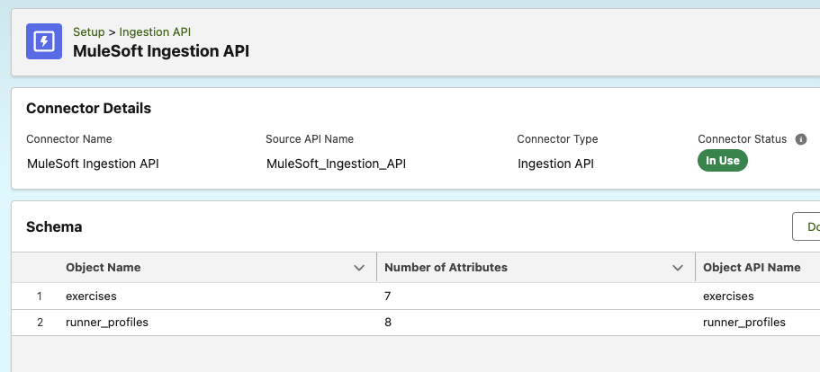

Click on **Save**.

> [!IMPORTANT]
> Whichever object you wish to insert/delete records to, will be used as the `objectName` query parameter to call the Mule application. In this case, the correct value(s) would be `runner_profiles` or `exercises`.

## Data Stream settings

Exit the Setup page or go back to the main page after logging in to Salesforce. Click on the apps button at the top-left of the screen and search for **Data Cloud**. Click on the app.

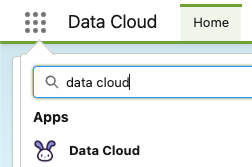

Select the **Data Streams** tab from the top. Click **New**.

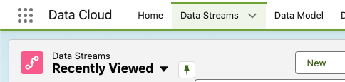

Select **Ingestion API** and click **Next**.

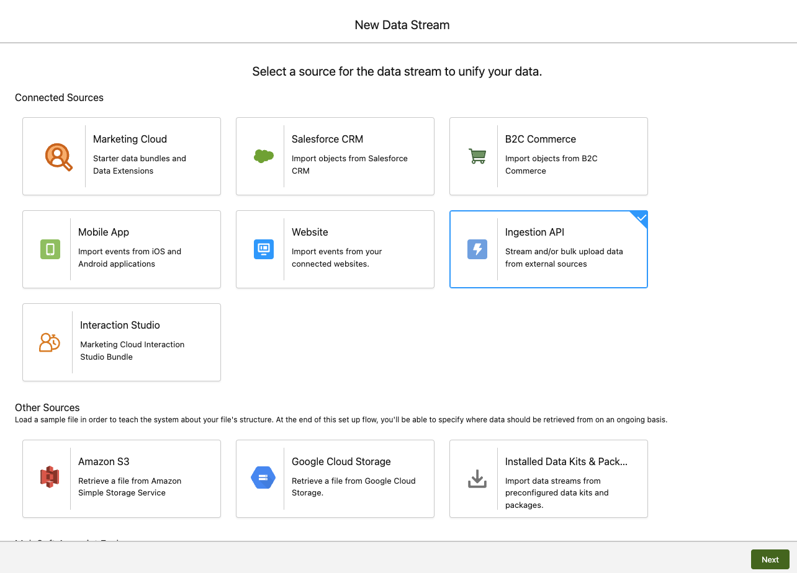

Select your **MuleSoft Ingestion API** from the dropdown. Select all the objects and click on **Next**.

- In the `exercises` configuration, select Category **Profile** and Primary Key `maid`
- In the `runner_profiles` configuration, select Category **Profile** and Primary Key `maid`

Click **Next**. Select the **default** Data Space and click **Deploy**.

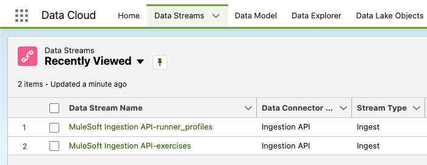

If you used the example YAML schema, you should have ended up with something like the following.

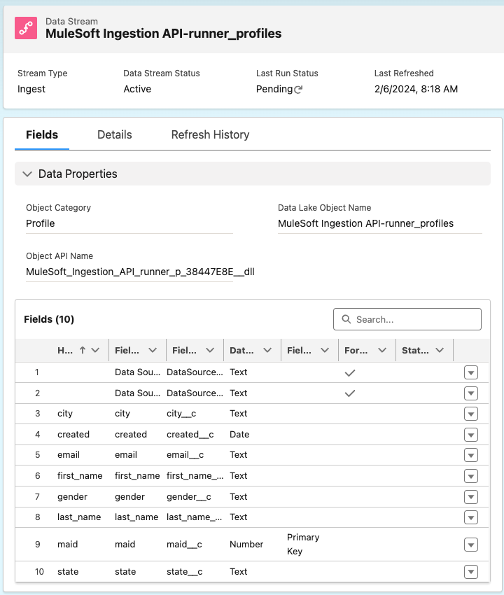

> [!NOTE]
> In this Data Stream, we selected `maid` as the Primary Key. This is the field we're going to need per record to delete them using the Mule app.

## Conclusion

After finishing this configuration in Salesforce/Data Cloud, you should now have the following data that you will use later when calling the integration.

| **Field** | **Value** |
|---|---|
| `salesforce.username` | The username you used to log in to Salesforce at [login.salesforce.com](http://login.salesforce.com) |
| `salesforce.password` | The password you used to log in to Salesforce at [login.salesforce.com](http://login.salesforce.com) |
| `cdp.consumer.key` | The Consumer Key you generated from the Connected App |
| `cdp.consumer.secret` | The Consumer Key you generated from the Connected App |
| `sourceApiName` | The Source API Name from the Ingestion API (`MuleSoft_Ingestion_API`) |
| `objectName` | The objects created from the YAML schema in the Ingestion API (`runner_profiles` or `exercises`) |
| Object ID / Primary Key | The field selected as Primary Key from the Data Stream settings (`maid`) |

Subscribe to receive notifications as soon as new content is published ✨

💬 Prost! 🍻
