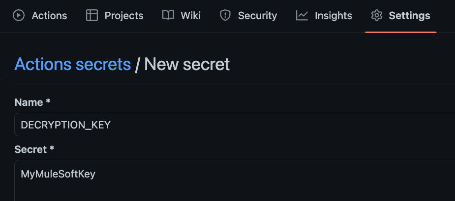

In the [previous article](https://www.prostdev.com/post/how-to-set-up-a-ci-cd-pipeline-to-deploy-your-mulesoft-apps-to-cloudhub-using-github-actions), we learned the basics to get started with a simple CI/CD pipeline to deploy a Mule application to CloudHub. We learned how to create Secrets in GitHub for your Anypoint Platform credentials, how to set up the `build.yml` file to set up the workflows, how to run the pipeline and the details of each of the steps in the pipeline. If you haven’t gone through that, I highly recommend you do. The steps for this post won’t be as detailed.

In this post, we’ll see the steps to create a pipeline with GitHub Actions that will decrypt your secured properties in your Mule application. If you don’t have secured properties in your application, you may not need this configuration.

## Prerequisites

You should already have all the setup in your Mule application for the secured properties. In summary, this is what you should already have:

- Your secure properties file(s) under `src/main/resources`
- Your encrypted properties (see [Encrypt Properties Using the Secure Properties Tool](https://docs.mulesoft.com/mule-runtime/latest/secure-configuration-properties#secure_props_tool))
- Your **Secure Properties Config** in Global Elements (`secure-properties:config`)
- The name of your decryption key property (i.e., `secure.key`)
- We recommend you add the key name to the `mule-artifact.json` file so it appears hidden in Runtime Manager (i.e., `"secureProperties": ["secure.key"]`)

> [!IMPORTANT]
> Make sure your Mule application is correctly configured and works locally before attempting to create the pipeline. Otherwise, you might encounter some issues.

## Set up your credentials

In your GitHub repository, go to the **Settings** tab (make sure you are signed in to see it). Now go to **Secrets and variables > Actions**. Here you will be able to set up your repository secrets.

In the previous tutorial, we added two credentials:

- `ANYPOINT_PLATFORM_PASSWORD`
- `ANYPOINT_PLATFORM_USERNAME`

For this part, we’re going to add a new one that will contain the decryption key.

Click on **New repository secret**. In the Name field, write `DECRYPTION_KEY`. In the Secret field, write the actual value of your key. For example, `MyMuleSoftKey`. Click **Add secret**.



You don’t have to change the name of this secret. We will keep it as-is because it will be used in the pipeline. I’ll show you later in the post where to modify the name of the property to match the one you have in your Mule application (like `secure.key`).

## Set up your repo

In the last post, we learned how to set up our `build.yml` file under `.github/workflows` for the actual pipelines in GitHub. This time, we are going to be using the same base file, just adding a few modifications to include the new decryption key.

You can copy and paste the following code into this file.

```yaml
name: Build and Deploy to Sandbox

on:
  push:
    branches: [ main ]
  pull_request:
    branches: [ main ]
    
jobs:
  build:
    runs-on: ubuntu-latest
    steps:
    - name: Checkout this repo
      uses: actions/checkout@v3
    - name: Cache dependencies
      uses: actions/cache@v3
      with:
        path: ~/.m2/repository
        key: ${{ runner.os }}-maven-${{ hashFiles('**/pom.xml') }}
        restore-keys: |
          ${{ runner.os }}-maven-
    - name: Set up JDK 1.8
      uses: actions/setup-java@v3
      with:
        distribution: 'zulu'
        java-version: 8
    - name: Build with Maven
      run: mvn -B package --file pom.xml
    - name: Stamp artifact file name with commit hash
      run: |
        artifactName1=$(ls target/*.jar | head -1)
        commitHash=$(git rev-parse --short "$GITHUB_SHA")
        artifactName2=$(ls target/*.jar | head -1 | sed "s/.jar/-$commitHash.jar/g")
        mv $artifactName1 $artifactName2
    - name: Upload artifact 
      uses: actions/upload-artifact@v3
      with:
          name: artifacts
          path: target/*.jar
        
  deploy:
    needs: build
    runs-on: ubuntu-latest
    steps:    
    - name: Checkout this repo
      uses: actions/checkout@v3
    - name: Cache dependencies
      uses: actions/cache@v3
      with:
        path: ~/.m2/repository
        key: ${{ runner.os }}-maven-${{ hashFiles('**/pom.xml') }}
        restore-keys: |
          ${{ runner.os }}-maven-
    - uses: actions/download-artifact@v3
      with:
        name: artifacts
    - name: Deploy to Sandbox
      env:
        USERNAME: ${{ secrets.anypoint_platform_username }}
        PASSWORD: ${{ secrets.anypoint_platform_password }}
        KEY: ${{ secrets.decryption_key }}
      run: |
        artifactName=$(ls *.jar | head -1)
        mvn deploy -DmuleDeploy \
         -Dmule.artifact=$artifactName \
         -Danypoint.username="$USERNAME" \
         -Danypoint.password="$PASSWORD" \
         -Ddecryption.key="$KEY"
```

As you can see, we added a new `KEY` variable that will get the decryption key from our secrets; and we are sending a `-Ddecryption.key` parameter into the maven command.

> [!NOTE]
> If you add this manually to the maven command, don’t forget to add a backslash (`\`) in the previous line.

## Modify your pom.xml

Go to your Mule application’s `pom.xml` file and locate the `cloudHubDeployment` configuration. You will need to add the following property:

> [!NOTE]
> this is where the name of your actual property needs to be set. In our example, we are using `secure.key`. Modify this field to match the name of your property, but keep the `decryption.key` since we’re using that in the GitHub Action pipeline.

```xml
<properties>
  <secure.key>${decryption.key}</secure.key>
</properties>
```

Your configuration should look something like this:

```xml
  <build>
    <plugins>
      <plugin>
        <groupId>org.apache.maven.plugins</groupId>
        <artifactId>maven-clean-plugin</artifactId>
        <version>3.0.0</version>
      </plugin>
      <plugin>
        <groupId>org.mule.tools.maven</groupId>
        <artifactId>mule-maven-plugin</artifactId>
        <version>${mule.maven.plugin.version}</version>
        <extensions>true</extensions>
        <configuration>
          <cloudHubDeployment>
            <uri>https://anypoint.mulesoft.com</uri>
            <muleVersion>${app.runtime}</muleVersion>
            <username>${anypoint.username}</username>
            <password>${anypoint.password}</password>
            <applicationName>${app.name}</applicationName>
            <environment>${env}</environment>
            <workerType>MICRO</workerType>
            <region>us-east-2</region>
            <workers>1</workers>
            <objectStoreV2>true</objectStoreV2>
            <!-- Start: SECURED PROPERTIES CI/CD -->
            <properties>
              <secure.key>${decryption.key}</secure.key>
            </properties>
            <!-- End: SECURED PROPERTIES CI/CD -->
          </cloudHubDeployment>
          <classifier>mule-application</classifier>
        </configuration>
      </plugin>
    </plugins>
  </build>
```

That’s all! Once you send these changes to the main branch, your pipeline will start running and deploying to CloudHub.

## More resources

You can check out my [GitHub profile](https://github.com/alexandramartinez) for more CI/CD repos:

- [github-actions](https://github.com/alexandramartinez/github-actions) to deploy a Mule app to CloudHub
- [dataweave-utilities-library](https://github.com/alexandramartinez/dataweave-utilities-library) to publish a DataWeave library to Exchange
- [api-catalog-cli-example](https://github.com/alexandramartinez/api-catalog-cli-example) to update APIs in Exchange using the API Catalog CLI

I hope this was helpful!

Don't forget to subscribe so you don't miss any future content.
