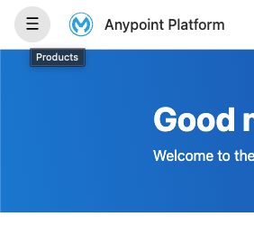
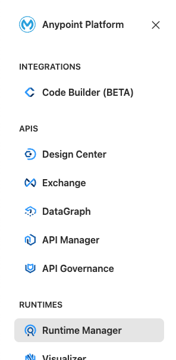
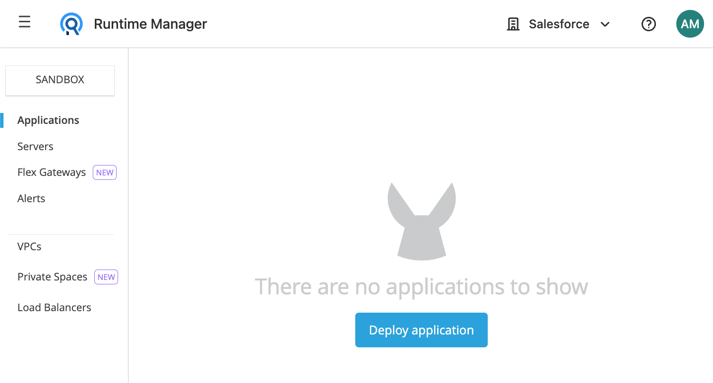
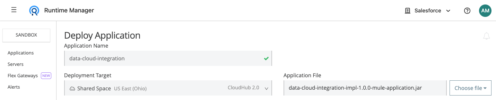
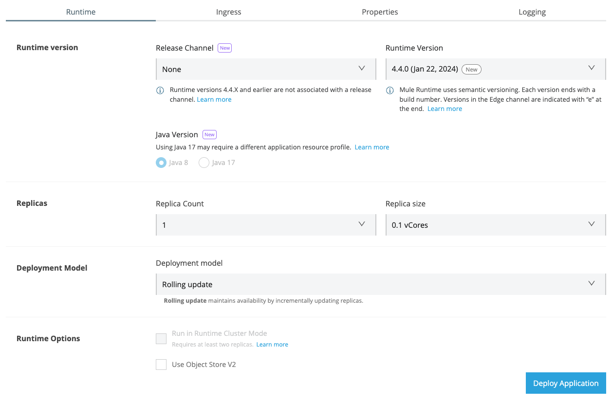
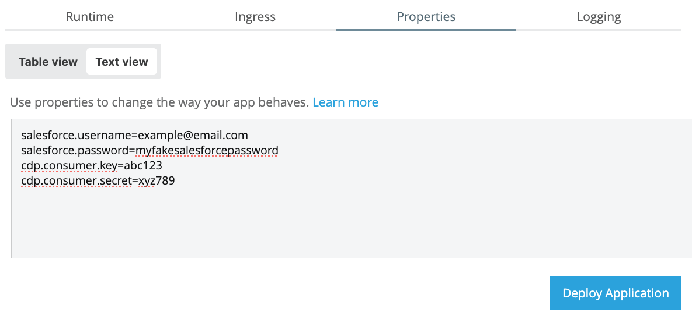
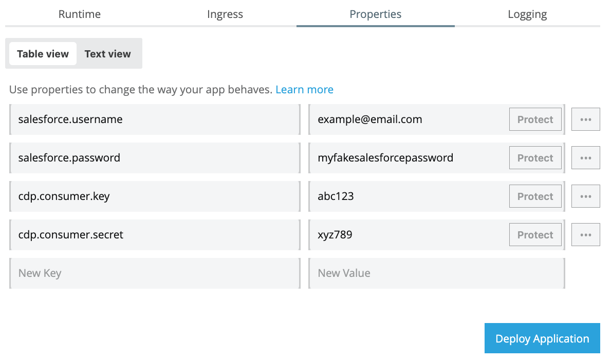
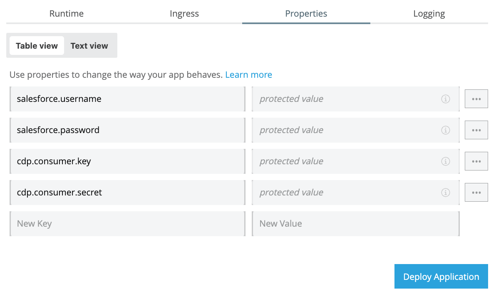
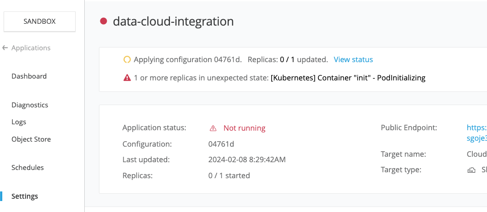
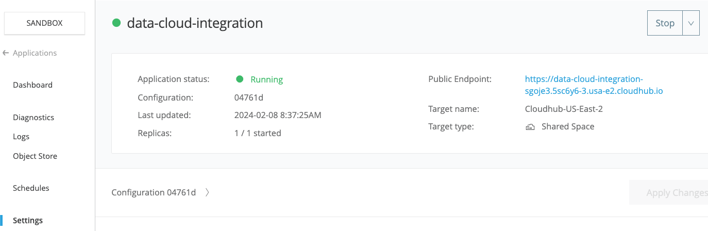

A little bird told me that deleting records in Data Cloud is actually not that easy to do. So, I did my research and came up with a Mule application for you all to reuse to (hopefully) make your lives easier when dealing with Data Cloud!

In this second part, we'll go through the MuleSoft side of the integration and you'll deploy your own Mule app to CloudHub. You do not have to know MuleSoft beforehand. I will guide you through every step.

## Prerequisites

- **Anypoint Platform** - You should have an Anypoint Platform account. You can create a new free trial account [here](https://anypoint.mulesoft.com/login/signup). It will expire in 30 days but you can create a new one using the same details to register, just making sure to change the username to a different one.
- **Mule app's JAR** - You will need to download the Mule application in a JAR format. You can find the releases for this Mule project [here](https://github.com/alexandramartinez/datacloud-mulesoft-integration/releases). By the time this post was created, the latest release was v1.0.0. However, if there is new functionality added later, it might be better for you to use the latest version.
- **Salesforce credentials** - Make sure you followed the [previous post](https://www.prostdev.com/post/part-1-data-cloud-mulesoft-integration) because you will need some of those credentials to follow this post. You will need:
  - `salesforce.username` - The username you use to log in to [Salesforce](https://login.salesforce.com/)
  - `salesforce.password` - The password you use to log in to [Salesforce](https://login.salesforce.com/)
  - `cdp.consumer.key` - The Consumer Key for the Connected App you created in Salesforce
  - `cdp.consumer.secret` - The Consumer Secret for the Connected App you created in Salesforce

## Deploy application

Sign in to your [Anypoint Platform](https://anypoint.mulesoft.com/) account and navigate to Runtime Manager from the left-hand side menu.





If this is your first time opening Runtime Manager, you will be asked to choose an environment. Choose **Sandbox**. Once inside, click on the blue **Deploy application** button.



Add any application name—for example, `data-cloud-integration`.

**CloudHub 2.0** should be selected by default under Deployment Target, if not, please select it.

Under Application File, select **Choose file** > **Upload File** and select the JAR file you downloaded from the Prerequisites.



> [!NOTE]
> We will deploy to CloudHub 2.0, but if you're deploying to CloudHub 1.0, the application name has to be unique across all applications worldwide. If the application name is not available, you can add your username at the end to make it unique. For example: `data-cloud-integration-amartinez`.

## Runtime tab

Under the **Runtime** tab (which should be already open), make sure the Release Channel is set to **None** so we can select the Runtime Version **4.4.0**.

You can experiment with different runtimes if you want! However, when this app was created and this post was published, I used version 4.4.0. I'll document in future versions of the JAR file if a new runtime is supported.

> [!NOTE]
> If you use the JAR version 2.1.0 or newer, you can select the runtime 4.7.0 and/or Java 11/17.

You can leave the rest of the settings with the default values.



## Properties tab

Now go to the **Properties** tab. Click on the **Text view** switch so you can copy and paste the following properties (add your actual credentials for each property):

```properties
salesforce.username=your_username
salesforce.password=your_password
cdp.consumer.key=your_key
cdp.consumer.secret=your_secret
anypoint.platform.gatekeeper=disabled
```

> [!NOTE]
> The last property, `anypoint.platform.gatekeeper` has to be added for the JAR version 2.0.0 and newer. You can skip it if you're using the 1.0.0 version.



Switch back to the **Table view** and click on the **Protect** button next to each of the values (this button is only available for CloudHub 2.0).



Now your credentials are not visible for added security. After this, click on **Deploy Application**. There is no need to modify the Ingress or Logging tabs.



## Copy the URL

Wait a few seconds for the JAR file to be uploaded. After this, you might see your app has a 🔴 red circle. Don't worry about this. If you go to the **Settings** tab you will see the yellow circle saying the configuration is still being applied. Wait a few more minutes until it's deployed 🟢 (green circle). It can take up to 10 minutes.



Once the app has been deployed and the Application Status says 🟢 Running, you can retrieve the **public endpoint**/URL from either the **Settings** or the **Dashboard** tab.



Copy this URL. We will use it in the next article to call the integration.

> [!CAUTION]
> **DO NOT** share this URL publicly. Anyone with this URL will be able to access your Data Cloud API (my URL from the previous screenshot is no longer available).
>
> If you wish to create a new URL, you will have to delete this app from the Settings tab (where it says Stop at the top-right) and deploy a new one with a new name following the same steps.
>
> You can **Stop** and **Start** your app only when you are using it to avoid unwanted requests.

## Conclusion

After you follow all these steps, you should now have the public endpoint/URL that we will use to call our Mule application. The Mule app will then connect with Data Cloud using the credentials we provided in the settings.

Subscribe to receive notifications as soon as new content is published ✨

💬 Prost! 🍻
