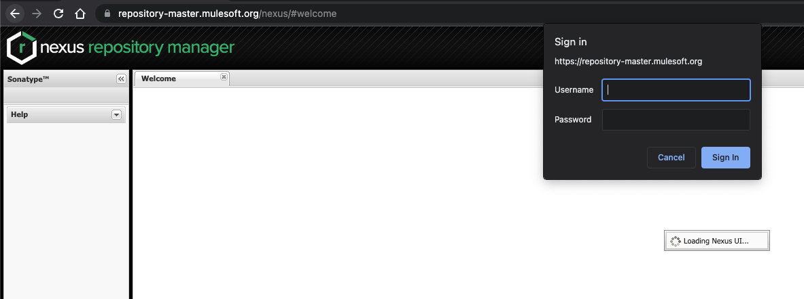
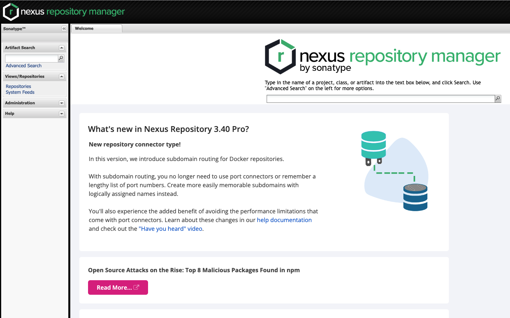
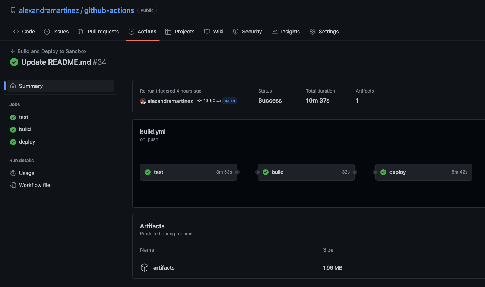

In the [previous article](https://www.prostdev.com/post/part-2-ci-cd-pipeline-with-mulesoft-and-github-actions-secured-encrypted-properties), we learned how to add a decryption key to your CI/CD pipeline to be able to decrypt your encrypted properties at runtime. If you haven’t been following the series or you’re not familiar with GitHub Actions, we recommend you start from the [first article](https://www.prostdev.com/post/how-to-set-up-a-ci-cd-pipeline-to-deploy-your-mulesoft-apps-to-cloudhub-using-github-actions) to understand how we are setting up all the configurations we need.

In this post, we’ll see the steps to create a pipeline with GitHub Actions that will run the MUnit tests you have set up in your Mule project.

> [!NOTE]
> We will talk about coverage percentage in the next article. We’ll only focus on creating the basic testing configuration in this post.

## Prerequisites

You should already have all the setup in your Mule application for running the MUnits. In summary, this is what you should already have:

- The required dependencies, plugins, or properties in your `pom.xml` to be able to run MUnits for your Mule project.
- The working MUnit tests under `src/test/munit`.
- Enterprise Nexus credentials to run the MUnits in the CI/CD pipeline. For more information see [this question](https://help.mulesoft.com/s/question/0D52T000064SVU4SAO/anypoint-platform-credentials-and-nexus). Note that we didn’t need these credentials before but we need them to be able to run the tests because of some dependencies.

> [!IMPORTANT]
> Make sure your MUnit tests work locally (from Anypoint Studio) before attempting to create the pipeline. Otherwise, you might encounter some issues.

> [!NOTE]
> You do not need Nexus credentials to run the MUnits from Studio, only to run them with Maven.

## Set up your credentials

In your GitHub repository, go to the **Settings** tab (make sure you are signed in to see it). Now go to **Secrets and variables > Actions**. Here you will be able to set up your repository secrets.

In the previous articles, we added the following actions secrets:

- `ANYPOINT_PLATFORM_PASSWORD`
- `ANYPOINT_PLATFORM_USERNAME`
- `DECRYPTION_KEY`

For this post, we’re going to add two more secrets for the nexus credentials:

- `NEXUS_USERNAME`
- `NEXUS_PASSWORD`

Click on **New repository secret**. In the Name field, write the name of the secret. In the Secret field, write the actual value of your key (your Nexus username/password). Click **Add secret**.

Please make sure your Nexus credentials are valid before continuing. To verify this, go to [this site](https://repository-master.mulesoft.org/nexus/#welcome) and sign in.



You should be able to see the welcome page after logging in.



## Set up your build.yml

In the last posts, we set up and modified our `build.yml` file under `.github/workflows`. This time, we are going to be using the same base file, just adding a few modifications to include the new configuration.

You can copy and paste the following code into this file.

```yaml
name: Build and Deploy to Sandbox

on:
  push:
    branches: [ main ]
  pull_request:
    branches: [ main ]
    
jobs:
  test:
    runs-on: ubuntu-latest
    steps:
    - name: Checkout this repo
      uses: actions/checkout@v3
    - name: Cache dependencies
      uses: actions/cache@v3
      with:
        path: ~/.m2/repository
        key: ${{ runner.os }}-maven-${{ hashFiles('**/pom.xml') }}
        restore-keys: |
          ${{ runner.os }}-maven-
    - name: Set up JDK 1.8
      uses: actions/setup-java@v3
      with:
        distribution: 'zulu'
        java-version: 8
    - name: Test with Maven
      env:
        nexus_username: ${{ secrets.nexus_username }}
        nexus_password: ${{ secrets.nexus_password }}
        KEY: ${{ secrets.decryption_key }}
      run: mvn test --settings .maven/settings.xml -Dsecure.key="$KEY"

  build:
    needs: test
    runs-on: ubuntu-latest
    steps:
    - name: Checkout this repo
      uses: actions/checkout@v3
    - name: Cache dependencies
      uses: actions/cache@v3
      with:
        path: ~/.m2/repository
        key: ${{ runner.os }}-maven-${{ hashFiles('**/pom.xml') }}
        restore-keys: |
          ${{ runner.os }}-maven-
    - name: Set up JDK 1.8
      uses: actions/setup-java@v3
      with:
        distribution: 'zulu'
        java-version: 8
    - name: Build with Maven
      run: mvn -B package --file pom.xml -DskipMunitTests
    - name: Stamp artifact file name with commit hash
      run: |
        artifactName1=$(ls target/*.jar | head -1)
        commitHash=$(git rev-parse --short "$GITHUB_SHA")
        artifactName2=$(ls target/*.jar | head -1 | sed "s/.jar/-$commitHash.jar/g")
        mv $artifactName1 $artifactName2
    - name: Upload artifact 
      uses: actions/upload-artifact@v3
      with:
          name: artifacts
          path: target/*.jar
        
  deploy:
    needs: build
    runs-on: ubuntu-latest
    steps:    
    - name: Checkout this repo
      uses: actions/checkout@v3
    - name: Cache dependencies
      uses: actions/cache@v3
      with:
        path: ~/.m2/repository
        key: ${{ runner.os }}-maven-${{ hashFiles('**/pom.xml') }}
        restore-keys: |
          ${{ runner.os }}-maven-
    - uses: actions/download-artifact@v3
      with:
        name: artifacts
    - name: Deploy to Sandbox
      env:
        USERNAME: ${{ secrets.anypoint_platform_username }}
        PASSWORD: ${{ secrets.anypoint_platform_password }}
        KEY: ${{ secrets.decryption_key }}
      run: |
        artifactName=$(ls *.jar | head -1)
        mvn deploy -DskipMunitTests -DmuleDeploy \
         -Dmule.artifact=$artifactName \
         -Danypoint.username="$USERNAME" \
         -Danypoint.password="$PASSWORD" \
         -Ddecryption.key="$KEY"
```

As you can see, we added a new `test` job that will run the MUnits before continuing with the rest of the jobs (build/deploy). We have seen the first steps before with the other two jobs, but the last step is different from what we’ve seen before. We also added the line `needs: test` under the build job so the jobs run synchronously. Finally, we added `-DskipMunitTests` to the two maven commands from build and deploy. Since we are running the tests on the first step, there’s no need to re-run them after that.

The `nexus_username` and `nexus_password` are being passed as environment variables implicitly. While the `KEY` variable is being used in the maven command. Let’s take a closer look at the maven command.

```bash
mvn test --settings .maven/settings.xml -Dsecure.key="$KEY"
```

Since we are using a specific configuration in our `settings.xml` to include the Nexus repository/credentials, we will be adding this file directly to the project (without hardcoding the credentials!!). We’ll see this configuration next.

⚠️ Another **important** change in this command is that this time we are sending the Mule property directly. In the previous post, we saw the decryption key property was called `secure.key`. If your property within the Mule project is named differently, please update this command appropriately.

## Set up your settings.xml

As we just mentioned, we hadn’t created a `settings.xml` in the project before. Mainly because there was no need to do so. This time, since we’re using enterprise Nexus credentials to run the MUnit tests with Maven, we do need to set up specific credentials, profiles, and repositories.

To start, create a new `.maven` folder at the root of your project. Inside this folder, create a `settings.xml` file. For example, this is how my folder structure looks like:

```
github-actions/
  - .github/
  - .maven/
    - settings.xml
  - src/
  - mule-artifact.json
  - pom.xml
```

Now copy and paste the following file. There’s no need to modify anything (just make sure the name is `settings.xml`).

```xml
<?xml version="1.0"?>
<settings>

  <pluginGroups>
    <pluginGroup>org.mule.tools</pluginGroup>
  </pluginGroups>

  <servers>
    <server>
      <id>MuleRepository</id>
      <username>${nexus_username}</username>
      <password>${nexus_password}</password>
    </server>
  </servers>

  <profiles>
    <profile>
      <id>Mule</id>
      <activation>
        <activeByDefault>true</activeByDefault>
      </activation>
      <repositories>
        <repository>
          <id>MuleRepository</id>
          <name>MuleRepository</name>
          <url>https://repository.mulesoft.org/nexus-ee/content/repositories/releases-ee/</url>
          <layout>default</layout>
          <releases>
            <enabled>true</enabled>
          </releases>
          <snapshots>
            <enabled>true</enabled>
          </snapshots>
        </repository>     
      </repositories>
    </profile>
  </profiles>
</settings>
```

As you can see, the Nexus username and password credentials match the environment variables we are sending through the `build.yml` file.

> [!DOCS]
> For more information, see [Configuring Maven to Work with Mule](https://docs.mulesoft.com/mule-runtime/3.9/configuring-maven-to-work-with-mule-esb).

## Modify your pom.xml

This time there’s nothing to add to your `pom.xml` file. The MUnit dependencies and needed configuration should be added automatically by MuleSoft once you add the tests to your code. However, here’s my project’s pom in case you want to compare it with yours:

```xml
<?xml version="1.0" encoding="UTF-8"?>
<project xmlns="http://maven.apache.org/POM/4.0.0" xmlns:xsi="http://www.w3.org/2001/XMLSchema-instance" xsi:schemaLocation="http://maven.apache.org/POM/4.0.0 https://maven.apache.org/xsd/maven-4.0.0.xsd">
	<modelVersion>4.0.0</modelVersion>

	<groupId>com.mycompany</groupId>
	<artifactId>github-actions</artifactId>
	<version>1.0.0-SNAPSHOT</version>
	<packaging>mule-application</packaging>

	<name>github-actions</name>

	<properties>
		<project.build.sourceEncoding>UTF-8</project.build.sourceEncoding>
		<project.reporting.outputEncoding>UTF-8</project.reporting.outputEncoding>

		<app.runtime>4.4.0</app.runtime>
		<mule.maven.plugin.version>3.8.0</mule.maven.plugin.version>
		<app.name>amartinez-github-actions</app.name>
		<env>Sandbox</env>
		<!-- Start: MUnits -->
		<munit.version>2.3.13</munit.version>
		<!-- End: MUnits -->
	</properties>

	<build>
		<plugins>
			<plugin>
				<groupId>org.apache.maven.plugins</groupId>
				<artifactId>maven-clean-plugin</artifactId>
				<version>3.0.0</version>
			</plugin>
			<plugin>
				<groupId>org.mule.tools.maven</groupId>
				<artifactId>mule-maven-plugin</artifactId>
				<version>${mule.maven.plugin.version}</version>
				<extensions>true</extensions>
				<configuration>
					<cloudHubDeployment>
						<uri>https://anypoint.mulesoft.com</uri>
						<muleVersion>${app.runtime}</muleVersion>
						<username>${anypoint.username}</username>
						<password>${anypoint.password}</password>
						<applicationName>${app.name}</applicationName>
						<environment>${env}</environment>
						<workerType>MICRO</workerType>
						<region>us-east-2</region>
						<workers>1</workers>
						<objectStoreV2>true</objectStoreV2>
						<!-- Start: SECURED PROPERTIES CI/CD -->
						<!-- Make sure `secure.key` matches with your property in the Mule app -->
						<properties>
							<secure.key>${decryption.key}</secure.key>
						</properties>
						<!-- End: SECURED PROPERTIES CI/CD -->
					</cloudHubDeployment>
					<classifier>mule-application</classifier>
				</configuration>
			</plugin>
			<!-- Start: MUnits -->
			<plugin>
				<groupId>com.mulesoft.munit.tools</groupId>
				<artifactId>munit-maven-plugin</artifactId>
				<version>${munit.version}</version>
				<executions>
					<execution>
						<id>test</id>
						<phase>test</phase>
						<goals>
							<goal>test</goal>
							<goal>coverage-report</goal>
						</goals>
					</execution>
				</executions>
				<configuration>
					<coverage>
						<runCoverage>true</runCoverage>
						<formats>
							<format>html</format>
						</formats>
					</coverage>
				</configuration>
			</plugin>
			<!-- End: MUnits -->
		</plugins>
	</build>

	<dependencies>
		<dependency>
			<groupId>org.mule.connectors</groupId>
			<artifactId>mule-http-connector</artifactId>
			<version>1.6.0</version>
			<classifier>mule-plugin</classifier>
		</dependency>
		<dependency>
			<groupId>org.mule.connectors</groupId>
			<artifactId>mule-sockets-connector</artifactId>
			<version>1.2.2</version>
			<classifier>mule-plugin</classifier>
		</dependency>
		<!-- Start: SECURED PROPERTIES CI/CD -->
		<!-- This dependency should be added to configure the global elements in your Mule app -->
		<dependency>
			<groupId>com.mulesoft.modules</groupId>
			<artifactId>mule-secure-configuration-property-module</artifactId>
			<version>1.2.5</version>
			<classifier>mule-plugin</classifier>
		</dependency>
		<!-- End: SECURED PROPERTIES CI/CD -->
		<!-- Start: MUnits -->
		<dependency>
			<groupId>com.mulesoft.munit</groupId>
			<artifactId>munit-runner</artifactId>
			<version>2.3.13</version>
			<classifier>mule-plugin</classifier>
			<scope>test</scope>
		</dependency>
		<dependency>
			<groupId>com.mulesoft.munit</groupId>
			<artifactId>munit-tools</artifactId>
			<version>2.3.13</version>
			<classifier>mule-plugin</classifier>
			<scope>test</scope>
		</dependency>
		<dependency>
			<groupId>org.mule.weave</groupId>
			<artifactId>assertions</artifactId>
			<version>1.0.2</version>
			<scope>test</scope>
		</dependency>
		<!-- End: MUnits -->
	</dependencies>

	<repositories>
		<repository>
			<id>anypoint-exchange-v3</id>
			<name>Anypoint Exchange</name>
			<url>https://maven.anypoint.mulesoft.com/api/v3/maven</url>
			<layout>default</layout>
		</repository>
		<repository>
			<id>mulesoft-releases</id>
			<name>MuleSoft Releases Repository</name>
			<url>https://repository.mulesoft.org/releases/</url>
			<layout>default</layout>
		</repository>
	</repositories>

	<pluginRepositories>
		<pluginRepository>
			<id>mulesoft-releases</id>
			<name>MuleSoft Releases Repository</name>
			<layout>default</layout>
			<url>https://repository.mulesoft.org/releases/</url>
			<snapshots>
				<enabled>false</enabled>
			</snapshots>
		</pluginRepository>
	</pluginRepositories>

</project>
```

## Run the pipeline

That’s it! Once you’re done with the changes, simply push a new change to the **main** branch and this will trigger the pipeline.



## More resources

You can check out my [GitHub profile](https://github.com/alexandramartinez) for more CI/CD repos:

- [github-actions](https://github.com/alexandramartinez/github-actions) to deploy a Mule app to CloudHub
- [dataweave-utilities-library](https://github.com/alexandramartinez/dataweave-utilities-library) to publish a DataWeave library to Exchange
- [api-catalog-cli-example](https://github.com/alexandramartinez/api-catalog-cli-example) to update APIs in Exchange using the API Catalog CLI

I hope this was helpful!

Don't forget to subscribe so you don't miss any future content.
