A little bird told me that deleting records in Data Cloud is actually not that easy to do. So, I did my research and came up with a Mule application for you all to reuse to (hopefully) make your lives easier when dealing with Data Cloud!

In this third part, we'll learn how to use our integration. We'll use [Postman](https://www.postman.com/) for this article, but you can use any other REST client like [Thunder Client](https://www.thunderclient.com/), [cURL](https://curl.se/), or [Advanced REST Client](https://www.advancedrestclient.com/).

## Prerequisites

- **Postman collection** - Download the Postman collection from [this link](https://github.com/alexandramartinez/datacloud-mulesoft-integration/tree/main/rest-clients-requests/postman). You can also find other collections/requests [here](https://github.com/alexandramartinez/datacloud-mulesoft-integration/tree/main/rest-clients-requests).
- **Postman** - Make sure you download [Postman](https://www.postman.com/). You can also use the web version by creating a Postman account, instead of installing the app locally.
- **Mule app URL** - By the end of the [previous article](https://www.prostdev.com/post/part-2-data-cloud-mulesoft-integration), we retrieved the public Endpoint/URL of our deployed Mule application. Make sure you have this before starting.

## Import the collection

In Postman, make sure you're located inside the **Collections** tab and click the **Import** button.

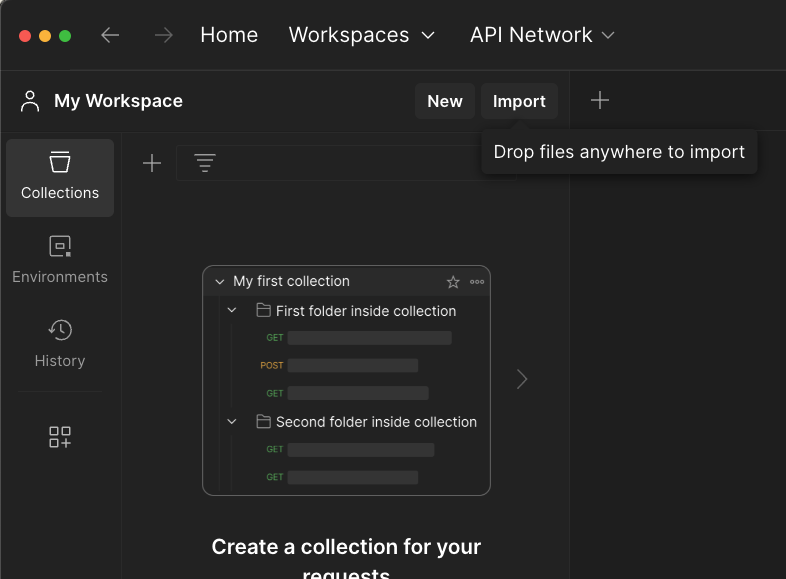

Select the Postman collection you downloaded from the Prerequisites. After you import it, you should now have something like the following.

> [!NOTE]
> The following screenshot contains only the **Streaming** insert/delete operations (from when the post was created). The **Bulk** operations are introduced after the JAR version 2.1.0, updated on July 2024.

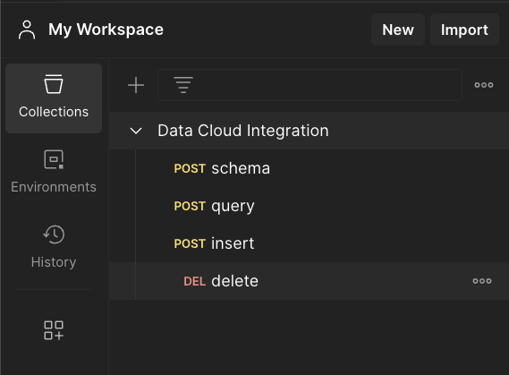

## Set up the environment

Select the **Environments** tab from the left (next to Collections). We could create a Global variable, but we're going to create a new environment to follow best practices. Click on **Create Environment**.

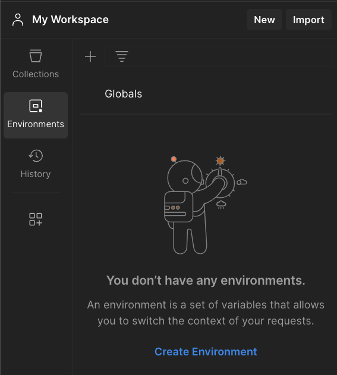

Let's name this environment **CloudHub**. Add a variable called **host** and the current value field will be your Mule app URL.

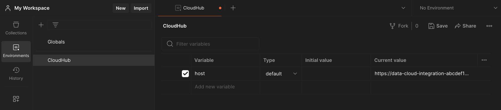

Save the variable by clicking on the **Save** button at the top-right. Select this new environment from the environment dropdown located at the top-right (over the Save button).

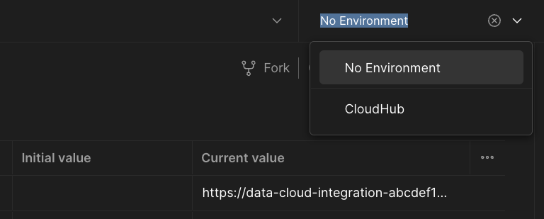

Go back to the **Collections** tab. You can now run the requests!

## schema

With this endpoint, you can send a JSON object to be transformed into the OpenAPI YAML schema. This is needed to create your Ingestion API and Data Stream in Data Cloud.

Because the Ingestion API doesn't accept nested objects on the schema, this endpoint will transform your multi-level object into the single level needed for Data Cloud.

For example, if you paste the following input payload under the **Body** tab of the request:

```json
{
  "customer": {
    "id": 1,
    "first_name": "Alex",
    "last_name": "Martinez",
    "email": "alex@sf.com",
    "address": {
      "street": "415 Mission Street",
      "city": "San Francisco",
      "state": "CA",
      "postalCode": "94105",
      "geo": {
        "lat": 37.78916,
        "lng": -122.39521
      }
    }
  }
}
```

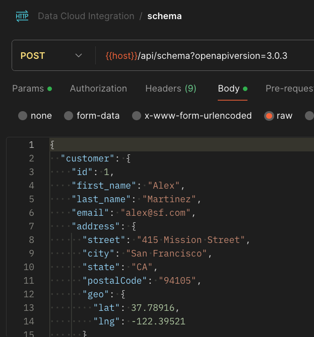

it would be first flattened and transformed into the following output:

```json
{
  "customer": {
    "id": 1,
    "first_name": "Alex",
    "last_name": "Martinez",
    "email": "alex@sf.com",
    "street": "415 Mission Street",
    "city": "San Francisco",
    "state": "CA",
    "postalCode": "94105",
    "lat": 37.78916,
    "lng": -122.39521
  }
}
```

then, based on this new input, you will receive the YAML schema like the following:

```yaml
openapi: 3.0.3
components:
  schemas:
    customer:
      type: object
      properties:
        id:
          type: number
        first_name:
          type: string
        last_name:
          type: string
        email:
          type: string
        street:
          type: string
        city:
          type: string
        state:
          type: string
        postalCode:
          type: string
        lat:
          type: number
        lng:
          type: number
```

If you want to change the OpenAPI version, you will have to set a different version using the openapiversion query parameter. To do this, go to the **Params** tab inside the request and modify the value.

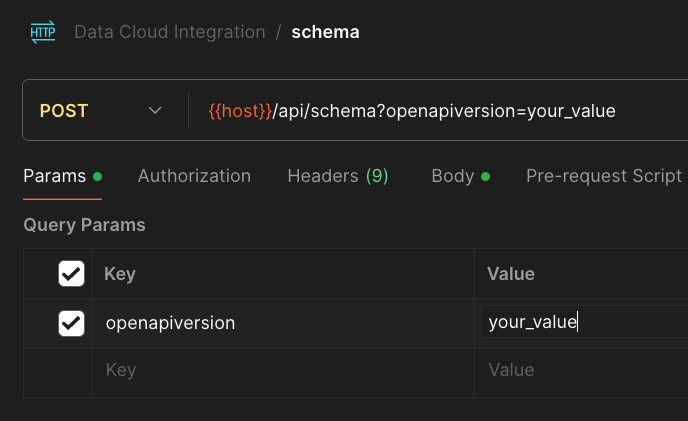

> [!NOTE]
> This is the only request that does not connect to Data Cloud and is not using your Data Cloud credentials. 

If you need to use this request before setting up your Salesforce configurations, you can go through the Mule app deployment (Part 2) and just input random credentials as a placeholder for the secured properties. You can modify them later in CloudHub.

## query

Send your SOQL query in the body of the request in a text/plain format. You can modify the query by going to the **Body** tab inside the request.

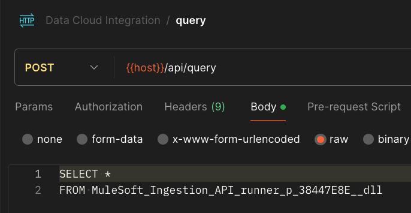

You will receive a JSON response with the result from Data Cloud. For example, from the previous query, you'd receive a JSON Array with the results of the SELECT:

```json
[
  {
    "DataSourceObject__c": "MuleSoft_Ingestion_API_runner_profiles_38447E8E",
    "DataSource__c": "MuleSoft_Ingestion_API_996db928_2078_4e3a_9c67_1c80b32790aa",
    "city__c": "Toronto",
    "created__c": "2017-07-21",
    "email__c": "alex@sf.com",
    "first_name__c": "Alex",
    "gender__c": "NB",
    "last_name__c": "Martinez",
    "maid__c": 1.000000000000000000,
    "state__c": "ON"
  }
]
```

If there are no records matching the query, you'll receive an empty array ([ ]).

## insert

Make sure you add the following query parameters (in the **Params** tab) to let Data Cloud know more information about where you want to insert new records:

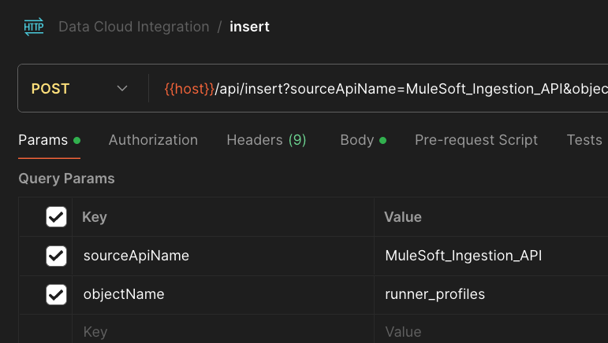

Next, in the body of the request (**Body** tab), make sure to use a JSON Array. Each Object inside this Array is a new record. For example:

```json
[
  {
    "maid": 1,
    "first_name": "Alex",
    "last_name": "Martinez",
    "email": "alex@sf.com",
    "gender": "NB",
    "city": "Toronto",
    "state": "ON",
    "created": "2017-07-21"
  }
]
```

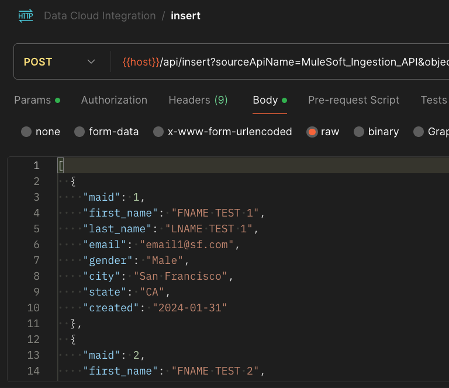

> [!IMPORTANT]
> Streaming in Data Cloud in limited to max 200 records per insertion.

If everything runs smoothly, you will receive a **200 - OK** successful response.

> [!NOTE]
> It may take a few minutes for your data to be updated in Data Cloud. You can manually check the records in Data Cloud or wait to attempt the `/query` from your MuleSoft API.

## delete

Make sure you add the following query parameters (in the **Params** tab) to let Data Cloud know more information about where you want to insert new records:

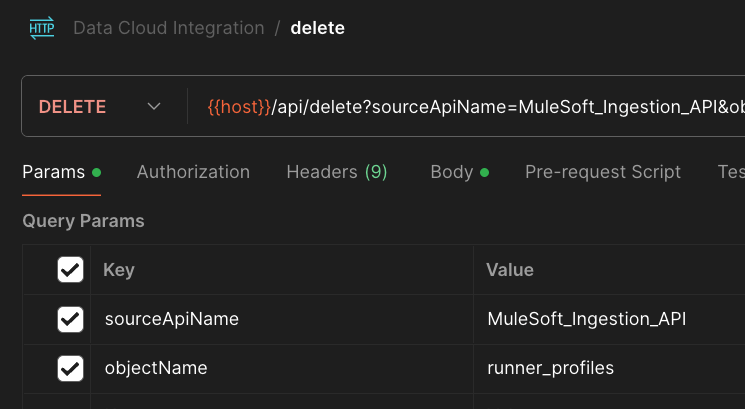

Next, in the body of the request, make sure to use a JSON Array. Each Object inside this Array is the Primary Key of the record to delete. For example:

```json
[
  1
]
```

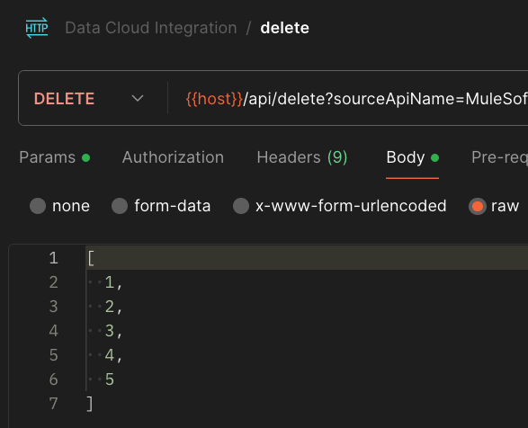

> [!IMPORTANT]
> Streaming in Data Cloud in limited to max 200 records per deletion.

If everything runs smoothly, you will receive a **200 - OK** successful response.

> [!NOTE]
> It may take a few minutes for your data to be updated in Data Cloud. You can manually check the records in Data Cloud or wait to attempt the /query from your MuleSoft API.

## Conclusion

That's it! That's all you need to know to get your Mule application going. I will be working on more enhancements to this app and I'll be writing more articles for you to learn how to implement/edit this code on your own.

Keep posted!

Subscribe to receive notifications as soon as new content is published ✨

💬 Prost! 🍻
