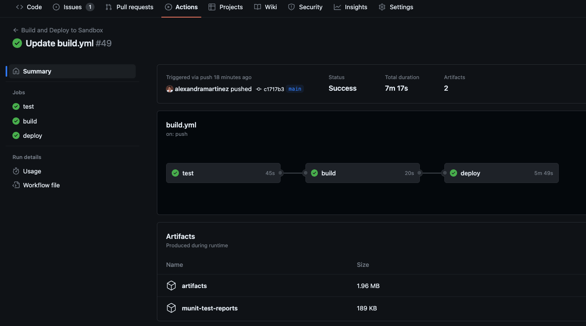

In the [previous article](https://www.prostdev.com/post/part-3-ci-cd-pipeline-with-mulesoft-and-github-actions-munit-testing), we learned how to set up our Nexus credentials to be able to run the MUnits from the CI/CD pipeline. If you haven’t been following the series or you’re not familiar with GitHub Actions, we recommend you start from the [first article](https://www.prostdev.com/post/how-to-set-up-a-ci-cd-pipeline-to-deploy-your-mulesoft-apps-to-cloudhub-using-github-actions) to understand how we are setting up all the configurations we need.

In this post, we’ll see the steps to add the minimum coverage percentage for the MUnit tests in order to pass the pipeline.

## Prerequisites

You should already have all the setup in your Mule application for running the MUnits in a CI/CD pipeline. In summary, this is what you should already have:

- The required dependencies, plugins, or properties in your `pom.xml` to be able to run MUnits for your Mule project.
- The working MUnit tests under `src/test/munit`.
- A working CI/CD pipeline. See the [previous article](https://www.prostdev.com/post/part-3-ci-cd-pipeline-with-mulesoft-and-github-actions-munit-testing) if you still need to set this up.

## Modify your pom.xml

This time there’s nothing to add/modify in the other files (`build.yml` / `settings.xml`). We’ll simply add the following configuration to our `pom.xml` under the existing `munit-maven-plugin` configuration.

```xml
<plugin>
  <groupId>com.mulesoft.munit.tools</groupId>
  <artifactId>munit-maven-plugin</artifactId>
  <version>${munit.version}</version>
  <executions>
    <execution>
      <id>test</id>
      <phase>test</phase>
      <goals>
        <goal>test</goal>
        <goal>coverage-report</goal>
      </goals>
    </execution>
  </executions>
  <configuration>
    <!-- START: MUnit coverage -->
    <environmentVariables>
      <secure.key>${decryption.key}</secure.key>
    </environmentVariables>
    <!-- END: MUnit coverage -->
    <coverage>
      <runCoverage>true</runCoverage>
      <!-- START: MUnit coverage -->
      <failBuild>true</failBuild>
      <requiredApplicationCoverage>90</requiredApplicationCoverage>
      <!-- <requiredResourceCoverage>50</requiredResourceCoverage> -->
      <!-- <requiredFlowCoverage>50</requiredFlowCoverage> -->
      <!-- END: MUnit coverage -->
      <formats>
        <!-- START: MUnit coverage -->
        <format>console</format>
        <format>sonar</format>
        <format>json</format>
        <!-- END: MUnit coverage -->
        <format>html</format>
      </formats>
    </coverage>
  </configuration>
</plugin>
```

Let’s explore each of the changes one by one. Starting with the `environmentVariables`.

```xml
<environmentVariables>
   <secure.key>${decryption.key}</secure.key>
</environmentVariables>
```

We are adding this variable right here because it needs to be passed down to the Mule application to be able to decrypt the existing secured properties.

> [!NOTE]
> If you’re not sure how to do this setup or want to understand where we are using the `secure.key` or `decryption.key`, please refer to [Part 2](https://www.prostdev.com/post/part-2-ci-cd-pipeline-with-mulesoft-and-github-actions-secured-encrypted-properties) of this series.

Next, we added the configuration to set the minimum coverage percentage for the application to pass the build.

```xml
<failBuild>true</failBuild>
<requiredApplicationCoverage>90</requiredApplicationCoverage>
<!-- <requiredResourceCoverage>50</requiredResourceCoverage> -->
<!-- <requiredFlowCoverage>50</requiredFlowCoverage> -->
```

In this case, we only set up the `requiredApplicationCoverage` option with a minimum percentage of 90. If you instead (or additional to) want to set up the percentage for the resources or the flows, you can use the other two options. To see the difference in these settings, you can refer to [this live stream](https://youtu.be/Z0ORL0yoKCo) or the [official documentation](https://docs.mulesoft.com/munit/latest/coverage-maven-concept#set-up-a-minimum-coverage-level).

Finally, you can generate different coverage reports to be able to see your statistics in several formats.

```xml
<formats>
	<format>console</format>
	<format>sonar</format>
	<format>json</format>
	<format>html</format>
</formats>
```

You can choose to generate some of them or all of them. Simply add/remove the `format` field from this configuration.

> [!DOCS]
> For more information, see [Coverage Report Types](https://docs.mulesoft.com/munit/latest/coverage-maven-concept#coverage-report-types).

> [!NOTE]
> If you want to be able to see your generated reports from the CI/CD pipeline, you can add the following configuration under the `test` job in your `build.yml` file. Add this as the last step. You will be able to download the reports after the whole pipeline has finished running (see the next screenshot).

```yaml
- name: Upload MUnit reports
  uses: actions/upload-artifact@v3
  with:
    name: munit-test-reports
    path: target/site/munit/coverage/
```

## Run the pipeline

That’s it! Once you’re done with the changes, simply push a new change to the **main** branch and this will trigger the pipeline.



## More resources

You can check out my [GitHub profile](https://github.com/alexandramartinez) for more CI/CD repos:

- [github-actions](https://github.com/alexandramartinez/github-actions) to deploy a Mule app to CloudHub
- [dataweave-utilities-library](https://github.com/alexandramartinez/dataweave-utilities-library) to publish a DataWeave library to Exchange
- [api-catalog-cli-example](https://github.com/alexandramartinez/api-catalog-cli-example) to update APIs in Exchange using the API Catalog CLI

I hope this was helpful!

Don't forget to subscribe so you don't miss any future content.
