We already finished our Data Cloud integration with MuleSoft. We have everything deployed and running in CloudHub, and we know how to call this integration to query, insert, or delete records from/to Data Cloud. However, our integration has a fatal flaw: we have no security.

In [Part 2](https://www.prostdev.com/post/part-2-data-cloud-mulesoft-integration) of this series, we learned that we should not share the CloudHub URL because everyone had access to our Data Cloud credentials with just the link.

There is a simple solution to this problem. In this post, we'll learn how to connect our Mule app (deployed in CloudHub) to API Manager to add basic authentication. This way, even if you share your URL by mistake, people would still need your username/password to access it.

## Prerequisites

- **Anypoint Platform** - You should have an Anypoint Platform account. You can create a new free trial account [here](https://anypoint.mulesoft.com/login/signup). It will expire in 30 days but you can create a new one using the same details to register, just making sure to change the username to a different one.
- **Deployed Mule app** - Make sure you followed [Part 2](https://www.prostdev.com/post/part-2-data-cloud-mulesoft-integration) of this series before starting. If you have already followed it and deployed version 1.0.0, I'll teach you how to update it to 2.0.0. If there are newer versions, feel free to use those.
- **Mule app's JAR** - If you deployed your app with version 1.0.0, make sure you download the version 2.0.0 JAR file. You can find the releases for this Mule project [here](https://github.com/alexandramartinez/datacloud-mulesoft-integration/releases).
- **Anypoint Platform's Environment Credentials** - In Anypoint Platform, go to Access Management > Business Groups > select your business group > Environments > Sandbox. Copy the Client ID and Client Secret. See the [docs](https://docs.mulesoft.com/access-management/environments#to-view-the-client-id-and-client-secret-for-an-environment) for more information.
- **Postman & the Postman collection** - You can use any other REST Client of your choice, but we used Postman in the [previous article](https://www.prostdev.com/post/part-3-data-cloud-mulesoft-integration), so we'll continue with it. You can download other collections from [this folder](https://github.com/alexandramartinez/datacloud-mulesoft-integration/tree/main/rest-clients-requests).

## Create API in API Manager

Sign in to your [Anypoint Platform](https://anypoint.mulesoft.com/) account and head to **API Manager** using the hamburger menu on the top left.

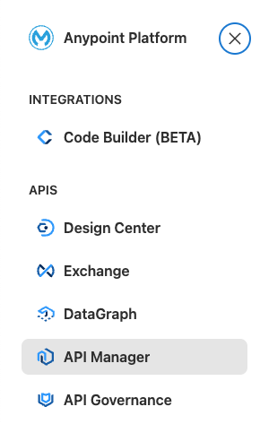

In API Manager, click **Add API** > **Add new API**.

In the Runtime section, select the **Mule Gateway** runtime and click on **Next**.

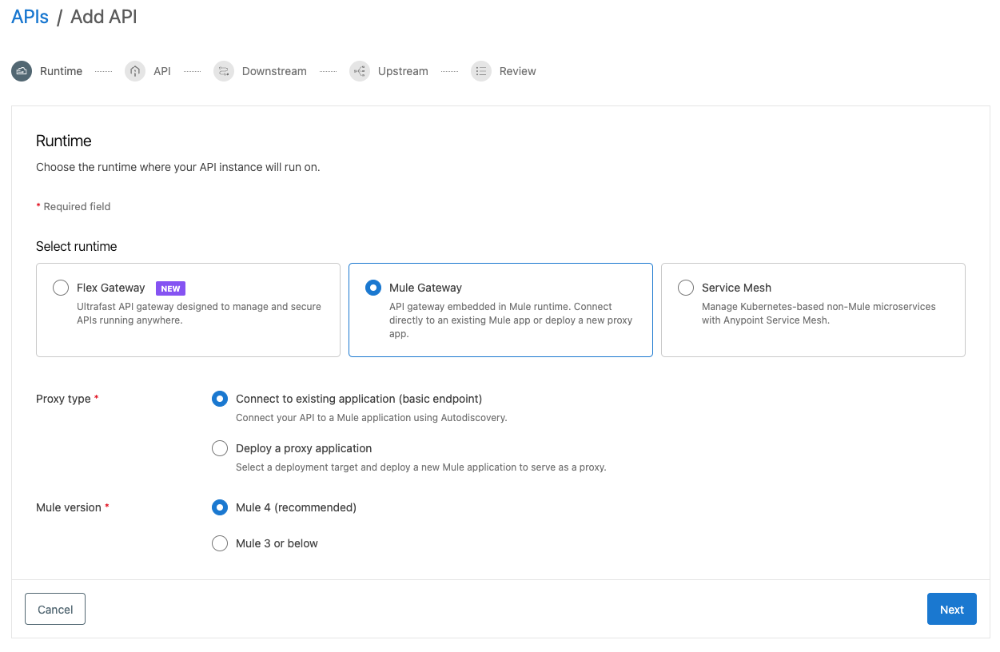

In the API section, select the **Create new API** option. Add the name **Data Cloud API** and the **HTTP API** asset type. Click on **Next**.

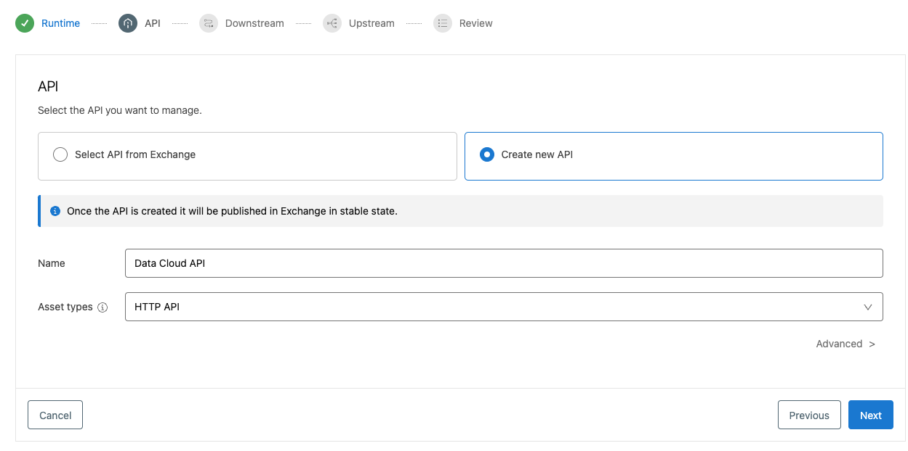

Leave the defaults for Downstream and Upstream (empty) and review the configurations. Click **Save**.

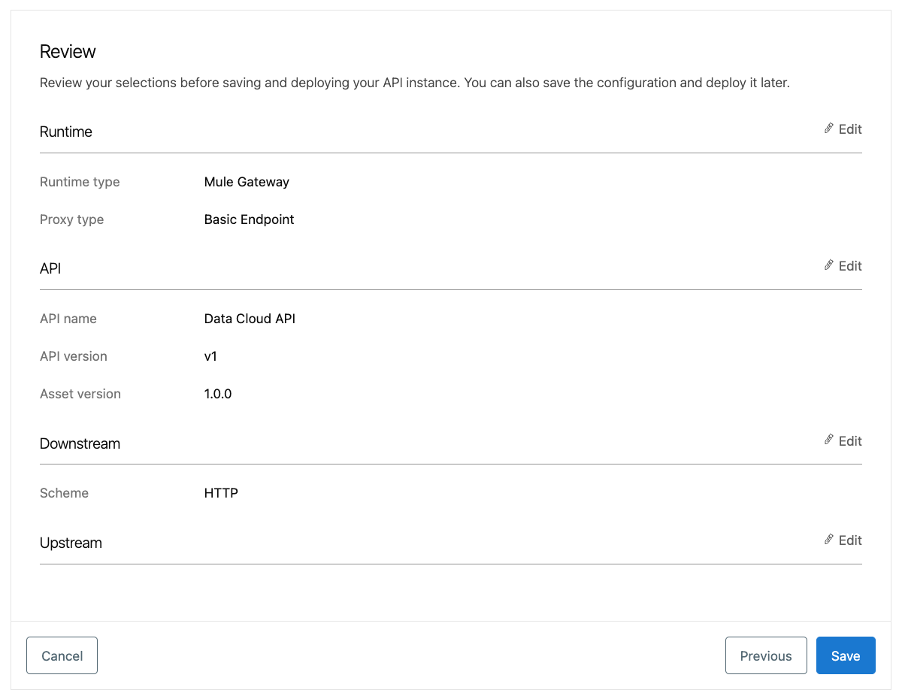

Copy the **API Instance ID**. We will use it in later steps.

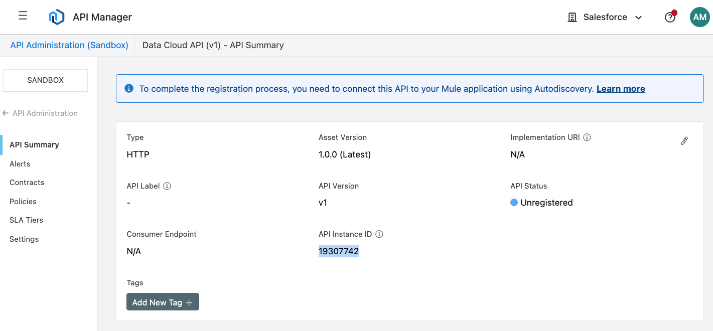

## Upgrade the deployed Mule app

The previous posts were based on the version 1.0.0 of the JAR file. If you already deployed your Mule app with that version, you'll just have to upload the new 2.0.0 JAR (or newer) to the same application in Runtime Manager. If you deployed your Mule app with this new version already, you can skip this part.

> [!TIP]
> If you're unsure of the JAR version you deployed, you can check. it by going to your Anypoint Platform account > Runtime Manager > open your app > go to the Settings tab > take a look at the JAR file under **Application File**. It will have the version number.

Let's see how to update the JAR from Runtime Manager.

Sign in to your Anypoint Platform account and go to **Runtime Manager**. Select the `data-cloud-integration` application you had previously deployed. In the **Settings** tab, locate the **Application File**. Click on **Choose file** > **Upload file** and select the new 2.0.0 JAR (or newer version) you downloaded from the Prerequisites.

Don't apply your changes yet. Let's add some more properties first.

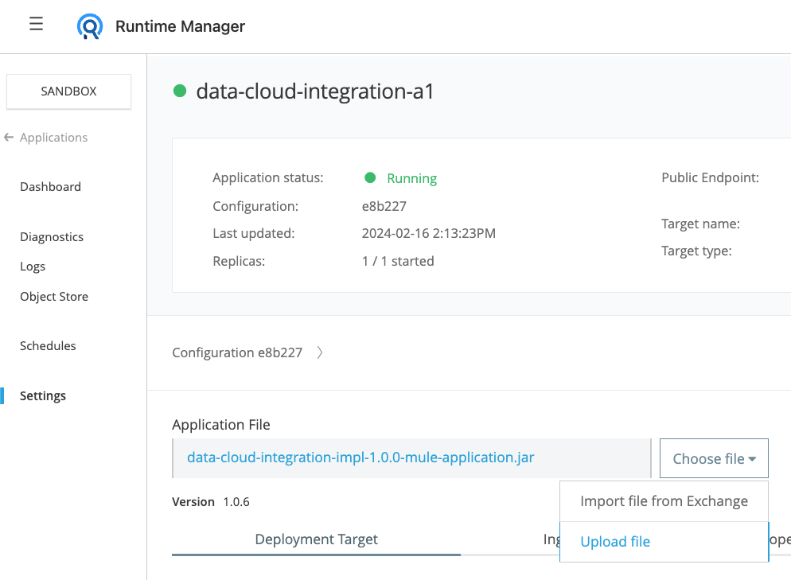

## Add Autodiscovery properties + credentials

Before applying your changes, head to the **Properties** tab and switch to the **Text view**.

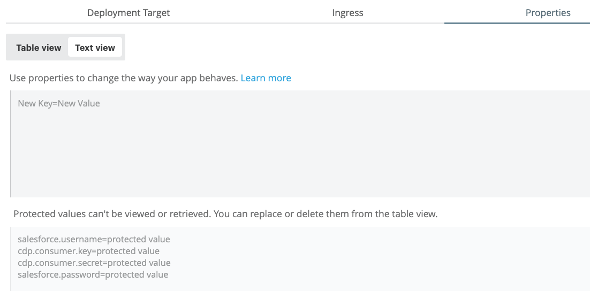

Copy the following snippet and replace the placeholders with your values.

```properties
anypoint.platform.gatekeeper=flexible
api.id=your_api_instance_id
anypoint.platform.client_id=your_client_id
anypoint.platform.client_secret=your_client_secret
```

> [!NOTE]
> If you had already set up the `anypoint.platform.gatekeeper` property to disabled, make sure you change it to flexible. See the [docs](https://docs.mulesoft.com/mule-gateway/mule-gateway-gatekeeper) for more info.

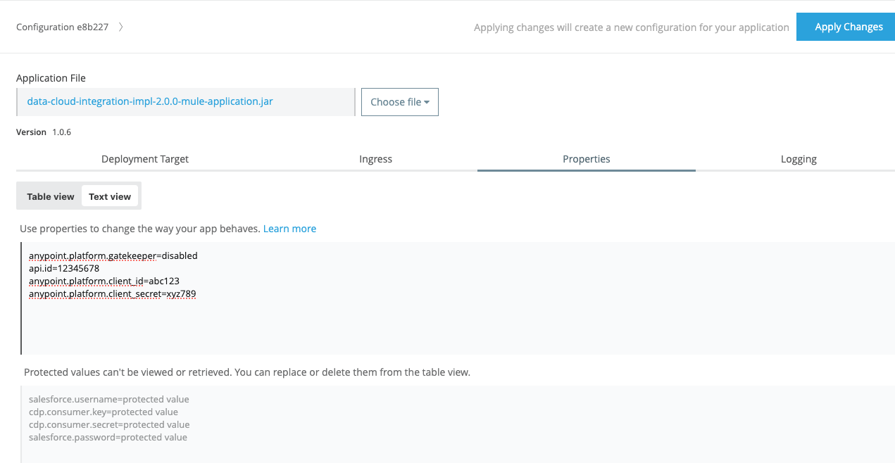

Go back to the **Table view** and click on **Protect** for your two new Anypoint Platform credentials. Once you're done, click **Apply Changes**. It will take some time to redeploy.

## Add the Basic Authentication policy

As you learned from [Part 3](https://www.prostdev.com/post/part-3-data-cloud-mulesoft-integration), you can use Postman to call your integration. If you try sending a request to the Query request now, you should still receive a 200-OK response because we haven't added the security policy yet.

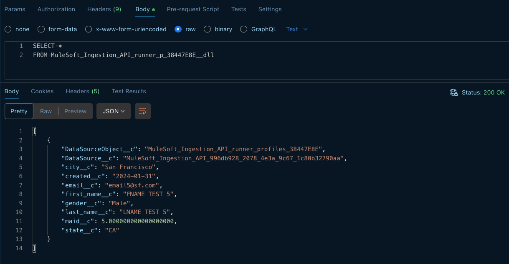

Head back to Anypoint Platform > **API Manager**. Select the Data Cloud API we created and make sure the API Status now appears as 🟢 **Active**. You may need to refresh the page.

If it doesn't appear as Active yet, make sure your request works and your properties in Runtime Manager are correct.

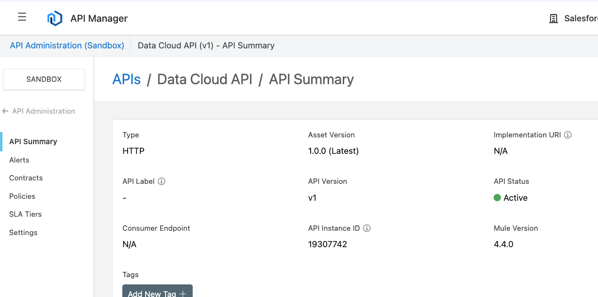

Then, head to the **Policies** tab on the left and click on **Add policy** under the API-level policies section.

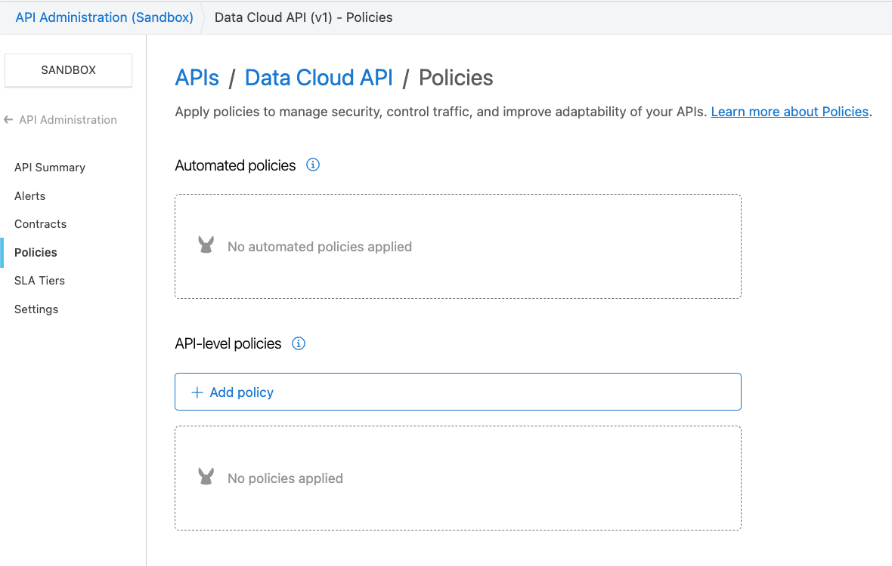

Search for the **Basic Authentication - Simple** policy and click on **Next**.

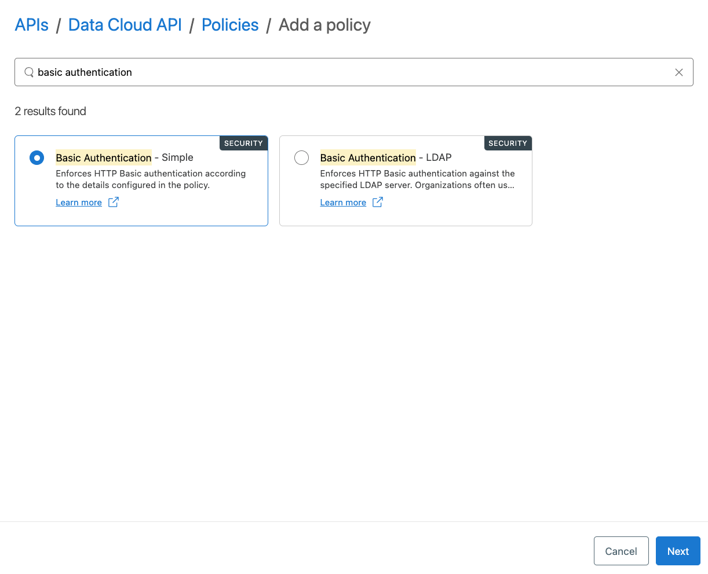

Create your own username/password to access your integration. **Do NOT** use the foo/bar example from the screenshot. Create your own credentials - they can be anything you want.

Once you're done, click **Apply**.

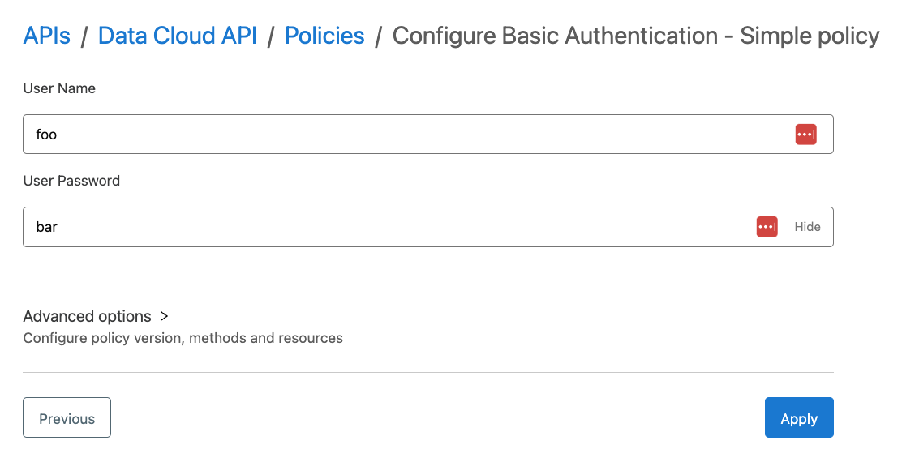

Try calling your Query request once more. After a few seconds, you should receive a **401-Unauthorized** error code. This means the security policy was successfully applied.

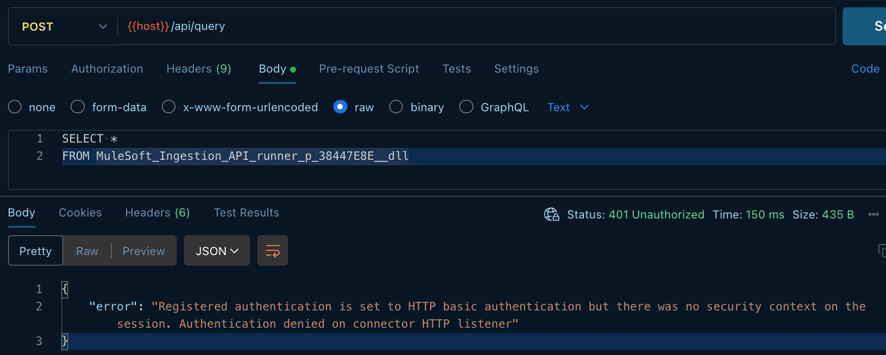

## Add your credentials to Postman

Now we need to send our new username/password credentials with Postman. There are several ways of doing this. You can:

- Hardcode them to each one of the requests
- Hardcode them in the collection
- Add them to the environment and reference them from each one of the requests
- Add them to the environment and reference them from the collection

The last one sounds more secure. Let's do that one.

In Postman, open. the **Environments** tab and select the **CloudHub** environment we had previously created. Add two new variables: **username** and **password**. Add your values to the Current value field.

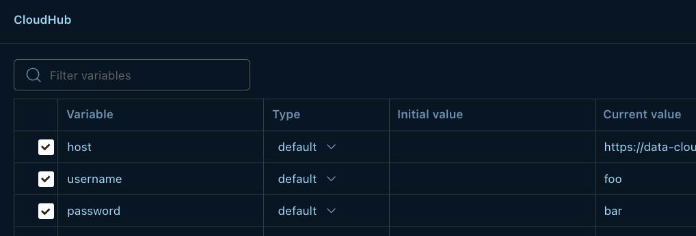

Click on **Save** and open the **Collections** tab. Click on the Data Cloud Integration collection. This will open a new window with different tabs for the collection.

Select the **Authorization** tab and the **Basic Auth** type from the dropdown. Once you're able to see the Username/Password fields with their textboxes, add the reference to your variables with the following syntax:

```
{{variableName}}
```

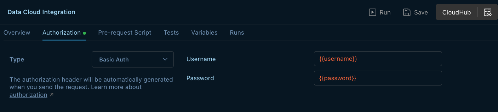

Make sure you **Save** your changes. Now all the requests located inside this collection will inherit the same authentication settings.

Try sending the Query request one more time. You should now receive a **200-OK** status code.

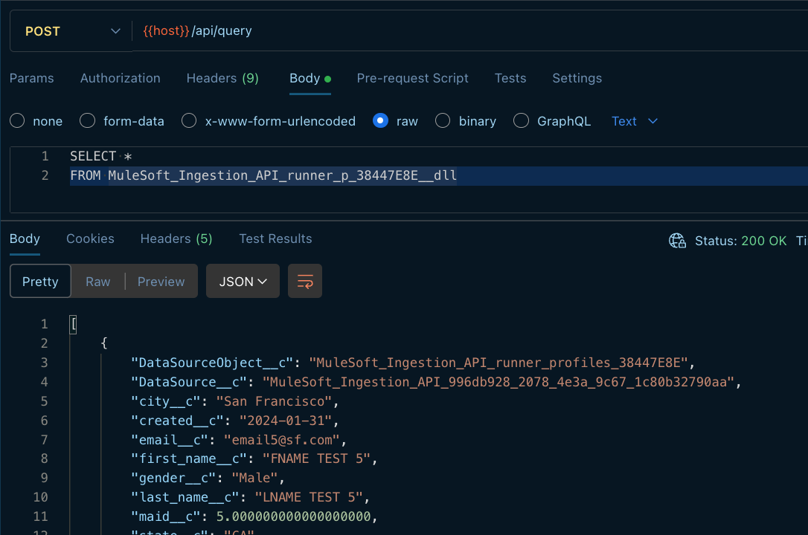

## Troubleshooting

If you receive a 503 error code when calling the integration from Postman after setting up Autodiscovery (`api.id`), you'll have to wait a few seconds for the security policies to be applied to your API. If a long time has passed and you're still receiving 503 instead of 200, make sure the `api.id` property is correctly set and your API in API Manager appears as Active (make sure to refresh).

If you're still experiencing the error, try changing the `anypoint.platform.gatekeeper` property to disabled and try again. Once it works, try changing it back to flexible.

## Conclusion

Anypoint Platform offers security policies for your APIs that you can apply using clicks, not code. We used one of the most basic policies for this tutorial, but there are a lot of other policies you can apply to improve your APIs.

Subscribe to receive notifications as soon as new content is published ✨

💬 Prost! 🍻
