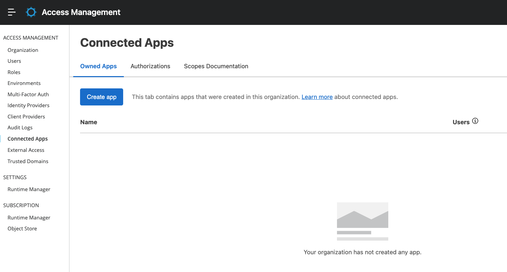
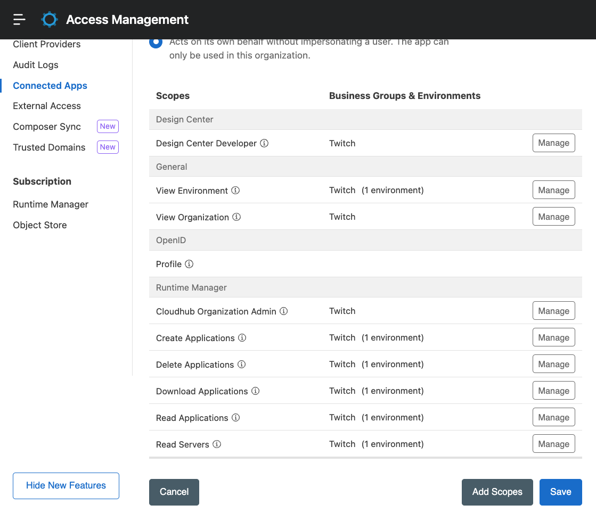
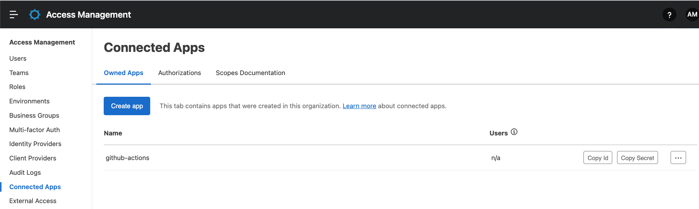
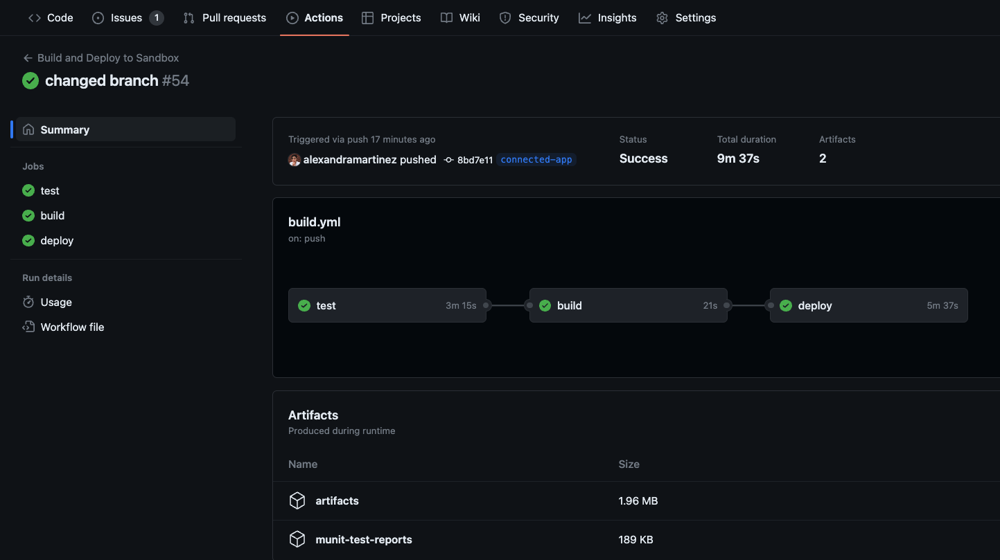

So far we’ve been setting up our CI/CD pipelines using our Anypoint Platform username and password. However, if you’re using an enterprise account, most likely you’re using MFA or Multi-Factor Authentication for your account. The process to create your CI/CD pipeline with this authentication method is quite different.

If you haven’t been following the series or you’re not familiar with GitHub Actions, we recommend you start from the [first article](https://www.prostdev.com/post/how-to-set-up-a-ci-cd-pipeline-to-deploy-your-mulesoft-apps-to-cloudhub-using-github-actions) to understand how we are setting up all the configurations we need.

In this post, we’ll learn how to set up our pipeline with a connected app, which is useful when you have multi-factor authentication activated in Anypoint Platform.

## Prerequisites

You should already understand the basic CI/CD setup we’ve been doing in the previous articles. In summary, this is what you should already know:

- How to configure and run the `build.yml` file for the pipeline under `.github/workflows`.
- How to configure secrets in your GitHub repository.

> [!NOTE]
> The code for this article is **not** located on the **main** branch of the `github-actions` repository. Instead, a new branch was created to avoid confusion: [connected-app](https://github.com/alexandramartinez/github-actions/tree/connected-app). If you want to check the rest of the files we discuss here, like pom or build, please refer to that branch.

## Create a connected app in Anypoint Platform

Because we are signing in to Anypoint Platform using MFA (through an app on your phone or an SMS code, for example), we can no longer rely on just our username and password. We have to create something called Connected App. To do this, sign in to [Anypoint Platform](https://anypoint.mulesoft.com/) and navigate to **Access Management** > **Connected Apps**.



Click on **Create app**. Add any name you want to identify this app, like `github-actions`. Select **App acts on its own behalf** and click on **Add Scopes**.

Select the following scopes for your current business group and the **Sandbox** environment (since this is the one we’re using for this demo):

- Design Center Developer
- View Environment
- View Organization
- Profile
- Cloudhub Organization Admin
- Create Applications
- Delete Applications
- Download Applications
- Read Applications
- Read Servers



Click on **Save**.

After you create the app, make sure to copy both **ID** and **Secret**. We will use these in the pipeline for our authentication method.



In this case, for demonstration purposes, these are the credentials I’ll be using:

```
ID: bf51f105b644471f812b2e0c0cb8a97b
Secret: 66B5ADCB18D4439D9C744236e3c590d3
```

## Set up your credentials on GitHub

Just as we’ve done before, go to your GitHub repository and click on the **Settings** tab. Select **Secrets and variables** > **Actions** and add these two new secrets.

- `CONNECTED_APP_CLIENT_ID`
- `CONNECTED_APP_CLIENT_SECRET`

The values should match what you previously extracted from Anypoint Platform.

## Modify your pom.xml

In our `pom.xml` file, in the `org.mule.tools.maven` plugin, we used to have something like the following to authenticate via username and password.

```xml
<configuration>
  <cloudHubDeployment>
    ...
    <username>${anypoint.username}</username>
    <password>${anypoint.password}</password>
```

We are going to replace the `username` and `password` fields with the following.

```xml
<connectedAppClientId>${client.id}</connectedAppClientId>
<connectedAppClientSecret>${client.secret}</connectedAppClientSecret>
<connectedAppGrantType>client_credentials</connectedAppGrantType>
```

Here's the complete `pom.xml` for this example:

```xml
<?xml version="1.0" encoding="UTF-8"?>
<project xmlns="http://maven.apache.org/POM/4.0.0" xmlns:xsi="http://www.w3.org/2001/XMLSchema-instance" xsi:schemaLocation="http://maven.apache.org/POM/4.0.0 https://maven.apache.org/xsd/maven-4.0.0.xsd">
	<modelVersion>4.0.0</modelVersion>

	<groupId>com.mycompany</groupId>
	<artifactId>github-actions</artifactId>
	<version>1.0.0-SNAPSHOT</version>
	<packaging>mule-application</packaging>

	<name>github-actions</name>

	<properties>
		<project.build.sourceEncoding>UTF-8</project.build.sourceEncoding>
		<project.reporting.outputEncoding>UTF-8</project.reporting.outputEncoding>

		<app.runtime>4.4.0</app.runtime>
		<mule.maven.plugin.version>3.8.0</mule.maven.plugin.version>
		<app.name>amartinez17-github-actions</app.name>
		<env>Sandbox</env>
		<munit.version>2.3.13</munit.version>
	</properties>

	<build>
		<plugins>
			<plugin>
				<groupId>org.apache.maven.plugins</groupId>
				<artifactId>maven-clean-plugin</artifactId>
				<version>3.0.0</version>
			</plugin>
			<plugin>
				<groupId>org.mule.tools.maven</groupId>
				<artifactId>mule-maven-plugin</artifactId>
				<version>${mule.maven.plugin.version}</version>
				<extensions>true</extensions>
				<configuration>
					<cloudHubDeployment>
						<uri>https://anypoint.mulesoft.com</uri>
						<muleVersion>${app.runtime}</muleVersion>
						<!-- <username>${anypoint.username}</username>
						<password>${anypoint.password}</password> -->
						<!-- Start: CONNECTED APP -->
						<connectedAppClientId>${client.id}</connectedAppClientId>
						<connectedAppClientSecret>${client.secret}</connectedAppClientSecret>
						<connectedAppGrantType>client_credentials</connectedAppGrantType>
						<!-- End: CONNECTED APP -->
						<applicationName>${app.name}</applicationName>
						<environment>${env}</environment>
						<workerType>MICRO</workerType>
						<region>us-east-2</region>
						<workers>1</workers>
						<objectStoreV2>true</objectStoreV2>
						<!-- Start: SECURED PROPERTIES CI/CD -->
						<properties>
							<secure.key>${decryption.key}</secure.key>
						</properties>
						<!-- End: SECURED PROPERTIES CI/CD -->
					</cloudHubDeployment>
					<classifier>mule-application</classifier>
				</configuration>
			</plugin>
			<plugin>
				<groupId>com.mulesoft.munit.tools</groupId>
				<artifactId>munit-maven-plugin</artifactId>
				<version>${munit.version}</version>
				<executions>
					<execution>
						<id>test</id>
						<phase>test</phase>
						<goals>
							<goal>test</goal>
							<goal>coverage-report</goal>
						</goals>
					</execution>
				</executions>
				<configuration>
					<!-- START: MUnit coverage -->
					<environmentVariables>
						<secure.key>${decryption.key}</secure.key>
					</environmentVariables>
					<!-- END: MUnit coverage -->
					<coverage>
						<runCoverage>true</runCoverage>
						<!-- START: MUnit coverage -->
						<failBuild>true</failBuild>
    					<requiredApplicationCoverage>90</requiredApplicationCoverage>
						<!-- <requiredResourceCoverage>50</requiredResourceCoverage> -->
						<!-- <requiredFlowCoverage>50</requiredFlowCoverage> -->
						<!-- END: MUnit coverage -->
						<formats>
							<!-- START: MUnit coverage -->
							<format>console</format>
							<format>sonar</format>
							<format>json</format>
							<!-- END: MUnit coverage -->
							<format>html</format>
						</formats>
					</coverage>
				</configuration>
			</plugin>
		</plugins>
	</build>

	<dependencies>
		<dependency>
			<groupId>org.mule.connectors</groupId>
			<artifactId>mule-http-connector</artifactId>
			<version>1.6.0</version>
			<classifier>mule-plugin</classifier>
		</dependency>
		<dependency>
			<groupId>org.mule.connectors</groupId>
			<artifactId>mule-sockets-connector</artifactId>
			<version>1.2.2</version>
			<classifier>mule-plugin</classifier>
		</dependency>
		<dependency>
			<groupId>com.mulesoft.modules</groupId>
			<artifactId>mule-secure-configuration-property-module</artifactId>
			<version>1.2.5</version>
			<classifier>mule-plugin</classifier>
		</dependency>
		<dependency>
			<groupId>com.mulesoft.munit</groupId>
			<artifactId>munit-runner</artifactId>
			<version>2.3.13</version>
			<classifier>mule-plugin</classifier>
			<scope>test</scope>
		</dependency>
		<dependency>
			<groupId>com.mulesoft.munit</groupId>
			<artifactId>munit-tools</artifactId>
			<version>2.3.13</version>
			<classifier>mule-plugin</classifier>
			<scope>test</scope>
		</dependency>
		<dependency>
			<groupId>org.mule.weave</groupId>
			<artifactId>assertions</artifactId>
			<version>1.0.2</version>
			<scope>test</scope>
		</dependency>
	</dependencies>

	<repositories>
		<repository>
			<id>anypoint-exchange-v3</id>
			<name>Anypoint Exchange</name>
			<url>https://maven.anypoint.mulesoft.com/api/v3/maven</url>
			<layout>default</layout>
		</repository>
		<repository>
			<id>mulesoft-releases</id>
			<name>MuleSoft Releases Repository</name>
			<url>https://repository.mulesoft.org/releases/</url>
			<layout>default</layout>
		</repository>
	</repositories>

	<pluginRepositories>
		<pluginRepository>
			<id>mulesoft-releases</id>
			<name>MuleSoft Releases Repository</name>
			<layout>default</layout>
			<url>https://repository.mulesoft.org/releases/</url>
			<snapshots>
				<enabled>false</enabled>
			</snapshots>
		</pluginRepository>
	</pluginRepositories>

</project>
```

That’s it for this file! Now let’s set up the pipeline to send these new credentials.

## Modify your build.yml

Open the `build.yml` file we created inside `.github/workflows`. If you haven’t created this file yet, please refer to the [first article](https://www.prostdev.com/post/how-to-set-up-a-ci-cd-pipeline-to-deploy-your-mulesoft-apps-to-cloudhub-using-github-actions) to learn how to set it up.

Go to the `deploy` job and locate the last step: **Deploy to Sandbox**. This is what we used to have under `env`:

```yaml
USERNAME: ${{ secrets.anypoint_platform_username }}
PASSWORD: ${{ secrets.anypoint_platform_password }}
```

And this is what we’ll replace it with:

```yaml
ID: ${{ secrets.CONNECTED_APP_CLIENT_ID }}
SECRET: ${{ secrets.CONNECTED_APP_CLIENT_SECRET }}
```

We’ll change the Maven command to match these new secrets/properties. Instead of sending username and password, like this:

```bash
-Danypoint.username="$USERNAME" \
-Danypoint.password="$PASSWORD" \
```

We’ll now send the app’s ID and secret. Like this:

```bash
-Dclient.id="$ID" \
-Dclient.secret="$SECRET" \
```

Here's the complete `build.yml` for this example:

```yaml
name: Build and Deploy to Sandbox

on:
  push:
    branches: [ main ]
    
jobs:
  test:
    runs-on: ubuntu-latest
    steps:
    - name: Checkout this repo
      uses: actions/checkout@v3
    - name: Cache dependencies
      uses: actions/cache@v3
      with:
        path: ~/.m2/repository
        key: ${{ runner.os }}-maven-${{ hashFiles('**/pom.xml') }}
        restore-keys: |
          ${{ runner.os }}-maven-
    - name: Set up JDK 1.8
      uses: actions/setup-java@v3
      with:
        distribution: 'zulu'
        java-version: 8
    - name: Test with Maven
      env:
        nexus_username: ${{ secrets.nexus_username }}
        nexus_password: ${{ secrets.nexus_password }}
        KEY: ${{ secrets.decryption_key }}
      run: mvn test --settings .maven/settings.xml -Dsecure.key="$KEY"
    - name: Upload MUnit reports
      uses: actions/upload-artifact@v3
      with:
        name: munit-test-reports
        path: target/site/munit/coverage/

  build:
    needs: test
    runs-on: ubuntu-latest
    steps:
    - name: Checkout this repo
      uses: actions/checkout@v3
    - name: Cache dependencies
      uses: actions/cache@v3
      with:
        path: ~/.m2/repository
        key: ${{ runner.os }}-maven-${{ hashFiles('**/pom.xml') }}
        restore-keys: |
          ${{ runner.os }}-maven-
    - name: Set up JDK 1.8
      uses: actions/setup-java@v3
      with:
        distribution: 'zulu'
        java-version: 8
    - name: Build with Maven
      run: mvn -B package --file pom.xml -DskipMunitTests
    - name: Stamp artifact file name with commit hash
      run: |
        artifactName1=$(ls target/*.jar | head -1)
        commitHash=$(git rev-parse --short "$GITHUB_SHA")
        artifactName2=$(ls target/*.jar | head -1 | sed "s/.jar/-$commitHash.jar/g")
        mv $artifactName1 $artifactName2
    - name: Upload artifact 
      uses: actions/upload-artifact@v3
      with:
          name: artifacts
          path: target/*.jar
        
  deploy:
    needs: build
    runs-on: ubuntu-latest
    steps:    
    - name: Checkout this repo
      uses: actions/checkout@v3
    - name: Cache dependencies
      uses: actions/cache@v3
      with:
        path: ~/.m2/repository
        key: ${{ runner.os }}-maven-${{ hashFiles('**/pom.xml') }}
        restore-keys: |
          ${{ runner.os }}-maven-
    - uses: actions/download-artifact@v3
      with:
        name: artifacts
    - name: Deploy to Sandbox
      env:
        ID: ${{ secrets.CONNECTED_APP_CLIENT_ID }}
        SECRET: ${{ secrets.CONNECTED_APP_CLIENT_SECRET }}
        KEY: ${{ secrets.decryption_key }}
      run: |
        artifactName=$(ls *.jar | head -1)
        mvn deploy -DskipMunitTests -DmuleDeploy \
         -Dmule.artifact=$artifactName \
         -Dclient.id="$ID" \
         -Dclient.secret="$SECRET" \
         -Ddecryption.key="$KEY"
```

## Run the pipeline

That’s it! Once you’re done with the changes, simply push a new change to the **main** branch and this will trigger the pipeline.



## More resources

You can check out my [GitHub profile](https://github.com/alexandramartinez) for more CI/CD repos:

- [github-actions](https://github.com/alexandramartinez/github-actions) to deploy a Mule app to CloudHub
- [dataweave-utilities-library](https://github.com/alexandramartinez/dataweave-utilities-library) to publish a DataWeave library to Exchange
- [api-catalog-cli-example](https://github.com/alexandramartinez/api-catalog-cli-example) to update APIs in Exchange using the API Catalog CLI

I hope this was helpful!

Don't forget to subscribe so you don't miss any future content.
