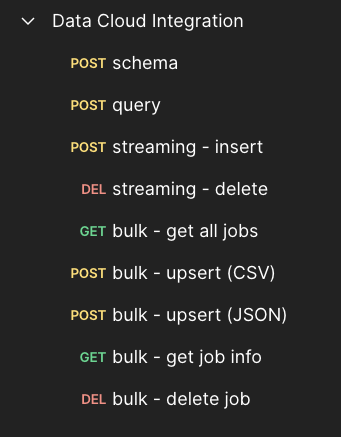
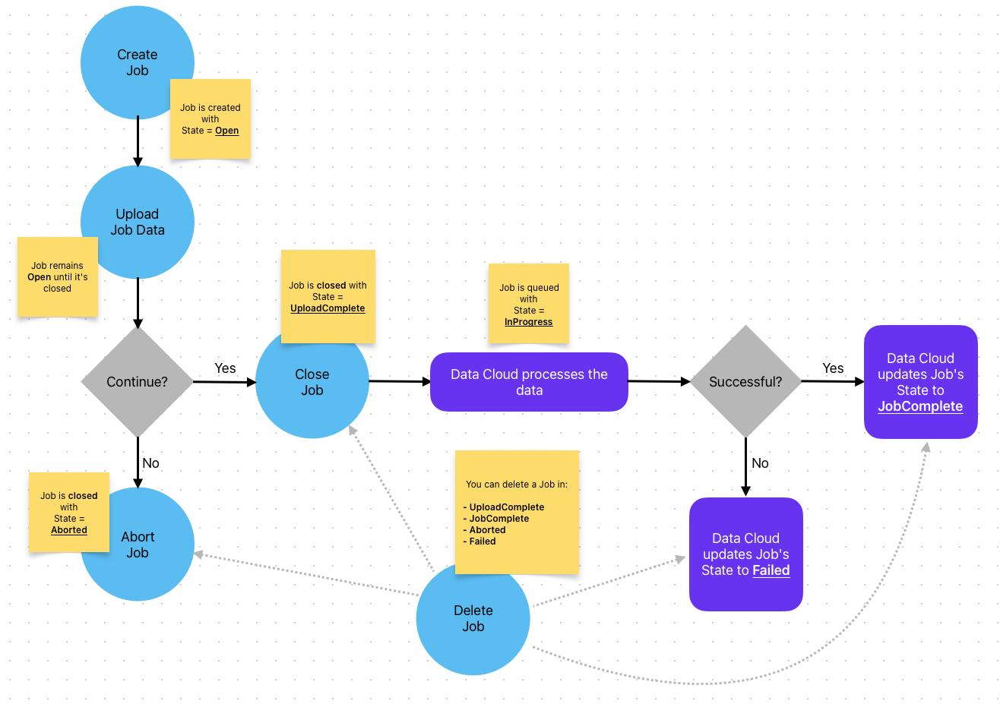
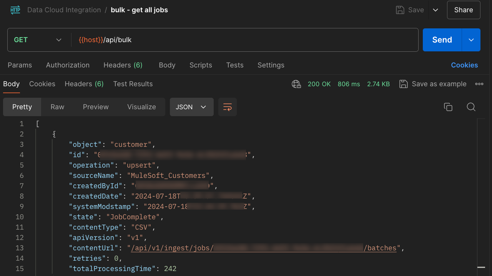
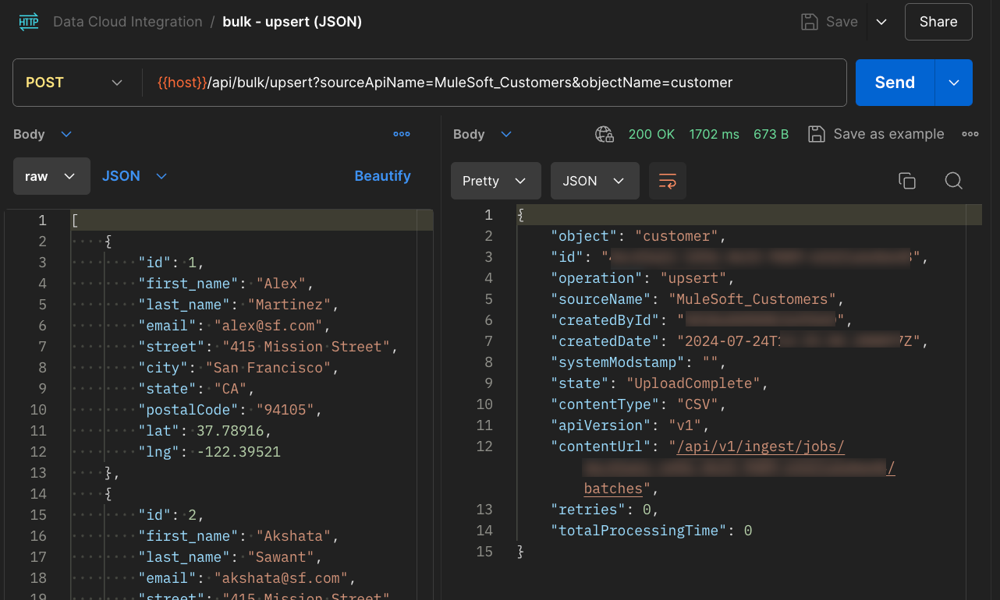
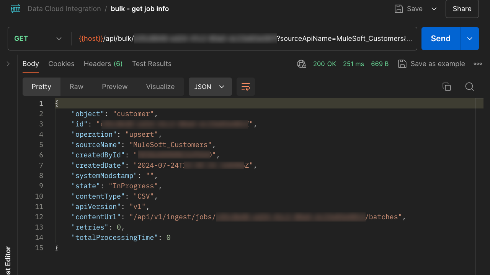
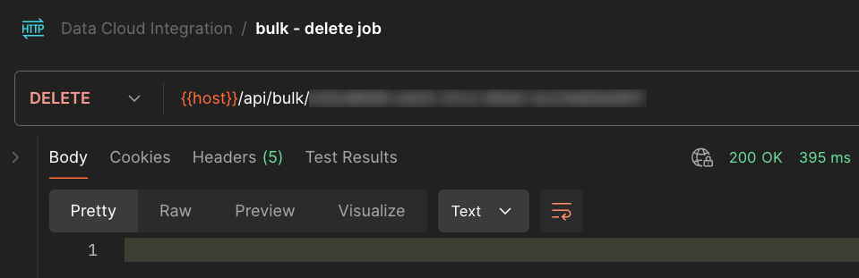

Hello, hello! By this point, you should already have a full Mule application running in CloudHub and you have been able to call the Query/Streaming operations.

In July 2024, I released a new JAR (version 2.1.0) where I added the Bulk operations.

Let's take a look at what other updates have been done to this version!

## Prerequisites

- **Previous configurations** - Make sure you followed at least parts 1-3 before reading this article. Part 4 is preferred for security reasons, but not necessary. You will need to do the Data Cloud, MuleSoft, and Postman configuration before doing this post.
- **Deployed Mule app -** Make sure you're using the JAR version 2.1.0 or newer. You can find the releases [here](https://github.com/alexandramartinez/datacloud-mulesoft-integration/releases/).
- **Postman collection -** If you have already imported the previous Postman collection, make sure you re-import the latest one (released on July 2024) from [this link](https://github.com/alexandramartinez/datacloud-mulesoft-integration/tree/main/rest-clients-requests/postman). This collection includes both the Streaming and the Bulk operations. Below is a screenshot of what the new collection looks like.

## Understanding the Bulk process

Before jumping right away into the new operations, let's take a moment to understand how Data Cloud processes this type of data. Take a look at the following diagram:

The blue circles are the actual operations you can do with the Data Cloud connector in MuleSoft and the purple squares are what Data Cloud changes on its own. A happy path processing would go like this:

- Create the Job
- Upload the data to the Job
- Close the Job with the *UploadComplete* status
- Data Cloud queues this data and changes the Job's state to *InProgress*
- Once the data is processed, the Job's status is changed to *JobComplete*

The Aborted state would happen if you wanted to stop the processing of the Job after it's already been created. It is irrelevant if you already uploaded the data or not. Once you abort it, the data will be deleted from the Job.

The Failed state would happen if there was an error processing the Job in Data Cloud. For example, if the data you sent is corrupted, wrong, or incomplete.

You can always delete a Job at any point while the job is not being processed and is already closed. This means after you close it (Aborted/UploadComplete state) but before it is queued (not in the InProgress state), or after it has been processed (Failed/JobComplete).

If a specific object already contains an open/in progress Job, you won't be able to create more Jobs for the same object and you will receive a 409-Conflict error when you try to create a new Job. In this case, you will need to wait until the Job is Failed/JobComplete, or you will have to abort the other Open Job first (if it hasn't been closed).

A lot of this process is already taken care of by the Mule application in the JAR file. You only need to send your data to the upsert operation and the app will take care of creating, uploading, and closing the Job for you.

## Get All Jobs

Once you import the Postman collection, you will see a request called "get all jobs". This is a GET request calling the path `/api/bulk` of our Mule application.

You don't need to add Query Params or a body. The credentials you set up in CloudHub are good enough to perform the call.

This request will return all the Jobs with their corresponding information, like the ID and its state.

*Note that the next screenshot has some blurred information for security reasons.

## Upsert

Once you import the Postman collection, you will see a request called "upsert (CSV)" and another one called "upsert (JSON)". Both are the same request, calling a POST in `/api/bulk/upsert`, but you have the possibility to send different bodies on each. Internally, the Mule application is transforming the input body to a CSV that can be read by Data Cloud.

You need to add two Query Parameters, same as you did for the streaming insertion:

- `sourceApiName`
- `objectName`

This request will create a new Job, upload the data, and close it with the *UploadComplete* status. If anything goes wrong while uploading the data, the Job will be aborted instead. Either way, you will receive a response with the details of the Job.

*Note that the next screenshot has some blurred information for security reasons.

## Get Job

Once you import the Postman collection, you will see a request called "get job info". This is a GET request calling the path `/api/bulk/{id}` of our Mule application.

You need to make sure to add your Job ID in the URI of the call and you need to add two Query Parameters, same as you did for the streaming insertion:

- `sourceApiName`
- `objectName`

This request will return the given Job's information (from the ID at the URI). You can use this to track its state.

*Note that the next screenshot has some blurred information for security reasons.

## Delete Job

Once you import the Postman collection, you will see a request called "delete job". This is a DELETE request calling the path `/api/bulk/{id}` of our Mule application.

You only need to make sure to add your Job ID in the URI of the call.

This request will delete the Job you pass in the URI. It will only be successful if the given Job is already closed. You can only delete a Job that has one of the following states:

- UploadComplete (before it's InProgress, once it's queued you can't delete it)
- JobComplete
- Aborted
- Failed

If the Job is in a different state, it will try to Abort it first (this will only be successful if the Job is in an Open state).

*Note that the next screenshot has some blurred information for security reasons.

And that's all for this post! I hope this helps to understand how to use the bulk operations with our Mule application.

Remember that you can always go to my [GitHub repo](https://github.com/alexandramartinez/datacloud-mulesoft-integration) if you want to take a look at the code :)

Subscribe to receive notifications as soon as new content is published ✨

💬 Prost! 🍻
