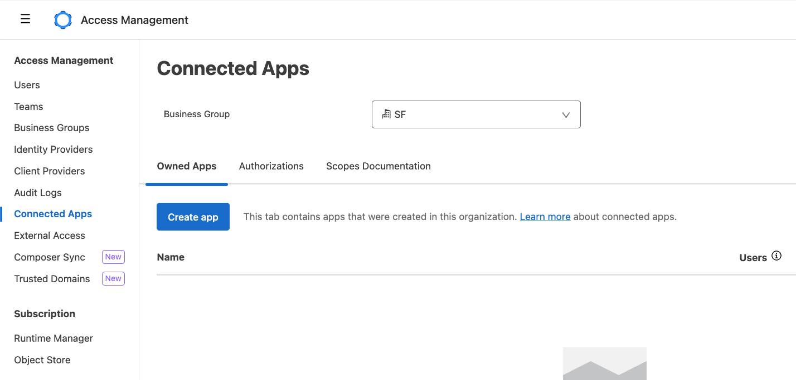
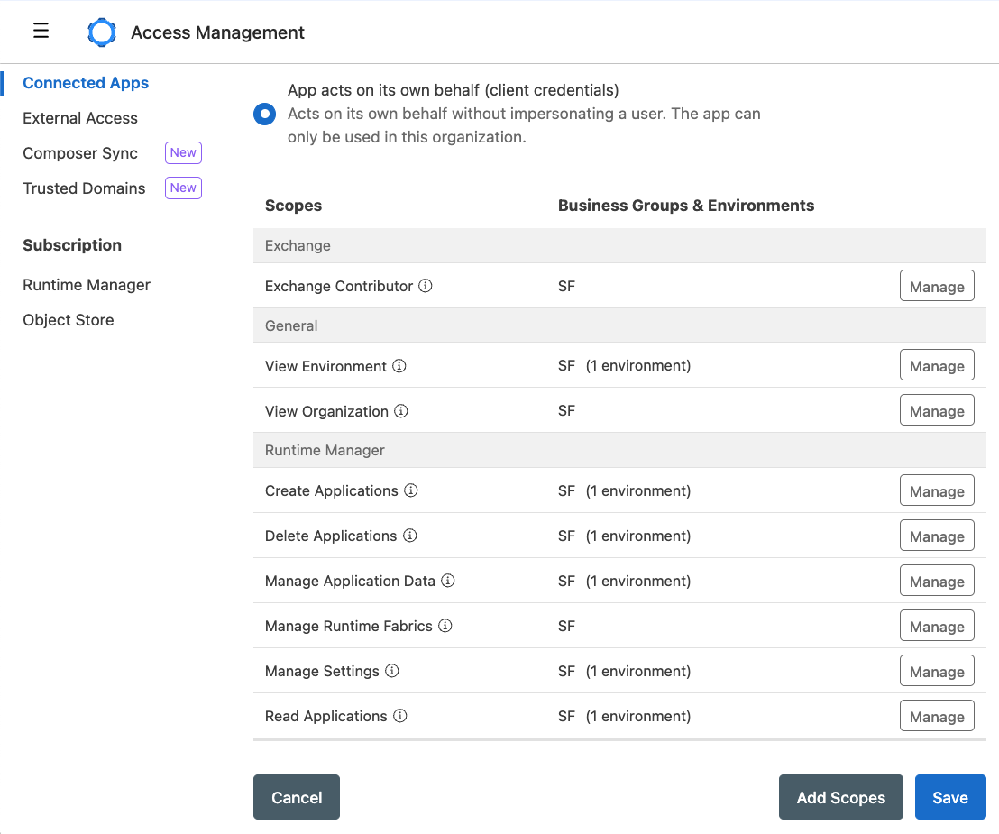
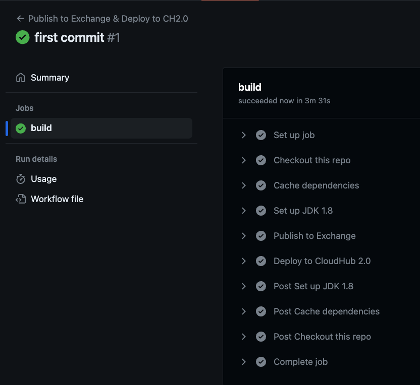

We already learned how to set up secured properties, MUnit coverage, and even a connected app to authenticate when you're using Multi-Factor Authentication (MFA) in your Anypoint Platform account. From now on, we will continue authenticating using a connected app for best practices.

What are we missing then? Well, we haven't learned how to enable the CI/CD pipelines for a CloudHub 2.0 deployment. You'd think it's very similar to CloudHub 1.0, but turns out it's very different! Don't worry, I got you :)

If you haven’t been following the series or you’re not familiar with GitHub Actions, we recommend you start from the [first article](https://www.prostdev.com/post/how-to-set-up-a-ci-cd-pipeline-to-deploy-your-mulesoft-apps-to-cloudhub-using-github-actions) to understand how we are setting up all the configurations we need.

In this post, we'll learn the basics of setting up our GitHub Actions pipeline to deploy a Mule application to CloudHub 2.0. Once more, using a Connected App.

## Prerequisites

- **Anypoint Platform** - You should have an Anypoint Platform account. You can create a new free trial account [here](https://anypoint.mulesoft.com/login/signup).
- **GitHub Repo** - You should already have a GitHub repo with a base Mule application and know how to configure secrets in your GitHub repo. If this is not the case, please return to the first article of this series.

## Create a connected app in Anypoint Platform

We learned how to create a connected app in the [previous article](https://www.prostdev.com/post/part-5-ci-cd-pipeline-with-mulesoft-and-github-actions-enabling-mfa-through-a-connected-app), but let's go ahead and create a new one. **Sign in to** [Anypoint Platform](https://anypoint.mulesoft.com/) **and navigate to Access Management > Connected Apps.**



**Click on Create app. Add any name you want to identify this app, like github-actions. Select App acts on its own behalf and click on Add Scopes.**

> [!DOCS]
> You can refer to [this article](https://help.salesforce.com/s/articleView?id=001119708&type=1) to learn more about the minimum scopes for CloudHub 2.0.

**Select the following scopes:**

- Exchange Contributor
- View Environment
- View Organization
- Create Applications
- Delete Applications
- Manage Application Data
- Manage Runtime Fabrics
- Manage Settings
- Read Applications

Click on Next. Select your Business Group and the Sandbox environment. Review the scopes and click on Add Scopes. You should end up with something like the following.



After that, click on Save. Make sure you copy both ID and Secret from the generated connected app.

## Set up your credentials on GitHub

Just as we’ve done before, go to your GitHub repository and click on the **Settings** tab. Select **Secrets and variables** > **Actions** and add these two new secrets.

- `CONNECTED_APP_CLIENT_ID`
- `CONNECTED_APP_CLIENT_SECRET`

The values should match what you previously extracted from Anypoint Platform.

## Modify your pom.xml

We'll start from the beginning on this so we don't get confused. Starting from a brand new project with no MUnits and no secured properties, open your `pom.xml` file from the root folder.

The first thing we'll modify is the groupId. The value here has to match your Business Group ID in Anypoint Platform. Please refer to [this post](https://dev.to/devalexmartinez/4-ways-to-retrieve-your-orgidgroupid-from-anypoint-platform-2e71) to learn how to extract this value.

You should end up with something like the following:

```xml
<groupId>4500658a-7637-4fcf-bc7d-51d1feb28edb</groupId>
```

Next, change your version so it doesn't say SNAPSHOT. If this is the first version of your app, you can leave it as 1.0.0, like so:

```xml
<version>1.0.0</version>
```

Then, in the `<properties>` tag, change the Mule Maven Plugin version to at least 4.1.0 (we'll be using 4.1.1).

```xml
<mule.maven.plugin.version>4.1.1</mule.maven.plugin.version>
```

And here comes the fun part. Inside the mule-maven-plugin, replace the configuration with the following:

```xml
<plugin>
    <groupId>org.mule.tools.maven</groupId>
    <artifactId>mule-maven-plugin</artifactId>
    <version>${mule.maven.plugin.version}</version>
    <extensions>true</extensions>
    <configuration>
        <classifier>mule-application</classifier>
        <cloudhub2Deployment>
            <uri>https://anypoint.mulesoft.com</uri>
            <provider>MC</provider>
            <environment>Sandbox</environment>
            <target>Cloudhub-US-East-2</target>
            <server>Repository</server>
            <applicationName>${project.artifactId}</applicationName>
            <releaseChannel>NONE</releaseChannel>
            <replicas>1</replicas>
            <vCores>0.1</vCores>
            <deploymentSettings>
                <generateDefaultPublicUrl>true</generateDefaultPublicUrl>
            </deploymentSettings>
        </cloudhub2Deployment>
    </configuration>
</plugin>
```

A few notes regarding this configuration:

- `<provider>` must always be set to MC when deploying to CloudHub 2.0.
- `<environment>` in this case is Sandbox, but you can change it if you have a different environment set up.
- There is only one `<target>` available for your trial account. Before setting this up, you can go to Runtime Manager > Deploy Application and see which region is available for your shared space. In our case, it's US East (Ohio). Refer to [this table](https://docs.mulesoft.com/cloudhub-2/ch2-architecture#regions-and-dns-records) to retrieve the target name you need to set up here.
- Whatever you write on `<server>` needs to match in three other places. We'll see exactly where in the rest of the article. In our case, we're setting it up as Repository.
- You can use the `<releaseChannel>` field to choose between NONE, LTS, or EDGE.
  - NONE will set up Mule Runtime 4.4.0.
  - LTS will set up the latest available LTS version (changes each year). The last LTS version when this post was written was 4.6.x. This is the most stable option if you want to use 4.6.
  - EDGE will set up the latest available EDGE version (changes every 4 months). This is a good option if you want to always be on the latest possible version, but a few things might break along the way, so choose carefully.

> [!NOTE]
> You can set up additional options to customize your deployment even more. For more information about this, see [CloudHub 2.0 Deployment Parameters Reference](https://docs.mulesoft.com/mule-runtime/latest/deploy-to-cloudhub-2#cloudhub2-deploy-reference).

Almost done. Now, keep scrolling down the file until you reach the `<repositories>` tag. Make sure the Anypoint Exchange version is 3 instead of 2. If this is not the case, change it. It should look like the following.

```xml
<repository>
    <id>anypoint-exchange-v3</id>
    <name>Anypoint Exchange</name>
    <url>https://maven.anypoint.mulesoft.com/api/v3/maven</url>
    <layout>default</layout>
</repository>
```

Add the following repository. Note that this `<id>` must match the same name you set up before as `<server>`.

```xml
<repository>
    <id>Repository</id>
    <name>Private Exchange repository</name>
    <url>https://maven.anypoint.mulesoft.com/api/v3/organizations/${project.groupId}/maven</url>
    <layout>default</layout>
</repository>
```

Aaaand finally, make sure you add a `<distributionManagement>` section at the end (before the `</project>` closing tag) with the following values. Note that this `<id>` must be the same as the previous repository.

```xml
<distributionManagement>
    <repository>
        <id>Repository</id>
        <name>Corporate Repository</name>
        <url>https://maven.anypoint.mulesoft.com/api/v3/organizations/${project.groupId}/maven</url>
        <layout>default</layout>
    </repository>
</distributionManagement>
```

Here's the full `pom.xml` for you to confirm everything's good.

```xml
<?xml version="1.0" encoding="UTF-8" standalone="no"?>
<project xmlns="http://maven.apache.org/POM/4.0.0" xmlns:xsi="http://www.w3.org/2001/XMLSchema-instance" xsi:schemaLocation="http://maven.apache.org/POM/4.0.0 http://maven.apache.org/maven-v4_0_0.xsd">
    <modelVersion>4.0.0</modelVersion>
    
    <groupId>4500658a-7637-4fcf-bc7d-51d1feb28edb</groupId>
    <artifactId>test</artifactId>
    <version>1.0.0</version>
    <packaging>mule-application</packaging>
    
    <name>test</name>
    
    <properties>
        <project.build.sourceEncoding>UTF-8</project.build.sourceEncoding>
        <project.reporting.outputEncoding>UTF-8</project.reporting.outputEncoding>
        <mule.maven.plugin.version>4.1.1</mule.maven.plugin.version>
    </properties>
    
    <build>
        <plugins>
            <plugin>
                <groupId>org.apache.maven.plugins</groupId>
                <artifactId>maven-clean-plugin</artifactId>
                <version>3.1.0</version>
            </plugin>
            <plugin>
                <groupId>org.mule.tools.maven</groupId>
                <artifactId>mule-maven-plugin</artifactId>
                <version>${mule.maven.plugin.version}</version>
                <extensions>true</extensions>
                <configuration>
                    <classifier>mule-application</classifier>
                    <cloudhub2Deployment>
                        <uri>https://anypoint.mulesoft.com</uri>
                        <provider>MC</provider>
                        <environment>Sandbox</environment>
                        <target>Cloudhub-US-East-2</target>
                        <server>Repository</server>
                        <applicationName>${project.artifactId}</applicationName>
                        <releaseChannel>NONE</releaseChannel>
                        <replicas>1</replicas>
                        <vCores>0.1</vCores>
                        <deploymentSettings>
                            <generateDefaultPublicUrl>true</generateDefaultPublicUrl>
                        </deploymentSettings>
                    </cloudhub2Deployment>
                </configuration>
            </plugin>
        </plugins>
    </build>
    <repositories>
        <repository>
            <id>anypoint-exchange-v3</id>
            <name>Anypoint Exchange</name>
            <url>https://maven.anypoint.mulesoft.com/api/v3/maven</url>
            <layout>default</layout>
        </repository>
        <repository>
            <id>mulesoft-releases</id>
            <name>MuleSoft Releases Repository</name>
            <url>https://repository.mulesoft.org/releases/</url>
            <layout>default</layout>
        </repository>
        <repository>
            <id>Repository</id>
            <name>Private Exchange repository</name>
            <url>https://maven.anypoint.mulesoft.com/api/v3/organizations/${project.groupId}/maven</url>
            <layout>default</layout>
        </repository>
    </repositories>
    <pluginRepositories>
        <pluginRepository>
            <id>mulesoft-releases</id>
            <name>mulesoft release repository</name>
            <layout>default</layout>
            <url>https://repository.mulesoft.org/releases/</url>
            <snapshots>
                <enabled>false</enabled>
            </snapshots>
        </pluginRepository>
    </pluginRepositories>
    <dependencies>
        <dependency>
            <groupId>org.mule.connectors</groupId>
            <artifactId>mule-http-connector</artifactId>
            <version>1.9.0</version>
            <classifier>mule-plugin</classifier>
        </dependency>
    </dependencies>
    <distributionManagement>
        <repository>
            <id>Repository</id>
            <name>Corporate Repository</name>
            <url>https://maven.anypoint.mulesoft.com/api/v3/organizations/${project.groupId}/maven</url>
            <layout>default</layout>
        </repository>
    </distributionManagement>
</project>
```

Did you notice we don't have the connected app's client id/secret set up in the `pom.xml`? That is because we will now authenticate using a server in the Maven `settings.xml` file instead of the `pom.xml` file.

## Modify your settings.xml

In the previous articles, we've created our own `settings.xml` file in the project to simplify things. Let's do the same here. Create a new .maven folder under the root folder. Then, create a `settings.xml` file inside it. Copy and paste the following into the file.

```xml
<?xml version="1.0"?>
<settings>

  <pluginGroups>
    <pluginGroup>org.mule.tools</pluginGroup>
  </pluginGroups>

  <servers>
    <server>
      <id>Repository</id>
      <username>~~~Client~~~</username>
      <password>${client.id}~?~${client.secret}</password>
    </server>
  </servers>

</settings>
```

We will be passing the client id/secret through the GitHub Actions file so we're not hardcoding them in the project.

> [!NOTE]
> If you want to authenticate using username and password instead of connected app, simply add your credentials in this server. Just make sure your user has the necessary permissions.
> For more information, see [Authentication Methods](https://docs.mulesoft.com/mule-runtime/latest/deploy-to-cloudhub-2#authentication-methods).

## Modify your build.yml

As we've done before, create a .github folder in the root folder of the project, then, create a workflows folder, and a `build.yml` file inside it. Copy and paste the following.

```yaml
name: Publish to Exchange & Deploy to CH2.0

on:
  push:
    branches: [ main ]
    
jobs:         
  build:
    runs-on: ubuntu-latest
    steps:
      - name: Checkout this repo
        uses: actions/checkout@v4

      - name: Cache dependencies
        uses: actions/cache@v4
        with:
          path: ~/.m2/repository
          key: ${{ runner.os }}-maven-${{ hashFiles('**/pom.xml') }}
          restore-keys: ${{ runner.os }}-maven-

      - name: Set up JDK 1.8
        uses: actions/setup-java@v4
        with:
          distribution: "zulu"
          java-version: 8
      
      - name: Publish to Exchange
        run: |
          mvn deploy --settings .maven/settings.xml -DskipMunitTests \
          -Dclient.id="${{ secrets.CONNECTED_APP_CLIENT_ID }}" \
          -Dclient.secret="${{ secrets.CONNECTED_APP_CLIENT_SECRET }}"
      - name: Deploy to CloudHub 2.0
        run: |
          mvn deploy --settings .maven/settings.xml -DskipMunitTests -DmuleDeploy \
          -Dclient.id="${{ secrets.CONNECTED_APP_CLIENT_ID }}" \
          -Dclient.secret="${{ secrets.CONNECTED_APP_CLIENT_SECRET }}" 
```

As you can see, we are extracting the secrets you set up at the beginning of the article which contain your connected app's client id/secret, and passing them to the Mule runtime as the client.id and client.secret properties.

## Run the pipeline

That's it! **Once you’re done with the changes, simply push a new change to the main branch and this will trigger the pipeline.**

There is something very important that you need to remember tho. Every time you push a new change, you have to change the version in the `pom.xml`. Otherwise, you will receive an error saying the version has already been published.

This happens because the asset is being published to Exchange and then it's deployed to CloudHub and each Exchange asset has to have a different version.



Subscribe to receive notifications as soon as new content is published ✨

💬 Prost! 🍻
