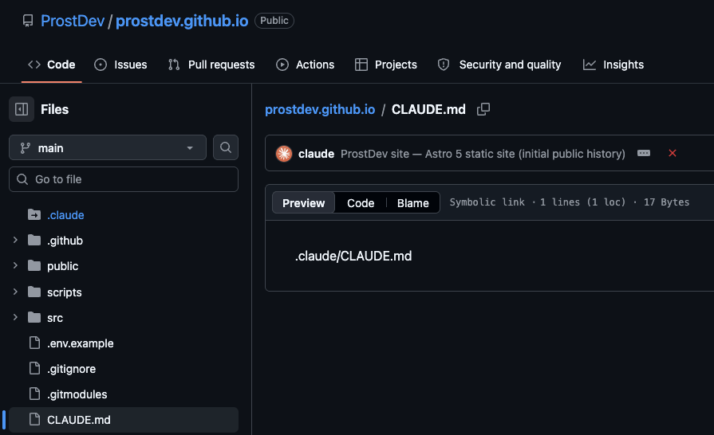
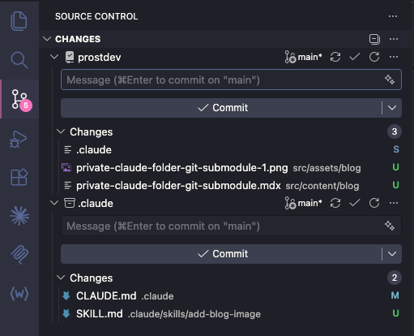

I build in the open. This site's whole [codebase](https://github.com/ProstDev/prostdev.github.io) is a public GitHub repo, and I like it that way. But my `.claude/` folder is a different story. It holds the skills, subagents, and `CLAUDE.md` instructions I've spent months tuning, plus notes I'd rather not hand to a scraper. I wanted the project public and that one folder private.

The fix is a [git submodule](https://git-scm.com/book/en/v2/Git-Tools-Submodules). 

`.claude/` becomes its own private repo, wired into the public project. That folder holds all my [AI agent skills](/post/what-are-ai-agent-skills-and-how-to-use-them), subagents, and instructions, so keeping it private matters. There's one snag with `CLAUDE.md` that I'll walk you through, because Claude Code expects it at the repo root but I want the real file inside the private folder. A relative [symlink](https://en.wikipedia.org/wiki/Symbolic_link) solves it.

This is exactly how prostdev.com is set up. Here's the whole thing, start to finish.

> [!TIP]
> You can follow these steps by hand, or you can hand them to your AI. Every step below is a plain command with the reasoning spelled out, so a coding agent like Claude Code can run the whole thing for you. If you go that route, paste the steps in, tell it your GitHub owner and the repo names you want, and ask it to stop and check with you before it creates the private repo or force-pushes anything. Those are the two steps you don't want an agent doing unsupervised.

> [!NOTE]
> This guide is written for macOS and Linux. The `CLAUDE.md` symlink step relies on POSIX symlinks, which Windows checkouts don't always materialize the same way.

## What you'll end up with

Two repos instead of one:

- **A public repo.** Your actual project (this site, in my case). Anyone can read it.
- **A private repo.** Just the contents of `.claude/`: your skills, agents, docs, and the real `CLAUDE.md`.

The private one is pulled into the public one as a submodule at the `.claude/` path. To anyone browsing your public repo, `.claude` looks like a pointer to a commit in another repo. They can't see what's inside unless you grant them access.



Two extra payoffs beyond privacy. First, you can **reuse that internal config across projects.** Point a second project's submodule at the same private repo and every skill comes along. Second, your `.claude/settings.json` (which can hold machine-specific paths) stays out of both repos entirely, which I'll cover near the end.

## Before you start

You'll need the [GitHub CLI](https://cli.github.com/) (`gh`) authenticated, and a project that already has a `.claude/` folder with real content in it. Confirm `gh` is signed in:

```bash
gh auth status
```

If that prints your account, you're good. Everything below runs from the root of your public project.

> [!WARNING]
> A few of these steps rewrite git history and delete the local `.claude/` folder before re-adding it. Commit or stash any uncommitted work first, and don't run this on a folder whose contents you haven't pushed somewhere safe.

## Step 1: Move the real CLAUDE.md inside .claude

Claude Code reads `CLAUDE.md` from your project root. But I want the *real* file versioned in the private repo, so it needs to live inside `.claude/`. We'll reconcile that with a symlink in a later step. For now, move it in:

```bash
git mv CLAUDE.md .claude/CLAUDE.md
```

If your `CLAUDE.md` wasn't tracked yet, use plain `mv` instead. If you already keep it at `.claude/CLAUDE.md`, skip this step. Either way, the source of truth is now `.claude/CLAUDE.md`.

## Step 2: Ignore your settings files in both repos

`settings.json` and `settings.local.json` hold per-machine and personal config (local paths, permission choices). They shouldn't live in *either* repo. Add them to the `.gitignore` inside `.claude/`:

```gitignore title=".claude/.gitignore"
# Claude Code: ignore personal/local settings (keep shared skills/agents/CLAUDE.md)
settings.json
settings.local.json
.DS_Store
```

Then make sure your project root's `.gitignore` ignores them too, so they can't sneak in from the top:

```gitignore title=".gitignore"
settings.json
settings.local.json
```

If either file is *already* tracked, untrack it without deleting your copy on disk:

```bash
git rm --cached .claude/settings.json .claude/settings.local.json
```

The `--cached` flag is the important part. It removes the file from git's index but leaves the actual file sitting in your folder, working as before.

## Step 3: Create the private repo from your .claude contents

Now we give `.claude/` its own git history and push it to a new private repo. To avoid disturbing the main project's git state, do this in a throwaway copy of the folder, *outside* your project tree:

```bash
cp -R .claude /tmp/claude-internal
cd /tmp/claude-internal
rm -rf .git          # drop any leftover git metadata from the copy
git init
git add -A
git commit -m "Initial import of .claude internal config"
```

Add a short `README.md` first if the folder doesn't have one, so the repo isn't bare. Then create the private repo and push, using `gh`:

```bash
gh repo create your-name/project-internal --private --source=. --remote=origin --push
```

Swap `your-name/project-internal` for the owner and name you want. `--private` is what keeps it locked down, `--source=.` points it at this folder, and `--push` sends the commit up immediately.

> [!IMPORTANT]
> This is the one step that publishes something. Double-check the repo name and the `--private` flag before you run it. Everything before this was local.

## Step 4: Replace the local folder with a submodule

Back in your public project, remove the plain `.claude/` folder from git and re-add it as a submodule pointing at the repo you just created:

```bash
cd /path/to/your/public/project
git rm -r --cached .claude
rm -rf .claude
git submodule add https://github.com/your-name/project-internal.git .claude
```

The `git rm -r --cached` stops tracking the folder's files directly. The `rm -rf` clears the local copy (it's safe now, everything is up in the private repo). And `git submodule add` clones the private repo into `.claude/` and records the link.

You'll see a new `.gitmodules` file. It should look like this:

```ini title=".gitmodules"
[submodule ".claude"]
	path = .claude
	url = https://github.com/your-name/project-internal.git
```

Confirm the submodule is healthy:

```bash
git submodule status
```

A line beginning with a space and a commit hash, ending in `(heads/main)`, means the submodule is checked out and clean.

## Step 5: Recreate CLAUDE.md as a symlink

Here's the trick that ties it together. The real file is now at `.claude/CLAUDE.md`, but Claude Code looks for `CLAUDE.md` at the project root. So we create a symlink at the root that points into the submodule:

```bash
ln -s .claude/CLAUDE.md CLAUDE.md
```

Use the **relative** target `.claude/CLAUDE.md`, not an absolute path. A relative link resolves no matter where the repo is cloned; an absolute one would break on anyone else's machine. Verify it:

```bash
ls -la CLAUDE.md
```

You should see something like `CLAUDE.md -> .claude/CLAUDE.md`, and the file will be tiny (about 17 bytes, the length of the target path). That's the tell that it's a symlink and not a copy. Reading it should show your real instructions:

```bash
cat CLAUDE.md   # prints the content of .claude/CLAUDE.md through the link
```

Now stage it. Git stores a symlink as a special entry (mode `120000`), not as a duplicate of the file's contents:

```bash
git add CLAUDE.md
```

When you commit, `git ls-files -s CLAUDE.md` will confirm the `120000` mode. That's how you know git recorded the link itself rather than inlining the file.

## Step 6: Learn the two-repo commit rule

From here on, your project is **two git repos**, and where a file lives decides which one you commit to.

- Edit a **project file** (source code, a config, a blog post)? That's one ordinary commit in the public repo.
- Edit an **internal file** (a skill, a subagent, a doc, or `CLAUDE.md`)? That's a **two-step commit**.

The internal edit goes *inside the submodule first*, then the public repo records the new pointer:

```bash
# 1. Commit inside the submodule
git -C .claude add CLAUDE.md
git -C .claude commit -m "Tweak instructions"
git -C .claude push

# 2. Bump the gitlink pointer in the public repo
git add .claude
git commit -m "Bump .claude submodule pointer"
```

The submodule commit has to exist and be pushed *before* the public repo points at it, or you'll reference a commit nobody else can fetch. When you run `git status` in the public repo and see `modified: .claude (new commits)`, that's not a stray change. It's git telling you the pointer is behind and you still owe step 2.

For example, this is how the Source Control tab looks like in my local once I've modified files in the `.claude/` folder. First, I have to commit the files at the bottom (`.claude`), and then the files at the top (`prostdev`). Note how the `.claude` change at the top has an `S` for Submodule.



## Step 7: Fix the clone gotcha

There's one catch that trips up everyone, including future you on a new laptop. A normal `git clone` of your public repo brings down an **empty** `.claude/` folder. The submodule contents don't come automatically.

Clone with the submodule in one shot:

```bash
git clone --recurse-submodules https://github.com/your-name/your-project.git
```

Already cloned the plain way? Pull the submodule in after the fact:

```bash
git submodule update --init
```

Because this bites everyone, say so in your public repo's README. A single line ("clone with `--recurse-submodules`") saves the next person a confused ten minutes wondering why Claude Code has no skills.

## Purge the private files from your git history

Step 4's `git rm -r --cached .claude` stops git from tracking those files *going forward*. It does not remove them from the commits you already made. Git history is append-only by default, so every earlier commit still holds the full contents of `.claude/`, viewable by anyone who checks out an old commit. If the whole point is privacy, "untracked from now on" is not enough.

The ideal is to never let the internal files reach the public repo's history in the first place: do this split before your first commit, or at least before you push. When that ship has already sailed, here's what to do based on where you are.

> [!IMPORTANT]
> Removing a file from the latest commit is not the same as removing it from history. Until you rewrite history, `git log` and any old checkout still expose it.

### If they never got committed

Best case. If `.claude/` was gitignored or split out before your very first commit, there's nothing in history to clean. Confirm it:

```bash
git log --all --oneline -- .claude
```

No output means the path never appeared in a commit, and you're done.

### If they're only local and not pushed yet

This is the easy one, because rewriting history is safe when nobody else has your commits. The bulletproof move is to collapse everything into one fresh commit of the current, correct state (symlink plus submodule, zero private files). You lose your old commit *messages*, but you get a guaranteed-clean history:

```bash
git checkout --orphan clean-history   # a new branch with no parent
git add -A
git commit -m "Public project (private .claude lives in a submodule)"
git branch -D main                    # drop the old history
git branch -m clean-history main      # promote the clean branch to main
```

Because you started from an orphan branch, the new `main` has exactly one commit and no trace of the old `.claude/` files. You never pushed, so there's nothing to force and nobody to coordinate with.

### If they were already pushed

Now the files are public, and two things are true. First, you have to rewrite history *and* force-push it. Second, and this matters more: **treat anything sensitive in those files as already leaked.** Clones, forks, and GitHub's own caches may still hold the old commits, so rotate any API keys, tokens, or secrets that were exposed. A history rewrite is not a substitute for rotation.

To rewrite while keeping the rest of your history, use [git-filter-repo](https://github.com/newren/git-filter-repo) (install it once with `brew install git-filter-repo`):

```bash
git filter-repo --path .claude --invert-paths
```

That strips every `.claude/` entry from every commit. It also rewrites all your commit hashes and drops the `origin` remote as a safety check, so re-add your remote, re-wire the submodule (repeat Step 4), then force-push:

```bash
git remote add origin https://github.com/your-name/your-project.git
git push --force origin main
```

Don't want to keep the old history at all? The orphan-branch reset from the previous section works here too. Just add `git push --force origin main` at the end, and warn anyone else who cloned the repo, because their history no longer matches yours.

> [!CAUTION]
> A force-push rewrites shared history. If other people have cloned or forked the repo, coordinate with them first. And whatever you do, rotate any secret that was ever pushed. Removing it from history does not un-leak it.

## Wrapping up

That's the whole pattern: a private submodule at `.claude/`, a relative `CLAUDE.md` symlink so Claude Code still finds its instructions, settings files ignored in both repos, a two-step commit for anything internal, and a clean history with none of those private files ever committed to the public repo. The upfront cost is one afternoon of git wrangling. What you get back is a project you can develop fully in the open without publishing the config you've invested real time in, and an internal toolkit you can drop into the next project by pointing a new submodule at the same private repo.

If you set this up and Claude Code suddenly can't see your skills, the first thing to check is whether the submodule actually populated. Run `git submodule status` and `ls .claude/` before you debug anything fancier.
