Hi there! You’re probably here because you want to create a blog post with us. Awesome! Let’s get started.

If you’re a new writer, please take a moment to read through this post to understand the different guidelines and standards when publishing in ProstDev. Also, feel free to look at the other content creation articles to read about best practices and tips for writing: [Content Creation articles](http://www.prostdev.com/blog/categories/content-creation).

- Google Doc Template
- Activating Word Count
- Blog Post Title (under 100 characters)
- Excerpt (max. 140 characters)
- SEO Description (max. 500 characters)
- Article Formatting
- Start the Review Process

## Prerequisites

If you’re not familiar with any of the following tools/terms, please take a moment to get acquainted with them before starting this guide.

- [Google Drive / Google Docs](https://support.google.com/drive/answer/2424384?co=GENIE.Platform%3DDesktop&hl=en)
- [SEO (Search Engine Optimization)](https://en.wikipedia.org/wiki/Search_engine_optimization)
- [Gist files](https://docs.github.com/en/github/writing-on-github/creating-gists)

## 1. Google Doc Template

First of all, open the following Google Doc template to have a starting point: [https://docs.google.com/document/d/1oCEdZXUnRY86MOogWeTR6Jm5IbGyvVhqoyjD9oXY-eA/edit?usp=sharing](https://docs.google.com/document/d/1oCEdZXUnRY86MOogWeTR6Jm5IbGyvVhqoyjD9oXY-eA/edit?usp=sharing)

Make sure to be logged in to Google Drive, or click on the “Sign In” button in the top right corner.

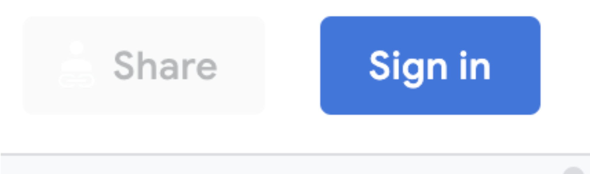

After this, you can select File > Make a copy.

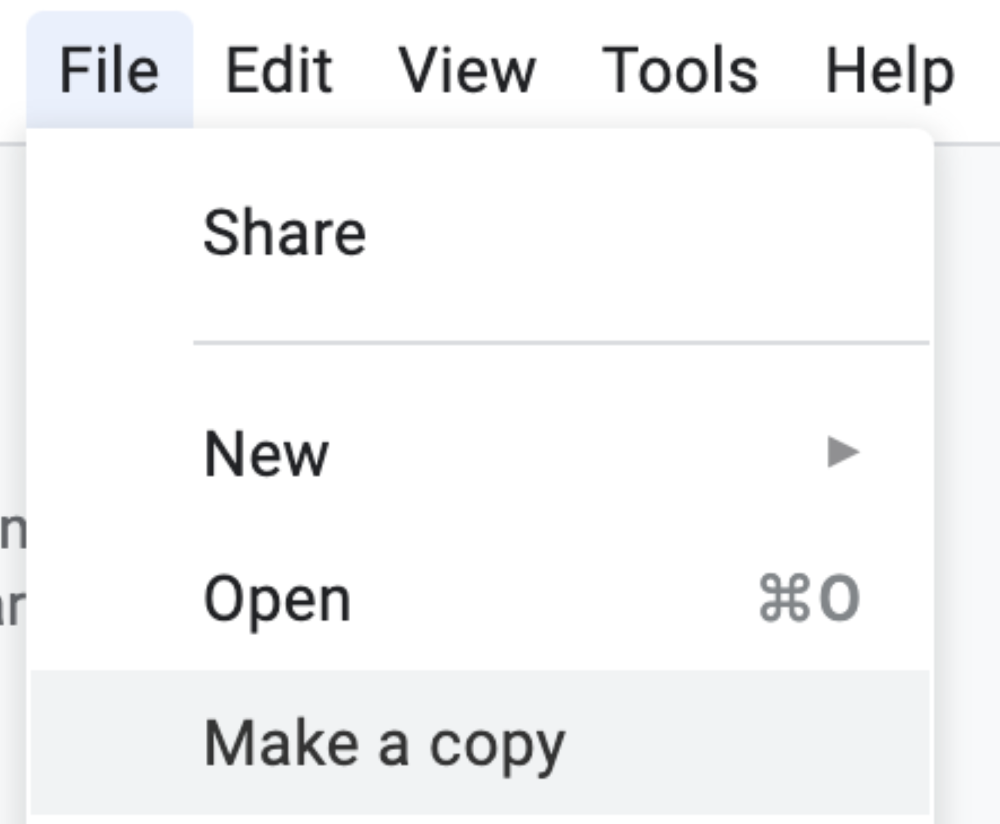

Change the name and select in which folder you want to save it. Click “OK.”

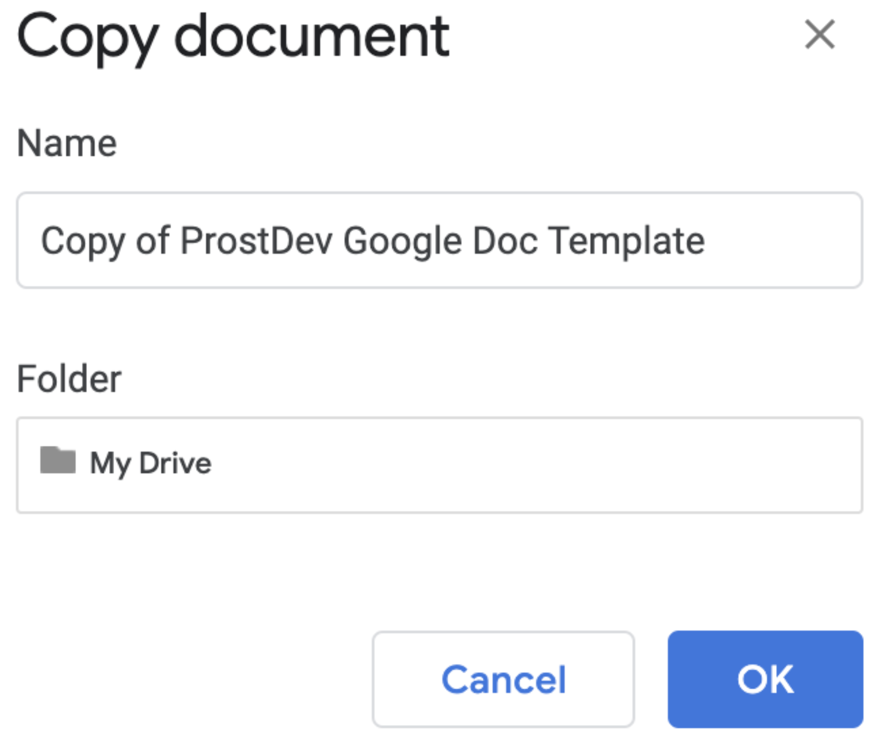

Now you can start editing the template with your own content!

> [!NOTE]
> Please continue using Google Docs to create your post because the review process will happen on this platform. You can also create your post in other platforms or tools, but you’ll then have to move the content into a Google Doc to continue with the process.

## 2. Activating Word Count

This is a neat trick that I *always* use when I’m reviewing or writing a post. In your Google Doc, select Tools > Word count.

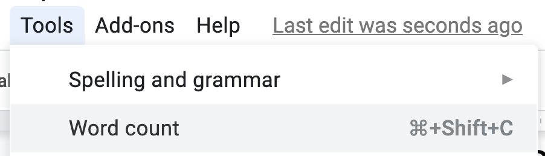

After this, activate the “Display word count while typing” option and click “OK.”

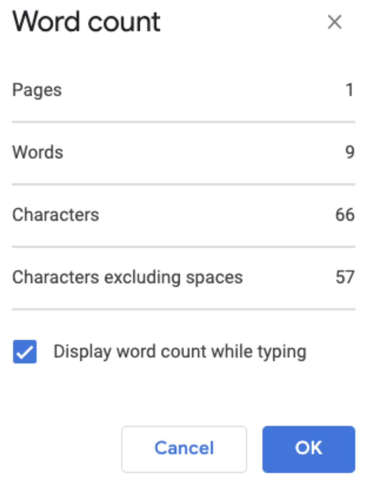

This will add a floating menu/button in the bottom left corner of the document to see the different counts.

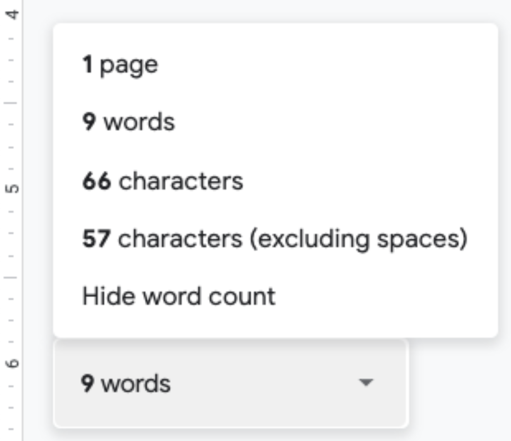

If you haven’t selected any text, the count will be from the entire document. If you highlight some text, then this count will be only from the selected area. This will help you to keep the desired word/character count in the next steps.

> [!NOTE]
> Try to keep your article less than 2,000 words if possible. The average is 1,500. If you’re writing a very long post, it’s best to break it down into several articles and create a series instead.

## 3. Blog Post Title (under 100 characters)

You can find some ideas to choose your title in this post - [7 tips to start writing your technical blog post](https://www.prostdev.com/post/7-tips-to-start-writing-your-technical-blog-post)*.* You will want to include some keywords so people can find your content more easily when they search on Google or other search engines (but keep the title under 100 characters!).

For example, if your content is about programming in Java, make sure to include the keyword “Java” in your title. Or if the article is also focusing on showing how the “toString” method works, then have that keyword too. A good title could be something like “How to use the toString method in Java.”

Identify between 2-5 keywords that *must* be included in the title first, and then see how you can structure it to be under 100 characters. If your title is too long, some keywords will have to be cut out, but don’t worry! You’ll learn how to still include them in other parts of the post for a better [SEO](https://en.wikipedia.org/wiki/Search_engine_optimization).

## 4. Excerpt (max. 140 characters)

Add a very short description (less than 140 characters) of your content so the audience can get a better idea of what they’re about to read. This can also be a “hook” to keep readers interested in your content.

> [!NOTE]
> It’s not necessary to include any keywords here. This is just for the actual reader and not for the search engines.

For example, “In this post, I explain how to use the ‘toString’ method and some of the most performant ways to use it.”

## 5. SEO Description (max. 500 characters)

*Now* we’re back to the SEO keywords that you couldn’t include in your title from step 3. Add a paragraph of 500 characters or less with the keywords that didn’t fit in the title because of the character restriction. This text does not have to appear in the actual article. It can be added to the SEO Description without the need to add it to the post.

This description will appear in the search results (for example, from Google), so try to think like your target audience. Ask yourself, “What would a person be *googling* to find my article?”

For example, “How to use the ‘toString’ method in Java. Understanding ‘toString’. Transforming an Integer / Boolean into a String.”

Try searching for some stuff yourself to see what the description includes in the results to give you a better idea of what you could put in this paragraph. Just make sure that what you add in the SEO Description is something you actually included in your content. Otherwise, your audience will feel “fooled” and won’t come back to see more *(also, it’s not cool to add keywords just to get clicks. You’re creating quality content!)*.

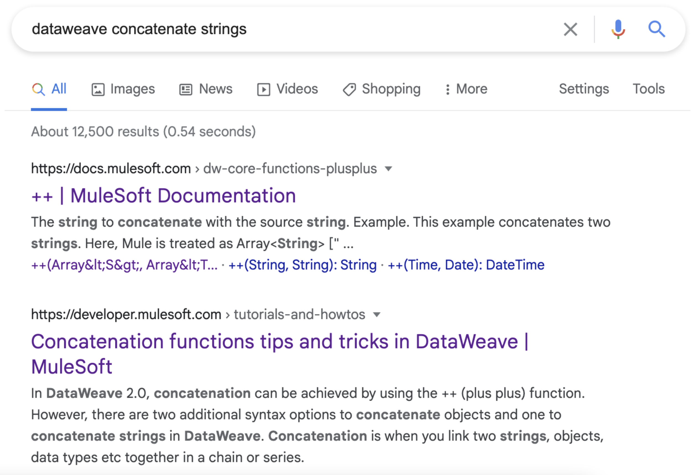

## 6. Article Formatting

Add the first subtitle after the introduction (steps 3-5) to separate the sections. After this, you can start developing your article.

Some formatting to keep in mind:

**1. Screenshots/pictures**

If you’re adding a screenshot or a picture, make sure you explain what is demonstrated before you show the image. You can also include additional information about the image under the picture. For example:

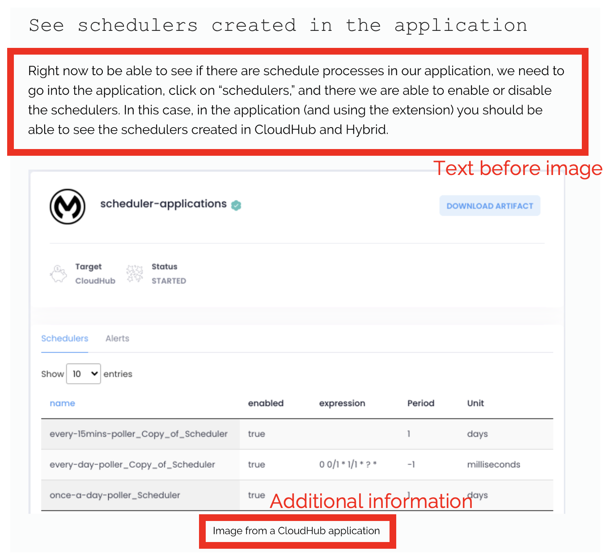

**2. Code**

Same as an image, explain what the code is doing before you show it. There are 3 different types of code that can be added in the article: in-line code, small scripts (approx. 1-10 lines), or large scripts (more than 10-15 lines).

Unfortunately, there’s no formatting for in-line code, so please add your variable name, property name, or any other code in between quotes. For example: *Use the “secondVar” variable to...*

Short pieces of code can be directly included in the post. For example:

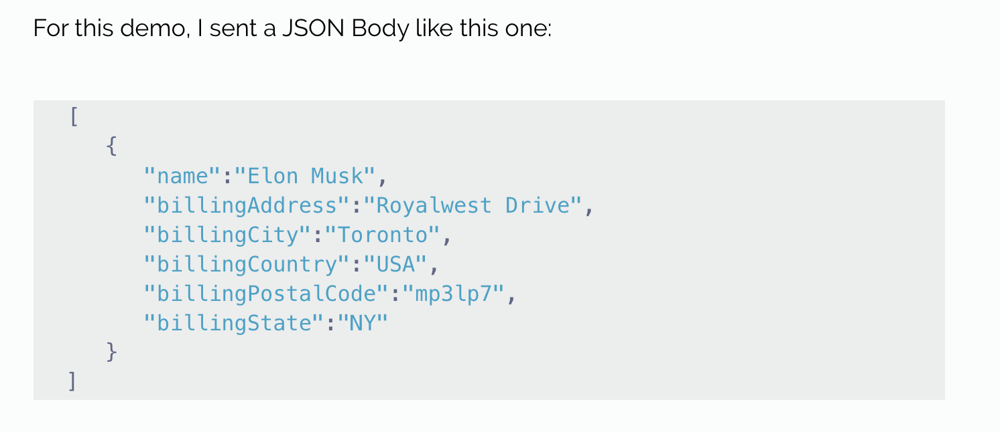

Large pieces of code should be added in a [gist file](https://docs.github.com/en/github/writing-on-github/creating-gists), and then provide the gist file link in your Google Doc. For example: [https://gist.github.com/alexandramartinez/798a12afe843c7218ae2564b9a0bc9d7](https://gist.github.com/alexandramartinez/798a12afe843c7218ae2564b9a0bc9d7)

The final output will look something like this:

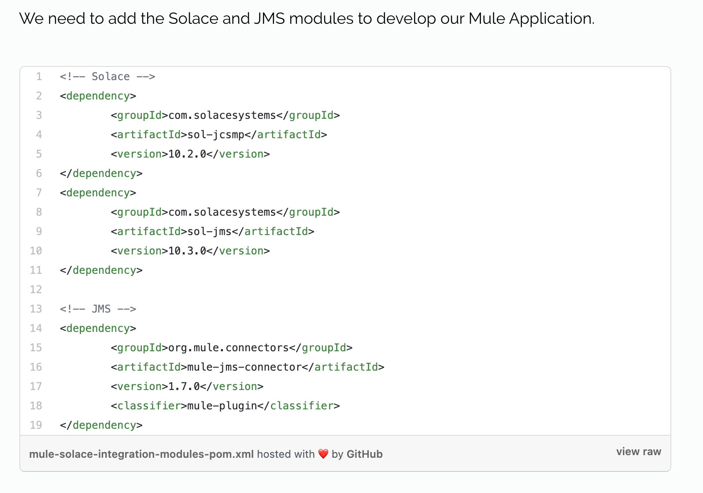

## 7. Start the Review Process

Once your article is all done, click that “Share” button in the top right corner of the screen.

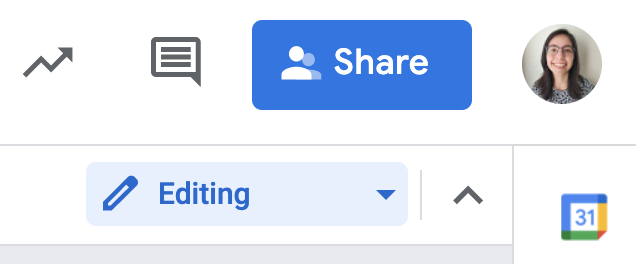

Select the “Anyone with the link” option, and you can either select “Commenter” or “Editor” as the role. The difference is that a “Commenter” can *suggest* changes, but you have to review and accept them, whereas an “Editor” can modify the document just as you can.

If you’re not familiar with the review process, you can select “Editor.”

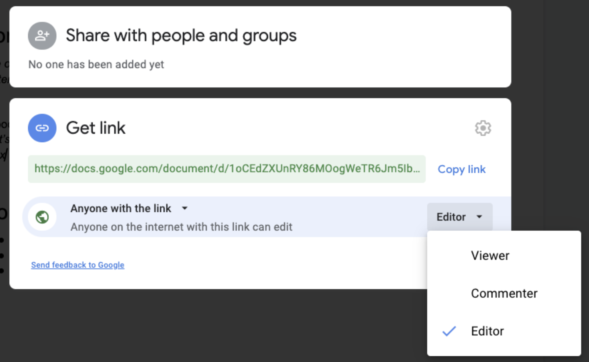

After that, click the “Copy link” button.

Now go to [ProstDev.com/contact](https://www.prostdev.com/contact) and go to the “Contribute” section. Paste the copied link into the “Link to your article” text box. Fill out the rest of the fields, and click “Submit.”

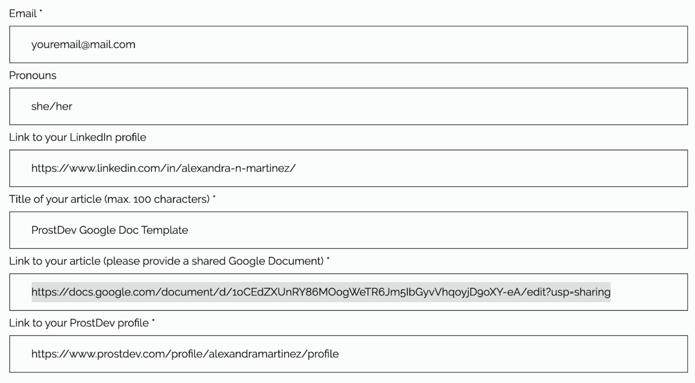

That’s it!

After that, we’ll review your article and provide feedback if anything needs to be changed. Once the review process is complete, we’ll schedule the content and create the social media.

## Recap

- **Make a copy** of the Google Doc Template into your own Google Drive. ([https://docs.google.com/document/d/1oCEdZXUnRY86MOogWeTR6Jm5IbGyvVhqoyjD9oXY-eA/edit?usp=sharing](https://docs.google.com/document/d/1oCEdZXUnRY86MOogWeTR6Jm5IbGyvVhqoyjD9oXY-eA/edit?usp=sharing)).
- **Activate the Word Count** option and try to keep your document less than 1,500-2,000 words.
- **Create your title** using keywords for a better SEO (max. 100 characters).
- **Create the post’s excerpt** for the reader (max. 140 characters).
- **Create the post’s SEO Description** (not added to the blog post) with additional keywords for the search engines (max. 500 characters).
- **Make sure to add explanations** before adding media and follow the code formatting for in-line, short, or large scripts.
- **Share your document** at [www.prostdev.com/contact](https://www.prostdev.com/contact) to start the review process.

If you have additional questions, take a look at the other blog posts in the [Content Creation category](https://www.prostdev.com/blog/categories/content-creation) for best practices and advice. You can also contact us or comment here if you still have questions.

Hope to see your articles soon :D

*Prost!*

-Alex
