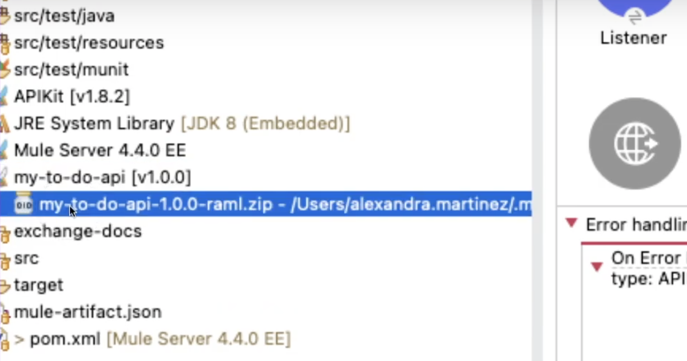
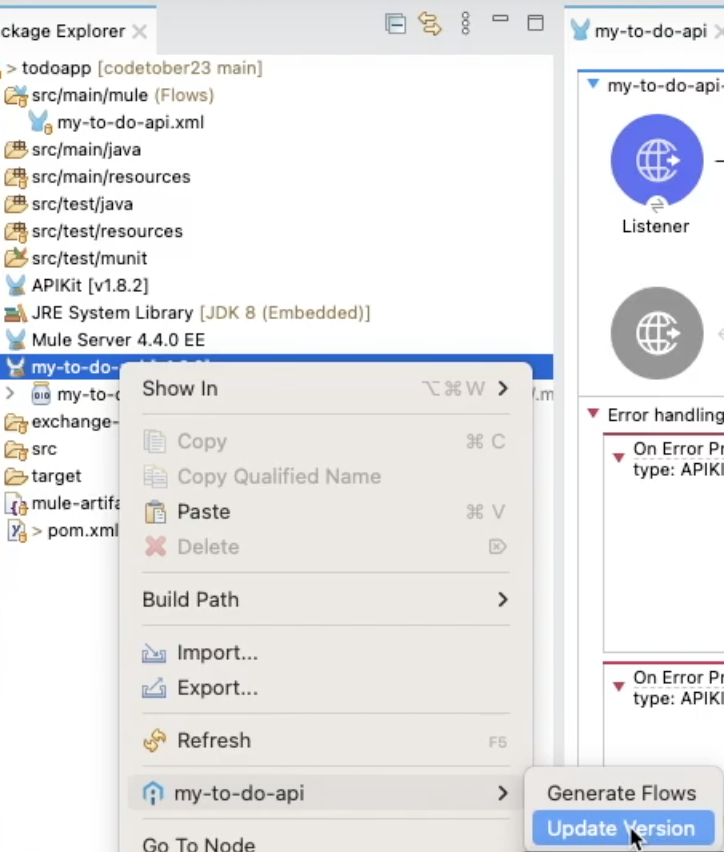
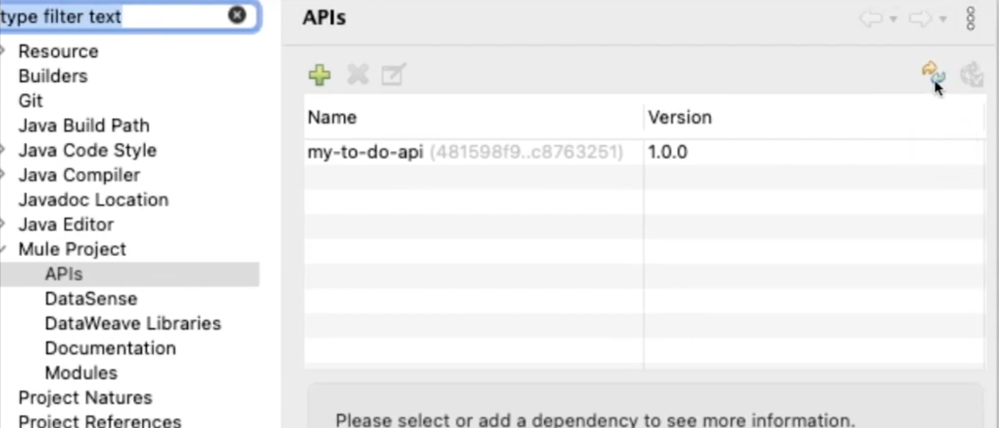
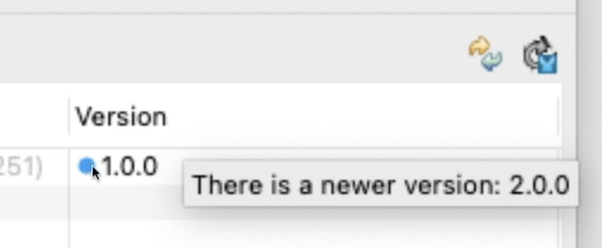
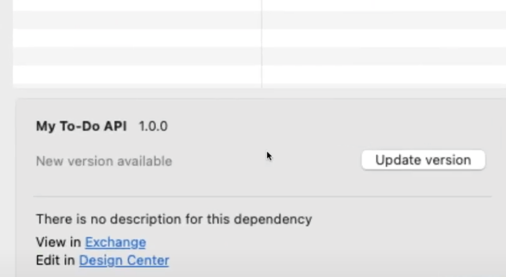
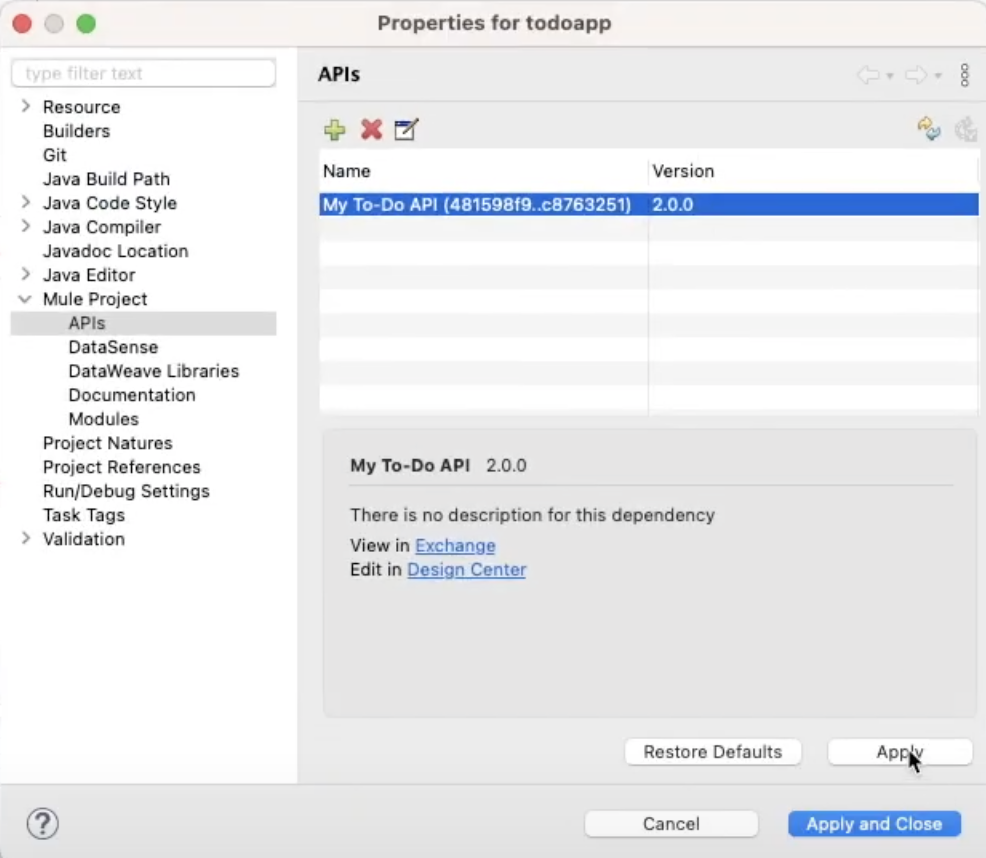
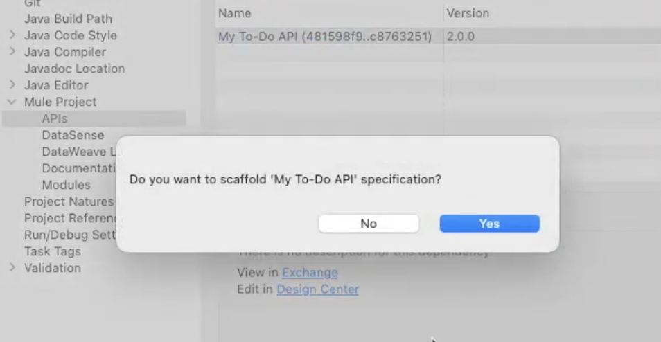
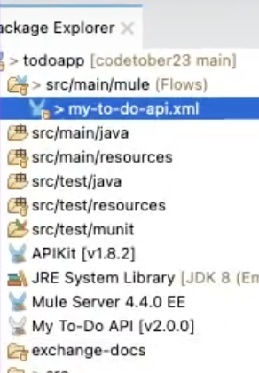

What happens when there is a change to a published API in Anypoint Exchange? How can we get these changes re-scaffolded to our API implementation once we have already done the scaffolding?

In this post, we'll learn how to re-scaffold our Mule project based on new changes done to the published API Specification in Exchange.

## Prerequisites

- **Anypoint Platform** - You should have an Anypoint Platform account. You can create a new free trial account [here](https://anypoint.mulesoft.com/login/signup).
- **API specification** - You should already have an API specification published in Anypoint Exchange.
- **Anypoint Studio** - MuleSoft's IDE based on Eclipse. You can download it [here](https://www.mulesoft.com/lp/dl/anypoint-mule-studio).
- **Scaffolded Mule project** - You should already have scaffolded the first version of the Mule project based on a previous version of the API specification since we're going to re-scaffold the same project with the new change in the specification. If you haven't done this yet, please refer to [part 1](https://www.prostdev.com/post/scaffold-mule-flows-from-published-api-specification) of this series.
- **GitHub Repo** - If you want to follow along with the code I generated, you can check it out [here](https://github.com/ProstDev/codetober23/tree/main/day3).

## Update the API specification's dependency version

Once our API Specification has been updated and published to Anypoint Exchange, our Mule project will become outdated and this is where we'll do the re-scaffolding to update the project to match the latest API specification version from Exchange.

In your Package Explorer in Anypoint Studio (located at the left of the screen), you will be able to find the name of your API Specification with the first version (in this case v1.0.0). If you open the dependency, you'll be able to see the .zip associated with the specification.

We want to change this version of the specification to the next available version, which in our case is v2.0.0, but it could be v1.0.1 or any other version your specification has as the latest. To do this, right-click on your API specification's dependency and select the name of the spec (in this case **my-to-do-api**). After that, select **Update Version**.

This will open a new window where you'll be able to refresh the APIs associated with the Mule Project by clicking the **Refresh** or **Update** button on the top-right side.

> [!IMPORTANT]
> If nothing happens when you click this button, it might mean that your credentials have expired. You will need to refresh them from **Anypoint Studio > Settings > Anypoint Studio > Authentication**. Remove your current Anypoint Platform credentials from this window and re-add them. Try refreshing the APIs one more time after refreshing the credentials.

Once the APIs are refreshed, you'll be able to see that there is a newer version of the API specification you're using in your project.

Click on the **Update version** button for this API to be refreshed.

Once it's refreshed, it will appear with the newest version. In this case, 2.0.0. Click **Apply and Close**.

Immediately after that, you will get a message asking if you want to scaffold the API specification. Select **Yes** to re-scaffold it.

After that, your API specification's dependency will appear with the new version in the Package Explorer and you'll be able to see your new changes in the API implementation.

Subscribe to receive notifications as soon as new content is published ✨

💬 Prost! 🍻
