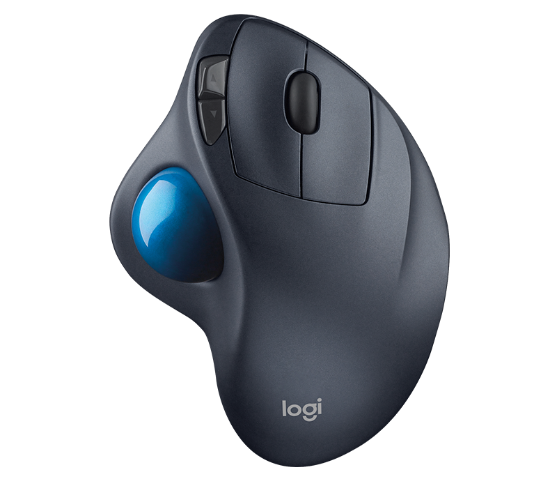
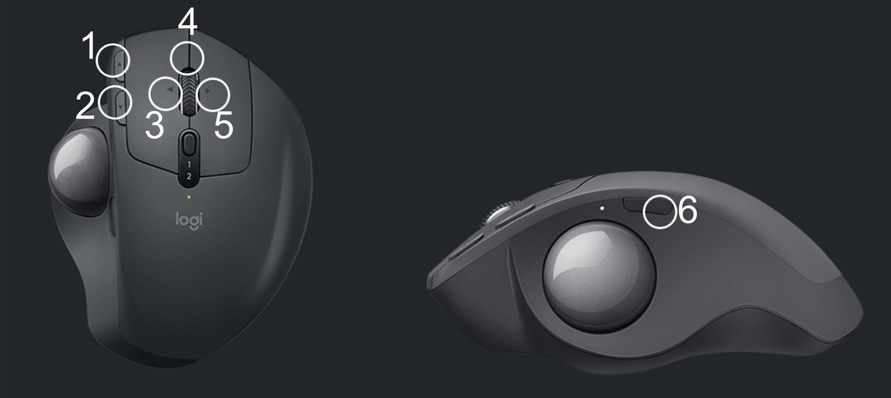
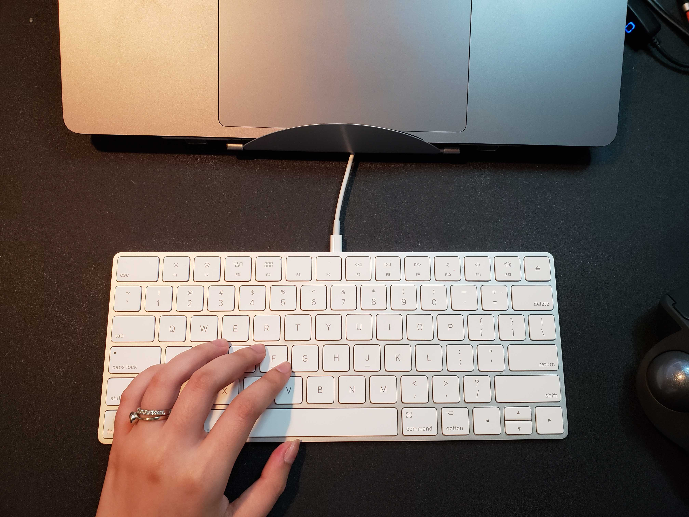
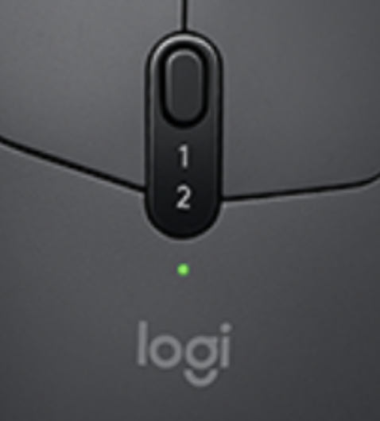

*Spanish version / versión en Español:* [Recomendación: Logitech MX Ergo Advanced (Plus) Wireless Trackball Mouse](https://www.alexandramartinez.world/post/recomendacion-logitech-mx-ergo-advanced-plus-wireless-trackball-mouse).

I bought this mouse less than 24 hours ago, and I’m already completely in love with it. I’m honestly even a little mad at Logitech for not sending me an email with the marketing for this product as soon as it came out, *LOL*!

## My previous mouse

Before starting with why I love my new purchase, let me give you a bit of background on my previous mouse. It was a [Logitech M570](https://amzn.to/3sTtftz) (also a wireless trackball mouse). I was pretty comfortable with it, but I always thought it needed more buttons. However, the newer versions still had pretty much the same number of buttons, so I never thought of upgrading it...until now.

If you don’t know what a trackball mouse looks like, here it is:

Why do I love these?

- I don’t need a mouse pad.
- I don’t need to move my hand; I just move my thumb.
- Less desktop space is needed.
- It can be used on almost any surface.

I say it needs more buttons because you basically have (1) the regular left-click, (2) right-click, and (3) scroll wheel button; *plus,* you can find the two buttons between the trackball and the left-click button.

I wanted to program several buttons to do some of my more common tasks - *I’ll mention them later in the post.* Unfortunately, I was only able to use buttons 3, 4, and 5 for my custom functions.

There are a lot of mice with more than 5 programmable buttons, but I wanted it to be specifically a trackball mouse. This brings me to my new toy!

## Logitech MX Ergo Advanced (Plus) Wireless Trackball Mouse

[This mouse](https://amzn.to/3eVb5z6) has **9** buttons in total! The picture may be misleading because it’s only pointing to the *6 programmable* buttons, but it’s not counting the left-click, right-click, and the small button in the middle that says 1 and 2. These 3 buttons will always maintain their specific functions and cannot be changed.

I’m sure you’re curious as to what I have programmed these 6 buttons to do. Here it goes:

- Left-top button: Delete.
- Left-bottom button: Enter/Return.
- Scroll wheel left button: Move to the desktop to the left (for Mac computers).
- Scroll wheel middle button: Screen capture.
- Scroll wheel right button: Move to the desktop to the right (for Mac computers).
- Button over the trackball: Maximize/minimize window.

Before I got an additional keyboard, I didn’t have to use numbers 3 and 5 that often. I could just use my Macbook’s trackpad to swipe left/right and change my desktop. However, after acquiring the keyboard, this became a bit more work. I had to either reach out to the laptop’s trackpad with my left hand or use the keyboard shortcut with my right hand (which I had to switch between the keyboard and the mouse). Neither option was good enough for me.

With my previous mouse, I had to start using the two additional buttons (4 and 5) to move to the left/right desktop. So, my previously programmed keystrokes (Delete and Enter/Return) were no longer in the picture. This, again, was not good enough for me.

Now I get to have all my 4 favorite tasks PLUS 2 more buttons that make my life easier!

## Is that all?

Of course not! This mouse is a MASTERPIECE! But the buttons were my biggest need. Also, the M570 requires one AA battery, but the MX Ergo can be recharged with a USB.

By the way, remember the middle button with the 1 and 2 numbers underneath it that you could not program?

Well, that button is for alternating between 2 different computers with the same mouse! This is incredibly useful if you’re using several systems at the same time. It can be annoying to have to use different hardware for the same purpose. I tested this functionality, and it doesn’t even have a lag to it. Once you push the button, the other computer can be used immediately — no need to wait for even 1 second.

It still has more great specs, but they weren’t *that* important for my day-to-day. You can read more about them [here](https://www.logitech.com/en-ca/products/mice/mx-ergo-wireless-trackball-mouse.html).

Finally, I leave you this quick 30-second video for a preview!
