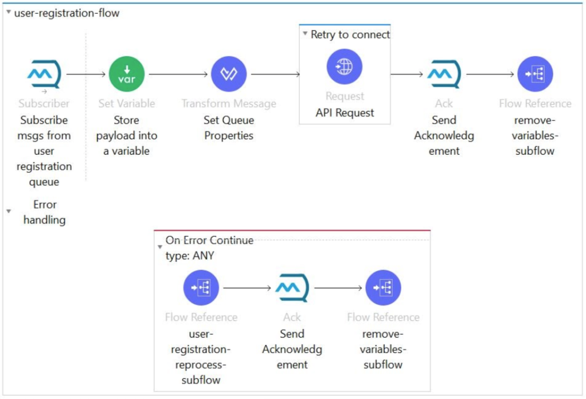
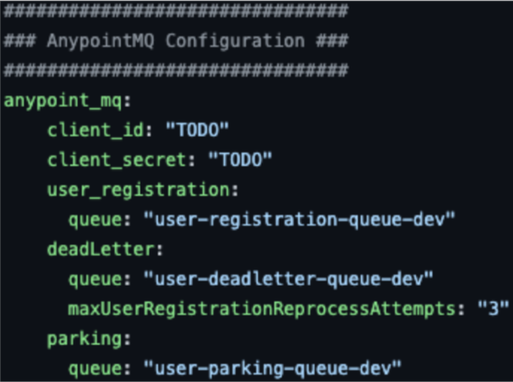
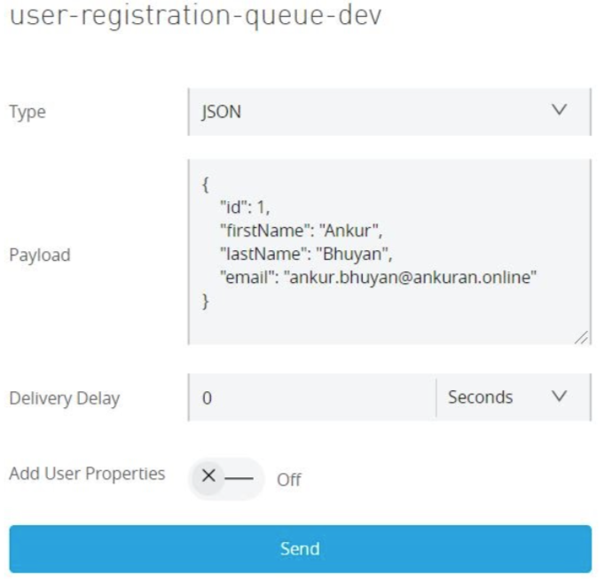
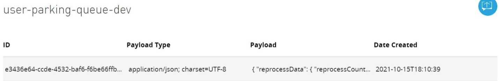

*GitHub repository with the Mule project and the spring boot application can be found at the end of the post.*

In any MuleSoft project, when Anypoint MQ comes into the picture there is always a requirement of retry and reprocess mechanism. Based on my experience I have prepared this blog to show how easily we can design retry and reprocess mechanisms.

## Requirement

The main flow of the Mule app will subscribe to a queue and the payload has to be sent to the backend via an HTTP call. While sending the subscribed payload to the backend via HTTP. If the backed system is down (during sending the HTTP request), how are we going to define our flow to perform the retry and reprocess mechanism?

## Step 1

Put the HTTP request inside an **until-successful scope**. Which is a default scope provided by MuleSoft for retrying any event. Define the below parameters in the scope:

- **maxRetries**: Number of retries the request will do to try to connect with the backend service.
- **millisBetweenRetries**: After the retry performs, how much time the application should hold for the next retry.

Code for backend call using until-successful:

```xml
<until-successful maxRetries="${api.retry.number_of_retry}" doc:name="Retry to connect" millisBetweenRetries="${api.retry.milliseconds_between_retry}">
	<http:request method="POST" doc:name="API Request" config-ref="LOCAL_HTTP_Request_configuration" path="${api.path}" responseTimeout="${api.response_timeout}" target="backendResponse"/>
</until-successful>
```

## Step 2

If we can't connect to the backend even after using the until-successful scope (retry process), we have to introduce a reprocess mechanism. To enable the reprocess mechanism, we have to call a subflow (which will perform reprocess) from the "**On Error Continue**" of the main flow.

> [!IMPORTANT]
> We have to acknowledge the subscribed queue in both HAPPY or ERROR scenarios. If we don't do that, the queue will hold the message and it may lead to a duplicate process.



## Step 3

To introduce the reprocess mechanism we have to define **two** queues.

**1. Dead letter queue**

This queue will work as an intermediate queue. This means, after failing the retry process we will store the message in this queue for re-processing. While sending the message to DLQ, we are going to pass two values in MQ properties:

- **reprocessCount**: This value is going to be used as a counter of the reprocess call.
- **qname**: The main queue name from which our application is subscribing to the messages.

Apart from the above two MQ properties, we have to define a property in the properties file. Which will be the maximum re-process count.

- **maxUserRegistrationReprocessAttempts: "3"** - This means the reprocess will happen (Main Queue - DLQ) only three times.

**2. Parking queue**

This queue will be treated as the final destination of the processing message. This means if both mechanisms (retry and reprocess) fail, the message will be stored in this queue (which will reprocess again).

The reason for introducing the parking queue is 100% delivery/processing of each message (at any condition).

We can introduce an additional flow, which will reprocess the landed message from parking to the main queue. We can define this in many ways. One of the ways is: Once the parking queue is filled with a certain limit an email will trigger to the support team. After receiving the email, the support team can trigger an endpoint that will start pulling the messages from the parking queue and pushing them to the main queue (using parallel for each component).

## How to test the POC

Deploy the Mule app in Anypoint Studio and the spring boot app in eclipse or CMD.

Define the main queue, dead letter queue, and parking queue according to your requirements and update the CI/CS of the Anypoint client app (by using the MQ portal).



**Happy flow**: After the successful deployment of both Mule and the backend application, send a message as shown below. The flow will execute without any error.



**Error flow**: To test the retry and reprocess flows, we have made the backend unavailable. So, we have to deploy only the Mule app (should not deploy the spring boot app) and send the message like above and observe the process in the log. After performing the retry and reprocess flows, the message will land in the parking queue as below.



## Conclusion

This POC is just to give an idea about retry and reprocess design using Anypoint MQ. There will be a lot of scopes to enhance the POC and prepare as per your requirement.

Finally, I will be more than happy to receive your valuable feedback.

## GitHub repository

Kindly find the complete Mule and backed (spring boot) application [here](https://github.com/anky123/ankuran.online.mule4/tree/master/project07%20%7C%20retry-process-with-mq).
