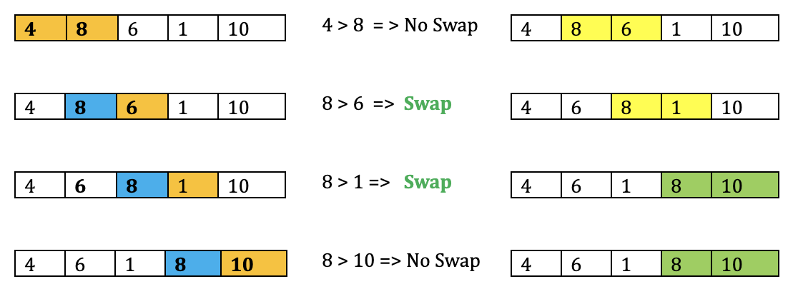
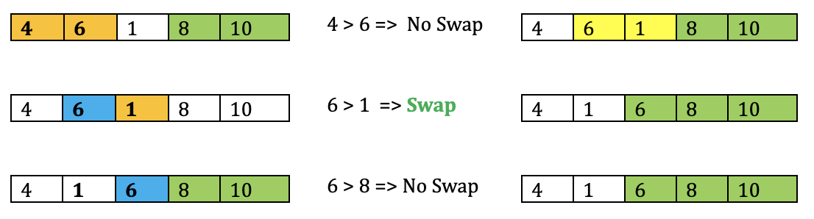
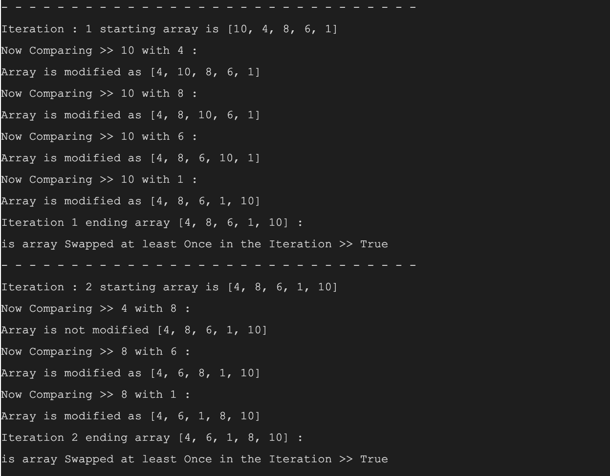
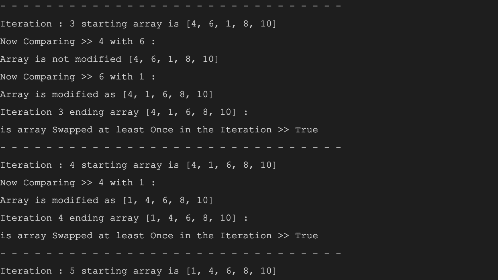
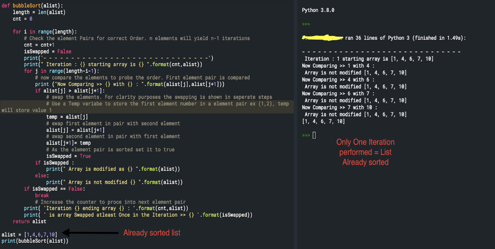
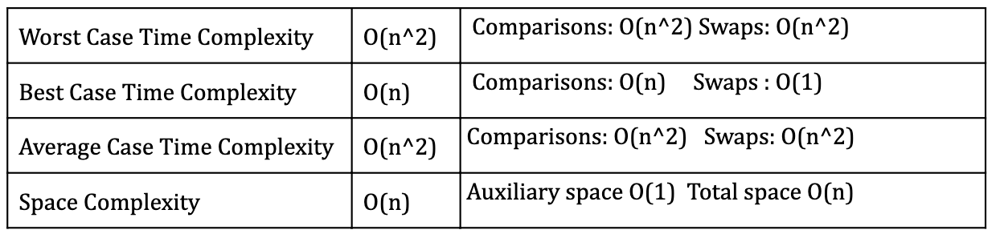
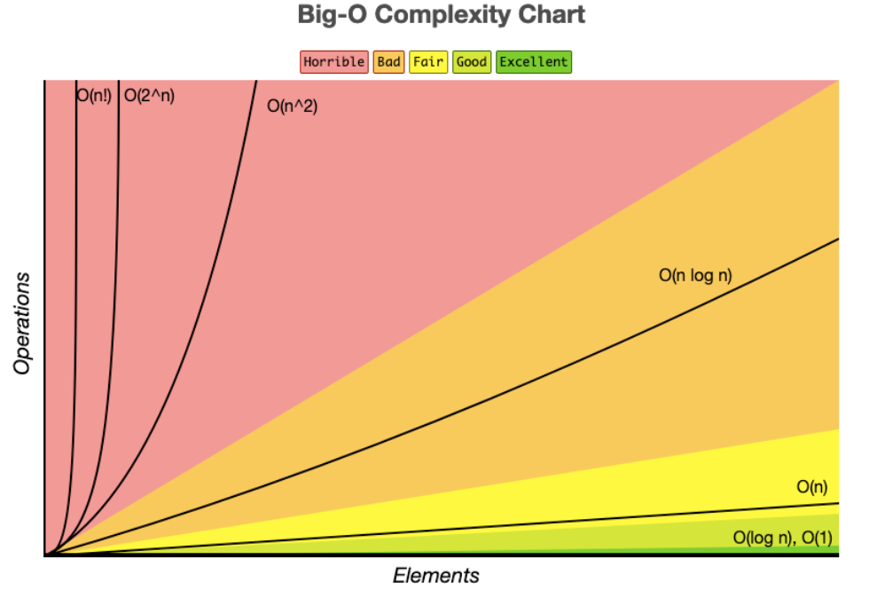

Let’s sort it out!

In this series of posts, we will be discussing basic computer science algorithm sorting techniques. Yes, you are right we are here again trying to shake up our memory boxes for these algorithms long forgotten. Recently, I attended an interview for a Silicon Valley company, and you guessed it right, KO (Knock Out) coding rounds were the appetizers and I figured pretty much on my day 1 of coding interview preparation, that I'm not serving KO’s back on coding challenges.

You may most definitely choose to agree with me that we always remember the most popular and unpopular of everything. I was sure the most unpopular sorting technique was “Bubble Sort” and the popular one was “Quick Sort”. Basically, my statement is incorrect on many counts about the popularity of the sorting techniques, the most unpopular kid in your high school is pretty much popular for being not so.

## Why is sorting a big deal?

We know sorting things almost in every instance reduces the complexity of the problem at hand. Sorting is a well-solved problem in computer science, It puts any list coming out of a computer into a certain required order efficiently to reduce the searching complexity of the problem.

In a series of posts, we will be discussing some of the sorting algorithms listed in the below order:

- **Bubble Sort**
- [Selection Sort](https://www.prostdev.com/post/reviewing-sorting-algorithms-selection-sort)
- [Insertion Sort](https://www.prostdev.com/post/reviewing-sorting-algorithms-insertion-sort)
- [Merge Sort](https://www.prostdev.com/post/reviewing-sorting-algorithms-merge-sort)
- Quick Sort
- Heap Sort

Let’s start with the most popularly known Sorting technique. You are getting better at the game of *“who’s more popular!”*

## Bubble Sort

Bubble sort is a very simple comparison-based algorithm used to sort the elements which are out of order. It compares the two elements at a time to check for the correct order, if the elements are out of order they are swapped. The swapping of elements continues, until an entire sorted order is achieved. Although a naïve algorithm, knowing bubble sort helps in understanding the technicalities of sorting in comparison with other techniques.

Let’s play with the bubbles.

**Problem:** Sort the numbers 10, 4, 8, 6, 1. As mentioned earlier, bubble sort will compare the two pairs at a time.

Let’s start with the *first iteration* of the numbers:

![First bubble sort pass over [10, 4, 8, 6, 1], swapping pairs until 10 reaches the end](../../assets/blog/reviewing-sorting-algorithms-bubble-sort-1.png)

Rinse and repeat! Until the required sorting order is achieved. This begs the question, what if the problem has a very long list of elements to be sorted like for example 100 or 1000? Well, the number of iterations to check every pair of elements repetitively might exhaust you (n-1) times. Which means, it will take (n-1) iterations in order to sort a list of n elements. *Mind you, the above example was just the very first iteration and for* *n=5**, it takes a total of 4 iterations to complete the sorting.*

*2nd Iteration:*



*3rd iteration:*



*4th iteration:*

![Fourth bubble sort pass swaps 4 and 1, producing the fully sorted [1, 4, 6, 8, 10]](../../assets/blog/reviewing-sorting-algorithms-bubble-sort-4.png)

**Observations based on Iterations:**

- *‘n’* number of elements will undergo (n-1) iterations to complete the sort.
- If you have noticed, the max number in the list 10 is placed in its ordered position after the first iteration.
- Likewise, the next max number 8 will be placed in its sorted position after the 2nd iteration, 6 from the 3rd iteration and number 4 for the 4th iteration.
- Based on this pattern, we can see that in each iteration the largest element tends to move up in the correct order similarly to bubbles rising on the surface or the smaller elements bubbles up to top the list. Hence, the name suffices the feature as “Bubble Sort”.
- We also observed that it's totally not required to check the last pair after the 2nd iteration as they are already sorted in their place. This pattern is observed in the 3rd iteration too, where the last 3 elements are already sorted. Which means that for every ‘m’ iterations, checking last ‘m’ elements will be a repetitive activity and avoiding the check can result in an optimal bubble sorting solution.
- Hold on to these observations for now, as we still have to check why this kid on the sorting block is notoriously ‘unpopular’.

## Coding Demonstration of Bubble Sort using Python:

```python
# Function to demonstrate bubble sort technique
def bubbleSort(alist):
    length = len(alist)
    # Counter is used only for displaying iteration count
    cnt = 0

    for i in range(length):
        # Check the element pairs for correct Order. 'n' elements will yield n-1 iterations to achieve sorted list
        cnt = cnt+1
        isSwapped = False
        print('- - - - - - - - - - - - - - - - - - - - - - - - - - - - - -')
        print(" Iteration : {} starting array is {} ".format(cnt,alist))
        for j in range(length-i-1):
            # now, compare the elements to probe the order. Example : First element pair is compared
            print ("Now Comparing >> {} with {} : ".format(alist[j],alist[j+1]))
            if alist[j] > alist[j+1]:
                # swap the elements. For clarity purposes the swapping is shown in seperate steps
                # Use a Temp variabe to store the first element number in a element pair ex (1,2), temp will store value 1
                # Temp variable is not required for swapping, is used only for understanding the swap logic
                temp = alist[j]
                # swap first element in pair with second element
                alist[j] = alist[j+1]
                # swap second element in pair with first element
                alist[j+1]= temp
                # As the element pair is sorted set it to true
                isSwapped = True
            if isSwapped :
                print(" Array is modified as {} ".format(alist))
            else:
                print(" Array is not modified {} ".format(alist))
            # Increase the counter to process into next element pair
        print( 'Iteration {} ending array {} : '.format(cnt,alist))
        print( ' is array Swapped at least Once in the Iteration >> {} '.format(isSwapped))
        if isSwapped == False:
            break
    return alist

alist = [10,4,8,6,1]
print(bubbleSort(alist))
```

**Log Output:**





![Final log line: iteration 5 makes no swaps, confirming [1, 4, 6, 8, 10] is sorted](../../assets/blog/reviewing-sorting-algorithms-bubble-sort-7.png)

From the above code snippet, we have demonstrated our earlier example on how bubble sort bubbles up the largest number to the end of the list in each iteration.

What if the Incoming list is already sorted?

In this case, if there are no swaps performed in the first iteration, it's positive that the list is pretty much already sorted out.



## Time and Space complexity AKA why is this kid so Unpopular?

To achieve the sorted list, we had to iterate ‘n’ times through an array of ‘n’ elements, in order to check all the ‘n’ elements. Meaning, the bubble sort performs *‘n*’ iteration *‘n’* times making it n*n = n^2.

*But what is Time and space complexity? Why does it matter in this case?*

- In simple terms, time and space complexity analysis is required to analyze the resources required by an algorithm to complete the function of the input (ex: in our case sorting).
- Time complexity of an algorithm is the amount of time taken by the algorithm to complete processing as a function for given input length *n*. It is commonly expressed using asymptotic notations as given below table.
- Space complexity is the amount of runtime memory used by the algorithm to achieve the result. Total space includes auxiliary space and the space used by the input. Auxiliary space is the temporary space allocated by the given algorithm so achieve the result for a given input size. Overall, memory usage includes the memory used to save the compiled version of instructions, space used by variables and constants and in cases where algorithms function internally another algorithm function.





*Fig: Reference -* [bigocheatsheet.com](http://bigocheatsheet.com)

Best case time complexity: If the array is an already sorted list of elements, at most ‘n’ comparisons are made and no swaps are required. For example, input: [2,3,6,7,9,12]

Worst case time complexity: Array is fully unsorted or in descending order. Example: [10,4,8,6,1]

Average case time complexity: A mix of sorted and unsorted list of elements in the array.

Example: [19,15, 21,7,9,10]

Space complexity: Amount of memory required to run the algorithm grows no more than O(n). In our example, total space required would be for variables assigned and array size *n*.

To understand why bubble sort is the least preferred sorting technique, consider the input list is grown in size to a more significant number (n=1000), the amount of comparisons and swaps will increase significantly making it more inefficient. I believe now it’s clear why bubble sort is so unpopular, as there are other sorting techniques which have a better time complexity and can run much faster for an increasing input size. To that point, bubble sort is mainly used for educational purposes.

Stay tuned!!

I hope you enjoyed the post. Please subscribe to [ProstDev](https://www.prostdev.com/) for more exciting topics.

Hasta luego, amigos!

## Study Resources

As bubble sort is a well known algorithm, lots of resources can be found with varying examples on the internet. This blog post was written to provide a basic understanding of the bubble sort, for a short read to refresh your memory. Below are some resources which discuss bubble sort and Time-Space complexity.

- [The Bubble Sort - Runestone Academy](https://runestone.academy/runestone/books/published/pythonds/SortSearch/TheBubbleSort.html)
- [Bubble Sort Wiki](https://en.wikipedia.org/wiki/Bubble_sort)
- [Bubble Sort - CS50 Harvard](https://www.youtube.com/watch?v=8Kp-8OGwphY)
- [Asymptotic-Notation- Khan Academy](https://www.khanacademy.org/computing/computer-science/algorithms/asymptotic-notation/a/asymptotic-notation)
- [Big-O cheat sheet](https://www.bigocheatsheet.com/)
