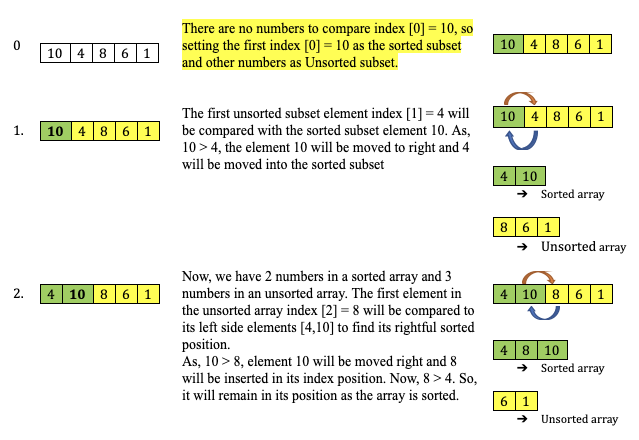
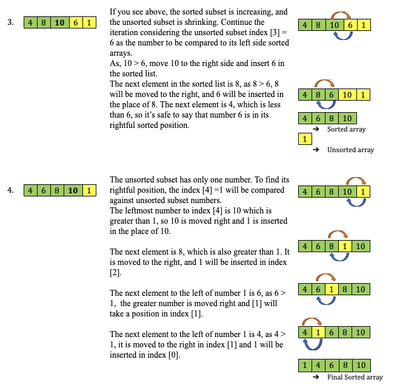
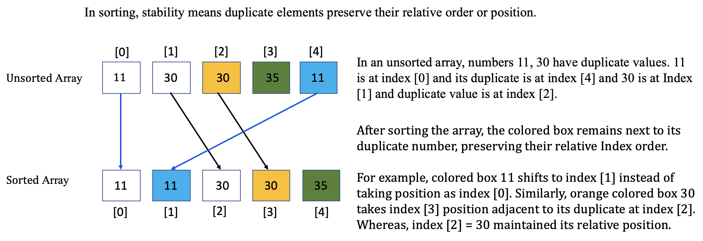
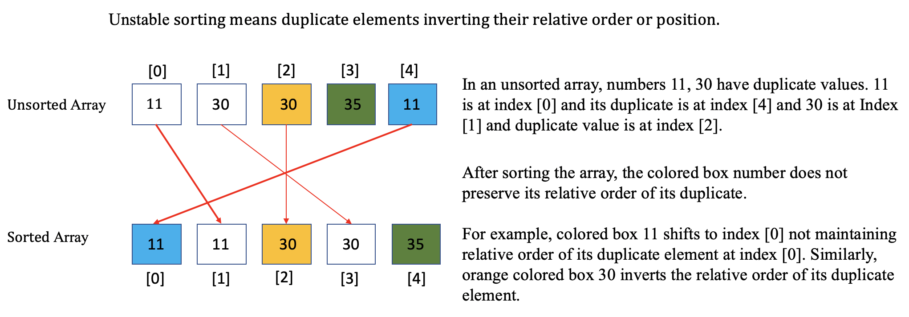
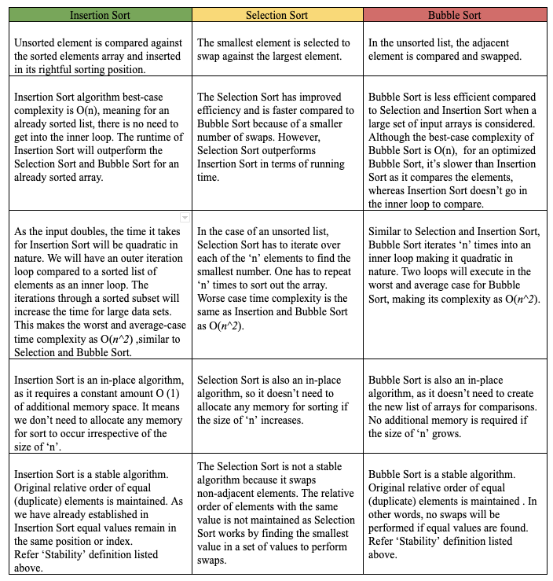
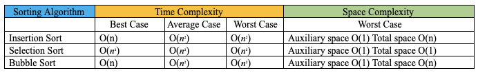

Let’s sort it out!

In a series of posts, we will be discussing some of the sorting algorithms listed in the below order:

- [Bubble Sort](https://www.prostdev.com/post/reviewing-sorting-algorithms-bubble-sort)
- [Selection Sort](https://www.prostdev.com/post/reviewing-sorting-algorithms-selection-sort)
- **Insertion Sort**
- [Merge Sort](https://www.prostdev.com/post/reviewing-sorting-algorithms-merge-sort)
- Quick Sort
- Heap Sort

In this post, we will explore the next in a series of sorting algorithms, the Insertion Sort. If you are still wondering how we landed here with a bunch of sorting algorithms, please go through the previous posts on [Bubble Sort](https://www.prostdev.com/post/reviewing-sorting-algorithms-bubble-sort) and [Selection Sort](https://www.prostdev.com/post/reviewing-sorting-algorithms-selection-sort). We are yet to discover the fastest and most efficient algorithm to sort the long list of input elements. In this post, the question remains, is Insertion Sort "The One"? We don’t have to wait for the "Oracle" to confirm. Let’s find out.

## Why is it called Insertion Sort?

Insertion Sort is one of the simplest and easiest sorting algorithms to understand. By the way, when’s the last time you sorted a hand of playing cards? If it’s today, congratulations! You have understood insertion sort even before we started. Brownie points to you!! If it’s been a while, you should try forming the thinking cloud of sorting the playing cards. You might have not realized it; you were implementing a version of the Insertion Sort algorithm to quickly sort the cards at hand. Well, if you are one of those, who never sorted playing cards, there isn’t a better time than “now” to expedite your understanding of the Insertion Sort.

Remember, in our pilot post of [Bubble Sort](https://www.prostdev.com/post/reviewing-sorting-algorithms-bubble-sort), we discussed sorting as an act of arranging the elements systematically, based on a predetermined order or certain rules. We have observed from our previously discussed sorting techniques that a comparison of elements is the fundamental idea to arrive at a sorted list. In the case of the Insertion Sort, the basic principle is of inserting an unsorted element at a particular sorted position. The name “Insertion Sort” is derived based upon the concept, where an element has to find its rightful place and has to be inserted in there. If you are confused, let’s go through the below listed instructions to get some clarity.

Breaking down the instructions:

- For a given unsorted array [10,4,8,6,1], the iteration will be performed for every array element, from left to right.
- Two subsets or sub-lists are maintained, the left side is a sorted subset and the right side is an unsorted subset. The first element in the array [10,4,8,6,1] will remain in place and is assumed to be sorted, as there are no further elements on the left side to compare.
- Now we have two sections, one sorted section [10], and other unsorted sections [4,8,6,1]. Insertion Sort will iterate through each element of the unsorted list and compare it with the sorted subset, to shift the largest number to the right and insert the smallest element in its current rightful sorted position.
- The first element in the unsorted subset (i.e., 4 in our example) is compared against each element from the sorted subset (i.e., 10 in this case) for its rightful sorted position.
- If a number in a sorted list is found to be greater than the unsorted list number (i.e., 4), the number is shifted one position right. Meaning, the smaller number is inserted into the sorted subset. Result array would be [4,10,8,6,1].
- The sorting will iterate to the next number (i.e., 8) to compare against a new sorted subset [4,10]. The above steps will be repeated until a valid sorted position is obtained for the same number.
- In the next iteration the sorted subset is [4,8,10], the process is repeated for the next number in an unsorted subset [6,1]. We observe that the unsorted subset shrinks with every iteration.

Let’s play with our numbers:

**Problem:** Sort the given array [10, 4, 8, 6, 1]. As discussed above, we will divide the array into two subsets of sorted and unsorted lists to demonstrate subsets. Iteration starting with the first index [0] as below.





For more insight into Step 4, below is a simple demonstration.

**Observations based on Iterations:**

- Well, the obvious observation here is, in each iteration, we compared the first unsorted item against the sorted item to its left to figure out if it’s in the right sorted position.
- Iteration is performed on every element and it is from left to right, growing the sorted array. Although the first element is unsorted, it becomes the sorted element in the first iteration.
- If the current unsorted array element is smaller than the sorted array element, the current element is shifted to one place higher than its current position.
- The array size in our example is n = 5 and the total iterations performed will be (n-1).
- The total number of comparisons required to sort: n = 5 elements is *(n-1) + (n-2) + (n-3) + (n-4).* You might recognize the similar pattern from Selection Sort.
- In case of a completely sorted list, the Insertion Sort requires the same number of comparisons as that of an unsorted list. However, there will be no shifting or insertion of elements performed.
- If there are duplicate elements in the sorting array, the Insertion Sort won’t move one element in front of the other, instead, the key value will be maintained in order. This characteristic makes the Insertion Sort a stable sorting algorithm. You may ask what is considered as stability in the sorting algorithm?

## Defining Stability





## Insertion Vs Selection Vs Bubble Sort



**Time and space complexity** are listed in the below table:



## Code Implementation:

```python
# Python code for Insertion Sort
# Additional Logs are  used for demonstration purposes.
def InsertionSort(arr):
    # Get the length of the array
    arrlen = len(arr)
    print(' Input Array : {} >> Length : {} '.format(arr,arrlen))
    
    # iterate through the array elements starting from index[1], as we have to compare left index [0] for sorting    
    for i in range(1,arrlen):
        print ('-----------------------------------------------------')
        print( 'Current Unsorted array  : {} '.format(arr))
        print ('At Index: {} >>  unsortedValue value {} '.format(i,arr[i]))
        # Set up j value as a copy of i value
        j = i
        # set up the unsorted value to be compared to the left array of sorted values
        unsortedValue = arr[j]
        print ('Current unsortedValue array value : {}, value to the left : {}'.format(unsortedValue,arr[j-1]))
        
        # Loop from the j (copy of i) element to check for j-1 (left) index value to find the right sorting positon
        while j > 0 and unsortedValue < arr[j-1]:
            print ('As {} < {}, Move arr[j-1] value {} to the right at index {}  '.format(unsortedValue,arr[j-1],arr[j-1],j))
            
            # As unsortedValue is less then left index value, Move the left index value to right side
            arr[j] = arr[j-1]
            print ('At index {} - New value is {} '.format(j,arr[j]))
            # to check all the left index values, until the list is exhuasted.
            j = j-1
            print (' >> Comparing Left of index: {}, Value {} with  unsortedValue: {}'.format(j,arr[j-1],unsortedValue))
            # ## ### ## ## # # ### ### # ### ## ## ## # ### # ## ### ## # ## ## # ### # ## ### ## #
            # The below If condition is not required >> It's added only for demonstration purpose
            #--------------------------------------------------------------------------------------
            if unsortedValue < arr[j-1] and j > 0:
                print(' >> ({} < {}) => True >> Continue Checking left index values'.format(unsortedValue,arr[j-1]))
            else:
                print(' >> ({} < {}) => False and j : {} >> unsortedValue is at sorted position '.format(unsortedValue,arr[j-1],j))
            # ---------------------------------------------------------------------------------------
            print ('At index {} >> Insert unsortedValue value {} '.format(j,unsortedValue))
        # Insert unsortedValue to it's rightful position.
        arr[j]= unsortedValue
        print ('New array formation : {} '.format(arr))  
            
    return arr

# Test Long unsorted list
#arrlist = [3, 56, 2, 58, 79, 59, 34, 23, 4, 78, 8, 123, 45]
# Test short unsorted list
arrlist = [10,4,8,6,1]
#Test sorted list 
#arrlist = [1,2,3,4,5]
#Test n= 100 unsorted list
#arrlist = [52,68,84,73,3,81,91,58,1,19,8,78,32,94,4,98,23,6,21,20,43,69,31,87,33,62,36,41,70,51,48,38,72,24,47,57,13,7,64,49,9,16,14,99,90,92,35,25,37,89,50,85,76,67,88,131,39,56,74,42,77,26,93,97,80,82,96,60,53,46,18,65,30,27,2,83,66,29,61,10,55,22,11,75,95,45,59,86,12,15,17,79,40,34,5,71,44,63,28,54]
print(InsertionSort(arrlist))
```

**Log Output:**

Let’s check the log output to understand the case of a fully sorted array and unsorted array.

```text
#-------------------------------------------------------------------
# Test Case 1: Short unsorted list : arrlist = [10,4,8,6,1]
#-------------------------------------------------------------------

Input Array : [10, 4, 8, 6, 1] >> Length : 5 
-----------------------------------------------------
Current Unsorted array  : [10, 4, 8, 6, 1] 
At Index: 1 >>  unsortedValue value 4 
Current unsortedValue array value : 4, value to the left : 10
As 4 < 10, Move arr[j-1] value 10 to the right at index 1  
At index 1 - New value is 10 
 >> Comparing Left of index: 0, Value 1 with  unsortedValue: 4
 >> (4 < 1) => False and j : 0 >> unsortedValue is at sorted position 
At index 0 >> Insert unsortedValue value 4 
New array formation : [4, 10, 8, 6, 1] 
-----------------------------------------------------
Current Unsorted array  : [4, 10, 8, 6, 1] 
At Index: 2 >>  unsortedValue value 8                                    
Current unsortedValue array value : 8, value to the left : 10
As 8 < 10, Move arr[j-1] value 10 to the right at index 2  
At index 2 - New value is 10 
 >> Comparing Left of index: 1, Value 4 with  unsortedValue: 8
 >> (8 < 4) => False and j : 1 >> unsortedValue is at sorted position 
At index 1 >> Insert unsortedValue value 8 
New array formation : [4, 8, 10, 6, 1] 
-----------------------------------------------------
Current Unsorted array  : [4, 8, 10, 6, 1] 
At Index: 3 >>  unsortedValue value 6 
Current unsortedValue array value : 6, value to the left : 10
As 6 < 10, Move arr[j-1] value 10 to the right at index 3  
At index 3 - New value is 10 
 >> Comparing Left of index: 2, Value 8 with  unsortedValue: 6
 >> (6 < 8) => True >> Continue Checking left index values
At index 2 >> Insert unsortedValue value 6 
As 6 < 8, Move arr[j-1] value 8 to the right at index 2  
At index 2 - New value is 8 
 >> Comparing Left of index: 1, Value 4 with  unsortedValue: 6
 >> (6 < 4) => False and j : 1 >> unsortedValue is at sorted position 
At index 1 >> Insert unsortedValue value 6 
New array formation : [4, 6, 8, 10, 1] 
-----------------------------------------------------
Current Unsorted array  : [4, 6, 8, 10, 1] 
At Index: 4 >>  unsortedValue value 1 
Current unsortedValue array value : 1, value to the left : 10
As 1 < 10, Move arr[j-1] value 10 to the right at index 4  
At index 4 - New value is 10 
 >> Comparing Left of index: 3, Value 8 with  unsortedValue: 1
 >> (1 < 8) => True >> Continue Checking left index values
At index 3 >> Insert unsortedValue value 1 
As 1 < 8, Move arr[j-1] value 8 to the right at index 3  
At index 3 - New value is 8 
 >> Comparing Left of index: 2, Value 6 with  unsortedValue: 1
 >> (1 < 6) => True >> Continue Checking left index values
At index 2 >> Insert unsortedValue value 1 
As 1 < 6, Move arr[j-1] value 6 to the right at index 2  
At index 2 - New value is 6 
 >> Comparing Left of index: 1, Value 4 with  unsortedValue: 1
 >> (1 < 4) => True >> Continue Checking left index values
At index 1 >> Insert unsortedValue value 1 
As 1 < 4, Move arr[j-1] value 4 to the right at index 1  
At index 1 - New value is 4 
 >> Comparing Left of index: 0, Value 10 with  unsortedValue: 1
 >> (1 < 10) => False and j : 0 >> unsortedValue is at sorted position 
At index 0 >> Insert unsortedValue value 1 
New array formation : [1, 4, 6, 8, 10] 
[1, 4, 6, 8, 10]

#------------------------------------------------------------------------------------------------
# Test Case 2: Long unsorted list : arrlist = [3, 56, 2, 58, 79, 59, 34, 23, 4, 78, 8, 123, 45]
#------------------------------------------------------------------------------------------------

Input Array : [3, 56, 2, 58, 79, 59, 34, 23, 4, 78, 8, 123, 45] >> Length : 13 
-----------------------------------------------------
Current Unsorted array  : [3, 56, 2, 58, 79, 59, 34, 23, 4, 78, 8, 123, 45] 
At Index: 1 >>  unsortedValue value 56 
Current unsortedValue array value : 56, value to the left : 3
New array formation : [3, 56, 2, 58, 79, 59, 34, 23, 4, 78, 8, 123, 45] 
-----------------------------------------------------
Current Unsorted array  : [3, 56, 2, 58, 79, 59, 34, 23, 4, 78, 8, 123, 45] 
At Index: 2 >>  unsortedValue value 2 
Current unsortedValue array value : 2, value to the left : 56
As 2 < 56, Move arr[j-1] value 56 to the right at index 2                
At index 2 - New value is 56 
 >> Comparing Left of index: 1, Value 3 with  unsortedValue: 2
 >> (2 < 3) => True >> Continue Checking left index values
At index 1 >> Insert unsortedValue value 2 
As 2 < 3, Move arr[j-1] value 3 to the right at index 1  
At index 1 - New value is 3 
 >> Comparing Left of index: 0, Value 45 with  unsortedValue: 2
 >> (2 < 45) => False and j : 0 >> unsortedValue is at sorted position 
At index 0 >> Insert unsortedValue value 2 
New array formation : [2, 3, 56, 58, 79, 59, 34, 23, 4, 78, 8, 123, 45] 
-----------------------------------------------------
Current Unsorted array  : [2, 3, 56, 58, 79, 59, 34, 23, 4, 78, 8, 123, 45] 
At Index: 3 >>  unsortedValue value 58 
Current unsortedValue array value : 58, value to the left : 56
New array formation : [2, 3, 56, 58, 79, 59, 34, 23, 4, 78, 8, 123, 45] 
-----------------------------------------------------
Current Unsorted array  : [2, 3, 56, 58, 79, 59, 34, 23, 4, 78, 8, 123, 45] 
At Index: 4 >>  unsortedValue value 79 
Current unsortedValue array value : 79, value to the left : 58
New array formation : [2, 3, 56, 58, 79, 59, 34, 23, 4, 78, 8, 123, 45] 
-----------------------------------------------------
Current Unsorted array  : [2, 3, 56, 58, 79, 59, 34, 23, 4, 78, 8, 123, 45] 
At Index: 5 >>  unsortedValue value 59 
Current unsortedValue array value : 59, value to the left : 79
As 59 < 79, Move arr[j-1] value 79 to the right at index 5  
At index 5 - New value is 79 
 >> Comparing Left of index: 4, Value 58 with  unsortedValue: 59
 >> (59 < 58) => False and j : 4 >> unsortedValue is at sorted postion 
At index 4 >> Insert unsortedValue value 59 
New array formation : [2, 3, 56, 58, 59, 79, 34, 23, 4, 78, 8, 123, 45] 
-----------------------------------------------------
Current Unsorted array  : [2, 3, 56, 58, 59, 79, 34, 23, 4, 78, 8, 123, 45] 
At Index: 6 >>  unsortedValue value 34 
Current unsortedValue array value : 34, value to the left : 79
As 34 < 79, Move arr[j-1] value 79 to the right at index 6  
At index 6 - New value is 79 
 >> Comparing Left of index: 5, Value 59 with  unsortedValue: 34
 >> (34 < 59) => True >> Continue Checking left index values
At index 5 >> Insert unsortedValue value 34 
As 34 < 59, Move arr[j-1] value 59 to the right at index 5  
At index 5 - New value is 59 
 >> Comparing Left of index: 4, Value 58 with  unsortedValue: 34
 >> (34 < 58) => True >> Continue Checking left index values
At index 4 >> Insert unsortedValue value 34 
As 34 < 58, Move arr[j-1] value 58 to the right at index 4  
At index 4 - New value is 58 
 >> Comparing Left of index: 3, Value 56 with  unsortedValue: 34
 >> (34 < 56) => True >> Continue Checking left index values
At index 3 >> Insert unsortedValue value 34 
As 34 < 56, Move arr[j-1] value 56 to the right at index 3  
At index 3 - New value is 56 
 >> Comparing Left of index: 2, Value 3 with  unsortedValue: 34
 >> (34 < 3) => False and j : 2 >> unsortedValue is at sorted position 
At index 2 >> Insert unsortedValue value 34 
New array formation : [2, 3, 34, 56, 58, 59, 79, 23, 4, 78, 8, 123, 45] 
-----------------------------------------------------
Current Unsorted array  : [2, 3, 34, 56, 58, 59, 79, 23, 4, 78, 8, 123, 45] 
At Index: 7 >>  unsortedValue value 23 
Current unsortedValue array value : 23, value to the left : 79
As 23 < 79, Move arr[j-1] value 79 to the right at index 7  
At index 7 - New value is 79 
 >> Comparing Left of index: 6, Value 59 with  unsortedValue: 23
 >> (23 < 59) => True >> Continue Checking left index values
At index 6 >> Insert unsortedValue value 23 
As 23 < 59, Move arr[j-1] value 59 to the right at index 6  
At index 6 - New value is 59 
 >> Comparing Left of index: 5, Value 58 with  unsortedValue: 23
 >> (23 < 58) => True >> Continue Checking left index values
At index 5 >> Insert unsortedValue value 23 
As 23 < 58, Move arr[j-1] value 58 to the right at index 5  
At index 5 - New value is 58 
 >> Comparing Left of index: 4, Value 56 with  unsortedValue: 23
 >> (23 < 56) => True >> Continue Checking left index values
At index 4 >> Insert unsortedValue value 23 
As 23 < 56, Move arr[j-1] value 56 to the right at index 4  
At index 4 - New value is 56 
 >> Comparing Left of index: 3, Value 34 with  unsortedValue: 23
 >> (23 < 34) => True >> Continue Checking left index values
At index 3 >> Insert unsortedValue value 23 
As 23 < 34, Move arr[j-1] value 34 to the right at index 3  
At index 3 - New value is 34 
 >> Comparing Left of index: 2, Value 3 with  unsortedValue: 23
 >> (23 < 3) => False and j : 2 >> unsortedValue is at sorted position 
At index 2 >> Insert unsortedValue value 23 
New array formation : [2, 3, 23, 34, 56, 58, 59, 79, 4, 78, 8, 123, 45] 
-----------------------------------------------------
Current Unsorted array  : [2, 3, 23, 34, 56, 58, 59, 79, 4, 78, 8, 123, 45] 
At Index: 8 >>  unsortedValue value 4 
Current unsortedValue array value : 4, value to the left : 79
As 4 < 79, Move arr[j-1] value 79 to the right at index 8  
At index 8 - New value is 79 
 >> Comparing Left of index: 7, Value 59 with  unsortedValue: 4
 >> (4 < 59) => True >> Continue Checking left index values
At index 7 >> Insert unsortedValue value 4 
As 4 < 59, Move arr[j-1] value 59 to the right at index 7  
At index 7 - New value is 59 
 >> Comparing Left of index: 6, Value 58 with  unsortedValue: 4
 >> (4 < 58) => True >> Continue Checking left index values
At index 6 >> Insert unsortedValue value 4 
As 4 < 58, Move arr[j-1] value 58 to the right at index 6  
At index 6 - New value is 58 
 >> Comparing Left of index: 5, Value 56 with  unsortedValue: 4
 >> (4 < 56) => True >> Continue Checking left index values
At index 5 >> Insert unsortedValue value 4 
As 4 < 56, Move arr[j-1] value 56 to the right at index 5  
At index 5 - New value is 56 
 >> Comparing Left of index: 4, Value 34 with  unsortedValue: 4
 >> (4 < 34) => True >> Continue Checking left index values
At index 4 >> Insert unsortedValue value 4 
As 4 < 34, Move arr[j-1] value 34 to the right at index 4  
At index 4 - New value is 34 
 >> Comparing Left of index: 3, Value 23 with  unsortedValue: 4
 >> (4 < 23) => True >> Continue Checking left index values
At index 3 >> Insert unsortedValue value 4 
As 4 < 23, Move arr[j-1] value 23 to the right at index 3  
At index 3 - New value is 23 
 >> Comparing Left of index: 2, Value 3 with  unsortedValue: 4
 >> (4 < 3) => False and j : 2 >> unsortedValue is at sorted position 
At index 2 >> Insert unsortedValue value 4 
New array formation : [2, 3, 4, 23, 34, 56, 58, 59, 79, 78, 8, 123, 45] 
-----------------------------------------------------
Current Unsorted array  : [2, 3, 4, 23, 34, 56, 58, 59, 79, 78, 8, 123, 45] 
At Index: 9 >>  unsortedValue value 78 
Current unsortedValue array value : 78, value to the left : 79
As 78 < 79, Move arr[j-1] value 79 to the right at index 9  
At index 9 - New value is 79 
 >> Comparing Left of index: 8, Value 59 with  unsortedValue: 78
 >> (78 < 59) => False and j : 8 >> unsortedValue is at sorted position 
At index 8 >> Insert unsortedValue value 78 
New array formation : [2, 3, 4, 23, 34, 56, 58, 59, 78, 79, 8, 123, 45] 
-----------------------------------------------------
Current Unsorted array  : [2, 3, 4, 23, 34, 56, 58, 59, 78, 79, 8, 123, 45] 
At Index: 10 >>  unsortedValue value 8 
Current unsortedValue array value : 8, value to the left : 79
As 8 < 79, Move arr[j-1] value 79 to the right at index 10  
At index 10 - New value is 79 
 >> Comparing Left of index: 9, Value 78 with  unsortedValue: 8
 >> (8 < 78) => True >> Continue Checking left index values
At index 9 >> Insert unsortedValue value 8 
As 8 < 78, Move arr[j-1] value 78 to the right at index 9  
At index 9 - New value is 78 
 >> Comparing Left of index: 8, Value 59 with  unsortedValue: 8
 >> (8 < 59) => True >> Continue Checking left index values
At index 8 >> Insert unsortedValue value 8 
As 8 < 59, Move arr[j-1] value 59 to the right at index 8  
At index 8 - New value is 59 
 >> Comparing Left of index: 7, Value 58 with  unsortedValue: 8
 >> (8 < 58) => True >> Continue Checking left index values
At index 7 >> Insert unsortedValue value 8 
As 8 < 58, Move arr[j-1] value 58 to the right at index 7  
At index 7 - New value is 58 
 >> Comparing Left of index: 6, Value 56 with  unsortedValue: 8
 >> (8 < 56) => True >> Continue Checking left index values
At index 6 >> Insert unsortedValue value 8 
As 8 < 56, Move arr[j-1] value 56 to the right at index 6  
At index 6 - New value is 56 
 >> Comparing Left of index: 5, Value 34 with  unsortedValue: 8
 >> (8 < 34) => True >> Continue Checking left index values
At index 5 >> Insert unsortedValue value 8 
As 8 < 34, Move arr[j-1] value 34 to the right at index 5  
At index 5 - New value is 34 
 >> Comparing Left of index: 4, Value 23 with  unsortedValue: 8
 >> (8 < 23) => True >> Continue Checking left index values
At index 4 >> Insert unsortedValue value 8 
As 8 < 23, Move arr[j-1] value 23 to the right at index 4  
At index 4 - New value is 23 
 >> Comparing Left of index: 3, Value 4 with  unsortedValue: 8
 >> (8 < 4) => False and j : 3 >> unsortedValue is at sorted position 
At index 3 >> Insert unsortedValue value 8 
New array formation : [2, 3, 4, 8, 23, 34, 56, 58, 59, 78, 79, 123, 45] 
-----------------------------------------------------
Current Unsorted array  : [2, 3, 4, 8, 23, 34, 56, 58, 59, 78, 79, 123, 45] 
At Index: 11 >>  unsortedValue value 123 
Current unsortedValue array value : 123, value to the left : 79
New array formation : [2, 3, 4, 8, 23, 34, 56, 58, 59, 78, 79, 123, 45] 
-----------------------------------------------------
Current Unsorted array  : [2, 3, 4, 8, 23, 34, 56, 58, 59, 78, 79, 123, 45] 
At Index: 12 >>  unsortedValue value 45 
Current unsortedValue array value : 45, value to the left : 123
As 45 < 123, Move arr[j-1] value 123 to the right at index 12  
At index 12 - New value is 123 
 >> Comparing Left of index: 11, Value 79 with  unsortedValue: 45
 >> (45 < 79) => True >> Continue Checking left index values
At index 11 >> Insert unsortedValue value 45 
As 45 < 79, Move arr[j-1] value 79 to the right at index 11  
At index 11 - New value is 79 
 >> Comparing Left of index: 10, Value 78 with  unsortedValue: 45
 >> (45 < 78) => True >> Continue Checking left index values
At index 10 >> Insert unsortedValue value 45 
As 45 < 78, Move arr[j-1] value 78 to the right at index 10  
At index 10 - New value is 78 
 >> Comparing Left of index: 9, Value 59 with  unsortedValue: 45
 >> (45 < 59) => True >> Continue Checking left index values
At index 9 >> Insert unsortedValue value 45 
As 45 < 59, Move arr[j-1] value 59 to the right at index 9  
At index 9 - New value is 59 
 >> Comparing Left of index: 8, Value 58 with  unsortedValue: 45
 >> (45 < 58) => True >> Continue Checking left index values
At index 8 >> Insert unsortedValue value 45 
As 45 < 58, Move arr[j-1] value 58 to the right at index 8  
At index 8 - New value is 58 
 >> Comparing Left of index: 7, Value 56 with  unsortedValue: 45
 >> (45 < 56) => True >> Continue Checking left index values
At index 7 >> Insert unsortedValue value 45 
As 45 < 56, Move arr[j-1] value 56 to the right at index 7  
At index 7 - New value is 56 
 >> Comparing Left of index: 6, Value 34 with  unsortedValue: 45
 >> (45 < 34) => False and j : 6 >> unsortedValue is at sorted position 
At index 6 >> Insert unsortedValue value 45 
New array formation : [2, 3, 4, 8, 23, 34, 45, 56, 58, 59, 78, 79, 123] 
[2, 3, 4, 8, 23, 34, 45, 56, 58, 59, 78, 79, 123]

#-------------------------------------------------------------------
# Test Case 3: sorted list : arrlist = [1,2,3,4,5]
#-------------------------------------------------------------------

Input Array : [1, 2, 3, 4, 5] >> Length : 5 
-----------------------------------------------------
Current Unsorted array  : [1, 2, 3, 4, 5] 
At Index: 1 >>  unsortedValue value 2 
Current unsortedValue array value : 2, value to the left : 1
New array formation : [1, 2, 3, 4, 5] 
-----------------------------------------------------
Current Unsorted array  : [1, 2, 3, 4, 5] 
At Index: 2 >>  unsortedValue value 3 
Current unsortedValue array value : 3, value to the left : 2
New array formation : [1, 2, 3, 4, 5] 
-----------------------------------------------------
Current Unsorted array  : [1, 2, 3, 4, 5] 
At Index: 3 >>  unsortedValue value 4                                    
Current unsortedValue array value : 4, value to the left : 3
New array formation : [1, 2, 3, 4, 5] 
-----------------------------------------------------
Current Unsorted array  : [1, 2, 3, 4, 5] 
At Index: 4 >>  unsortedValue value 5 
Current unsortedValue array value : 5, value to the left : 4
New array formation : [1, 2, 3, 4, 5] 
[1, 2, 3, 4, 5]
```

**Unsorted array:** There are two loops performed, one is the outer loop for array iteration, and another is the inner loop for comparisons. At the start of the sorting, the first element (10) is considered as a sorted subset and the inner loop will compare the first unsorted element (4) against the sorted element. As the unsorted array shrinks on every iteration, the sorted array inner loop keeps growing to shift the elements. The inner loop will run for *(n-1)* elements wherein *‘n’* is the total number of array elements. For instance, for the last iteration in the test case, the array index [4] = 1 element is compared against (n-1) = 4 sorted array elements. If you observe closely, the inner loops iterate from right to left to compare against the sorted array list. The double looping is what makes the Insertion Sort worst-case time complexity О(*n^2*) because if the input doubles the running time will be quadratic.

**Sorted array:** In test case 3, the log shows no inner loops, as the values are already sorted. However, the comparisons are performed to check the rightful sorting position. Insertion Sort requires ‘n’ steps to sort an already sorted array of ‘n’ elements, which makes its best-case time complexity a linear function of O(n).

## Final thoughts

So next time you sort out cards manually or play bridge, remember it’s an Insertion Sort. It is yet another simple algorithm that is slow due to its internal looping. In all fairness, Insertion Sort has an edge over its peers Bubble and Selection Sort as it has a best-case running time for an already sorted array list. Moreover, it is a stable algorithm with in-place properties and the ability to sort a list as it is received.

We have arrived at the most awaited conclusion, the Insertion Sort is not “The One” we were looking out for. Well, our quest to find “The One” continues and looks like we are getting really close. In the next post, we shall discuss “Merge Sort” to continue our pursuit of finding the most efficient sorting algorithm.

Stay tuned!!

I hope you enjoyed the post. Please subscribe to [ProstDev](https://www.prostdev.com/) for more exciting topics.

Hasta luego, amigos!

## Study Resources

Below are some resources which discuss Insertion Sort and its Time-Space complexity at length.

- [The Insertion Sort - Runestone academy](https://runestone.academy/runestone/books/published/pythonds/SortSearch/TheInsertionSort.html)
- [Insertion Sort - Wikipedia](https://en.wikipedia.org/wiki/Insertion_sort)
- [Video] [Insertion Sort - CS50 Harvard](https://www.youtube.com/watch?v=O0VbBkUvriI)
- [Analysis of Insertion Sort - Khan Academy](https://www.khanacademy.org/computing/computer-science/algorithms/insertion-sort/a/analysis-of-insertion-sort)
- [Video] [Insertion Sort - CS310 San Diego University](https://www.youtube.com/watch?v=eTvQIbB-AuE)
- [Video] [Insert Sort with Romanian Folk Dance](https://www.youtube.com/watch?v=ROalU379l3U)
- [Asymptotic-Notation- Khan Academy](https://www.khanacademy.org/computing/computer-science/algorithms/asymptotic-notation/a/asymptotic-notation)
- [Big-O cheat sheet](https://www.bigocheatsheet.com/)
- [Insertion Sort Animation](https://www.toptal.com/developers/sorting-algorithms/insertion-sort)
- [Stable Sorting Algorithms](https://www.baeldung.com/cs/stable-sorting-algorithms)
- [Sorting Algorithms Stability](https://en.wikipedia.org/wiki/Sorting_algorithm#Stability)
- [A Comparative Study of Selection Sort and Insertion Sort Algorithms](https://www.irjet.net/archives/V3/i12/IRJET-V3I12115.pdf) Fahriye Gemci FuratResearch Assistant, Department of Computer Engineering, Iskenderun Technical University, Hatay, Turkey
