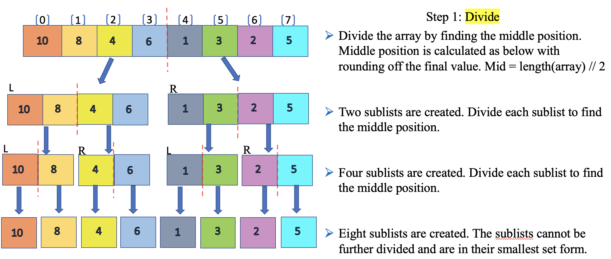
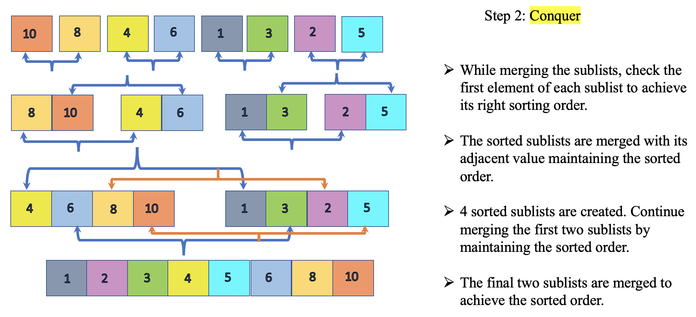
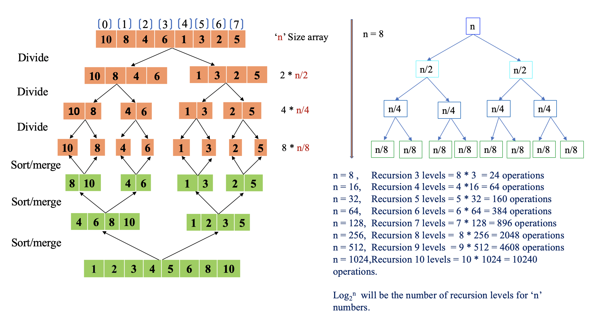
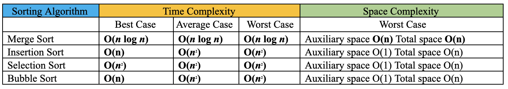

Let’s sort it out!

In a series of posts, we will be discussing some of the sorting algorithms listed in the below order:

- [Bubble Sort](https://www.prostdev.com/post/reviewing-sorting-algorithms-bubble-sort)
- [Selection Sort](https://www.prostdev.com/post/reviewing-sorting-algorithms-selection-sort)
- [Insertion Sort](https://www.prostdev.com/post/reviewing-sorting-algorithms-insertion-sort)
- **Merge Sort**
- Quick Sort
- Heap Sort

As promised, we are back to explore the next in a series of sorting algorithms, the Merge Sort. Till now, we have reviewed three sorting algorithms as listed above, to conclude that the common traits they possess are inefficiency and slowness. Bubble Sort, Selection Sort, and Insertion Sort algorithms have minor differences among themselves with the same quadratic running time; meaning the time complexity of these three algorithms is O(n^2). In this post, we shall determine if Merge Sort is any better than its already discussed peers, and does it fit the bill to be chosen as "The One"? Let’s find out.

## Why is it called Merge Sort?

Merge Sort is a[divide and conquer algorithm](https://en.wikipedia.org/wiki/Divide_and_conquer_algorithm) that was invented in 1945 by [John von Neumann](https://en.wikipedia.org/wiki/John_von_Neumann), who was a founding figure in computing. The Merge Sort algorithm sorts an input collection by breaking it into two halves. It then sorts those two halves and merges them together as one sorted array. Most of the merge sort implementations use divide and conquer, a common algorithm design paradigm based on [recursion](https://en.wikipedia.org/wiki/Recursion_(computer_science)). The idea behind the merge sort is, it’s easier to sort sublists or smaller sets and combine them rather than sorting the long list of an array’s items. In our [previous post for Insertion Sort](https://www.prostdev.com/post/reviewing-sorting-algorithms-insertion-sort), we have clearly identified the common issue in all the discussed sorting techniques as sorting a long list of values that had slower and inefficient runtimes, with a quadratic time complexity O(n^2).

Let’s first understand the divide and conquer algorithm.

> “*A divide-and-conquer algorithm works by recursively breaking down a problem into two or more sub-problems of the same or related type until these become simple enough to be solved directly. The solutions to the sub-problems are then combined to give a solution to the original problem.*” [[Ref. 1](https://en.wikipedia.org/wiki/Divide-and-conquer_algorithm)]

A divide-and-conquer algorithm divides the problem into the simplest form. The smaller problems are the ones most easier to solve. The solution is then applied to the bigger chunks of the complex problem. Hence, the larger problem is conquered by using the same solution recursively.

The three parts of the divide and conquer algorithm are as below:

**Divide**: The problem is divided into the smallest possible number of the same problem; meaning the problem is divided into a subproblem, which indeed is divided into another subproblem and so forth until the smallest set is achieved.

**Conquer**: The smallest subproblem is conquered first by finding the solution as a base case. Once the solution is achieved, the same technique can be used to tackle bigger subproblems recursively.

**Combine**: The solution to the small problem is combined and build-up to solve the bigger problem.

The below pictures demonstrate the divide-and-conquer algorithm, wherein a problem is divided into two subproblems and the algorithm makes multiple recursive calls.

![Fig1.1 Divide-and-Conquer demonstration - Khan academy [Ref. 2]](../../assets/blog/reviewing-sorting-algorithms-merge-sort-1.png)

Further simplification of the recursive steps is demonstrated below:

![Fig1.2 Divide-and-Conquer demonstration - Khan academy [Ref. 2]](../../assets/blog/reviewing-sorting-algorithms-merge-sort-2.png)

At this point, we have better clarity on how the Divide-and-conquer algorithm works in theory, it’s time to illustrate this design paradigm implementation in the Merge Sort. The idea is to discuss the Merge Sort in a very simple way so that it sticks well in our memory, very much like solving small problems to achieve the original big problem solution. We have now cemented in theory how the Merge Sort will split the collections in a number of sublists to find the basic solution. Let’s break it down with our post series sample array [10,8,4,6,1,3,2,5]. Additional element number [3,2,5] is added to the array to make it an even array for easier demonstration purposes.

**Divide**: The array is divided into two halves initially and each half is again divided into halves until the smallest subset is attained. Below is the illustration for the divide step and we achieve a sorted smallest sub list at the end. You may ask, how is it sorted? Well, the final eight sublists are considered sorted as there is only one value and nothing else to compare. In short, the smallest sublist is always a sorted list by itself and considered as a base case. Now that we have solved the smallest problem, the next step would be to solve the next biggest subproblem. How do we do that? This is the time we introduce the “conquer” part of the algorithm.



**Conquer**: The sorted sublists are merged together maintaining the sorted list. Two sorted lists are required to merge together and create one single sorted list. The sorted lists are merged together as a part of the “*combine*” step recursively building towards the final single sorted list. The base case is the first single element sorted list. If you observe closely, the sorting has taken place recursively for each of the below sublists.



We discussed the Divide-and-conquer algorithm on how it’s implemented in the Merge Sort and tried to simplify the workings of the Merge Sort, in theory. Let’s dive into code snippets to understand how it’s implemented in real-time. *Okay, but what about recursion?* We have used the reference multiple times in our discussion. [Recursion](https://en.wikipedia.org/wiki/Recursion_(computer_science)) is a method to solve the same problem by breaking it down into smaller problems until a base condition (ex: if n&lt;= 1) is satisfied to stop the recursion. A recursive function is one that calls itself during execution directly or indirectly to achieve the desired solution.

## Pseudocode logic:

- The recursive approach is followed to implement the Merge Sort. The first step is to find the mid-position of the array to split the array into two halves. Mid position for an array of ‘n’ size is found as ‘n/2’. Alternatively, (L+R)/2 would also yield the mid-position of the array where L is the left index, and R is the right index value.
- If the input array length is less than 2 then no action will be performed, as this will be considered as a sorted single element sublist.
- The array is split into two sublists of size ‘n/2’ until no further division can be performed. The split function ‘mergesort’ is invoked recursively to get the left and right sublist until a single element list is formed.
- For each split function, ‘mergesort’ will invoke the function ‘merge’ each time recursively. For example, array [10,8,4,6,1,3,2,5] can be divided into two, four, and eight sublists, making it *mergesort(left), mergesort(right)* function call.
- Once the single sublists are formed, the next step is to invoke the function ‘merge’ passing the input parameters left, right, and array. The single sublist is considered as a sorted list as there are no other values to compare, making it as our base case.
- The logic of function *“merge“* implements the sorting and merging of the sublists. For example, single arrays [10] [8] are sorted and merged together as [8,10]. Similarly, backtracking other array values we attain the final sorted list.
- The elements from the left array and right array indexes will be compared for sorting. In our example, the left array [8,10] and right array [4,6] the index[0] in both lists are compared to find the sorted position for the new sublist as [4,6,8,10].

## Code Implementation:

```python
#function for merging the left and right array. Sorting will be performed

def merge(left, right, array):
    print("  ")
    print(" Merge -> array : {} Left : {} Right : {} ".format(array,left,right))
    # Iterator i for traversing through the Left Half of the array
    i = 0
    # Iterator j for traversing through the Right Half of the array
    j = 0
    # Iterator k for the main list
    k = 0

    while (i<len(left) and j<len(right)):
        # compare the lefthalf index value for iterator i with rightHalf index value for iterator j
        if(left[i]<right[j]):
            array[k] = left[i]
            i = i+1
        else:
            array[k] = right[j]
            j = j+1
        k = k+1
    # New loop for any remaining values which are left out of the above check on leftHalf side
    while(i<len(left)):
        #print (" left array is: {} ".format(left))
        array[k] = left[i]
        i = i+1
        k = k+1
    # New loop for any remaining values which are left out of the above check on RightHalf side
    while(j<len(right)):
        #print (" right array is: {} ".format(right))
        array[k] = right[j]
        j = j+1
        k = k+1
    print(" *-*-* End of merge function >> Merged array is : {} ".format(array));
    print(" ")
    return array
    
######################################################
### Function for dividing and calling merge function #
######################################################

def mergesort(array):
    arrlen = len(array)
    if(arrlen<2):
        print(" array has only one element {} - no further action ".format(array))
        return
    # derive the midpoint of the array
    mid = int(arrlen/2)
    # divide the array into left Half and Right Half based on the midpoint
    left =  array[:mid]
    right = array[mid:]
    print(" Left Half :{} Right Half : {}".format(left,right))
    print(" ")
    print(" Recursive call mergesort for left array {} ".format(left))
    print(" ---------------------------------------------------------")
    mergesort(left)
    print(" ----------------------------------------------------------")
    print(" ")
    print(" Recursive call mergesort for Right array {} ".format(right))
    print(" ----------------------------------------------------------")
    mergesort(right)
    print(" ----------------------------------------------------------")
   # print( " After MergeSort Right :{} ".format(right))
    merge(left,right,array)
    return array
 
 # test driver code    
if __name__ == '__main__': 
    # Test Long unsorted list
    # arrlist = [3, 56, 2, 58, 79, 59, 34, 23, 4, 78, 8, 123, 45]
    # arrlist = []
    # Test short unsorted list
    arrlist = [10,4,8,6,1,3,2,5]
    #Test sorted list 
    # arrlist = [1,2,3,4,5]
    #Test n= 100 unsorted list
    #arrlist = [52,68,84,73,3,81,91,58,1,19,8,78,32,94,4,98,23,6,21,20,43,69,31,87,33,62,36,41,70,51,48,38,72,24,47,57,13,7,64,49,9,16,14,99,90,92,35,25,37,89,50,85,76,67,88,131,39,56,74,42,77,26,93,97,80,82,96,60,53,46,18,65,30,27,2,83,66,29,61,10,55,22,11,75,95,45,59,86,12,15,17,79,40,34,5,71,44,63,28,54]
    print(" Input array : {}".format(arrlist))
    print(" Output array :{} ".format(mergesort(arrlist)))
```

**Log Output:**

```text
 ############# Test Case 1  ############# 
 Input array : [10, 4, 8, 6, 1, 3, 2, 5]
 Left Half :[10, 4, 8, 6] Rigth Half : [1, 3, 2, 5]
 Recursive call mergesort for left array [10, 4, 8, 6] 
 ---------------------------------------------------------
 Left Half :[10, 4] Rigth Half : [8, 6]
 
 Recursive call mergesort for left array [10, 4] 
 ---------------------------------------------------------
 Left Half :[10] Rigth Half : [4]
 
 Recursive call mergesort for left array [10] 
 ---------------------------------------------------------
 array has only one element [10] - no further action                     
 ----------------------------------------------------------
 
 Recursive call mergesort for Right array [4] 
 ----------------------------------------------------------
 array has only one element [4] - no further action 
 ----------------------------------------------------------
  
 Merge -> array : [10, 4] Left : [10] Right : [4] 
 *-*-* End of merge function >> Merged array is : [4, 10] 
 ----------------------------------------------------------
 Recursive call mergesort for Right array [8, 6] 
 ----------------------------------------------------------
 Left Half :[8] Rigth Half : [6]
 
 Recursive call mergesort for left array [8] 
 ---------------------------------------------------------
 array has only one element [8] - no further action 
 ----------------------------------------------------------
 Recursive call mergesort for Right array [6] 
 ----------------------------------------------------------
 array has only one element [6] - no further action 
 ----------------------------------------------------------
 Merge -> array : [8, 6] Left : [8] Right : [6] 
 *-*-* End of merge function >> Merged array is : [6, 8] 
 ----------------------------------------------------------
 Merge -> array : [10, 4, 8, 6] Left : [4, 10] Right : [6, 8] 
 *-*-* End of merge function >> Merged array is : [4, 6, 8, 10] 
 ----------------------------------------------------------
 
 Recursive call mergesort for Right array [1, 3, 2, 5] 
 ----------------------------------------------------------
 Left Half :[1, 3] Rigth Half : [2, 5]
 
 Recursive call mergesort for left array [1, 3] 
 ---------------------------------------------------------
 Left Half :[1] Rigth Half : [3]
 
 Recursive call mergesort for left array [1] 
 ---------------------------------------------------------
 array has only one element [1] - no further action 
 ----------------------------------------------------------
 
 Recursive call mergesort for Right array [3] 
 ----------------------------------------------------------
 array has only one element [3] - no further action 
 ----------------------------------------------------------
 Merge -> array : [1, 3] Left : [1] Right : [3] 
 *-*-* End of merge function >> Merged array is : [1, 3] 
 ----------------------------------------------------------
 
 Recursive call mergesort for Right array [2, 5] 
 ----------------------------------------------------------
 Left Half :[2] Rigth Half : [5]
 
 Recursive call mergesort for left array [2] 
 ---------------------------------------------------------
 array has only one element [2] - no further action 
 ----------------------------------------------------------
 Recursive call mergesort for Right array [5] 
 ----------------------------------------------------------
 array has only one element [5] - no further action 
 ----------------------------------------------------------
  
 Merge -> array : [2, 5] Left : [2] Right : [5] 
 *-*-* End of merge function >> Merged array is : [2, 5] 
 ----------------------------------------------------------
 Merge -> array : [1, 3, 2, 5] Left : [1, 3] Right : [2, 5] 
 *-*-* End of merge function >> Merged array is : [1, 2, 3, 5] 
 ----------------------------------------------------------
 Merge -> array : [10, 4, 8, 6, 1, 3, 2, 5] Left : [4, 6, 8, 10] Right : [1, 2, 3, 5] 
 *-*-* End of merge function >> Merged array is : [1, 2, 3, 4, 5, 6, 8, 10] 
 Output array :[1, 2, 3, 4, 5, 6, 8, 10] 

 ############# Test Case 2  #############

 Input array : [3, 56, 2, 58, 79, 59, 34, 23, 4, 78, 8, 123, 45]
 Left Half :[3, 56, 2, 58, 79, 59] Right Half : [34, 23, 4, 78, 8, 123, 45]
 
 >>> Recursive call mergesort for left array [3, 56, 2, 58, 79, 59] 
 Left Half :[3, 56, 2] Right Half : [58, 79, 59]
 
 >>> Recursive call mergesort for left array [3, 56, 2] 
 Left Half :[3] Right Half : [56, 2]
 
 >>> Recursive call mergesort for left array [3] 
 Array has only one element [3] - no further action 
 ----------------------------------------------------------                                                                       
 >>> Recursive call mergesort for Right array [56, 2] 
 Left Half :[56] Right Half : [2]
 
 >>> Recursive call mergesort for left array [56] 
 Array has only one element [56] - no further action 
 ----------------------------------------------------------
 >>> Recursive call mergesort for Right array [2] 
 Array has only one element [2] - no further action 
 ----------------------------------------------------------
 Merge -> Array : [56, 2] Left : [56] Right : [2] 
 *-*-* End of merge function ** array is : [2, 56] 
 ----------------------------------------------------------
  
 Merge -> Array : [3, 56, 2] Left : [3] Right : [2, 56] 
 *-*-* End of merge function ** array is : [2, 3, 56] 
 ----------------------------------------------------------
 >>> Recursive call mergesort for Right array [58, 79, 59] 
 Left Half :[58] Right Half : [79, 59]
 
 >>> Recursive call mergesort for left array [58] 
 Array has only one element [58] - no further action 
 ----------------------------------------------------------
 >>> Recursive call mergesort for Right array [79, 59] 
 Left Half :[79] Right Half : [59]
 
 >>> Recursive call mergesort for left array [79] 
 Array has only one element [79] - no further action 
 ----------------------------------------------------------
 >>> Recursive call mergesort for Right array [59] 
 Array has only one element [59] - no further action 
 ----------------------------------------------------------
 Merge -> Array : [79, 59] Left : [79] Right : [59] 
 *-*-* End of merge function ** array is : [59, 79] 
 ----------------------------------------------------------
 Merge -> Array : [58, 79, 59] Left : [58] Right : [59, 79] 
 *-*-* End of merge function ** array is : [58, 59, 79] 
 ---------------------------------------------------------- 
 Merge -> Array : [3, 56, 2, 58, 79, 59] Left : [2, 3, 56] Right : [58, 59, 79] 
 *-*-* End of merge function ** array is : [2, 3, 56, 58, 59, 79] 
 ----------------------------------------------------------
 >>> Recursive call mergesort for Right array [34, 23, 4, 78, 8, 123, 45] 
 Left Half :[34, 23, 4] Right Half : [78, 8, 123, 45]
 
 >>> Recursive call mergesort for left array [34, 23, 4] 
 Left Half :[34] Right Half : [23, 4]
 
 >>> Recursive call mergesort for left array [34] 
 Array has only one element [34] - no further action 
 ----------------------------------------------------------
 >>> Recursive call mergesort for Right array [23, 4] 
 Left Half :[23] Right Half : [4]
 
 >>> Recursive call mergesort for left array [23] 
 Array has only one element [23] - no further action 
 ----------------------------------------------------------
 >>> Recursive call mergesort for Right array [4] 
 Array has only one element [4] - no further action 
 ----------------------------------------------------------
  
 Merge -> Array : [23, 4] Left : [23] Right : [4] 
 *-*-* End of merge function ** array is : [4, 23] 
 ----------------------------------------------------------
 Merge -> Array : [34, 23, 4] Left : [34] Right : [4, 23] 
 *-*-* End of merge function ** array is : [4, 23, 34] 
 ----------------------------------------------------------
 
 >>> Recursive call mergesort for Right array [78, 8, 123, 45] 
 Left Half :[78, 8] Right Half : [123, 45]
 
 >>> Recursive call mergesort for left array [78, 8] 
 Left Half :[78] Right Half : [8]
 
 >>> Recursive call mergesort for left array [78] 
 Array has only one element [78] - no further action 
 ----------------------------------------------------------
 >>> Recursive call mergesort for Right array [8] 
 Array has only one element [8] - no further action 
 ----------------------------------------------------------
 Merge -> Array : [78, 8] Left : [78] Right : [8] 
 *-*-* End of merge function ** array is : [8, 78] 
 ----------------------------------------------------------
 >>> Recursive call mergesort for Right array [123, 45] 
 Left Half :[123] Right Half : [45]
 
 >>> Recursive call mergesort for left array [123] 
 Array has only one element [123] - no further action 
 ----------------------------------------------------------
 >>> Recursive call mergesort for Right array [45] 
 Array has only one element [45] - no further action 
 ----------------------------------------------------------
  
 Merge -> Array : [123, 45] Left : [123] Right : [45] 
 *-*-* End of merge function ** array is : [45, 123] 
 ----------------------------------------------------------
 Merge -> Array : [78, 8, 123, 45] Left : [8, 78] Right : [45, 123] 
 *-*-* End of merge function ** array is : [8, 45, 78, 123] 
 ----------------------------------------------------------
 Merge -> Array : [34, 23, 4, 78, 8, 123, 45] Left : [4, 23, 34] Right : [8, 45, 78, 123] 
 *-*-* End of merge function ** array is : [4, 8, 23, 34, 45, 78, 123] 
 ----------------------------------------------------------
  
 Merge -> Array : [3, 56, 2, 58, 79, 59, 34, 23, 4, 78, 8, 123, 45] Left : [2, 3, 56, 58, 59, 79] Right : [4, 8, 23, 34, 45, 78, 123] 
 *-*-* End of merge function ** array is : [2, 3, 4, 8, 23, 34, 45, 56, 58, 59, 78, 79, 123] 
 
 Output array :[2, 3, 4, 8, 23, 34, 45, 56, 58, 59, 78, 79, 123] 

 ############# Test Case 3  #############

 Input array : [1, 2, 3, 4, 5]
 Left Half :[1, 2] Right Half : [3, 4, 5]
 
 >>> Recursive call mergesort for left array [1, 2] 
 Left Half :[1] Right Half : [2]
 
 >>> Recursive call mergesort for left array [1] 
 Array has only one element [1] - no further action 
 ----------------------------------------------------------
 >>> Recursive call mergesort for Right array [2] 
 Array has only one element [2] - no further action 
 ----------------------------------------------------------
                                                                         
 Merge -> Array : [1, 2] Left : [1] Right : [2] 
 *-*-* End of merge function ** array is : [1, 2] 
 ----------------------------------------------------------
 >>> Recursive call mergesort for Right array [3, 4, 5] 
 Left Half :[3] Right Half : [4, 5]
 
 >>> Recursive call mergesort for left array [3] 
 Array has only one element [3] - no further action 
 ----------------------------------------------------------
 >>> Recursive call mergesort for Right array [4, 5] 
 Left Half :[4] Right Half : [5]
 
 >>> Recursive call mergesort for left array [4] 
 Array has only one element [4] - no further action 
 ----------------------------------------------------------
 >>> Recursive call mergesort for Right array [5] 
 Array has only one element [5] - no further action 
 ----------------------------------------------------------
  
 Merge -> Array : [4, 5] Left : [4] Right : [5] 
 *-*-* End of merge function ** array is : [4, 5] 
 ---------------------------------------------------------- 
 Merge -> Array : [3, 4, 5] Left : [3] Right : [4, 5] 
 *-*-* End of merge function ** array is : [3, 4, 5] 
 ----------------------------------------------------------
  
 Merge -> Array : [1, 2, 3, 4, 5] Left : [1, 2] Right : [3, 4, 5] 
 *-*-* End of merge function ** array is : [1, 2, 3, 4, 5] 
 
 Output array :[1, 2, 3, 4, 5] 
```

**Observations based on code implementation:**

- We defined two functions *“merge”* and *“mergesort”* to implement the Divide-and-conquer algorithm. From the logs, we see that the array [10,4,8,6,1,3,2,5] is divided into Left Half: [10, 4, 8,6] Right Half: [1,3,2,5].
- To further divide the arrays, we see the recursive algorithm in action by invoking function “mergesort” multiple times. As shown in the logs, the first set of [10,4,8,6] is divided until the single element, further sorting and merging it as [4,6,8,10]. In the same way, the right array is also sorted and built-up to merge and form a new array [1,2,3,5].
- Merge Sort performs three steps: dividing the collection, sorting the values, and merging it back together. Multiple sublists are sorted at a time in the Merge Sort due to recursion, whereas in case of iteration we sort one item at a time. This is a clear distinction from its peers Bubble Sort, Selection Sort, and Insertion Sort. The recursive action is more efficient than iterations, as the work is constantly divided into halves.
- The function *“merge”* is the one that does the heavy lifting by sorting and merging back the arrays. In short, we are appending the items from a single element to form the complete array as a new array structure in sorted order. The step *“merge”* actively compares two sublists and then appends the smaller value as the first index and larger value at the second index position.
- As shown below, in total we must perform n= 8 and 3 recursion level operations for merge and sorting. In each level, we will be performing sorting and merge of the elements to store it in a new temporary sublist array. As there are 3 levels we have performed a total of 24 operations of comparing the elements and inserting them in a new array. Remember, the length of our array is 8, how many recursion levels will we have for the size n = 16 array? It would be 4 recursion levels, similarly, for a size ‘n’ number of an array, the recursion level will be the logarithmic value of Log2(n).
- From the above abstraction, in case n = 8 (array size) multiplying with Log2(8) value (i.e 3) will give 24 as the number of operations to be performed. For time complexity, it is read as O(n*log(n)) time taken for the operations to be performed for the Merge Sort.



- The code implementation log has three test cases, out of which one case is for a completely sorted array. The sorted array will also go through the discussed Divide-and-conquer algorithm process and comparisons are performed to find the rightful sorting position. This indicates there is no distinction in runtimes for both the best-case scenarios of sorted arrays and an unsorted array.

## Time and space complexity

- As we see from the above illustration, as the size of ‘n’ increases, so does the number of merge operations required. if we recollect from our previous posts, Bubble Sort, Insertion Sort, and Selection Sort all have worst-case time complexity is O(n^2) as the size of ‘n’ increases, the runtime is quadratic (n(n-1)/2) times. Whereas in the case of the Merge Sort runtime is not quadratic.
- Merge Sort’s time complexity follows both linear and logarithmic runtime, where O(n) is linear and O(log N) is logarithmic. The division of the “mergesort” function indicates logarithmic time complexity, whereas the time complexity of the “merge” function and recursion is linear indicating O(n) time complexity. The merge sort combining both linear and logarithmic runtimes follows a time complexity called “linearithmic time” which is O(n log n).
- In the case of Merge Sort, the time complexity for the best case, worst case, and average case scenarios are the same as O(*n* log *n*).
- It’s time to refer to the Big-O Complexity chart we referred back in our [first post series of the Bubble Sort](https://www.prostdev.com/post/reviewing-sorting-algorithms-bubble-sort). From the below chat we can see that Merge Sort performs a lot better than its peers with quadratic runtimes O(n^2).

![Fig3.1 Big-O Algorithm Complexity Chart [Ref.4]](../../assets/blog/reviewing-sorting-algorithms-merge-sort-6.png)

- We have discussed stability in our [previous post](https://www.prostdev.com/post/reviewing-sorting-algorithms-insertion-sort), the Merge Sort is a stable algorithm as it maintains the stability of the input data set.
- As the Merge Sort requires a temporary array to store the sorted merge values, it requires an O(n) or constant amount of space. This is the memory needed for the temporary buffer array storage. The Merge Sort is an out-of-place sorting algorithm, which requires additional memory as its dataset grows. The Bubble Sort, Insertion Sort, and Selection Sort are in-place algorithms.

> “*An in-place algorithm is an* [algorithm](https://en.wikipedia.org/wiki/Algorithm) *that transforms input using no auxiliary* [data structure](https://en.wikipedia.org/wiki/Data_structure)*. However, a small amount of extra storage space is allowed for auxiliary variables. The input is usually overwritten by the output as the algorithm executes. In-place algorithm updates the input sequence only through replacement or swapping of elements. An algorithm that is not in-place is sometimes called not-in-place or out-of-place."* [[Ref. 3](https://en.wikipedia.org/wiki/In-place_algorithm)]

**Time and space complexity table:**



## Final thoughts

The question is, did we find “The One”? We certainly see some potential in the Merge Sort as a faster and more efficient sorting algorithm with minor drawbacks, compared to the most popular kid Bubble Sort, followed by Selection and Insertion Sort.

- In the case of large data sets, the Merge Sort is definitely way faster than its peers O(n^2) with a linearithmic time complexity of O(*n* log *n*) in best, average, and worst case scenarios.
- However, the time complexity of the Insertion Sort’s best case scenario is O(n), which is better than the Merge Sort in case of a fully sorted array.
- The space complexity of the Insertion Sort O(1) is better than the Merge Sort’s O(n) as it requires additional space for a temporary buffer array in case of large data sets. This is one of the drawbacks of the Merge Sort being an out-of-place algorithm requiring more memory as the dataset grows.

Considering the above drawbacks, for small datasets it will be beneficial to use the Insertion Sort and for large datasets, the best suited so far is the Merge Sort. In fact, in Python and Java, the sort function is implemented as a hybrid of the Merge Sort and Insertion Sort called [Tim Sort](https://en.wikipedia.org/wiki/Timsort). For hybrid models, the Insertion Sort is used for the sublist of the Merge Sort as it runs faster for small data sets and has efficient space complexity. The hybrid model can be considered as “The One”, but hey, there are few other candidates auditioning for the title. The next candidate up for auditioning is known to quickly sort the data set using the “Quick Sort” algorithm.

Stay tuned!!

I hope you enjoyed the post. Please subscribe to[ProstDev](https://www.prostdev.com/) for more exciting topics.

Hasta luego, amigos!

## References

- [Divide-and-conquer algorithm - Wikipedia](https://en.wikipedia.org/wiki/Divide-and-conquer_algorithm)
- [Divide-and-conquer algorithm - Khan Academy](https://www.khanacademy.org/computing/computer-science/algorithms/merge-sort/a/divide-and-conquer-algorithms)
- [In-place algorithm - Wikipedia](https://en.wikipedia.org/wiki/In-place_algorithm)
- [Big-O Algorithm Complexity Chart](https://www.bigocheatsheet.com/)

## Study Resources

- [Recursion - Khan Academy](https://www.khanacademy.org/computing/computer-science/algorithms/recursive-algorithms/a/recursion)
- [Video] [Recursion - CS50 Stanford](https://www.youtube.com/watch?v=mz6tAJMVmfM)
- [Differentiating Logarthamic and linearithmic time complexity](https://levelup.gitconnected.com/differentiating-logarithmic-and-linearithmic-time-complexity-976cd49c351b)
- [Analysis of Merge Sort - Khan Academy](https://www.khanacademy.org/computing/computer-science/algorithms/merge-sort/a/analysis-of-merge-sort)
- [Logarithm Calculator - RapidTable](https://www.rapidtables.com/calc/math/Log_Calculator.html)
- [Video] [Merge Sort with Transylvanian German Folk Dance](https://www.youtube.com/watch?v=HzUrYDdXY-8)
- [Video] [CS50 - Merge Sort](https://www.youtube.com/watch?v=Pr2Jf83_kG0)
- [Merge Sort - GeekforGeeks](https://www.geeksforgeeks.org/merge-sort/)
