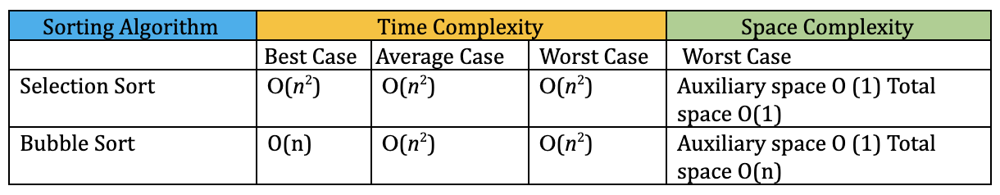

Let's sort it out!

In a series of posts, we will be discussing some of the sorting algorithms listed in the below order:

- [Bubble Sort](https://www.prostdev.com/post/reviewing-sorting-algorithms-bubble-sort)
- **Selection Sort**
- [Insertion Sort](https://www.prostdev.com/post/reviewing-sorting-algorithms-insertion-sort)
- [Merge Sort](https://www.prostdev.com/post/reviewing-sorting-algorithms-merge-sort)
- Quick Sort
- Heap Sort

In this post, we will explore the next, in a series of sorting algorithms, the selection sort. If you feel nostalgic about sorting algorithms, I don’t blame you and it’s totally fine if you want to skim through the first post of the series on [Bubble Sort](https://www.prostdev.com/post/reviewing-sorting-algorithms-bubble-sort). Good read eh! Now you know that bubble sort’s time and space complexity is kind of meh! We crave for a faster and more efficient algorithm to sort the long list of input elements. Is “Selection Sort” the answer? Maybe.

## Why is it called Selection Sort?

The sorting algorithm gets its name from the iterations it performs through input arrays or elements. The algorithm selects the current smallest element and swaps it into its sorted place and continues doing it until the list is sorted. It creates two sections of the arrays; one section is unsorted, and another is sorted. In short, we will be selecting one item at a time by its size and moving it to its sorted position.

Breaking down the instructions:

- Given an unsorted array, set the first index [0] element as the smallest number.
- Iterate through the array to find the smallest number.
- Now swap the smallest number as Index [0] and the original index [0] value to index of the smallest number.
- Continue the above process for the rest of the unsorted array until the last element is reached.

I know, it’s like “yeah I get it, but wait I’m lost” and that’s why we have visuals! Yay!

We will pick up the same numbers we introduced during the bubble sort as an example. Yes! I’m trying to make you compare the techniques already.

Let’s play with the selections:

**Problem:** Sort the numbers [10, 4, 8, 6, 1]. Let’s start with the first *iteration* of the unsorted list based on our understanding of the above instruction.

![Step-by-step selection sort iterations sorting the array [10, 4, 8, 6, 1]](../../assets/blog/reviewing-sorting-algorithms-selection-sort-1.png)

**Observations based on Iterations:**

- In our example, the array size is *n=5* and 4 iterations were performed. Similarly, for *‘n’* numbers *‘n-1’* iterations will be performed.
- Only one element gets sorted on each pass.
- The number of comparisons needed for first iterations was *(n-1),* as we compared 4 elements to find the smallest number. Likewise, comparisons needed for the second iteration is (n-2), third is (n-3), and so on.
- The total number of comparisons required to sort n=5 elements are *(n-1) +(n-2) +(n-3) +(n-4)*. From our example problem length of array is *n= 5,* no. of comparisons is 4+3+2+1 = 10.
- Summation of the above stated turns out to be *‘n(n-1)/2’*. So, guess what would be the total # of comparisons if n=100.
- In the case of a sorted list, selection sort requires the same number of steps as running through an unsorted list.

The default implementation of selection sort is not stable; however, it can be made stable if required. To explore more about stable selection sort, refer to this [link](https://www.geeksforgeeks.org/stable-selection-sort/).

## Selection Vs Bubble Sort

- In bubble sort, the adjacent element is compared and swapped, whereas in selection sort the smallest element is selected to swap against the largest element.
- The selection sort has improved efficiency and is faster when compared to bubble sort.
- The number of swaps is O(n) in comparison to О(*n^*2) of bubble sort. In our example , we have very few swaps when compared to swaps in bubble sort.
- The worst-case complexity in both algorithms is О(*n^*2). In the case of an unsorted list, selection sort has to iterate over each of the ‘n’ elements to find the smallest number. One has to repeat ‘n’ times to sort out the array.
- In the best case of an already sorted list, selection sort will need to iterate over all elements to check if it's sorted. Due to this reason, the time complexity remains the same as in the worst case О(*n^*2).
- The best case of bubble sort is O(n) because in the first iteration, if the swaps are zero the array is determined to be completely sorted.
- Bubble sort consumes additional space for storing variables and needs more swaps, whereas selection sort is an in-place algorithm, so it doesn’t need to allocate any memory.
- Selection sort stores one minimum value and its index to compare results. The space required doesn’t increase with the input size, hence space complexity remains O(1).

**Time and space complexity** are listed in the below table:



## Code Implementation:

> [!NOTE]
> The code has a couple of counters and log messages only for demonstration purposes.

```python
#Function to sort array using Selection Sort
def selectionSort(arr):
    # Get the length of the array
    arrlen = len(arr)
    print('Length of the Input Array : {}'.format(arrlen))
    # Counter to count # of iterations

    cnt = 0
    cnt_comps = 0  # count the comparisions

    for i in range(0, arrlen-1):   # Initial Loop to iterate through Arrays
        # set the indexposition for example i = 0,1,2,3,4
        indexpos = i
        # set the smallestValue as the Current index position array Value
        smallValue = arr[indexpos]
        #  increment the iteration counter
        cnt = cnt+1

        print('- - - - - - - - - - - - - - - - - - - - - - - - - - - - - -')
        print('Iteration : {} starting array is {} '.format(cnt,arr))

    # Loop to compare the index position value with rest of the values in array

        for j in range(i+1, arrlen):

            print('comparing  {}  and  {} '.format( smallValue , arr[j]))
            cnt_comps = cnt_comps + 1
            # Compare smallestValue with the rest of the values
            # This is to check for any values which is smaller than the current position set value.

            if(smallValue > arr[j]):
                # swap the indexposition to the index of newly found small value
                indexpos= j
                # Imp: Swap smallvalue with current array indexposition value.
                # This means the comparision value is changed. This works for large arrays with a complete unsorted list
                smallValue= arr[j]
        # if indexposition is not equal to original index position Swap the values
        if (indexpos!= i):
            currentvalue = arr[i]

            print('Swapping the number {} >> for the number {}'.format(arr[indexpos],arr[i]))

            arr[i], arr[indexpos] = arr[indexpos], currentvalue

            print('Current Array after swap : {} '.format(arr))

        else: # else just print No swap is performed
            print('>>> Looks like value is sorted. No Swap is performed >>>')
    print('Total iterations :{} Total Comparisions : {} Output Array is : {}'.format(cnt,cnt_comps,arr))
    return arr

# Test Long unsorted list
#arrlist = [3, 56, 2, 58, 79, 59, 34, 23, 4, 78, 8, 123, 45]
# Test short unsorted list
arrlist = [10,4,8,6,1]
# Test sorted list arrlist = [1,2,3,4,5]
print(selectionSort(arrlist))
```

**Log Output:**

Let’s decipher the log output to align with our understanding of selection sort.

```text
#  Log for Test short unsorted list arrlist = [10,4,8,6,1]

Length of the Input Array : 5
- - - - - - - - - - - - - - - - - - - - - - - - - - - - - -
Iteration : 1 starting array is [10, 4, 8, 6, 1]
comparing  10  and  4
comparing  4  and  8
comparing  4  and  6
comparing  4  and  1
Swapping the number 1 >> for the number 10
Current Array after swap : [1, 4, 8, 6, 10]
- - - - - - - - - - - - - - - - - - - - - - - - - - - - - -
Iteration : 2 starting array is [1, 4, 8, 6, 10]
comparing  4  and  8
comparing  4  and  6
comparing  4  and  10
>>> Looks like value is sorted. No Swap is performed >>>
- - - - - - - - - - - - - - - - - - - - - - - - - - - - - -
Iteration : 3 starting array is [1, 4, 8, 6, 10]
comparing  8  and  6
comparing  6  and  10
Swapping the number 6 >> for the number 8
Current Array after swap : [1, 4, 6, 8, 10]
- - - - - - - - - - - - - - - - - - - - - - - - - - - - - -
Iteration : 4 starting array is [1, 4, 6, 8, 10]
comparing  8  and  10
>>> Looks like value is sorted. No Swap is performed >>>
Total iterations :4 Total Comparisons : 10 Output Array is : [1, 4, 6, 8, 10]
[1, 4, 6, 8, 10]
---*---*---*---*---*---*---*---*---*---*---*---*---*---*---*---*---*---*---*---*

#  Log for Test long unsorted list arrlist = [3, 56, 2, 58, 79, 59, 34, 23, 4, 78, 8, 123, 45]

Length of the Input Array : 13
- - - - - - - - - - - - - - - - - - - - - - - - - - - - - -
Iteration : 1 starting array is [3, 56, 2, 58, 79, 59, 34, 23, 4, 78, 8, 123, 45]
comparing  3  and  56
comparing  3  and  2
comparing  2  and  58
comparing  2  and  79
comparing  2  and  59
comparing  2  and  34
comparing  2  and  23
comparing  2  and  4
comparing  2  and  78
comparing  2  and  8
comparing  2  and  123
comparing  2  and  45
Swapping the number 2 >> for the number 3
Current Array after swap : [2, 56, 3, 58, 79, 59, 34, 23, 4, 78, 8, 123, 45]
- - - - - - - - - - - - - - - - - - - - - - - - - - - - - -
Iteration : 2 starting array is [2, 56, 3, 58, 79, 59, 34, 23, 4, 78, 8, 123, 45]
comparing  56  and  3
comparing  3  and  58
comparing  3  and  79
comparing  3  and  59
comparing  3  and  34
comparing  3  and  23
comparing  3  and  4
comparing  3  and  78
comparing  3  and  8
comparing  3  and  123
comparing  3  and  45
Swapping the number 3 >> for the number 56
Current Array after swap : [2, 3, 56, 58, 79, 59, 34, 23, 4, 78, 8, 123, 45]
- - - - - - - - - - - - - - - - - - - - - - - - - - - - - -
Iteration : 3 starting array is [2, 3, 56, 58, 79, 59, 34, 23, 4, 78, 8, 123, 45]
comparing  56  and  58
comparing  56  and  79
comparing  56  and  59
comparing  56  and  34
comparing  34  and  23
comparing  23  and  4
comparing  4  and  78
comparing  4  and  8
comparing  4  and  123
comparing  4  and  45
Swapping the number 4 >> for the number 56
Current Array after swap : [2, 3, 4, 58, 79, 59, 34, 23, 56, 78, 8, 123, 45]
- - - - - - - - - - - - - - - - - - - - - - - - - - - - - -
Iteration : 4 starting array is [2, 3, 4, 58, 79, 59, 34, 23, 56, 78, 8, 123, 45]
comparing  58  and  79
comparing  58  and  59
comparing  58  and  34
comparing  34  and  23
comparing  23  and  56
comparing  23  and  78
comparing  23  and  8
comparing  8  and  123
comparing  8  and  45
Swapping the number 8 >> for the number 58
Current Array after swap : [2, 3, 4, 8, 79, 59, 34, 23, 56, 78, 58, 123, 45]
- - - - - - - - - - - - - - - - - - - - - - - - - - - - - -
Iteration : 5 starting array is [2, 3, 4, 8, 79, 59, 34, 23, 56, 78, 58, 123, 45]
comparing  79  and  59
comparing  59  and  34
comparing  34  and  23
comparing  23  and  56
comparing  23  and  78
comparing  23  and  58
comparing  23  and  123
comparing  23  and  45
Swapping the number 23 >> for the number 79
Current Array after swap : [2, 3, 4, 8, 23, 59, 34, 79, 56, 78, 58, 123, 45]
- - - - - - - - - - - - - - - - - - - - - - - - - - - - - -
Iteration : 6 starting array is [2, 3, 4, 8, 23, 59, 34, 79, 56, 78, 58, 123, 45]
comparing  59  and  34
comparing  34  and  79
comparing  34  and  56
comparing  34  and  78
comparing  34  and  58
comparing  34  and  123
comparing  34  and  45
Swapping the number 34 >> for the number 59
Current Array after swap : [2, 3, 4, 8, 23, 34, 59, 79, 56, 78, 58, 123, 45]
- - - - - - - - - - - - - - - - - - - - - - - - - - - - - -
Iteration : 7 starting array is [2, 3, 4, 8, 23, 34, 59, 79, 56, 78, 58, 123, 45]
comparing  59  and  79
comparing  59  and  56
comparing  56  and  78
comparing  56  and  58
comparing  56  and  123
comparing  56  and  45
Swapping the number 45 >> for the number 59
Current Array after swap : [2, 3, 4, 8, 23, 34, 45, 79, 56, 78, 58, 123, 59]
- - - - - - - - - - - - - - - - - - - - - - - - - - - - - -
Iteration : 8 starting array is [2, 3, 4, 8, 23, 34, 45, 79, 56, 78, 58, 123, 59]
comparing  79  and  56
comparing  56  and  78
comparing  56  and  58
comparing  56  and  123
comparing  56  and  59
Swapping the number 56 >> for the number 79
Current Array after swap : [2, 3, 4, 8, 23, 34, 45, 56, 79, 78, 58, 123, 59]
- - - - - - - - - - - - - - - - - - - - - - - - - - - - - -
Iteration : 9 starting array is [2, 3, 4, 8, 23, 34, 45, 56, 79, 78, 58, 123, 59]
comparing  79  and  78
comparing  78  and  58
comparing  58  and  123
comparing  58  and  59
Swapping the number 58 >> for the number 79
Current Array after swap : [2, 3, 4, 8, 23, 34, 45, 56, 58, 78, 79, 123, 59]
- - - - - - - - - - - - - - - - - - - - - - - - - - - - - -
Iteration : 10 starting array is [2, 3, 4, 8, 23, 34, 45, 56, 58, 78, 79, 123, 59]
comparing  78  and  79
comparing  78  and  123
comparing  78  and  59
Swapping the number 59 >> for the number 78
Current Array after swap : [2, 3, 4, 8, 23, 34, 45, 56, 58, 59, 79, 123, 78]
- - - - - - - - - - - - - - - - - - - - - - - - - - - - - -
Iteration : 11 starting array is [2, 3, 4, 8, 23, 34, 45, 56, 58, 59, 79, 123, 78]
comparing  79  and  123
comparing  79  and  78
Swapping the number 78 >> for the number 79
Current Array after swap : [2, 3, 4, 8, 23, 34, 45, 56, 58, 59, 78, 123, 79]
- - - - - - - - - - - - - - - - - - - - - - - - - - - - - -
Iteration : 12 starting array is [2, 3, 4, 8, 23, 34, 45, 56, 58, 59, 78, 123, 79]
comparing  123  and  79
Swapping the number 79 >> for the number 123
Current Array after swap : [2, 3, 4, 8, 23, 34, 45, 56, 58, 59, 78, 79, 123]
Total iterations :12 Total Comparisons : 78 Output Array is : [2, 3, 4, 8, 23, 34, 45, 56, 58, 59, 78, 79, 123]
[2, 3, 4, 8, 23, 34, 45, 56, 58, 59, 78, 79, 123]

---*---*---*---*---*---*---*---*---*---*---*---*---*---*---*---*---*---*---*---*

#  Log for Test Sorted list arrlist = [1,2,3,4,5,6]

Length of the Input Array : 5
- - - - - - - - - - - - - - - - - - - - - - - - - - - - - -
Iteration : 1 starting array is [1, 2, 3, 4, 5]
comparing  1  and  2
comparing  1  and  3
comparing  1  and  4
comparing  1  and  5
>>> Looks like value is sorted. No Swap is performed >>>
- - - - - - - - - - - - - - - - - - - - - - - - - - - - - -
Iteration : 2 starting array is [1, 2, 3, 4, 5]
comparing  2  and  3
comparing  2  and  4
comparing  2  and  5
>>> Looks like value is sorted. No Swap is performed >>>
- - - - - - - - - - - - - - - - - - - - - - - - - - - - - -
Iteration : 3 starting array is [1, 2, 3, 4, 5]
comparing  3  and  4
comparing  3  and  5
>>> Looks like value is sorted. No Swap is performed >>>
- - - - - - - - - - - - - - - - - - - - - - - - - - - - - -
Iteration : 4 starting array is [1, 2, 3, 4, 5]
comparing  4  and  5
>>> Looks like value is sorted. No Swap is performed >>>
Total iterations :4 Total Comparisons : 10 Output Array is : [1, 2, 3, 4, 5]
[1, 2, 3, 4, 5]
```

If you analyze the short unsorted list [10,4,8,6,1] log, length of the array is 5, total iterations performed are 4 and total Comparisons 10. The total comparison value is based on our earlier formulae n(n-1) /2.

Another test performed with a long unsorted list has log output of array length as n=13, total iterations performed (n-1) = 12, total comparisons as 78 based on the above formulae. If you recollect, we had to guess what would be the total comparisons for n=100, it will be 4950.

We also tested a completely sorted array [1,2,3,4,5], although no swapping was required, the total number of comparisons remains 10 and iterations as 4. This clearly justifies the selection sort time complexity of О(*n^*2) in best and worst cases.

## Final thoughts

Selection sort is yet another simple algorithm that is slow and not fast in comparison to bubble sort. However, it works well with a small list to be sorted and in cases where space is limited. This feature is attributed mainly due to the minimal swaps O(n) requiring very less space.

To conclude, selection sort doesn’t seem to be the answer for the fast and efficient sorting algorithm we were looking for at the beginning of the post. However, this isn’t the end of it, in the continuum we have a couple more sorting algorithms to be discussed, to arrive at the most efficient sorting techniques.

Stay tuned!!

I hope you enjoyed the post. Please subscribe to [ProstDev](https://www.prostdev.com/) for more exciting topics.

Hasta luego, amigos!

## Study Resources

Below are some resources which discuss Selection sort and its Time-Space complexity at length.

- [The Selection Sort - Runestone academy](https://runestone.academy/runestone/books/published/pythonds/SortSearch/TheSelectionSort.html)
- [Selection Sort - Wikipedia](https://en.wikipedia.org/wiki/Selection_sort)
- [Video] [Selection Sort - CS50 Harvard](https://www.youtube.com/watch?v=f8hXR_Hvybo&feature=emb_title)
- [Analysis of Selection Sort - Khan Academy](https://www.khanacademy.org/computing/computer-science/algorithms/sorting-algorithms/a/analysis-of-selection-sort)
- [Video] [Select Sort - CS310 San Diego University](https://www.youtube.com/watch?v=fgYlVyrt1vE)
- [Video] [Selection Sort with Gypsy Folk Dance](https://www.youtube.com/watch?v=Ns4TPTC8whw)
- [Asymptotic-Notation- Khan Academy](https://www.khanacademy.org/computing/computer-science/algorithms/asymptotic-notation/a/asymptotic-notation)
- [Big-O cheat sheet](https://www.bigocheatsheet.com/)
