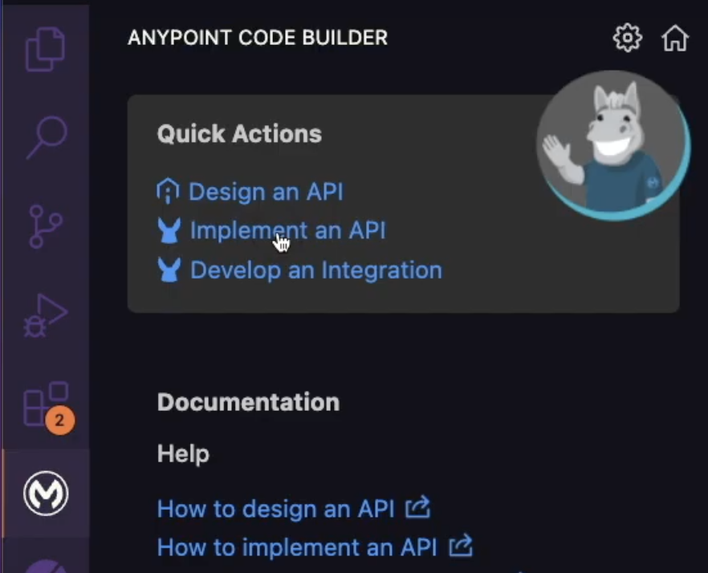
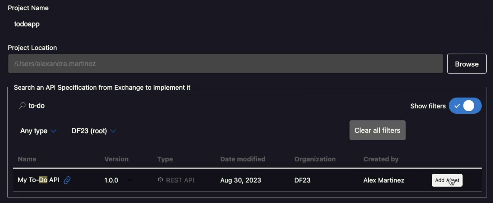
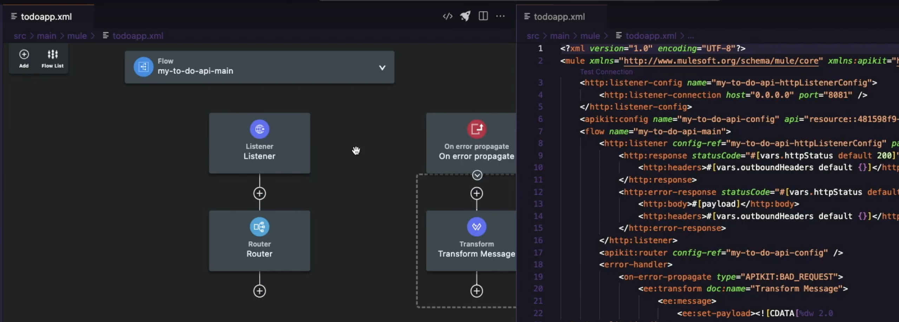
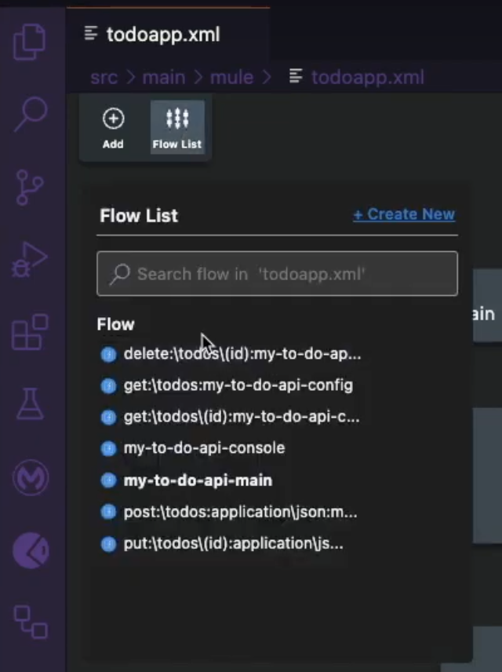
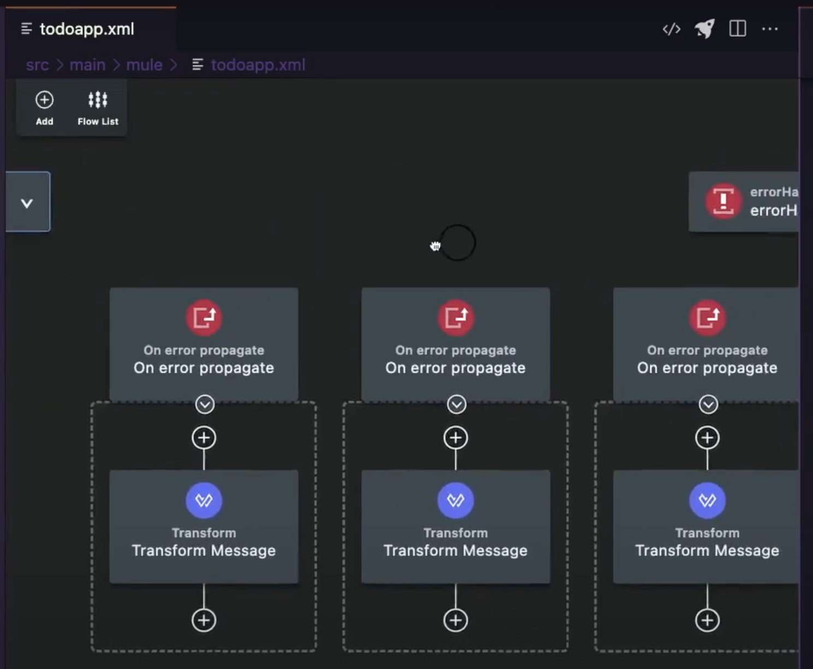
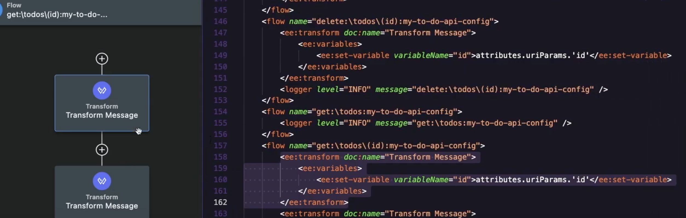
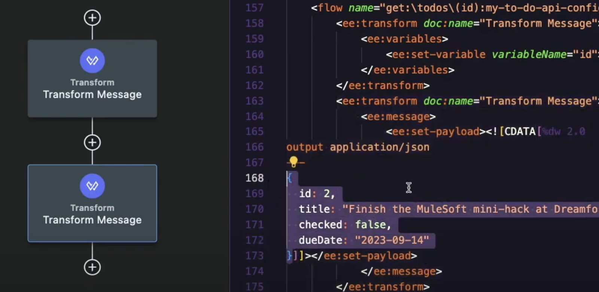

In this post, I am going to show you how to scaffold your flows in Anypoint Code Builder from a published API specification.

> [!DOCS]
> To do this same thing in Anypoint Studio, refer to [How to scaffold Mule flows from a published API spec in Anypoint Studio](https://www.prostdev.com/post/scaffold-mule-flows-from-published-api-specification)

Why would you want to scaffold Mule flows from an API specification? This way you will be able to get started on your Mule application with a base project that is created upon your specification, instead of starting the Mule project and Mule flows from scratch.

Once you scaffold the Mule project, you will have:

- Mule flows for each HTTP method in your specification
- Basic error handling for different HTTP status codes
- Initial Mule project with some Transform Message components where applicable

## Prerequisites

- **Anypoint Platform** - You should have an Anypoint Platform account. You can create a new free trial account [here](https://anypoint.mulesoft.com/login/signup).
- **API specification** - You should already have an API specification published in Anypoint Exchange.
- **Visual Studio Code** - To use Anypoint Code Builder, you must first install VS Code. You can download it [here](https://code.visualstudio.com/).
- **Anypoint Extension Pack** - To enable Anypoint Code Builder in your Visual Studio Code, you must install this extension. You can install it from [here](https://marketplace.visualstudio.com/items?itemName=salesforce.mule-dx-extension-pack).
- **GitHub Repo** - If you want to follow along with the code I generated, you can check it out [here](https://github.com/ProstDev/codetober23/tree/main/day2).

> [!DOCS]
> If this is your first time creating an API specification, refer to [How to use MuleSoft's visual API Designer to create a To-Do API specification using clicks, not code](https://www.prostdev.com/post/how-to-use-mulesoft-s-visual-api-designer-to-create-a-to-do-api-specification-using-clicks-not-code)

## Create a Mule project in ACB

Once you are inside Anypoint Code Builder, select the **Implement an API** quick action.

This will open a new menu or window, and it will ask you to sign in to Anypoint Platform to retrieve the API Specification from your account. Click **Allow** and follow the prompts to sign in.

Once you are signed in, you will be able to search an API Specification from Exchange to implement it. Simply search for your asset's name on the search bar and select it from the list by clicking on **Add Asset**.

> [!NOTE]
> If you're having issues searching for your asset, you can use the **Show filters** toggle to search for more specific assets. For example, using your own organization or the asset's type.

After the API Specification has been selected, click on **Create Project**. Wait a few seconds for everything to finish processing and you'll have the finalized project after that.

## Navigate the generated project

Once the project has been created, you should be able to see the flows in the configuration file located under `src/main/mule`.

You can click on the **Flow List** button from the top-left of the graphical view (or the flow canvas) to see a complete list of all the flows that have been implemented in the current XML file.

The Error Handling has been added automatically to the main flow as well. This contains the HTTP status codes for some basic errors like 400 Bad Request or 404 Not Found.

Notice how some of the flows already have a Transform Message component for you to see which DataWeave code is needed to retrieve some data like the URI Parameter(s). This, of course, is just in the case that your API Specification contains a URI Parameter.

There will also be Transform Message components added for some cases where you have set up an example in the API Specification.

Pretty cool, right?

Keep posted for some more articles on scaffolding in Anypoint Studio or Anypoint Code Builder!

Remember to subscribe at the bottom of the page to receive email notifications as soon as new content is published. ✨

💬 Prost! 🍻
