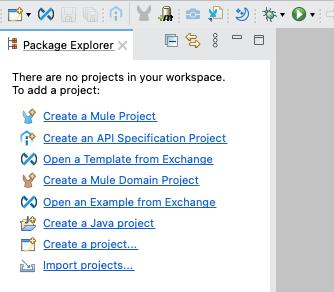
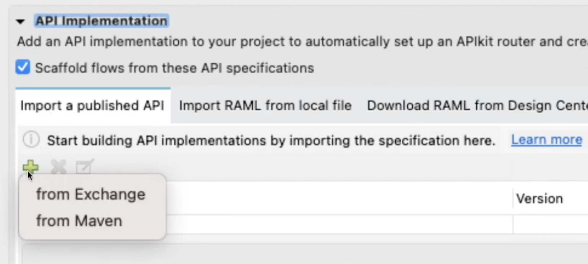
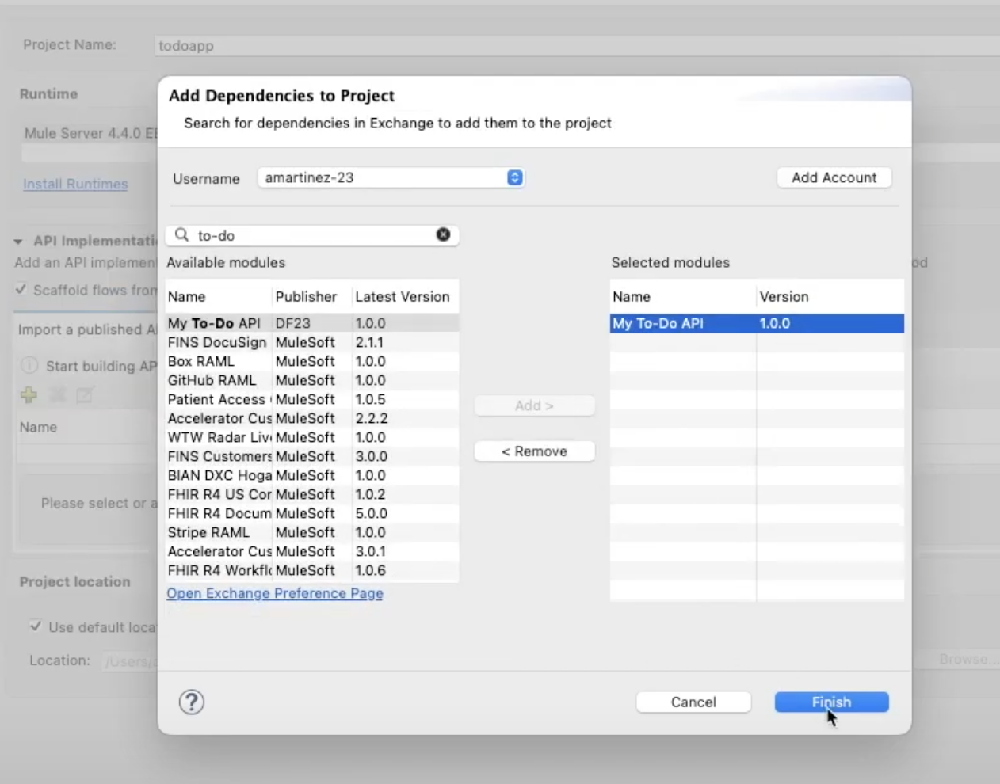
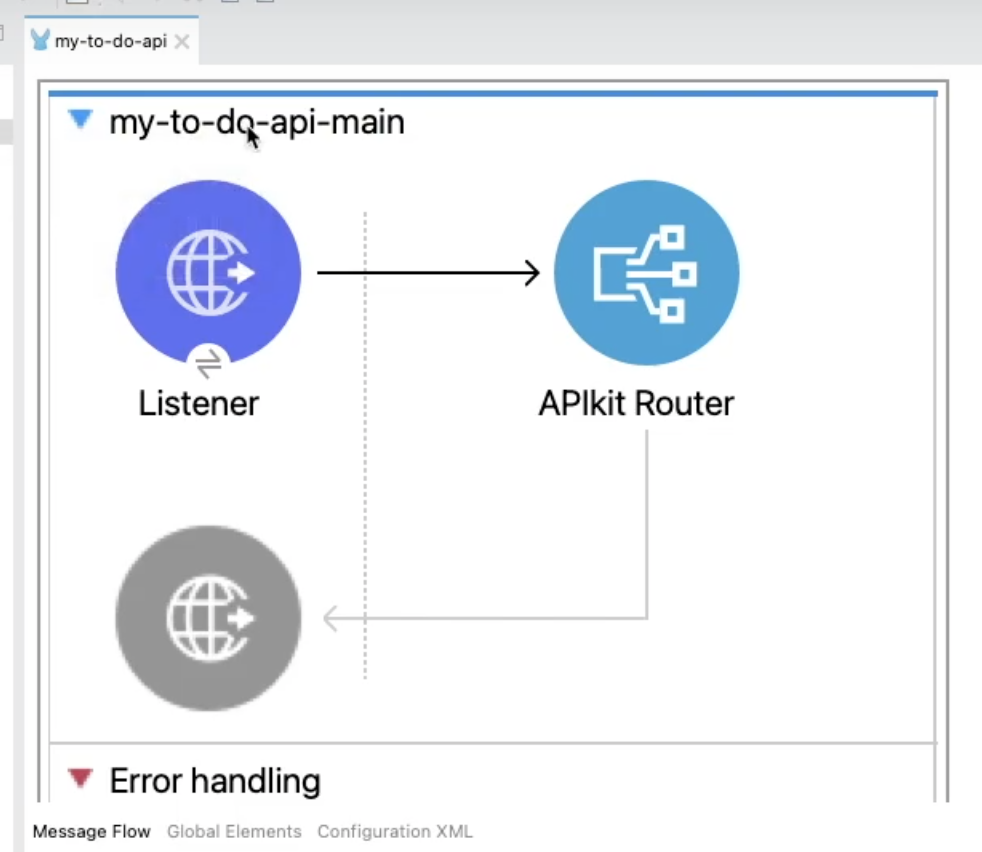
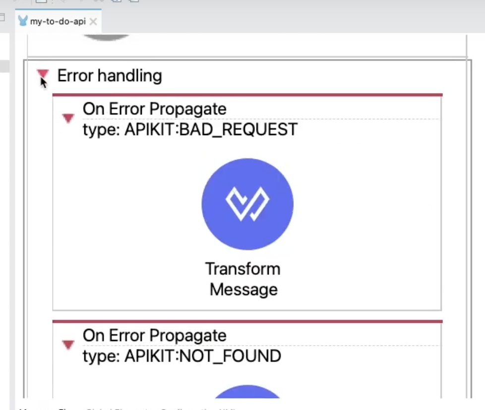
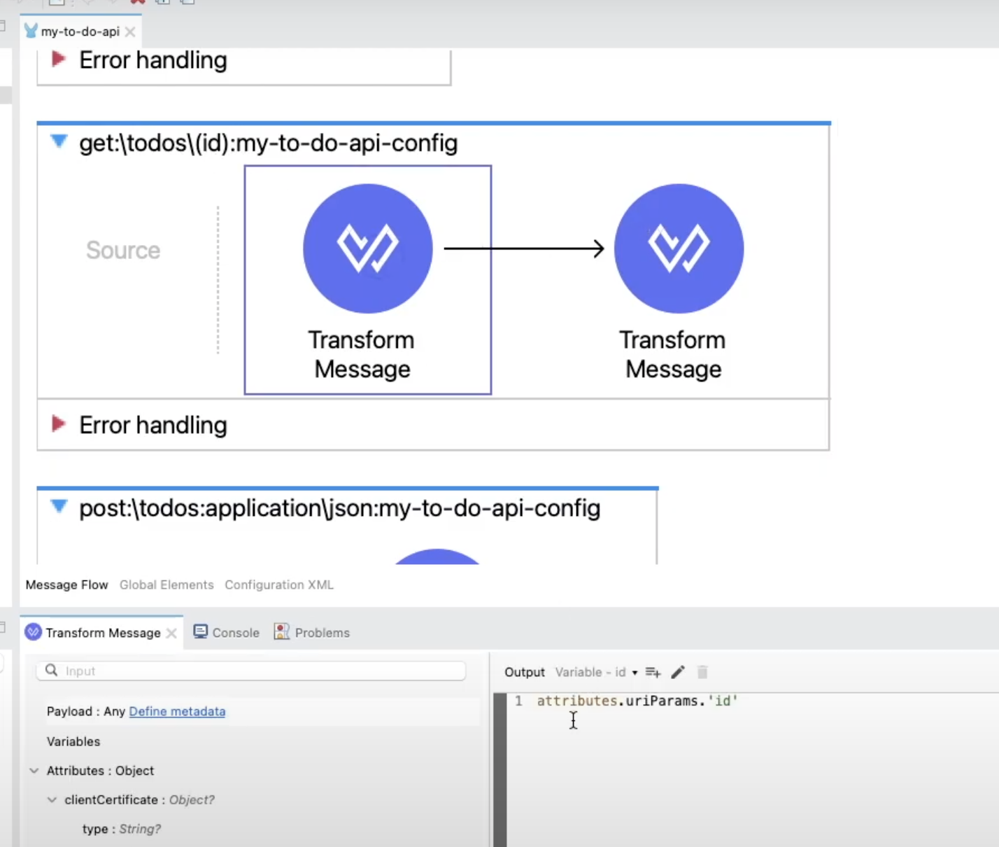
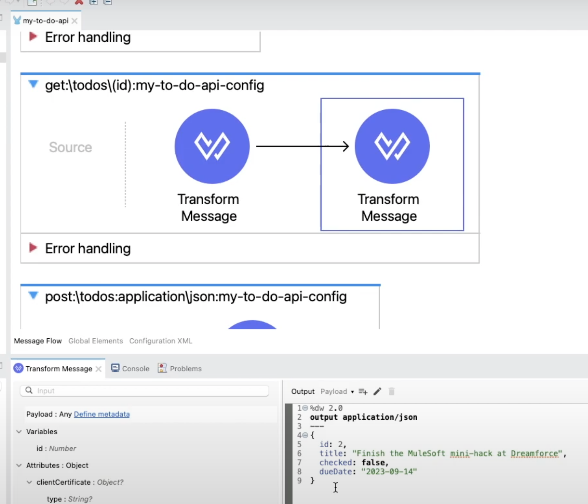

In this post, I am going to show you how to scaffold your flows in Anypoint Studio from a published API specification.

> [!DOCS]
> To do this same thing in Anypoint Code Builder, refer to [How to scaffold Mule flows from a published API spec in Anypoint Code Builder (ACB)](https://www.prostdev.com/post/scaffold-mule-flows-from-published-api-spec-acb)

Why would you want to scaffold Mule flows from an API specification? This way you will be able to get started on your Mule application with a base project that is created upon your specification, instead of starting the Mule project and Mule flows from scratch.

Once you scaffold the Mule project, you will have:

- Mule flows for each HTTP method in your specification
- Basic error handling for different HTTP status codes
- Initial Mule project with some Transform Message components where applicable

## Prerequisites

- **Anypoint Platform** - You should have an Anypoint Platform account. You can create a new free trial account [here](https://anypoint.mulesoft.com/login/signup).
- **API specification** - You should already have an API specification published in Anypoint Exchange.
- **Anypoint Studio** - MuleSoft's IDE based on Eclipse. You can download it [here](https://www.mulesoft.com/lp/dl/anypoint-mule-studio).
- **GitHub Repo** - If you want to follow along with the code I generated, you can check it out [here](https://github.com/ProstDev/codetober23/tree/main/day1).

> [!DOCS]
> If this is your first time creating an API specification, refer to [How to use MuleSoft's visual API Designer to create a To-Do API specification using clicks, not code](https://www.prostdev.com/post/how-to-use-mulesoft-s-visual-api-designer-to-create-a-to-do-api-specification-using-clicks-not-code)

## Create a Mule project in Studio

First of all, let's open Anypoint Studio and click on **Create a Mule project** from the options on the left.

Add any name of your choice in **Project Name**. Click on the green ➕ button under **Import a published API** and select **from Exchange**.

Follow the prompts to authenticate to your Anypoint Platform account by clicking **Add Account** and adding your Username and Password. Once you are signed in, search for your API Specification, select it, and click on **Add >**. Once you selected it on the right-hand panel, click on **Finish**.

After the API appears under **Import a published API**, you can click on **Finish** to close the window and see the generated project.

## Navigate the generated project

Once the project has been created, you should be able to see the flows in the configuration file located under `src/main/mule`.

The Error Handling has been added automatically to the main flow as well. This contains the HTTP status codes for some basic errors like 400 Bad Request or 404 Not Found.

Notice how some of the flows already have a Transform Message component for you to see which DataWeave code is needed to retrieve some data like the URI Parameter(s). This, of course, is just in the case that your API Specification contains a URI Parameter.

There will also be Transform Message components added for some cases where you have set up an example in the API Specification.

Pretty cool, right?

Keep posted for some more articles on scaffolding in Anypoint Studio or Anypoint Code Builder!

Remember to subscribe at the bottom of the page to receive email notifications as soon as new content is published.

Prost!
