*GitHub repository with the Mule Project can be found at the end of the post.*

In the previous post, [Intro to Scatter-Gather Integration Pattern](https://www.prostdev.com/post/intro-to-scatter-gather-integration-pattern), we have discussed the basics of the Scatter-Gather message routing Enterprise Integration Pattern and also demonstrated a simple case of the pattern using MuleSoft Connector. Moving forward, from a happy path scenario, we will see the demonstration on how Mule 4 Scatter-Gather connector behaves in case of processing errors with or without Mule Error handlers. Additionally, we will explore the example of processing multiple services using the Mule 4 Scatter-Gather connector.

**Gathering** **thoughts from the previous blog:**

- Scatter-Gather processes messages in-parallel and the result is an aggregated response of the routes.
- To live up to its merits, Scatter-Gather needs more than one message processing route.
- When the process responses are independent of each other, it is efficient to use Scatter-Gather.
- Use Scatter-Gather for multicasting scenarios.
- Scatter-Gather is concurrent processing and there is no sequence of execution.
- Scatter-Gather will not stop processing messages to other successful routes during failures.

## How does the input message get processed in Scatter-Gather?

The input payload/message is distributed or copied across all the routes of the Scatter-Gather. Our [previous example](https://www.prostdev.com/post/intro-to-scatter-gather-integration-pattern) of the MuleSoft Scatter-Gather is modified, by adding a new Set Payload component to check the status of the payload during the Scatter-Gather processing. As shown below from the log results, the payload is copied or distributed across all the routes of the Scatter-Gather. In the listed example, the payload value “result0: 42” is not honored by the three flows, as they have their payload values.

In short, the Set Payload value before the Scatter-Gather component is overwritten by the flow's payload value.

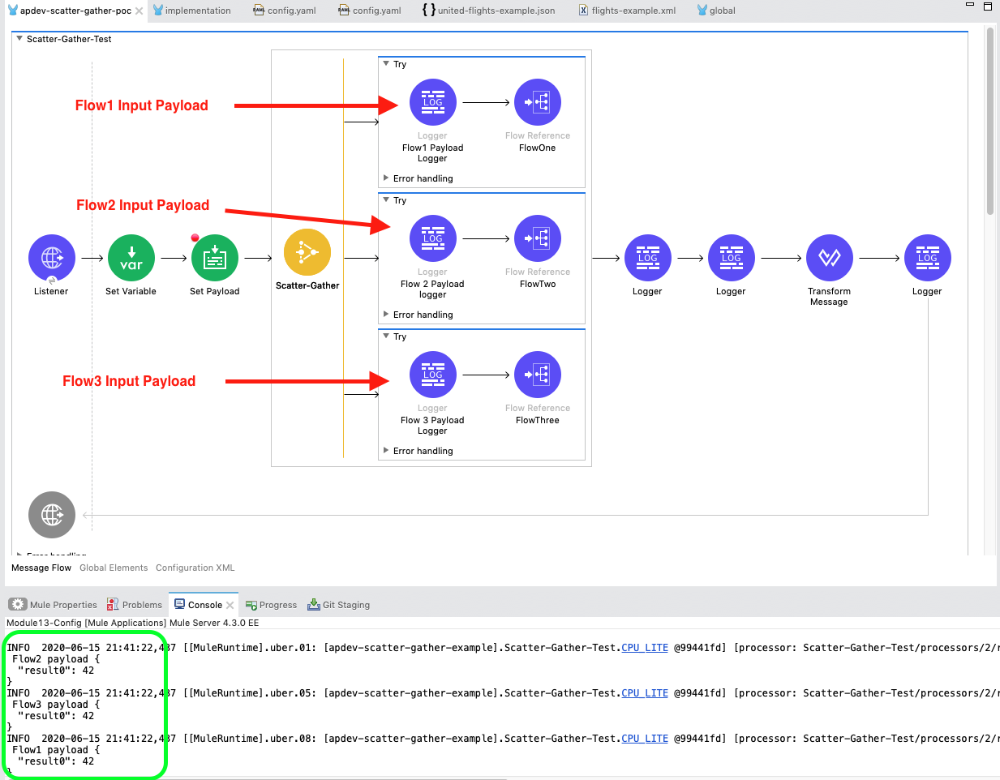

However, the Set Payload information can be very well used to add business logic to the multiple routes accordingly. For demonstration purposes, Flow One payload is modified to retrieve the “result0” information.

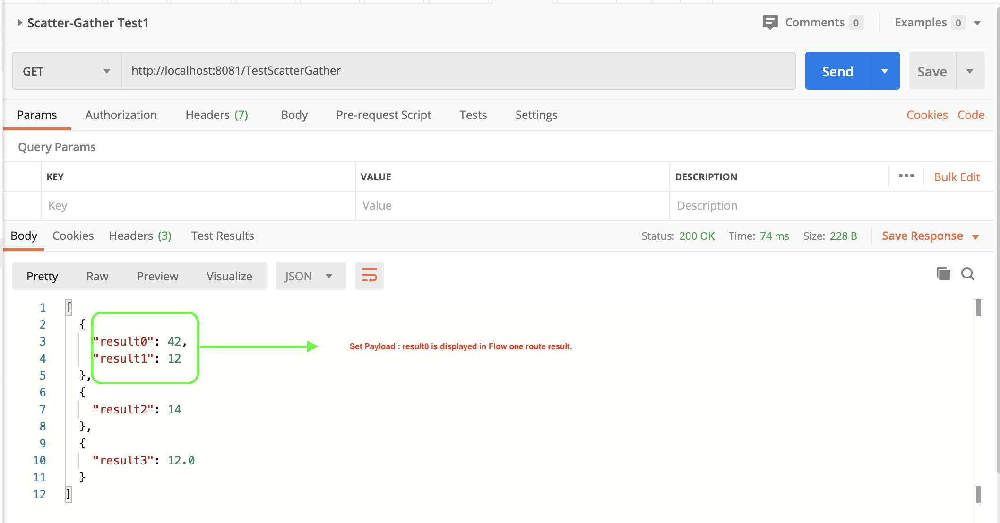

## Error Handling in Scatter-Gather

In our [previous post](https://www.prostdev.com/post/intro-to-scatter-gather-integration-pattern), we stated that the Scatter-Gather avoids a complete meltdown, unlike sequential processing. But, without an effective error handling in place, you can question the merits of the latter statement. One can use a MuleSoft Try scope in the routers of a Scatter-Gather component for error handling purposes.

If a particular route encounters errors, the Try scope will take care of the error using the [On-Error-continue](https://docs.mulesoft.com/mule-runtime/4.3/on-error-scope-concept) error handler, which would make the route successful by handling the error logic. The Scatter-Gather route failures are handled well to process the error unless it is required to end the process abruptly. Let’s try to prove the same using some twists in our current Scatter-Gather example.

### Happy Path ☺

Everything is green, life’s pretty smooth and happiness sways around. The Scatter-Gather route flows one, two, and three payloads have been modified to implement a simple addition, subtraction, and division of numbers (ex: 10+2, 16-2, 30/2) to be aggregated as an output result of each flow. In the screenshot below, results are displayed as expected, all looks good! Yay!!

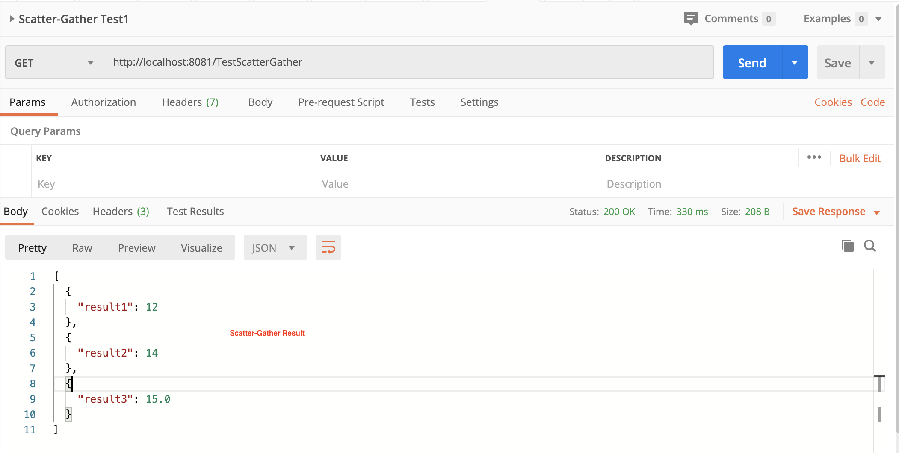

### Not so Happy Path

Well, life isn’t all rainbows and unicorns as the above result made you believe for a while. If the flow-three fails due to a *division by zero* error, the Scatter-Gather will fail as there isn’t any mechanism to avert the catastrophe. The process will halt, and the error will be displayed as given below.

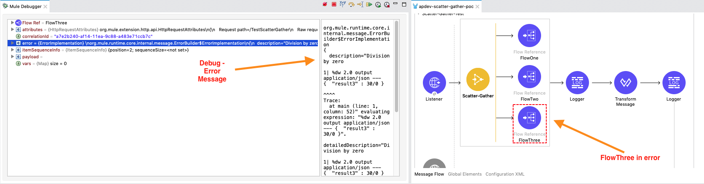

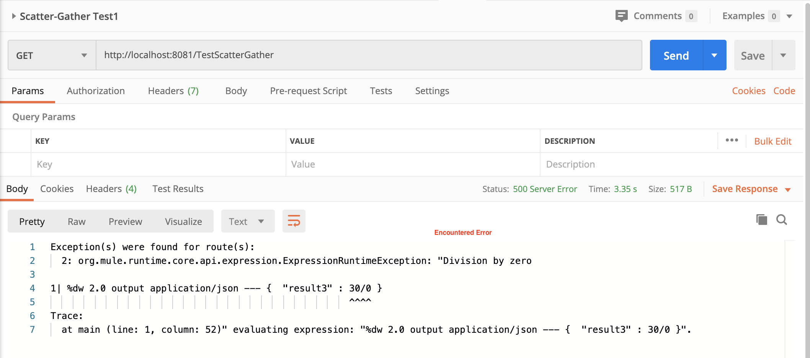

Although not so happy path the above case is, one would still want to see some result as an output instead of a long semi-cryptic error message. Here comes the error handling Try scope for the Scatter-Gather routes! All the three flows are wrapped with [Try Scope](https://docs.mulesoft.com/mule-runtime/4.3/try-scope-concept)to capture the errors in any of the routes if they failed while processing the message. The output is guaranteed to be some aggregated result instead of a long error description.

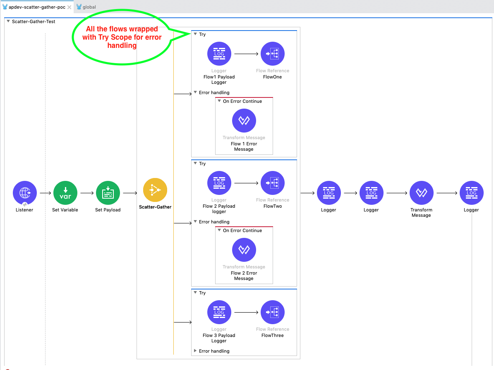

From the above fig. 2.5, an error handling scope (Mule 4) of On-Error Continue is implemented which will make sure a result is derived from the Scatter-Gather. More information about Mule 4 error handling can be found at [MuleSoft documentation](https://docs.mulesoft.com/mule-runtime/4.3/intro-error-handlers). The transform message component, inside the On-Error Continue scope, is used to provide more information on the type of error as output. By adding this feature, we can now identify the failure reason for flow three. After all, our goal here is to achieve a more composed state of the output.

There will be valid business scenarios in real-time, where the output of the route in error is not required to be displayed. In such cases, the output will be an aggregate response of successful flows, as shown in Fig 2.5.1. In the On-Error continue component, the transform message payload is given as [ ] (empty array) to bypass error information.

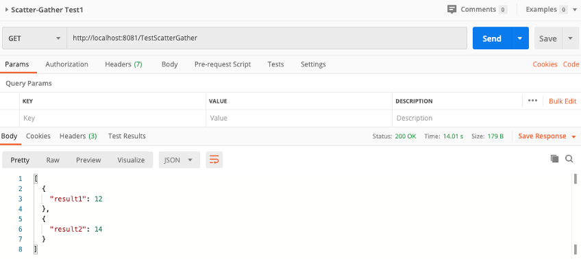

Fig.2.6 is showing results of the flow stepping into the error handling scope through Anypoint studio mule debugger. The error is bypassed, and the Scatter-Gather has aggregated the messages from successful processes.

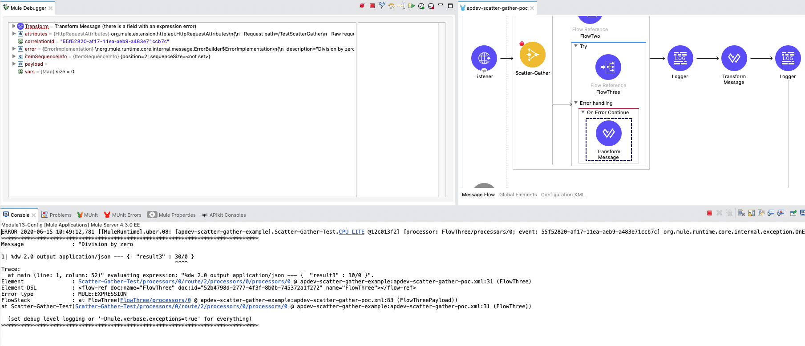

When the flow-three result is required irrespective of failure or success, a descriptive user-friendly error message can be added. This would help the user to identify the reason for Scatter-Gather route failures (if any). If a business logic needs to be invoked on flow-three failure, it can be incorporated in the On-Error continue error handler scope. The business logic can be anything specific to invoking another process upon failure or notifying the stakeholders through email.

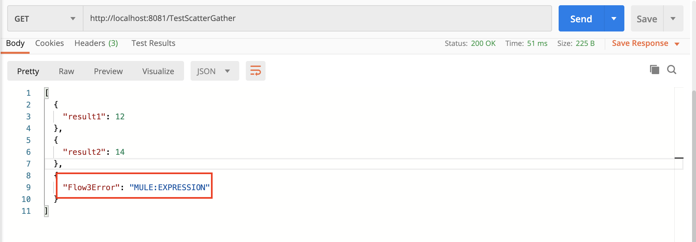

Error message to be displayed as the output of the failed process flow-three.

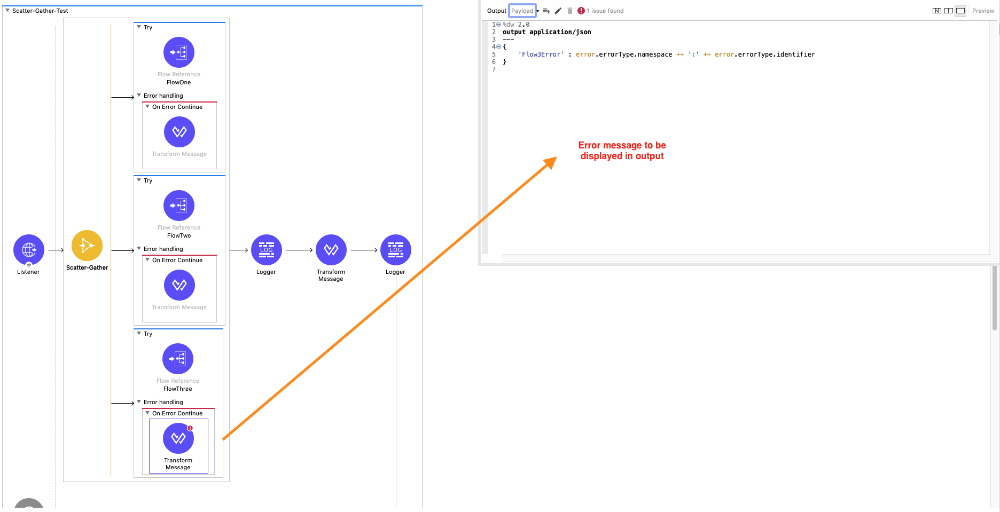

Yay!! We searched for happiness, in the not so happy path of Scatter-Gather and we were able to strike the right balance. A thought to ponder and reflect upon, which brings us to our reflection questions, and I would encourage you to try out the code snippets in mule 4 to try out the below cases and get the answers.

### Reflection Questions:

- What happens to the initial payload, when one of the processes in the Scatter-Gather fails?
- What happens if the variable in one process is modified and not in the other?
- What would be the result of Scatter-Gather if “On-Error propagates” is used instead of “On-Error continue” when one of the routes fails?

## Multiple Services Call Using Mule 4 Scatter-Gather

Okay! Moving ahead, remember we are yet to see a case of multiple services being invoked through the Scatter-Gather Mule 4 component. The example demonstrated below is retrieved from the free [Mule 4 developer](https://training.mulesoft.com/course/development-fundamentals-mule4) course. It’s a very simple example to showcase the power of the Scatter-Gather component. The scenario is to search the flights of United Airlines and Delta airlines for a given airport code.

The United Airlines flight search is retrieved from REST API calls. Whereas Delta airlines information is retrieved through SOAP WSDL. The Set-Variable component is used to store the airport code value to retrieve the available flight information. Variable ‘code’ value is set as #[message.attributes.queryParams.code].

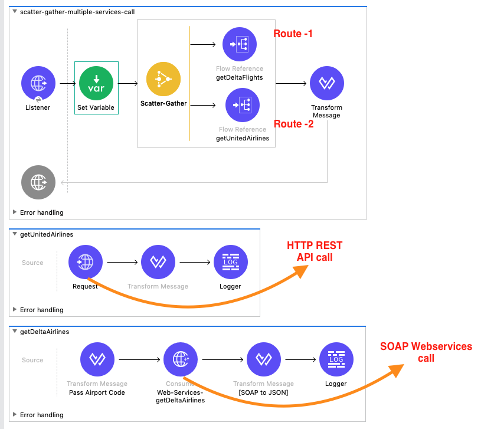

The following result is derived from the Scatter-Gather processing of the two different service calls.

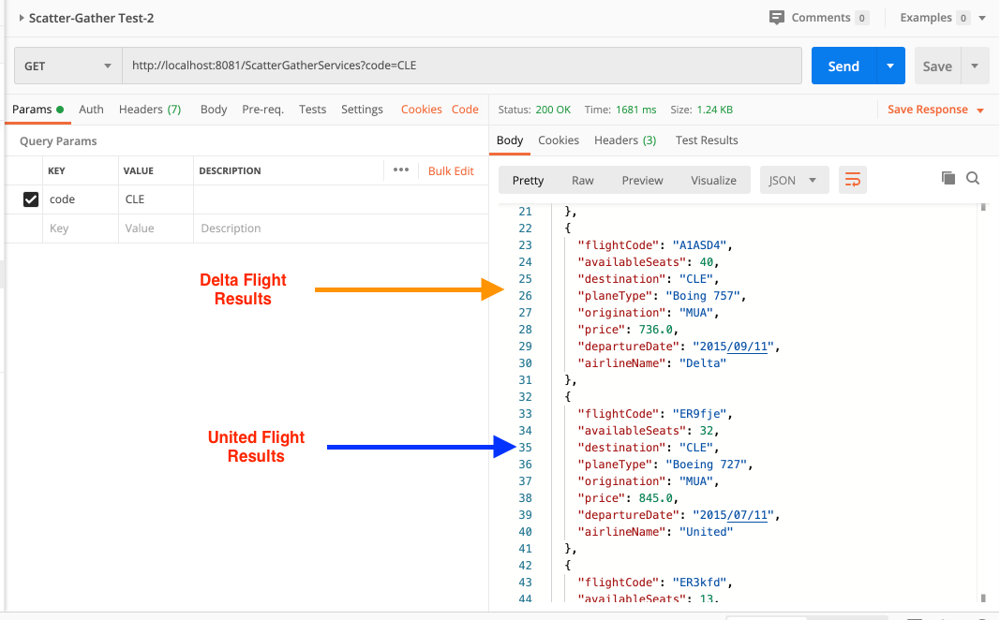

You have made it to this part of the post, now the last stop in the journey is to add the missing part in the above demonstration, error handling. If you check *Fig 2.9,* Try scope hasn’t been implemented yet. Applying the learnings from our previous section, let’s add the Try scope to each of the Scatter-Gather routes.

We can add a flavor to the scenario by displaying only available flights. Meaning, we are looking to retrieve any flight information irrespective of route failure. You can most definitely hash out a test case to check the output if both the flights fail.

To demonstrate the error handling, the web services URL is tweaked as [http://mu.learn.mulesoft.com/delta12?wsdl](http://mu.learn.mulesoft.com/delta12?wsdl)

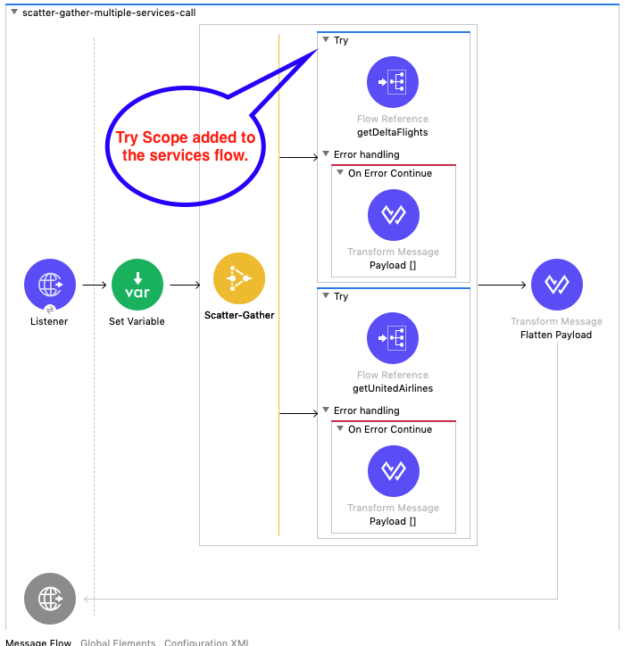

Upon checking the flow through mule-debugger, we can see the getDeltaFlights process failed due to error type `WSC: CONNECTIVITY`.

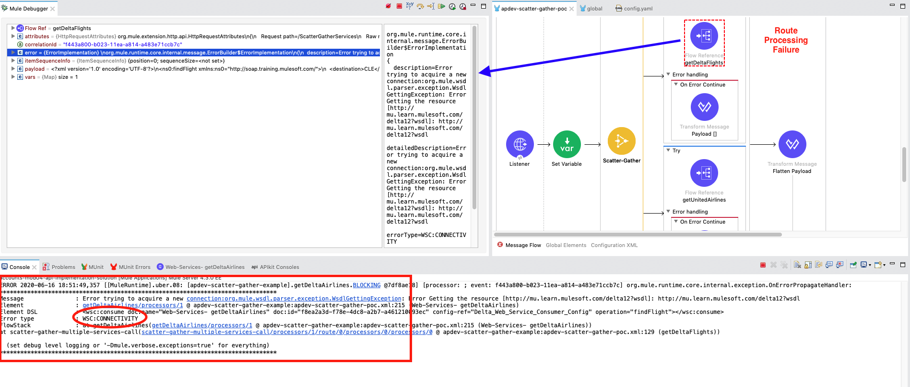

However, the failure was handled successfully by the MuleSoft Try scope and the On-Error continue to Transform message has an empty array returned as a response. Scatter-Gather has now aggregated the response from both the flows as output shown below:

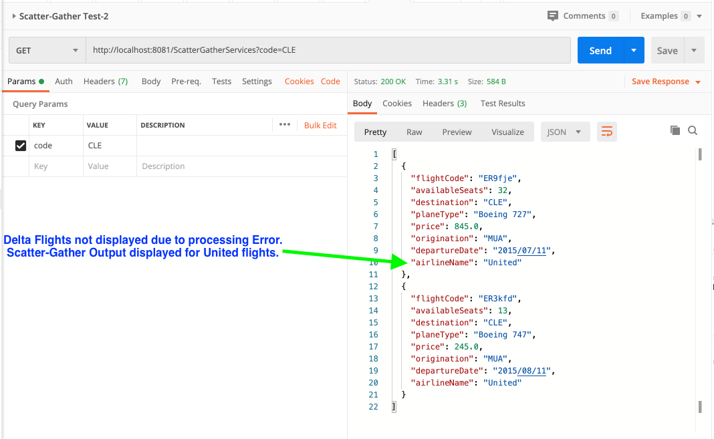

## Penultimate Thoughts

Finally, we have reached a point where we understand the ball bearings of Scatter-Gather through the Mule 4 connector example.

To reiterate:

- Scatter-Gather is best suited for Multicast scenarios.
- The Scatter-Gather messages are processed in-parallel with aggregate responses.
- More than one process is required for Scatter-Gather to function according to its discussed merits.
- The MuleSoft Scatter-Gather has many features to control the execution flow in case of route failures.
- In case of errors, a new business logic such as notifications can be invoked as required.

Now that you’re familiar with Scatter-Gather, it’s the time to check out the real code in action.

### Configuration File Code:

```xml
<?xml version="1.0" encoding="UTF-8"?>

<mule xmlns:wsc="http://www.mulesoft.org/schema/mule/wsc" xmlns:ee="http://www.mulesoft.org/schema/mule/ee/core"
	xmlns:http="http://www.mulesoft.org/schema/mule/http"
	xmlns="http://www.mulesoft.org/schema/mule/core" xmlns:doc="http://www.mulesoft.org/schema/mule/documentation" xmlns:xsi="http://www.w3.org/2001/XMLSchema-instance" xsi:schemaLocation="http://www.mulesoft.org/schema/mule/core http://www.mulesoft.org/schema/mule/core/current/mule.xsd
http://www.mulesoft.org/schema/mule/http http://www.mulesoft.org/schema/mule/http/current/mule-http.xsd
http://www.mulesoft.org/schema/mule/ee/core http://www.mulesoft.org/schema/mule/ee/core/current/mule-ee.xsd
http://www.mulesoft.org/schema/mule/wsc http://www.mulesoft.org/schema/mule/wsc/current/mule-wsc.xsd">
	<http:listener-config name="HTTP_Listener_config" doc:name="HTTP Listener config" doc:id="2e90c00a-52d5-4446-8873-0f7ed5a2799c" >
		<http:listener-connection host="0.0.0.0" port="8081" />
	</http:listener-config>
	<http:request-config name="HTTP_Request_configuration" doc:name="HTTP Request configuration" doc:id="c9782c4e-e9f6-4eec-99db-6af800f655e3" basePath="${training.basepath}" >
		<http:request-connection host="${training.host}" port="${training.port}" />
	</http:request-config>
	<configuration-properties doc:name="Configuration properties" doc:id="debae6a1-48ed-4980-97c2-8fdb04f6c21a" file="config.yaml" />
	<flow name="Scatter-Gather-Test" doc:id="935b40a1-ff2a-42dc-9ae1-7582ae6d395c" >
		<http:listener doc:name="Listener" doc:id="28367bf3-d88f-44b7-8588-2e90765a8a73" config-ref="HTTP_Listener_config" path="/TestScatterGather" allowedMethods="GET"/>
		<set-variable value='#["Test Variable 123"]' doc:name="Set Variable" doc:id="24a377c4-0948-43a2-8554-a505e87f3fd1" variableName="testVar"/>
		<set-payload value='#[%dw 2.0
output application/json
---
{
	"result0" : 42
}]' doc:name="Set Payload" doc:id="ecf832d1-0c7c-4896-9fa8-88c0cc30bf25" />
		<scatter-gather doc:name="Scatter-Gather" doc:id="905db6e8-0620-49fd-9758-d19face32c9e" >
			<route>
				<try doc:name="Try" doc:id="1096fe18-88c4-494b-a9c1-5af626fe1448" >
					<logger level="INFO" doc:name="Flow1 Payload Logger" doc:id="16b90067-0961-4ae7-8b95-df9113338c7d" message="#['\n Flow1 payload #[payload]']"/>
					<flow-ref doc:name="FlowOne" doc:id="ccc96be7-ebd6-4951-bfee-0e8dd01f3891" name="FlowOne" />
					<error-handler >
						<on-error-continue enableNotifications="true" logException="true" doc:name="On Error Continue" doc:id="7cac59d1-16f7-44c1-93f1-5d92ab46f0ad" >
							<ee:transform doc:name="Flow 1 Error Message" doc:id="87382f00-993d-4a0d-8e77-9c96dd4e0e12" >
								<ee:message >
									<ee:set-payload ><![CDATA[%dw 2.0
output application/java
---
[]]]></ee:set-payload>
								</ee:message>
							</ee:transform>
						</on-error-continue>
					</error-handler>
				</try>
			</route>
			<route>
				<try doc:name="Try" doc:id="3f118c60-59a3-442e-b9d1-b09c982e33a0" >
					<logger level="INFO" doc:name="Flow 2 Payload logger" doc:id="61a4d43a-2455-4a34-b70b-5626037cfcce" message="#['\n Flow2 payload #[payload]']"/>
					<flow-ref doc:name="FlowTwo" doc:id="0c0ddba9-eba4-42ef-b1d9-0063b5749e34" name="FlowTwo" />
					<error-handler >
						<on-error-continue enableNotifications="true" logException="true" doc:name="On Error Continue" doc:id="99fc9f22-4521-46a6-ad84-c7c80a031aab" >
							<ee:transform doc:name="Flow 2 Error Message" doc:id="edf180cf-59ad-46bb-b7bf-d095649387de" >
								<ee:message >
									<ee:set-payload ><![CDATA[%dw 2.0
output application/java
---
[]]]></ee:set-payload>
								</ee:message>
							</ee:transform>
						</on-error-continue>
					</error-handler>
				</try>
			</route>
			<route>
				<try doc:name="Try" doc:id="a640a6e5-259a-4b16-a40f-2e26a595f00e" >
					<logger level="INFO" doc:name="Flow 3 Payload Logger" doc:id="c93a5225-142d-45e8-b6a2-20f16fffb90d" message="#['\n Flow3 payload #[payload]']"/>
					<flow-ref doc:name="FlowThree" doc:id="52b4798d-2777-4f3f-8b0b-745372a1f272" name="FlowThree" />
					<error-handler >
						<on-error-continue enableNotifications="true" logException="true" doc:name="On Error Continue" doc:id="874b6ccc-58f7-48ed-8c44-73a631e0403f" >
							<ee:transform doc:name="Flow 3 Error Message" doc:id="4d36bfa5-d34c-4baf-9bdb-df613ecacba1" >
								<ee:message >
									<ee:set-payload ><![CDATA[%dw 2.0
output application/json
---
{
	"Flow3Error" : (error.errorType.namespace default "")  ++ ':' ++ (error.errorType.identifier default "") 
}
]]></ee:set-payload>
								</ee:message>
							</ee:transform>
						</on-error-continue>
					</error-handler>
				</try>
			</route>
		</scatter-gather>
		<logger level="INFO" doc:name="Logger" doc:id="7d031c30-e6b7-47df-ad39-b639aad494c7" message="#[%dw 2.0
output application/json
---
payload]" />
		<logger level="INFO" doc:name="Logger" doc:id="72e4e169-b948-45b1-89f4-446f4b9142d5" message='#["Test Variable value : " ++ vars.testVar]'/>
		<ee:transform doc:name="Transform Message" doc:id="3e84b6d3-9272-427d-891c-cd63ae73565f" >
			<ee:message >
				<ee:set-payload ><![CDATA[%dw 2.0
output application/json
---
flatten(payload..payload)]]></ee:set-payload>
			</ee:message>
		</ee:transform>
		<logger level="INFO" doc:name="Logger" doc:id="e1f6e37f-8cd2-48ad-a5d9-7970c8f0cab8" />
	</flow>
	<sub-flow name="FlowOne" doc:id="132faa68-d296-4567-90a7-dc733acc8276" >
		<set-payload value='#[%dw 2.0
output application/json
---
{
	"result1" : 10+2
}]' doc:name="FlowOnePayload" doc:id="c5486dd1-6668-407d-a592-5d8bbfc8325f" />
	</sub-flow>
	<sub-flow name="FlowTwo" doc:id="0853ac27-db89-466c-b106-6578028696dd" >
		<set-payload value='#[%dw 2.0
output application/json
---
{
	"result2" : 20 - 6
}]' doc:name="FlowTwoPayload" doc:id="bf1cbf04-c8b0-499f-97f3-c146b35be5bb" />
	</sub-flow>
	<sub-flow name="FlowThree" doc:id="73f3fb03-edc8-4485-8606-648fc96fdcb2" >
		<set-payload value='#[%dw 2.0
output application/json
---
{
	"result3" : 30/0
}]' doc:name="FlowThreePayload" doc:id="70b95fd0-2bb2-4f16-bb8f-17b613f6990c" />
	</sub-flow>
	<flow name="scatter-gather-multiple-services-call" doc:id="d0fd7365-d765-439f-8bfa-3b8ebb6647e5" >
		<http:listener doc:name="Listener" doc:id="70436cfa-8d4d-4a7e-a530-4e91d6d9537d" config-ref="HTTP_Listener_config" path="/ScatterGatherServices"/>
		<set-variable value="#[message.attributes.queryParams.code]" doc:name="Set Variable" doc:id="0f99b4e2-194f-4b71-885a-e0e147274db3" variableName="code"/>
		<scatter-gather doc:name="Scatter-Gather" doc:id="8d114f5d-4ff5-4892-beef-26c0d541f3ab" >
			<route>
				<try doc:name="Try" doc:id="6e1e1de9-caba-4677-90a2-1bc995db66e8" >
					<flow-ref doc:name="getDeltaFlights" doc:id="c0f1ba5b-df1a-4d16-8c73-c836cbc1761c" name="getDeltaAirlines" />
					<error-handler >
						<on-error-continue enableNotifications="true" logException="true" doc:name="On Error Continue" doc:id="84fc561c-565c-45e8-8afd-aba9301c0ac4" >
							<ee:transform doc:name="Payload []" doc:id="3c5b5476-b8af-4a97-824e-0f02484a536c" >
								<ee:message >
									<ee:set-payload ><![CDATA[%dw 2.0
output application/java
---
[]]]></ee:set-payload>
								</ee:message>
							</ee:transform>
						</on-error-continue>
					</error-handler>
				</try>
			</route>
			<route>
				<try doc:name="Try" doc:id="35d74f1f-bc98-431e-9edc-384e9dde3de8" >
					<flow-ref doc:name="getUnitedAirlines" doc:id="812c4ba9-ccb5-4191-897f-8969cb487609" name="getUnitedAirlines" />
					<error-handler >
						<on-error-continue enableNotifications="true" logException="true" doc:name="On Error Continue" doc:id="8d9bd759-f7fa-4c40-ad2e-920fbf2919fd" >
							<ee:transform doc:name="Payload []" doc:id="41a50c5c-3a84-4b07-a962-5dd25adb51a3" >
								<ee:message >
									<ee:set-payload ><![CDATA[%dw 2.0
output application/java
---
{
}]]></ee:set-payload>
								</ee:message>
							</ee:transform>
						</on-error-continue>
					</error-handler>
				</try>
			</route>
		</scatter-gather>
		<ee:transform doc:name="Flatten Payload" doc:id="e2bdf846-50dd-4317-98fd-10d723bb7712" >
			<ee:message >
				<ee:set-payload ><![CDATA[%dw 2.0
output application/json
---
flatten(payload..payload)]]></ee:set-payload>
			</ee:message>
		</ee:transform>
	</flow>
	<flow name="getUnitedAirlines" doc:id="025efebd-861e-4cc3-b6eb-a14ae182a390" >
		<http:request method="GET" doc:name="Request" doc:id="f1fbfa28-94ef-4796-9d13-07f85e798ff8" config-ref="HTTP_Request_configuration" path="/united/flights/{dest}">
			<http:uri-params ><![CDATA[#[output application/java
---
{
	"dest" : vars.code
}]]]></http:uri-params>
		</http:request>
		<ee:transform doc:name="" doc:id="436059d8-d6c7-4048-90b1-4d03abb61af9" >
			<ee:message >
				<ee:set-payload ><![CDATA[%dw 2.0
output application/java
---
payload.flights map ( flight , indexOfFlight ) ->{
	airlineName: flight.airlineName,
	availableSeats: flight.emptySeats,
	departureDate: flight.departureDate,
	destination: flight.destination,
	flightCode: flight.code,
	origination: flight.origin,
	planeType: flight.planeType,
	price: flight.price
} as Object {
	class : "com.mulesoft.training.Flight"
}]]></ee:set-payload>
			</ee:message>
		</ee:transform>
		<logger level="INFO" doc:name="Logger" doc:id="77f5d7d7-df37-47fd-b201-8a64fe3fc6c1" message="Flights Info Retreived"/>
	</flow>
	<flow name="getDeltaAirlines" doc:id="6c24f5fa-1d7b-462a-adc0-03bbbbd25518" >
		<ee:transform doc:name="Pass Airport Code" doc:id="500dca76-08d6-4b44-ab8d-5373f973cfd0" >
			<ee:message >
				<ee:set-payload ><![CDATA[%dw 2.0
output application/xml
ns ns0 http://soap.training.mulesoft.com/
---
{
	ns0#findFlight:{
		destination: vars.code
	}
}]]></ee:set-payload>
			</ee:message>
		</ee:transform>
		<wsc:consume doc:name="Web-Services- getDeltaAirlines" doc:id="f8ea2a3d-f78e-4dc8-a2b7-a461210093ec" config-ref="Delta_Web_Service_Consumer_Config" operation="findFlight"/>
		<ee:transform doc:name="[SOAP to JSON]" doc:id="2d384544-8f37-4fd2-b227-3a84d1dde5d3" >
			<ee:message >
				<ee:set-payload ><![CDATA[%dw 2.0
output application/java
ns ns0 http://soap.training.mulesoft.com/
---
payload.body.ns0#findFlightResponse.*return map ( return , indexOfReturn ) -> {
	airlineName: return.airlineName,
	availableSeats: return.emptySeats,
	departureDate: return.departureDate,
	destination: return.destination,
	flightCode: return.code,
	origination: return.origin,
	planeType: return.planeType,
	price: return.price
} as Object {
	class : "com.mulesoft.training.Flight"
}]]></ee:set-payload>
			</ee:message>
		</ee:transform>
		<logger level="INFO" doc:name="Logger" doc:id="6c13aa6e-0d20-4b60-9db6-1c9c3ab8a95b" message="getDeltaFlights"/>
	</flow>
</mule>
```

## Next Steps

It is highly recommended that you check the simple example code snippets and test out the concepts discussed in these pair of blogs. Download [MuleSoft Anypoint Studio](https://www.mulesoft.com/lp/dl/studio) to test out the Scatter-Gather flows by goofing around in your unique ways. Test the above reflection questions to grasp an in-depth understanding of the Mule 4 Scatter-Gather component. Try out some [DataWeave](https://docs.mulesoft.com/mule-runtime/4.3/dataweave-cookbook) functions to make the error response interesting for the end-users.

For a better understanding of the Mule 4 error handling refer to the below amazing blogs:

- [Mule 4 error handling demystified](https://blogs.mulesoft.com/dev/training-dev/mule4-error-handling/)
- [Mule 4 error handling deep dive](https://blogs.mulesoft.com/dev/training-dev/mule4-error-handling-deep-dive/)
- [Use case-specific error handling in Mule 4](https://blogs.mulesoft.com/dev/training-dev/mule4-error-handling-use-cases/)

I hope you enjoyed the post. Please subscribe to ProstDev for more exciting topics.

Hasta luego, amigos!

## GitHub repository

[ProstDev GitHub - Scatter-Gather Error Handling Example](https://github.com/ProstDev/apdev-scatter-gather-error-handling)
