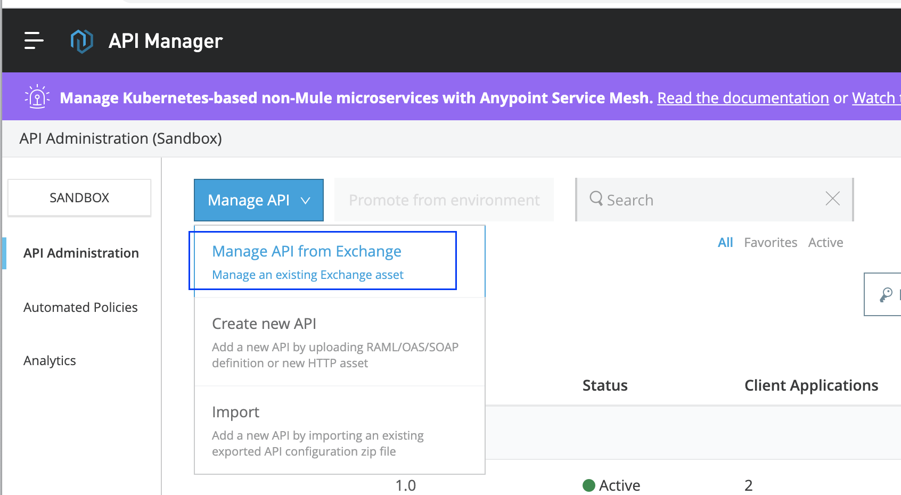
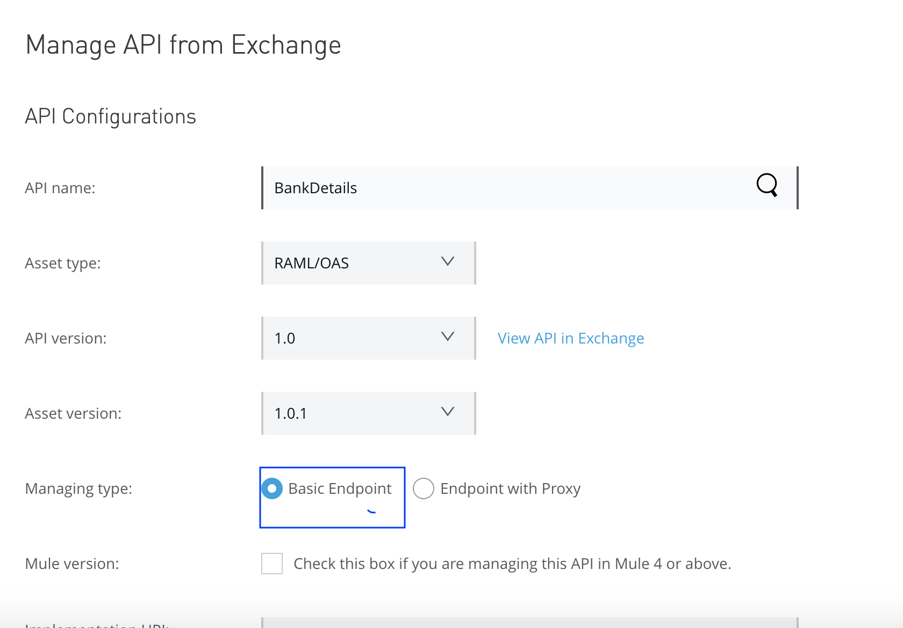
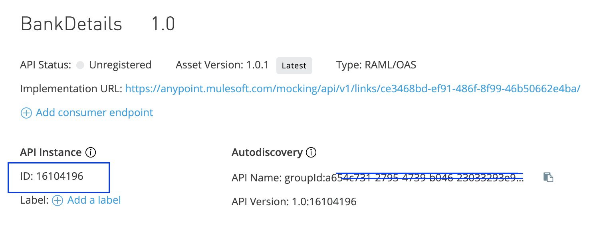
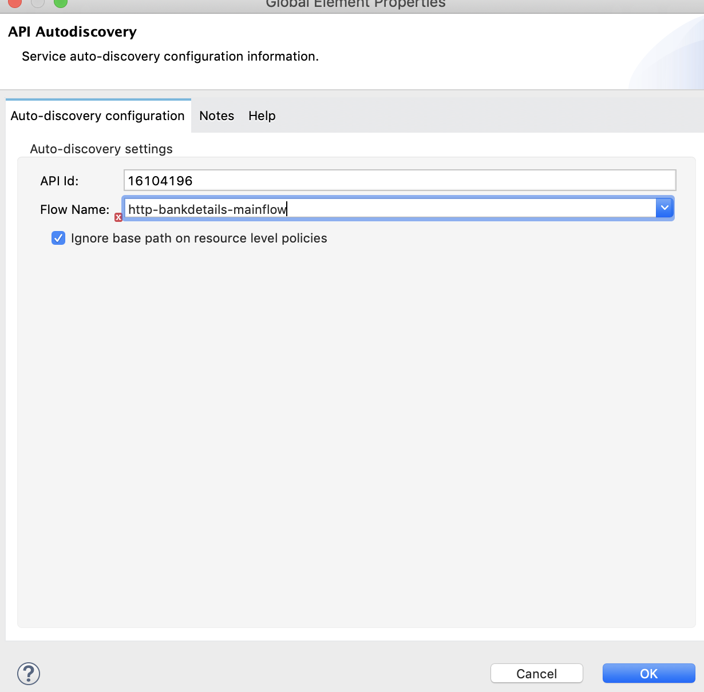
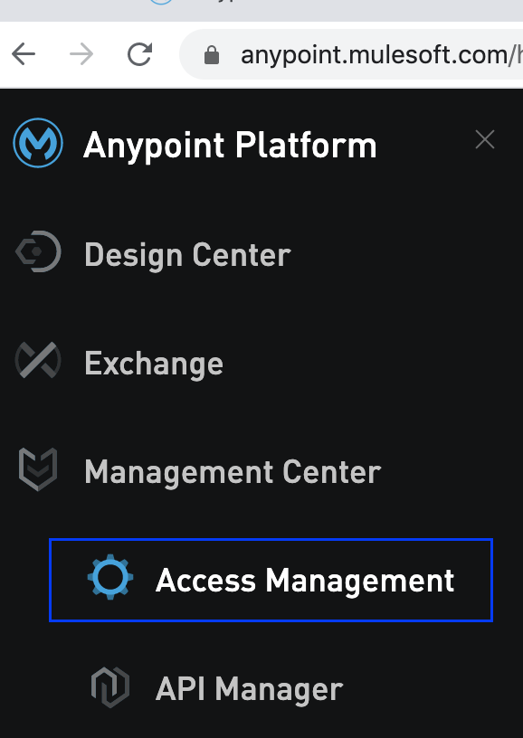
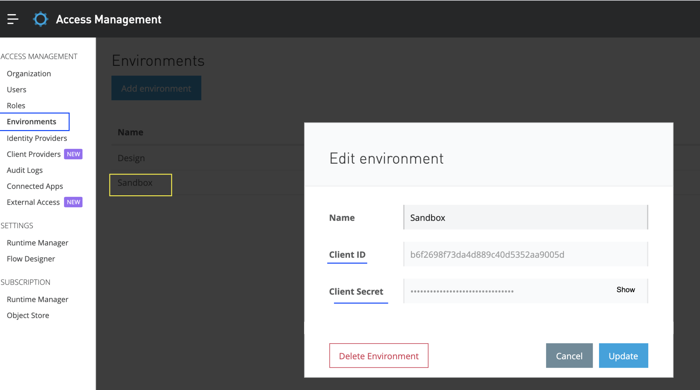
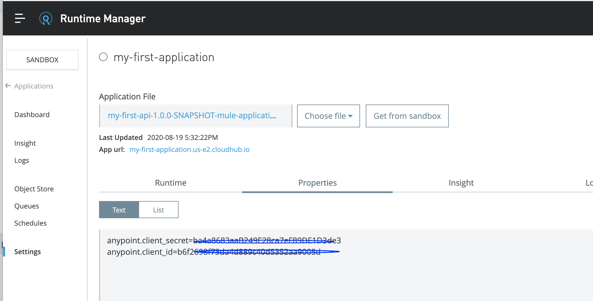
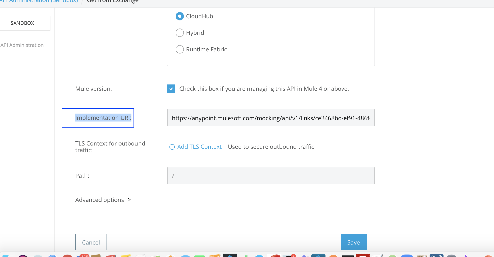
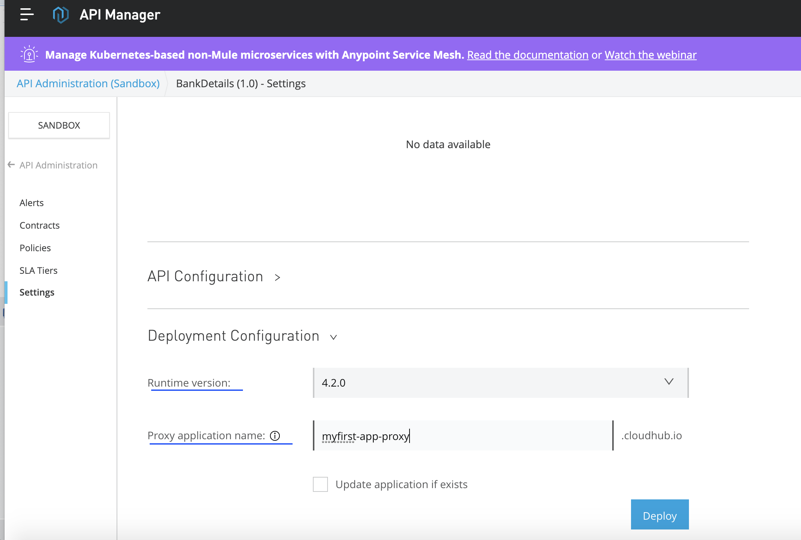
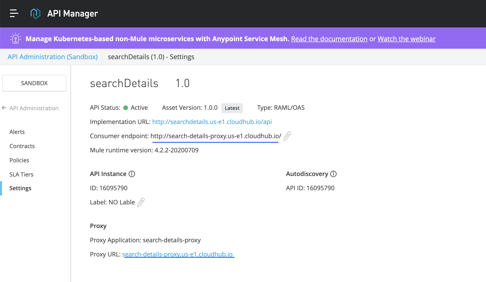

> [!NOTE]
> Anypoint Platform’s API Manager policies can only be applied to the applications which are deployed to CloudHub. For other deployment modes you need to have other ways of applying policies.

This article helps you to apply policies via Anypoint Platform’s API Manager.

We have 2 ways to apply policies:

- Creating Proxy APIs
- Without Creating Proxy APIs

The main difference between the two of them is:

- Using API ID in Auto-Discovery of your “actual” application,
- Or Mule itself will create a Proxy application on top of your “actual” application which has API Auto-Discovery.

## 1) Without Creating Proxy API

We will need these two things:

- API ID generated in API Manager and used in the global element “Auto-Discovery” of your application.
- Anypoint Platform’s Client ID and Client Secret. We can get them from “Access Management” Under Environments Tab > Choose the environment in which your application is getting deployed. Use them in Runtime properties while deploying the application in below way:

```
anypoint.platform.client_id : xxxxxxxxxxxx
anypoint.platform.client_secret : xxxxxxxxxxxx
```

With the help of these two steps, we can now see in API Manager that the status of our API will turn from “Unregistered” to “Active”.

**Step 1**: Design a RAML, publish the asset to Exchange, import the RAML to Anypoint Studio, and generate the flows.

**Step 2**: Go to API Manager, Click on Manage API and choose “Manage API from Exchange”.



**Step 3**: Select your API, and select the managing type as “Basic Endpoint”. Don’t forget to check the box “Mule version: Check this box if you are managing this API in Mule 4 or above.”

Click on Save.





**Step 4**: Go to the Application in Anypoint Studio, Create a Global Element Auto-Discovery and Add API id and choose the flow name (usually Main flow where the request listens).



**Step 5**: Go to Access Management (the owner of the account can have access and can view this option. If you are not seeing this, that means you need to request access to the owner of the Anypoint Platform account). Choose the Environments Tab and select your environment. Get your Client ID and Client Secret.





**Step 6**: Go to Runtime Manager and add the Runtime properties like below and deploy.



Now your API in API manager status will turn to Active and you can start applying policies by going to Policies > Apply New Policy.

> [!NOTE]
> There’s no need to restart the application once the policy is applied. It will reflect within seconds automatically. Even if you add one or more policies at a later point of time, no restart of the application is required.

## 2) Creating Proxy API

In the previous method there were a lot of manual processes required. To avoid all these, we can go for this second approach to create a Proxy application.

This Proxy application is nothing but a kind of wrapper to your main application. Now for each application, we will have 2 apps in Runtime Manager:

- Your Actual Application
- Your Proxy Application, which has API ID, Client ID, and Client Secret within it. There’s no manual effort required to deploy. It’s deployed from the API manager.

**Step 1**: Design a RAML, publish the asset to Exchange, import the RAML to Anypoint Studio, and generate the flows.

**Step 2**: Go to API Manager, Click on Manage API and choose “Manage API from Exchange”.

**Step 3**: Select your API, and select the managing type as “Endpoint with Proxy”. Don’t forget to check the box “Mule version: Check this box if you are managing this API in Mule 4 or above.” Click on Save.

**Step 4**: Give the Implementation URL of your actual application that is deployed.

Make sure you provide your complete path, up until /api (all RAML-generated flows have a common base path as /api)

E.g.

```
http://myfirstapp.cloudhub.io/api
```

Once done, click on Save.



**Step 5**: Now you can see the Deployment Configuration. Choose the runtime and name of the Proxy app you want to give and click on deploy. The application will be deployed in the Runtime Manager.



**Step 6**: Now edit the Consumer endpoint in API Manager with your Proxy endpoint. So that all the requests will hit the proxy application. Basically your implementation URL is your actual endpoint and Consumer endpoint is the endpoint for the Proxy. In other words, the client hits the Proxy endpoint, which in-turn is routed to the implementation URL.



You can see that the Client ID and Client Secret values are picked automatically and placed in Runtime properties. You can also download the jar of the Proxy application and import it in Anypoint Studio, where you can see the API ID is automatically configured and the HTTP request will route to your main app.

You have to provide the endpoint of the Proxy application to consumers/clients so that they don’t have access to your main app. The policies are applied to your Proxy application.

But the thing here is, we need additional vCore and workers to deploy our Proxy app.

According to your requirements, you can choose which method you want to follow to apply policies for your CloudHub apps.

## Pros and Cons

Without Proxy Application:

- You will save a vCore and worker.
- As a developer, you need to know the Client ID and Client Secret - unless the deployment is managed by CI/CD process.
- You need to manually create a global element to invoke Auto-Discovery.
- You will expose your actual endpoint to the Client/Consumer.
- Use case: If your APIs are used within the organization, within intranet, you can choose this option where we can share the endpoints directly. This saves vCores.

With Proxy Application:

- You will need additional vCore and worker for each Proxy app you deploy.
- As a developer, you don’t need to know the Client ID since it’s managed internally.
- No need for the manual process of using API ID or using Client ID and Client Secret.
- You will expose your Proxy endpoint over the actual endpoint to the Client/Consumer.
- Use case: If your APIs are used outside of your organization, you can choose this option where we can share the endpoints of the Proxy app instead of the actual endpoint. This gives you more security.

These are 2 simple ways to apply policies!

Happy learning

Sravan Lingam
