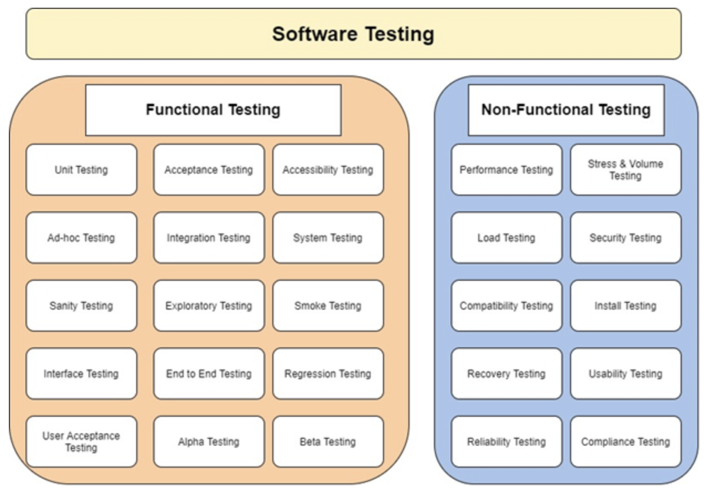

You have less than 6 minutes before your customer ditches your application because they perceived a bad customer experience. If you knew this, would you risk your company’s future on the lack of software quality?

Mark is the CEO of a start-up company. He had 3 teams of developers and only one QA (Quality Assurance resource) to perform the vast amount of work before pushing the web application to go live (to make it available for customers). He had a healthy number of customers that were eager to try the new CRM (Customer Relationship Management) system. Little did everyone know; things went south very quickly.

Customers weren’t happy because the web application wasn’t working as expected. There was a gap between what the application was supposed to do and what it actually did. So, what really went wrong? Short answer: Lack of quality and testing.

Today we are going to talk about the importance of testing. We will also talk about some testing types and objectives but, first things first.

## What is Quality?

There are 3 points of view to look at the software product. These views pay attention to different attributes of the software.

**The first point of view concentrates on the functionality** of the software to conform to requirements.

A few examples of this:

- It uses a specification guide in the form of:
  - User Stories – In the agile world.
  - Specifications document.
- The QA (Quality Assurance resource) will focus all their efforts into making sure the software solution provides the minimum specifications stated in the document they got assigned.

**2. Best practices when coding.**

A few examples of this:

- Write reusable code (reutilization of existing code for new functions in the software)
- Write unit tests for your unit of behavior (to make sure a piece of code behaves as it’s supposed to).
- Make your code readable and self-documenting through good naming conventions and programming standards.
  - Not relying on code comments because they become outdated often. . (Software developers use comments to explain what their code performs)
- Refactor (process of restructuring existing computer code) whenever you can or need.
- Avoid technical debt (additional rework caused by choosing a limited solution now instead of using a better approach that would take longer).
- Try to make your code fail a test at least once, that way you know that it works as expected.

**3. The end user or customer.**

A few examples of this:

- Quality is a customer determination.
- Exceed customer’s expectations.
- Provide customer satisfaction.

**In my opinion, good software quality could be defined as:**

A software product that is free from defects, that is efficient, secure, reliable, easy to maintain, that has the ability to escalate with little effort and time and that exceeds customer’s expectations by providing a solution that is, not only useful, but adds more value to the customer.

## What is the importance of testing?

I’ll use an analogy to try and explain the importance of it.

It’s like throwing yourself from an airplane and you didn’t check if your backpack had a parachute. In this case you are the software product and the empty backpack is your product quality.

From a business point of view, **software quality is your safety net and it saves you time and money.**

**It brings you economic benefits** in the medium-long run. Every time a customer is not able to interact successfully with your software product, it becomes a customer that will never come back. When you lose that customer, you lose money and your software product might get a bad review.

**Did you know that it takes around 40 positive reviews to undo only one negative review?** And most happy customers don’t leave a positive review.

From a security point of view, software quality protects vulnerabilities of your product. That means that your product might be targeted to exploit those vulnerabilities in order to steal customers personal information, money, benefits-free products or anything else you might keep in order to process their software solution.

**From a customer satisfaction point of view, software quality provides precisely that: Customer satisfaction.**

The software product that you create will bring a polished solution and the best user experience possible (at that precise time). It will be efficient, secure, reliable and will work like magic. So easy to interact with that no one will ever know the complexity in the code.

And you might be hesitant into investing in testing because it seems to be so invisible. No one cares when your software solution is working fine, right? But what happens when it doesn’t perform well? Software quality is not cheap when perceived as invisible but if you start adding $ into each defect found you soon will learn that it is not only necessary, it is intrinsic to your business success.

**A software with good software quality, reputation and positive user experience will bring you more customers.**

## Software Quality Types and Objectives

Software quality is divided into 2 main categories. Functional and non-functional.

**Functional testing** is the **“what”** in your software. What will your application do? What should your TV do when you push the power button?

- Turn on the screen - This is a functional test.

How long should your TV take when you push the power button to turn on the screen?

- 2 seconds - This is a non-functional test.

**Non-functional testing** is the **“how”** in your software.

There are more than 100 types of testing but some of the most common types are listed below.

In software testing you have several opportunities to catch the defects in your product before launching it to your customers.

**Unit Testing** is the first level or opportunity for software testing that is performed by software developers. It is the first piece of the puzzle. It is performed by using the White Box Testing method, which means that the person who is testing the functionality also knows the internal structure, design and implementation. The main objective is to isolate your unit and test its behavioral performance. Make sure it performs as designed.

The second level or opportunity for testing is **Integration Testing**. Integration Testing combines individual units, like the one we talked about above, and tests them as a group. The idea behind this type of testing is to expose defects in the interaction between the units.

An example of integration testing could be something similar to a lightbulb connected to a battery and a switch. Each one of the items listed is a unit, and I expect that when I interact with the switch, the lightbulb will turn on and off.

The third level or opportunity to catch a defect comes in the form of **System Testing**. This means that we will combine all the product components and modules and perform an end-to-end testing on it. In this type of testing we use a persona and try to accomplish a task in the software product. There’s a beginning and an end to the workflow that has to be followed to get the task done. The objective is to replicate and validate real user scenarios.

The fourth level is named **Acceptance Testing**. The software product is tested against the business requirements. There has to be a perfect compliance with the specifications on the solution we are presenting to the end user.

Product quality is a joint effort. To have a mesmerizing quality you need everyone in your company to put on their Quality Assurance hat and evaluate their own designs, implementations and reasons behind each solution. A software tester (or QA) is your software solution protector. It is the last gate to open before launching your product to your customer. The difference between making it or breaking it.

## Recap

Quality can be explained from 3 different perspectives:

- The functionality of the software to conform to requirements.
- Using best practices when coding the software product.
- Exceed customer’s expectations.

Testing your software product will result in more customer satisfaction, which can give you a great reputation as a business and will bring you more customers, resulting in more money.

The types of Software Testing can be divided into Functional and Non-Functional.

- Functional testing is the “what” in your software.
- Non-Functional testing is the “how”.
