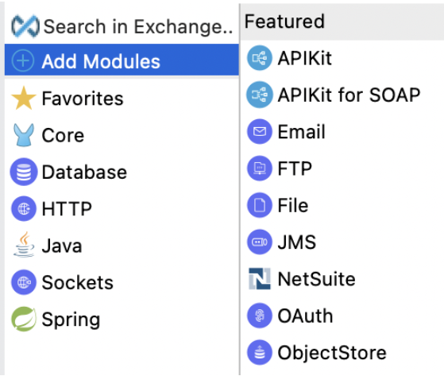
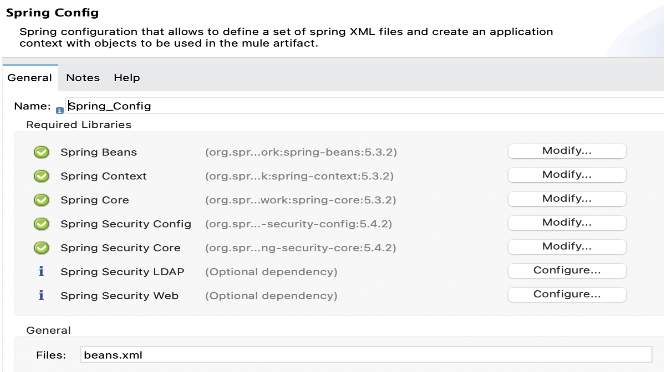
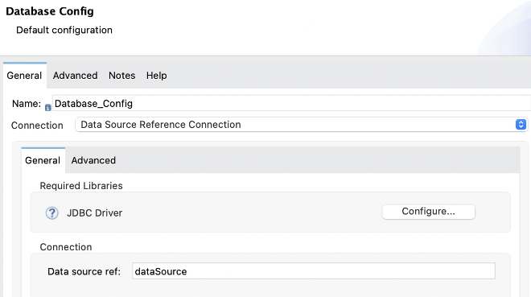
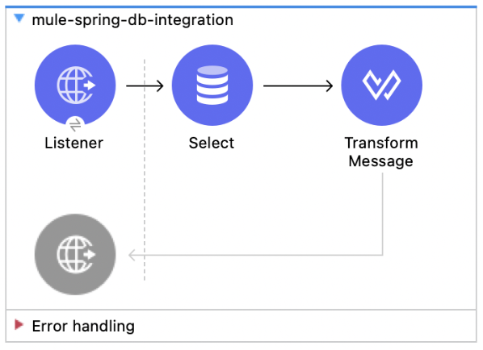
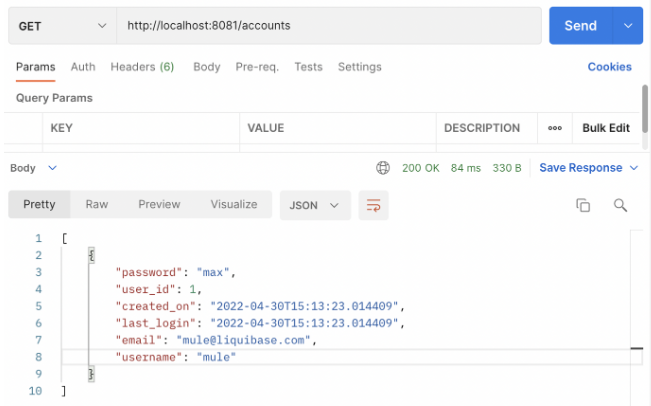
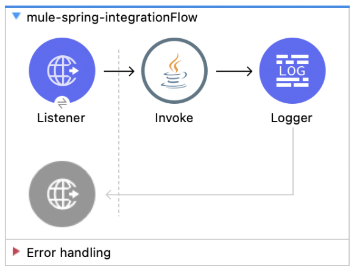
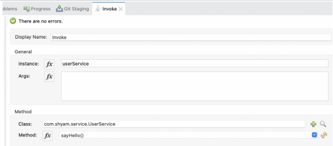
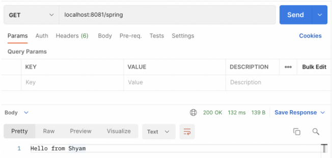

The Spring module enables Mule apps to use the Spring framework. In this article, we will use a database datasource that is created by spring beans. Also, we will invoke one bean’s method from a Mule flow.

## Step by step

1 - **Create Mule Project**: Go to Anypoint Studio and create a new Mule project.

2 - **Add spring module**: In Anypoint Studio, the Spring module is provided in the default configuration. In the Mule Palette, click on add modules, search for Spring and add this module to your project.



3 - **Spring config**: Go to spring config, add name as `Spring_Config` and provide files as `beans.xml`



4 - **Spring Beans**: Create a `beans.xml` file under `src/main/resources`. Add the below configuration in this file.

```xml
<beans xmlns="http://www.springframework.org/schema/beans" xmlns:context="http://www.springframework.org/schema/context"
 xmlns:xsi="http://www.w3.org/2001/XMLSchema-instance" xmlns:jdbc="http://www.springframework.org/schema/jdbc"
xsi:schemaLocation="http://www.springframework.org/schema/beans
     http://www.springframework.org/schema/beans/spring-beans-4.2.xsd
     http://www.springframework.org/schema/jdbc
     http://www.springframework.org/schema/jdbc/spring-jdbc-4.2.xsd
     http://www.springframework.org/schema/context
     http://www.springframework.org/schema/context/spring-context-4.2.xsd
     http://www.springframework.org/schema/security
     http://www.springframework.org/schema/security/spring-security-4.2.xsd">
</beans>
```

5 - **Spring JDBC**: Add spring JDBC and PostgreSQL dependency and shared library in `pom.xml`

```xml
<dependency>
    <groupId>org.springframework</groupId>
    <artifactId>spring-jdbc</artifactId>
    <version>5.3.2</version>
</dependency>
<dependency>
    <groupId>org.postgresql</groupId>
    <artifactId>postgresql</artifactId>
    <version>42.3.4</version>
</dependency>
```

Add below shared library in the shared libraries tag.

```xml
<sharedLibrary>
   <groupId>org.springframework</groupId>
   <artifactId>spring-jdbc</artifactId>
</sharedLibrary>
<sharedLibrary>
   <groupId>org.postgresql</groupId>
   <artifactId>postgresql</artifactId>
</sharedLibrary>
```

6 - **Spring JDBC Beans**: Add spring Datasource bean configuration in `beans.xml`.

```xml
<bean id="dataSource" class="org.springframework.jdbc.datasource.DriverManagerDataSource">
 <property name="driverClassName" value="org.postgresql.Driver" />
 <property name="url" value="${spring.datasource.url}" />
 <property name="username" value="${spring.datasource.username}" />
 <property name="password" value="${spring.datasource.password}" />
</bean>
```

7 - **Application Properties**: Add below application properties for JDBC connection in `src/main/resources`. You can replace the correct username, password, and database name in the below properties.

```properties
spring.datasource.url=jdbc:postgresql://localhost:5432/spring
spring.datasource.username=username
spring.datasource.password=password
```

8 - **Database Config**: Go to Mule Palette and drag the database connector. Configure the database configuration in `global.xml` with the datasource and select the PostgreSQL jar for the JDBC driver.



Test the configuration, this should return a successful connection.

9 - **HTTP Listener for accounts**: Add an HTTP listener and configure it with the default settings. Add a Select DB configuration and a Select query for the accounts table. Make sure the account table is created in your database and there will be at least one entry for the account table. Add a transformer to give the result in JSON format.



10 - **Invoke**: Run the mule application and invoke the endpoint to see the result. This will return records from the accounts table.



11 - **Create Spring Beans**: Create User POJO class, UserService interface, and UserServiceImpl service implementation class.

```java title="User.java"
package com.shyam.model;
public class User {

 private String firstName;
 private String lastName;
 private String email;
 public String getFirstName() {
   return firstName;
 }
 public void setFirstName(String firstName) {
   this.firstName = firstName;
 }
 public String getLastName() {
   return lastName;
 }
 public void setLastName(String lastName) {
   this.lastName = lastName;
 }
 public String getEmail() {
   return email;
 }
 public void setEmail(String email) {
   this.email = email;
 }
}
```

```java title="UserService.java"
package com.shyam.service;
public interface UserService {

 public String sayHello();
}
```

```java title="UserServiceImpl.java"
package com.shyam.service;
import com.shyam.model.User;
public class UserServiceImpl implements UserService {

 private User user;
@Override
 public String sayHello() {
   return "Hello from " + user.getFirstName();
 }

 public User getUser() {
   return user;
 }
public void setUser(User user) {
   this.user = user;
 }
}
```

12 - **Spring Bean Configuration**: Add below spring bean configuration for User and UserServiceImpl class in `beans.xml`.

```xml
<bean id="user" class="com.shyam.model.User">
   <property name="firstName" value="Shyam" />
 </bean>
<bean id="userService" class="com.shyam.service.UserServiceImpl">
   <property name="user" ref="user" />
 </bean>
```

13 - **Mule flow**: From a Mule flow it's very simple to access one of the previously created beans. It just uses an Invoke component to call the Spring bean’s function.



14 - **JAVA Invoke**: In the Invoke component in the Mule application, we are simply calling the sayHello() method of the UserServiceImpl. Here is the screenshot of the configuration of the Invoke component:



15 - **Invoke**: Invoke the endpoint and see this will return Hello from Shyam, which we have configured the first name in beans property.



## GitHub repository

- [https://github.com/shyamrajprasad/mule-spring-integration](https://github.com/shyamrajprasad/mule-spring-integration)

## References

- [https://docs.mulesoft.com/spring-module/1.3/](https://docs.mulesoft.com/spring-module/1.3/)
- [https://dzone.com/articles/using-spring-beans-in-mule](https://dzone.com/articles/using-spring-beans-in-mule)
- [https://shyamrajprasad.medium.com/spring-module-integration-in-mule-application-8de5a08303e6](https://shyamrajprasad.medium.com/spring-module-integration-in-mule-application-8de5a08303e6)
