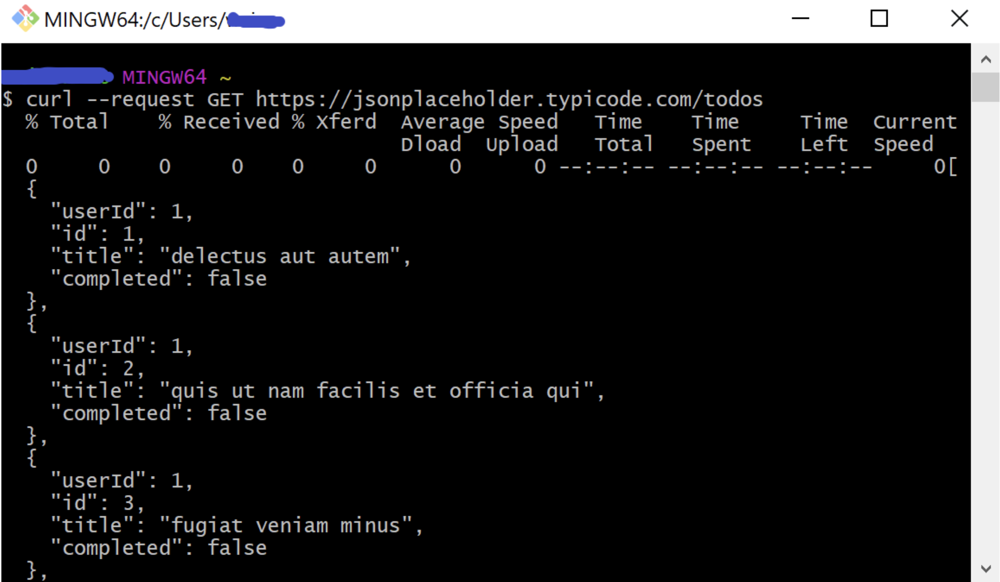
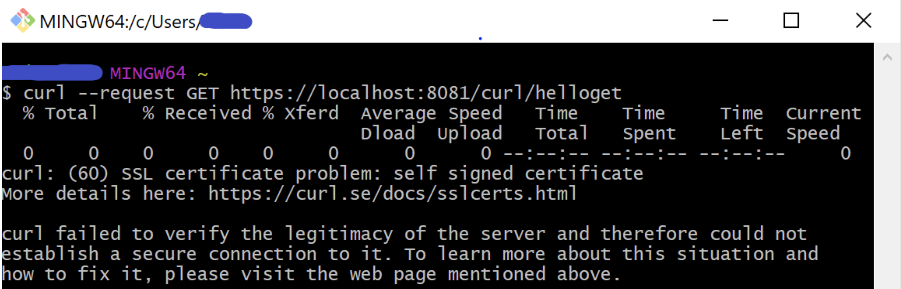
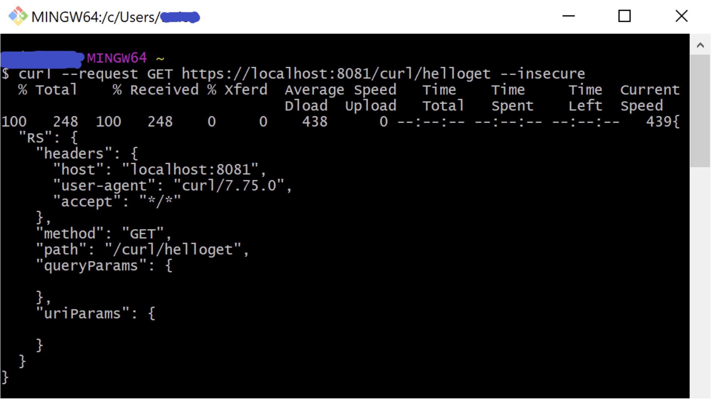
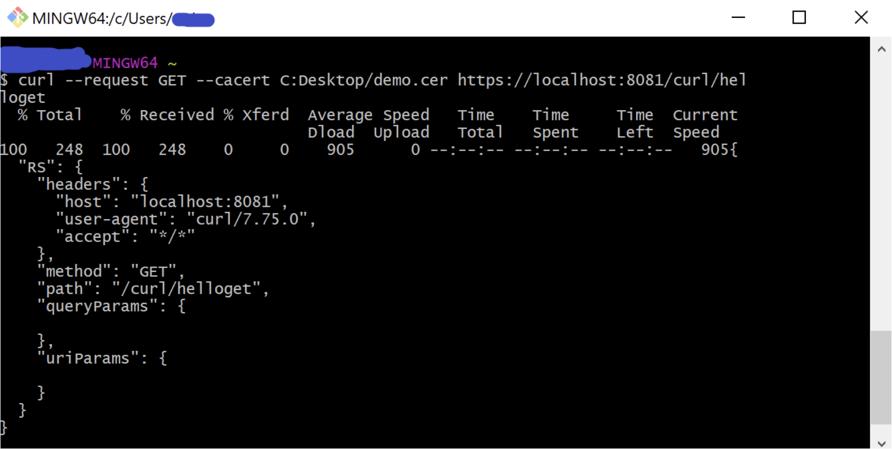

Welcome to part II of the The Power of cURL. If you are new to cURL, I recommend checking out my previous post [here](https://www.prostdev.com/post/the-power-of-curl). There I provide an overview of cURL and how to invoke HTTP methods from the command line. I go into detail on how to invoke APIs using HTTP GET and POST requests, as well as how to pass query parameters, URI parameters and headers. This post will explain how to invoke APIs using HTTPS via **cURL**.

## Review of cURL

[cURL](https://curl.se/) is a tool used to transfer files. The cURL command can be used inside scripts or from the command line. cURL provides support for common protocols like HTTP, HTTPS, FTP and much more.

This article will focus on using the cURL command to invoke integrations that use HTTPS.

## cURL Requests

cURL commands begin with the keyword “curl” followed by an option.

REQUEST OPTION: To specify the request method in an HTTP/HTTPS request. Use the --request or -X options.

- SYNTAX:

```bash
curl --request <method> '<url>'
```

- OR:

```bash
curl -X <method> '<url>'
```

> [!NOTE]
> This article does not use ' ' around the url but I recommend using quotes when passing query parameters. If possible, try to make using single-quotes around the url a habit.

## Demo Time

The cURL commands provided in this article will be demonstrated by first invoking the JSON Placeholder API. It is a fake API used for building prototypes. Learn more about it [here](https://jsonplaceholder.typicode.com/). The latter portion of the article will be demonstrated by invoking a sample Mule API configured for HTTPS. Let’s get started!

Let's make a request to the infamous JSON Placeholder API.

EXAMPLE REQUEST

```bash
curl --request GET https://jsonplaceholder.typicode.com/todos
```



Notice we get a JSON list of to-do objects.

**Simple, right?**

This works because the server hosting [https://jsonplaceholder.typicode.com](https://jsonplaceholder.typicode.com/) has a digital certificate that is issued by a trusted Certificate Authority (CA). When an HTTPS request is invoked, the server will present its certificate. If the certificate is in the API client’s trust store, the API client recognizes the server as trusted and will accept the API’s response.

**What happens if the server hosting the API is not trusted? Or not in the API client’s trust store?**

This time I have configured HTTPS via TLS on a simple Mule API on my local machine. When invoking the API through curl, I get the following error. For this example, I have used a self-signed certificate.

EXAMPLE REQUEST

```bash
curl --request GET https://localhost:8081/curl/helloget
```



Notice the error I get back when invoking the API. “curl: (60) SSL certificate problem: self signed certificate.” This error occurred because the certificate was not from a trusted source. This certificate is not present in machines.

But why is cURL screaming? The self-signed certificate is not trusted, that means it is not in my computer’s trust store.

cURL offers 4 options in which one can resolve this type of error. I will go over 2 options but feel free to check out all four options [here](https://curl.se/docs/sslcerts.html).

**Option 1:** Disable SSL certificate validation*

A work-around to this is to add the --insecure or the -k option. These two options disable peer SSL certificate validation.

- SYNTAX:

```bash
curl --request <method> '<url>' --insecure
```

- OR:

```bash
curl --request <method> '<url>' -k
```

> [!NOTE]
> This option is insecure and disables SSL certificate validation. I recommend only using this option when invoking and/or testing internal APIs and you are certain the host is from a trusted source.

EXAMPLE REQUEST

```bash
curl --request GET https://localhost:8081/curl/helloget --insecure
```



**Option 2:** Provide the certificate during the invocation

This option requires you to retrieve and save the certificate (or public key) of the API host. Then save this certificate in a location on your machine and reference it during the API invocation. Unlike option 1, SSL certificate validation is still in place and is therefore a safer option.

- SYNTAX

```bash
curl --request <method> --cacert <cert_path> '<url>'
```

EXAMPLE REQUEST

```bash
curl --request --cacert C:Desktop/demo.cer https://localhost:8081/curl/helloget
```



Notice in both option 1 and option 2, we were able to get a response from the Mule API.

## Conclusion

cURL is a powerful tool. The 2 articles in this series only scratch the surface of cURL. If you would like to learn more, review the [cURL man page](https://curl.se/docs/manpage.html) and the [cURL ebook](https://everything.curl.dev/).

Lastly, I am Whitney Akinola. I am a fellow MuleSoft Developer and content creator. Feel free to check out my technical content[here](https://www.whitneyakinola.io/blog). I am also looking for integration topics to write about. If you have a topic you would like me to explore and write about, please feel free to request. You can [contact me](https://linktr.ee/whitneyakinola) personally via LinkedIn or Twitter.
