[Advanced Rest Client](https://install.advancedrestclient.com/install), [Postman](https://www.postman.com/downloads/) and [SoapUI](https://www.soapui.org/downloads/soapui/) are top API clients you may have used while building or testing API integrations. These applications are useful. However there are cases where invoking the API from the command line is advantageous and is made possible through **cURL.**

## What is cURL?

[cURL](https://curl.se/) is a tool used to transfer files. The cURL command can be used inside scripts or from the command line. cURL provides support for common protocols like HTTP, HTTPS, FTP and much more.

This article will focus on using the cURL command to invoke integrations that use HTTP. The cURL commands provided in this article will be demonstrated by invoking a sample API built in Mule 4, running on my local machine. Let’s get started!

## How do I start?

Open your command prompt (Windows) or terminal (Mac/Linux). Run

```bash
curl
```

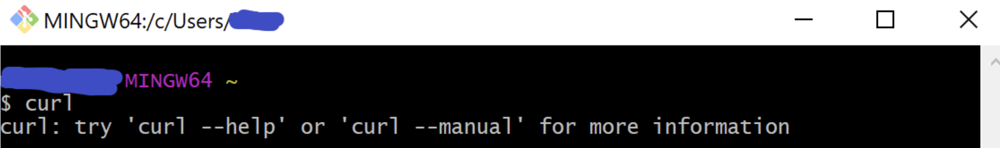

Look for the following output:

```bash
curl: try 'curl --help' for more information
```

This is a good indicator that cURL is installed on your local machine. If not, you will need to do a fresh install of cURL. Download cURL [here](https://curl.se/download.html).

cURL commands typically use the following syntax:

```bash
curl [options] [url]
```

## Need help?

Use the --help option to provide a list of options.

```bash
curl --help
```

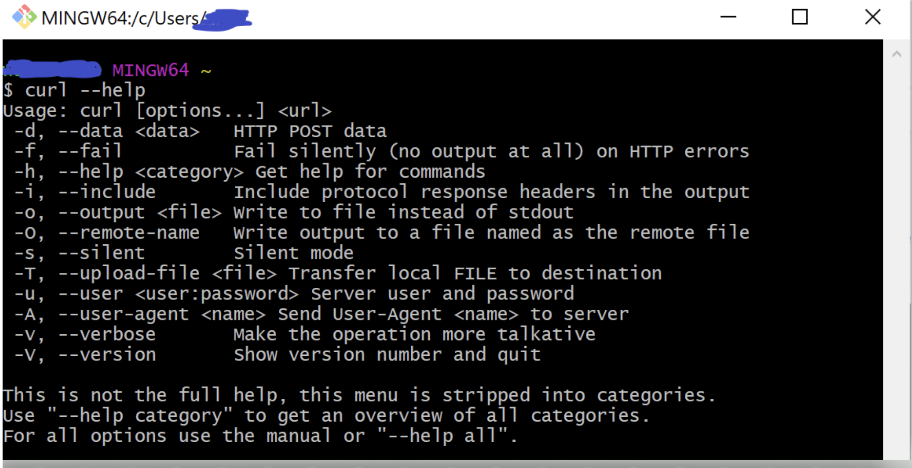

Use the --manual option to reference the “man” page (or manual).

```bash
curl --manual
```

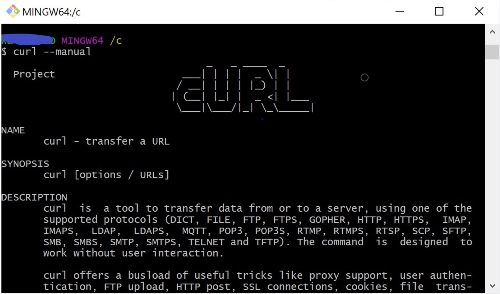

> [!NOTE]
> Since I am using a Windows machine, I often use the command line from a Git Bash terminal.

## Demo Time

The remainder of this article will focus on HTTP. All demonstrated cURL command examples will be HTTP requests (unless otherwise specified) and invoked against a simple Mule API running on my local machine. The API takes in the HTTP request and provides a breakdown of the request in the response.

REQUEST OPTION: To create an HTTP/HTTPS request. Use the --request option.

SYNTAX:

```bash
curl --request <method> '<url>'
```

> [!NOTE]
> URL will include the protocol (http/https).

### **GET**

GET requests can be written in two formats:

1) Short-hand

SYNTAX:

```bash
curl '<url>'
```

EX:

```bash
curl 'http://localhost:8081/curl/helloget'
```

2) Long-hand

SYNTAX:

```bash
curl --request GET '<url>'
```

EX:

```bash
curl --request GET 'http://localhost:8081/curl/helloget'
```

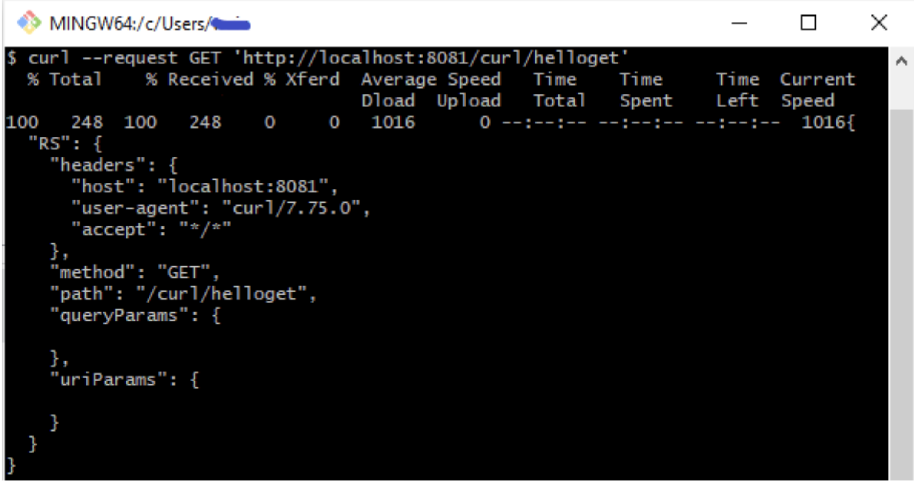

### **QUERY PARAMS**

SYNTAX:

```bash
curl --request <method> '<url>?<queryParam1>=<value1>...&<queryParamN>=<valueN>'
```

EX:

```bash
curl --request GET 'http://localhost:8081/curl/helloget?firstname=Daffy&lastname=Duck'
```

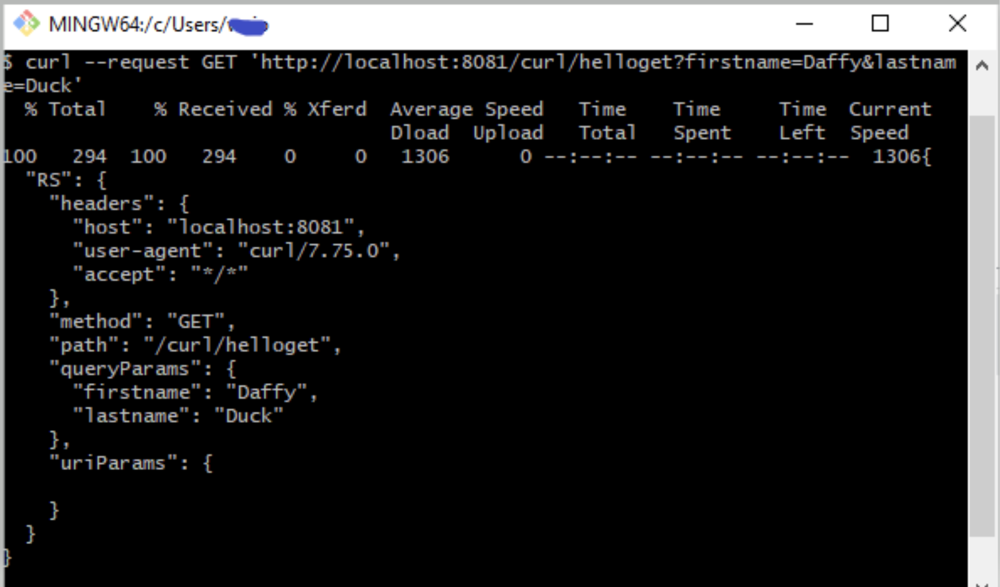

### **URI PARAMS**

SYNTAX:

```bash
 curl --request <method> '<url>/<uriParam>'
```

EX:

```bash
 curl --request GET 'http://localhost:8081/curl/helloget/1'
```

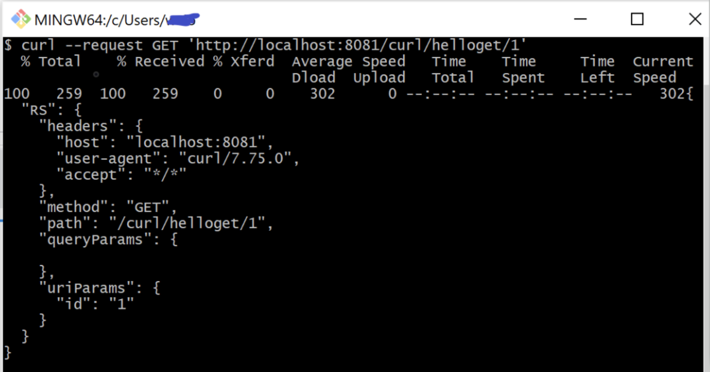

### **HEADERS**

SYNTAX:

```bash
curl --request <method> '<url>'  \
    --header '<key>:<value>'
```

*Single Header*

EX:

```bash
curl --request GET 'http://localhost:8081/curl/helloget' \
    --header 'Authorization: Bearer xybaneoovganfZbe'
```

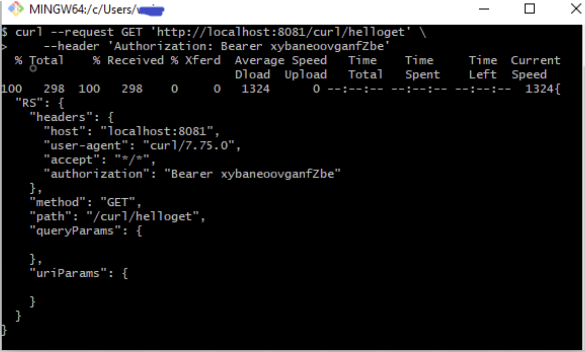

*Multiple Headers*

EX:

```bash
curl --request GET 'http://localhost:8081/curl/helloget' \
    --header 'client_id: bond' \
    --header 'client_secret: 0007'
```

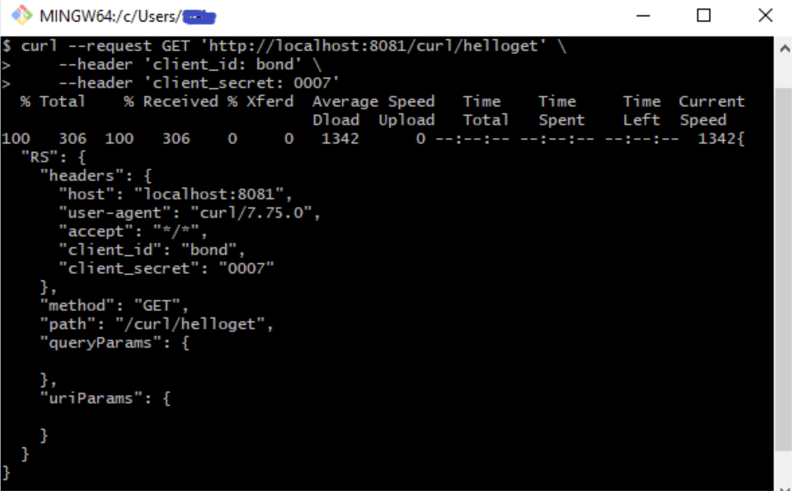

### **POST**

SYNTAX:

```bash
curl --request <method> '<url>' \
    --header 'Content-Type: <content-type>' \
    --data-raw '<data>'
```

EX:

```bash
curl --request POST 'http://localhost:8081/curl/hellopost' \
    --header 'Content-Type: application/json' \
    --data-raw '{ "RQ" : {"message" : "hello prostdev readers"}}'
```

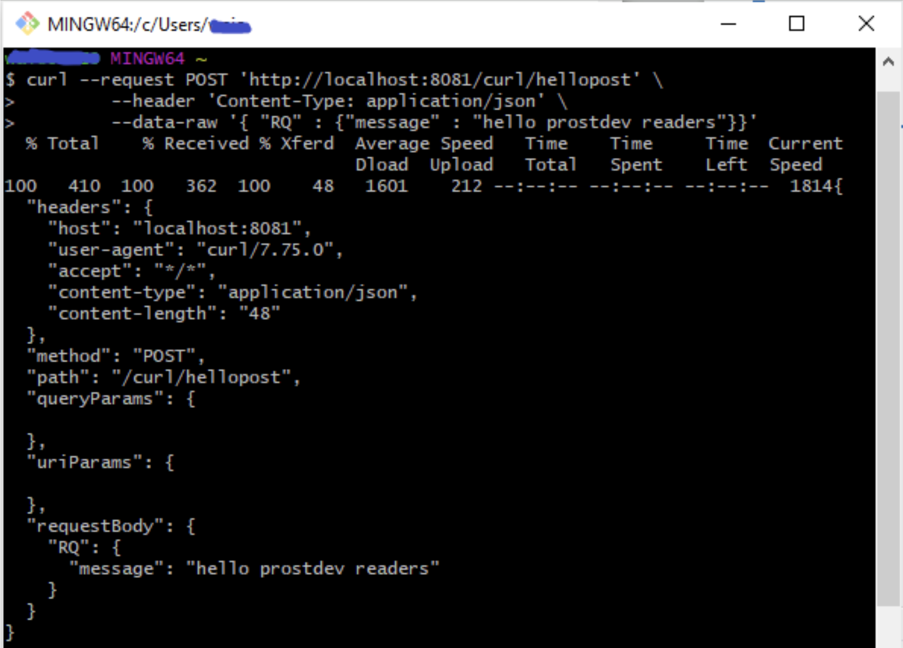

### **Print Output**

Interested in saving the output of your API invocation? Use the --output option.

SYNTAX:

```bash
curl --request <method> <url> --output output.txt
```

EX:

```bash
curl --request GET 'http://localhost:8081/curl/helloget'\ 
    --output output.txt
```

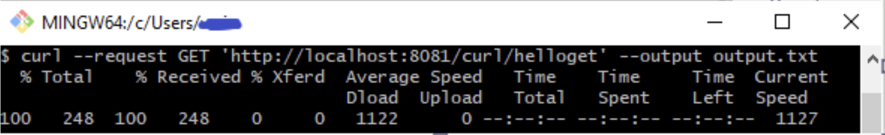

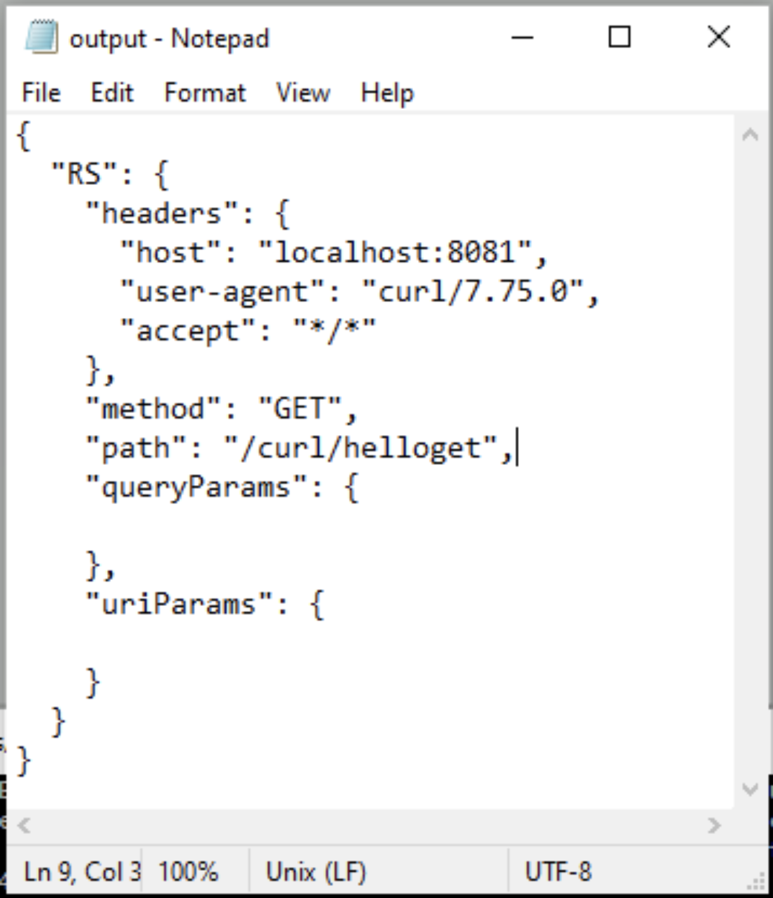

## Lessons Learned

- Although quotes are not required around the URL, when sending requests with query parameters make sure you wrap requests around quotes. Without the quotes, I noticed that cURL dropped the query parameters.
- Wrap your request URL in “double-quotes” if using command prompt and ‘single-quotes’ if using command line terminal. I found issues with ‘’ and “” between command prompt and command line.
- Multi-line in command prompt is different from multi-line on command line.
  - Add “\” at the end of the line to enter a new line on a multi-line request from the command line.
  - Add “^” at the end of the line to enter a new line on a multi-line request from the command prompt.

## Conclusion

This post invoked an API through HTTP. However, most of the time we invoke APIs over HTTPS. If you are interested in an HTTPS version of this post, please let us know through a comment.

If you would like to learn more about cURL, check out the cURL documentation [here](https://curl.se/docs/httpscripting.html).

Lastly, I am Whitney Akinola. I’m a fellow MuleSoft Developer and content creator. Feel free to check out my technical content [here](https://www.whitneyakinola.io/blog).
