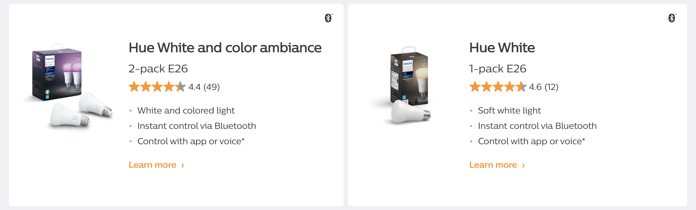
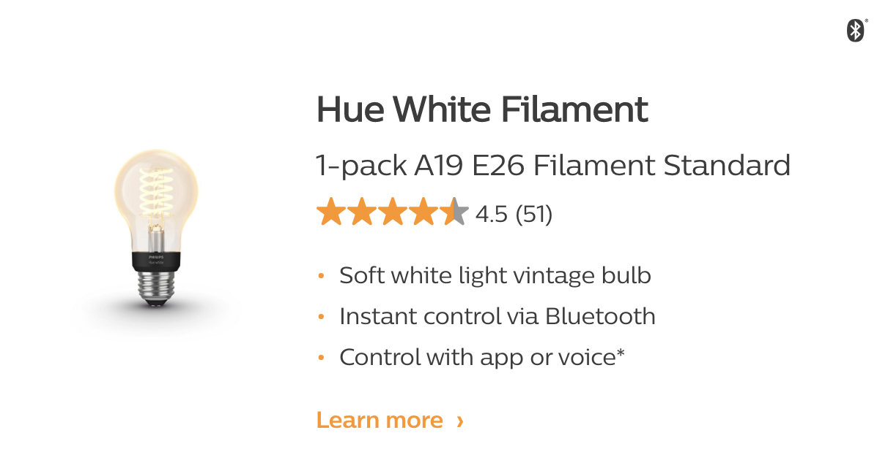
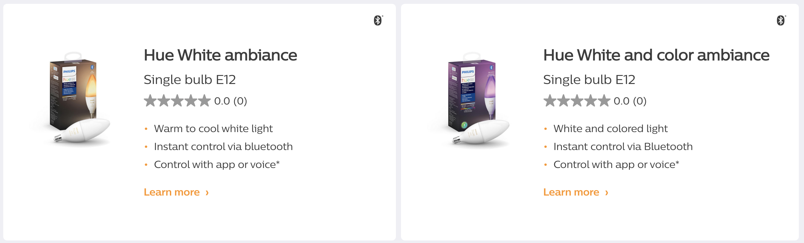
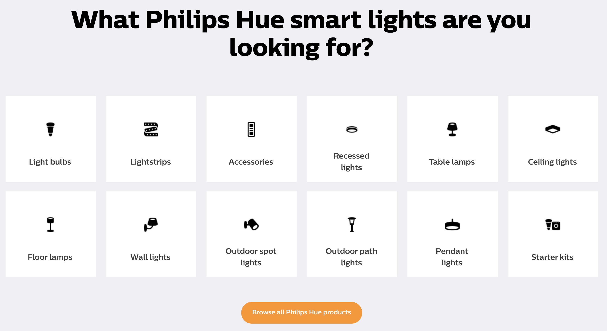
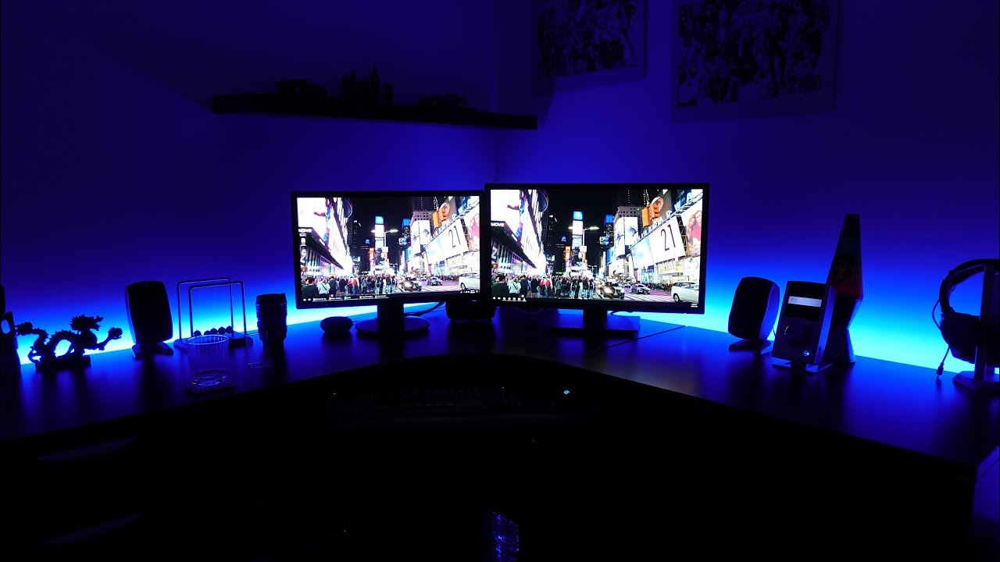
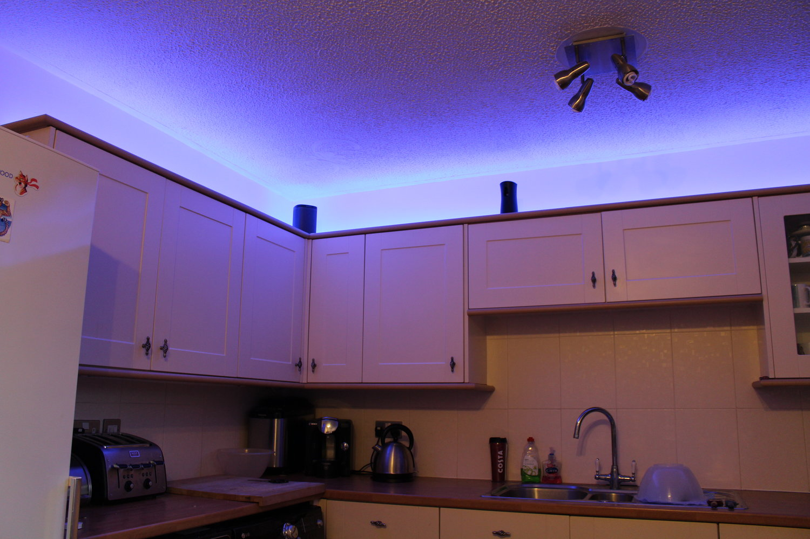
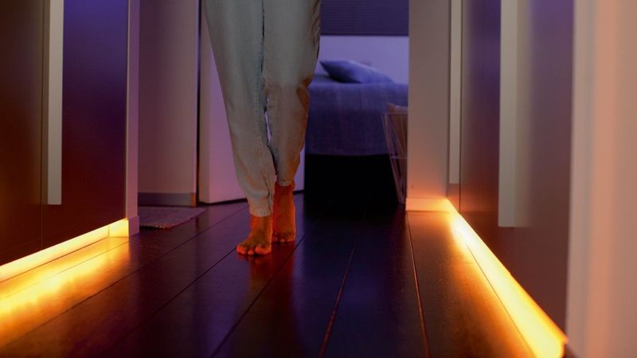
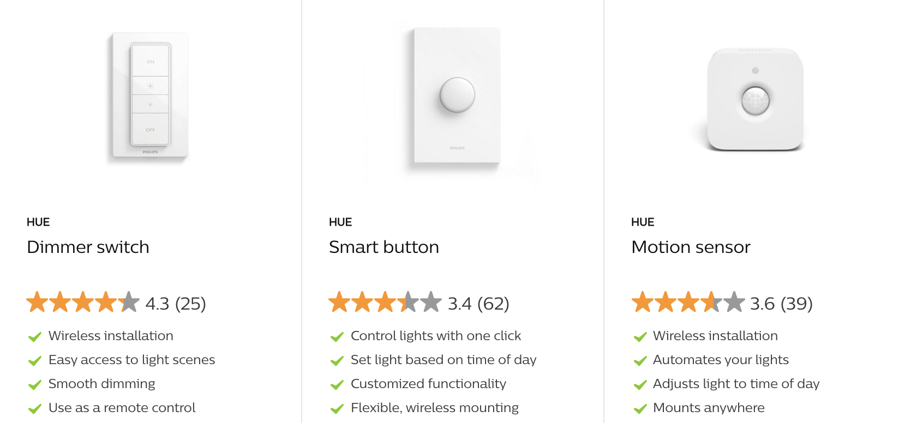
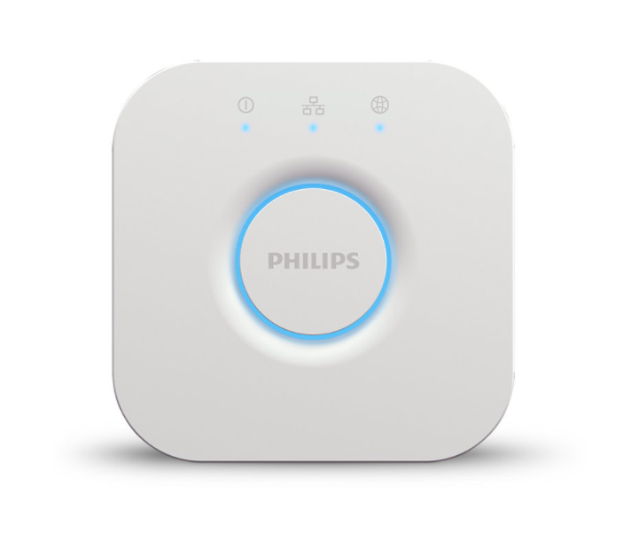

If you own an [Amazon Alexa](https://amzn.to/3JFoPwc) device or any of the [Google Assistant](https://assistant.google.com/) devices to create a smart home, you may already be looking into some smart lights to go with that!

You may even be thinking about buying some [Philips Hue](https://www.philips-hue.com/) products such as smart bulbs, or maybe some lamps or smart switches. My first Philips Hue product was a [lightstrip](https://amzn.to/3mWJSk1)! I still have it, and I love it. But there are some things I wish I knew before buying it.

In this post, I’ll show you some of the pros and cons of using Philips Hue for your smart home.

## What exactly are smart lights?

There is one main difference between a regular light bulb and a smart bulb: you can turn on and off your regular bulb with only a wall switch.

Smart bulbs can be turned on and off with a variety of smart switches, with a mobile app, with a voice command, or even with a synched schedule. Not just that, but you can also dim your smart bulbs and change their colors/tones.

Sounding pretty cool so far, right?

## Choosing the right product - Bulbs

You can choose to simply change your current regular bulbs with [Philips Hue Smart Bulbs](https://www.philips-hue.com/en-us/bulbs). You can choose the size you need, or if they’re indoor or outdoor bulbs too!

When researching bulbs, something important to notice is that some are “white and color ambiance,” and some are just “white.” This small detail can be easy to miss at first, so make sure to choose the product you want. As you may have guessed, one bulb can change into different colors or tones, and the other one is just a white light (which can still be dimmed).

Both are still smart lights, and both offer a range of functions. Just the colors of the light can’t be personalized for the Hue White bulbs.

You can also choose some vintage bulbs, like this one:

Or some smaller “candle” bulbs, like these:

These are just the most common bulbs to give you an example of the variety of products that you can find. You can go to the [product overview page](https://www.philips-hue.com/en-us/product-overview) and check out all the different lights they have to offer. The options are endless!

As you can see, you can buy just the bulbs, or you can also choose between different lamps or outdoor lightings.

My favorite is, by far, the lightstrips.

## Lightstrips

[Lightstrips](https://amzn.to/3mWJSk1) have some adhesive on the back, so you can paste them wherever you want! Check out these COOL examples from the internet:

**Behind your desk**

**Over furniture / near the ceiling**

**Light-up the halls!**

You can also use them behind the couch/furniture, behind a TV/screen, under the stairs, or under the table. You choose!

## Accessories

So what are these [accessories](https://www.philips-hue.com/en-us/products#filters=CONTROLS_SU&page=1)? There are some smart switches that you can program from a mobile application to do different things - turn several lights on/off, dim the lights, choose different colors. You can do all these directly from the Hue app, but some people prefer to touch a switch. :)

There are also smart plugs, cable extensions, power supplies, and more.

But wait! Don’t buy anything just yet, you still need to learn about some **very important** things.

## Connecting over Wi-Fi - Philips Hue Bridge

All these lights can be used over Bluetooth, and for that, you only need your smartphone. But honestly, why use only Bluetooth when you can connect everything to the internet? If you connect your lights to your Wi-Fi, you can even turn on/off your lights when you’re away on vacation!

But to do this, you need to make an additional purchase: the [Philips Hue Bridge](https://amzn.to/3FUbu0P).

> “The brains of the Philips Hue smart lighting system, the Hue Bridge allows you to connect and control up to 50 lights and accessories.”

With this little box, you’ll be able to control up to 50 lights/bulbs/lamps and accessories. But you need to know this: **you need to connect your Bridge directly to your modem using an Ethernet cable**. You can’t just connect the Bridge to the Wi-Fi directly. Once the Bridge is connected with the Ethernet cable, *then* you can use all your products over Wi-Fi.

*Sneaky marketing...*

So, if your modem is not accessible to you for any reason, you may want to think twice before committing to Philips Hue.

Here’s a quick video to get you started with your first Philips Hue Bridge installation and to get it connected to your modem: [Signify - How to install a Philips Hue starter kit with Jonathan Morrison](https://youtu.be/aTa26eNlI54).

You can opt to buy the Bridge alone or choose one of the [Starter Kits](https://amzn.to/32Io5pF), which will provide you with the Bridge, plus some lights or switches.

## My favorite part - syncing your lights to your screen

This is my absolute favorite thing about Philips Hue. You can sync the color of the lights in a given room based on whatever colors are on the screen. This gives you an immersive experience, especially when playing video games or watching movies!

However… To be able to sync your lights to your screen, it is only free when using a PC/laptop through the [Hue Sync app](https://www.philips-hue.com/en-hk/entertainment/hue-sync), which is compatible with both a Mac OS and Windows. **If you want to do the same with a regular TV, you’ll need a** [Play HDMI Sync Box](https://amzn.to/3ztwLfw).

I’ll end this post by providing this amazing video, so you can see this beautiful functionality in action (the more lights you use, the more detailed colors you’ll get):

I hope this post was useful to help you choose your next smart lights.

Let me know if you set them up!

*Prost!*

-Alex

## Links

- [Amazon - Echo Dot](https://amzn.to/3JFoPwc)
- [Google Assistant](https://assistant.google.com/)
- [Philips Hue](https://www.philips-hue.com/)
- [Amazon - Lightstrips](https://amzn.to/3mWJSk1)
- [Amazon - Bulb](https://amzn.to/3pT9Irf)
- [Philips Hue - Product Overview](https://www.philips-hue.com/en-us/product-overview)
- [Amazon - Bridge (Hub)](https://amzn.to/3FUbu0P)
- [Amazon - Starter Kit](https://amzn.to/32Io5pF)
- [Philips Hue - Hue Sync app for PC/Laptop](https://www.philips-hue.com/en-hk/entertainment/hue-sync)
- [Amazon - Play HDMI Sync Box](https://amzn.to/3ztwLfw)
