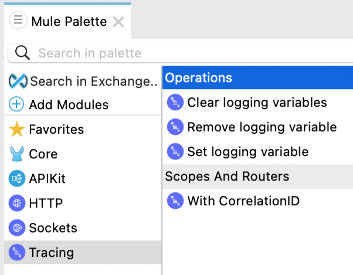
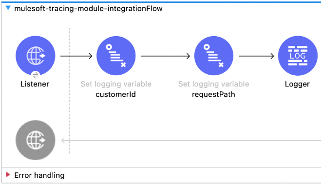
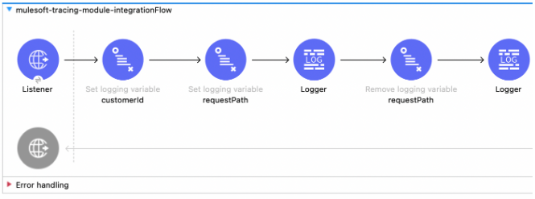
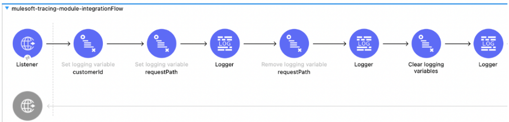
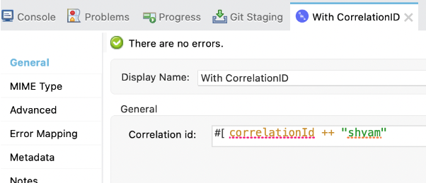

The tracing module enables you to enhance your logs by adding, removing, and clearing all variables from the logging context for a given Mule event. It also enables you to modify the correlation ID during flow execution.

## Uses Of Tracing Module

- Clear all the logging variables from the event logging context.
- Remove a logging variable from the logging context.
- Set logging variables to logging context.
- Modify the correlation ID during flow execution



## Tracing Module Application

1 - **Create Mule application**: Go to Anypoint studio and create a mule project with the name `mulesoft-tracing-module-integration`.

2 - **Add Tracing module**: In the mule palette view, click on **+ Add Modules** and search for tracing modules. Drag the Tracing module to your modules.

3 - **HTTP Listener**: Create an HTTP listener with the default configuration and specify the `/trace` base path.

4 - **MDC Logging**: Mapped Diagnostic Context (MDC) enriches logging and improves tracking by providing more context or information in the logs for the current Mule event. By default, Mule logs two MDC entries: `processor`, which shows the location of the current event; and `event`, which shows the correlation ID of the event. Open the `log4j.xml` file and replace `[processor: %X{processorPath}; event: %X{correlationId}]` with `[%MDC]`.

5 - **Create set variable logging**: Create a set logging variable for `customerId` and request path as below. In the logger, we will print the payload.



```xml
<tracing:set-logging-variable doc:name="customerId" doc:id="0222c54e-b2f3-4353-ab95-be72e993501c" variableName="customerId" value="#[payload.customerId]"/>
<tracing:set-logging-variable doc:name="requestPath" doc:id="2bcaa45d-e469-450e-99ad-a422a656ccbb" variableName="requestPath" value='#["$(attributes.method):$(attributes.requestPath)"]'/>
```

6 - **Run application**: Run the application and test it out with the below command.

```bash
curl --location --request POST 'http://localhost:8081/trace' \
--header 'Content-Type: application/json' \
--data-raw '{
   "orderId": 54810284,
   "customerId": "CUST-12934",
   "items": [
       "P-123",
       "P-452"
   ]
}'
```

7 - **Verify logs**: Verify the logs `customerId` and request path will be printed in the context path logs. The below log will be printed in the file location mentioned in `log4j.xml`.

```text
INFO  2022-05-08 21:46:29,898 [[MuleRuntime].uber.07: [mulesoft-tracing-module-integration].mulesoft-tracing-module-integrationFlow.CPU_LITE @69de6b8b] [{correlationId=37e4bf90-ceea-11ec-9c4a-f84d89960c47, customerId=ARG-12934, processorPath=mulesoft-tracing-module-integrationFlow/processors/2, requestPath=POST:/trace}] logging variables: {
"orderId": 548102842,
"customerId": "ARG-12934",
"items": [
"CP-123",
"CP-452"
]
}
```

> [!NOTE]
> You will see different logs in the console with `processor` and `event`.

8 - **Console log4j changes**: Open `log4j.xml`, add Console logging in Appenders tag. Also, add this reference to the AsyncRoot tag.

```xml
<?xml version="1.0" encoding="utf-8"?>
<Configuration>
<Appenders>
       <RollingFile name="file" fileName="${sys:mule.home}${sys:file.separator}logs${sys:file.separator}mulesoft-tracing-module-integration.log"
                filePattern="${sys:mule.home}${sys:file.separator}logs${sys:file.separator}mulesoft-tracing-module-integration-%i.log">
       <PatternLayout pattern="%-5p %d [%t] [%MDC] %c: %m%n"/>
           <SizeBasedTriggeringPolicy size="10 MB"/>
           <DefaultRolloverStrategy max="10"/>
       </RollingFile>
      <Console name="Console" target="SYSTEM_OUT">
         <PatternLayout pattern="%-5p %d [%t] [%MDC] %c: %m%n"/>
       </Console>
   </Appenders>
<Loggers>
       <!-- Http Logger shows wire traffic on DEBUG -->
       <!--AsyncLogger name="org.mule.service.http.impl.service.HttpMessageLogger" level="DEBUG"/-->
       <AsyncLogger name="org.mule.service.http" level="WARN"/>
       <AsyncLogger name="org.mule.extension.http" level="WARN"/>
<!-- Mule logger -->
       <AsyncLogger name="org.mule.runtime.core.internal.processor.LoggerMessageProcessor" level="INFO"/>
<AsyncRoot level="INFO">
           <AppenderRef ref="file"/>
           <AppenderRef ref="Console"/>
       </AsyncRoot>
</Loggers>
</Configuration>
```

9 - **Run application**: Re-run the Mule application and verify the logger. The same logging will be printed in the console.

10 - **Remove logging variable**: After the logger, let’s remove one of the logging variables i.e request path. Also after this, remove the logging variable, and add the logger for payload.

```xml
<tracing:remove-logging-variable doc:name="requestPath" doc:id="9d960273-39bc-4589-9b1d-8cb775374c9c" variableName="requestPath"/>
```



11 - **Run application and verify**: Re-run the application, hit the endpoint, and verify the logs, you will see the request path will be removed from the context path. When you will hit the application multiple times, you will see different correlation IDs.

```text
INFO  2022-05-08 22:08:11,518 [[MuleRuntime].uber.09: [mulesoft-tracing-module-integration].mulesoft-tracing-module-integrationFlow.CPU_LITE @11ace7f9] [{correlationId=3fd22371-ceed-11ec-9c4a-f84d89960c47, customerId=ARG-12934, processorPath=mulesoft-tracing-module-integrationFlow/processors/4}] logging without request path: {
   "orderId": 548102842,
   "customerId": "ARG-12934",
   "items": [
       "CP-123",
       "CP-452"
   ]
}
```

12 - **Clear logging variable**: After the payload logger, let's add a clear logging variable, it will remove all the logging variables which were created during the flow.



13 - **Re-run application and verify**: Run the application again and hit the endpoint and verify the logs. There will be no `customerId` logging variable.

```text
INFO  2022-05-08 22:08:11,520 [[MuleRuntime].uber.09: [mulesoft-tracing-module-integration].mulesoft-tracing-module-integrationFlow.CPU_LITE @11ace7f9] [{correlationId=3fd22371-ceed-11ec-9c4a-f84d89960c47, processorPath=mulesoft-tracing-module-integrationFlow/processors/6}] no logging variable :: {
   "orderId": 548102842,
   "customerId": "ARG-12934",
   "items": [
       "CP-123",
       "CP-452"
   ]
}
```

14 - **With Correlation ID**: Let’s add with correlation id after payload logger, and change correlation Id. I have changed the correlation id to append my name. Add the payload logger into this too.



15 - **Run the application**: Re-run the application, hit the URL again, and verify the logs with the correlation logger. This updated correlation id will be visible only for the logger available under the correlation ID.

```text
INFO  2022-05-08 22:20:33,690 [[MuleRuntime].uber.02: [mulesoft-tracing-module-integration].mulesoft-tracing-module-integrationFlow.CPU_LITE @3b8d37c5] [{correlationId=fa14acc0-ceee-11ec-b249-f84d89960c47: shyam, processorPath=mulesoft-tracing-module-integrationFlow/processors/7/processors/0}] with changed correlation id:: {
   "orderId": 548102842,
   "customerId": "ARG-12934",
   "items": [
       "CP-123",
       "CP-452"
   ]
}
```

16 - **Add payload logger**: Add payload logger at the last, you can re-run the application and the updated correlation id will not be available to this logger.

```text
INFO  2022-05-08 22:20:33,696 [[MuleRuntime].uber.04: [mulesoft-tracing-module-integration].mulesoft-tracing-module-integrationFlow.CPU_LITE @3b8d37c5] [{correlationId=fa14acc0-ceee-11ec-b249-f84d89960c47, processorPath=mulesoft-tracing-module-integrationFlow/processors/8}] org.mule.runtime.core.internal.processor.LoggerMessageProcessor: {
   "orderId": 548102842,
   "customerId": "ARG-12934",
   "items": [
       "CP-123",
       "CP-452"
   ]
}
```

## GitHub repository

- [https://github.com/shyamrajprasad/mulesoft-tracing-module-integration](https://github.com/shyamrajprasad/mulesoft-tracing-module-integration)

## References

- [https://docs.mulesoft.com/tracing-module/1.0/](https://docs.mulesoft.com/tracing-module/1.0/)
