We all know that MuleSoft is now part of Salesforce. It's been more than two years since Salesforce acquired it.

But even before the acquisition, those two have had a strong integration.

In my opinion, as a person who has been working in the integration space for more than 20 years, one of the most attractive things within their integration through the MuleSoft Salesforce connector, is the ability to subscribe to events that occur within Salesforce.

One of the challenges that has always been present when you are integrating an application is the ability to generate events that 3rd parties can subscribe to. This is a good element for an Event-Driven Architecture (EDA), and really a differentiator if you are building a connectivity/integration initiative.

Well, Salesforce offers a lot of alternatives to generate events. Not only within Salesforce boundaries, but also across them. And one key player here for that regard, is MuleSoft via its Salesforce Connector.

Salesforce offers:

- Push Topic Event
- Generic Event
- CDC
- Platform Event
- etc.

Which are different alternatives to generate events within Salesforce, after a change has occurred in one of its objects or when you programmed that the event should occur (APEX, Workflow).

Some of them are more flexible than others in terms of the customization and data that the event can contain.

But something that they have in common, is that they can be used by the MuleSoft Salesforce Connector, and with that, trigger a MuleSoft flow. And now within a MuleSoft flow, you can pretty much do whatever you want with the data and send it to other systems, or publish the information through another event mechanism for 3rd parties.

Let's imagine you want to inform another system every time a create, update or delete for a Lead happens. But you do not want to be polling Salesforce every now and then to look up for new Leads. What you want is to be notified that the event happened and then manipulate the information and send it to others, or process them, or whatever you want to do with it.

In the last paragraph I said "you do not want to be polling," I mentioned it because that is a common practice, but a very bad one. Rather than doing that, you can subscribe for events and process them only when they happen and you are ready to receive them. That is a cleaner and more effective approach, and it can help you to understand the value of an Event-Driven Architecture.

MuleSoft is a very versatile platform. It offers an API platform, but also an API implementation and integration platform. Not only that, it can be used to expose asynchronous APIs, to serve as part of an EDA architecture.

In this post I am going to show you how we can create a MuleSoft Flow that can react to three different events generated by Salesforce:

1. On Create Event

2. On Modify Event

3. On Delete Event

We will use Lead as the entity in Salesforce. We are interested to know if a Lead was created, updated, or deleted.

But again, we want to react to the event. We are not going to be asking Salesforce if a Lead was created, updated or deleted. No! We are going to subscribe and react.

## Creating the Mule Project

In order to do that, let's create a MuleSoft project that will look like this:

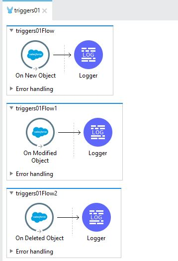

We have three different flows: one per event. After we receive the event, we simply send it to the logger.

In order to achieve this, we need two things:

- Create the MuleSoft project and use the Salesforce connector. In order to configure the Salesforce connector, you need a developer account ([https://developer.salesforce.com/](https://developer.salesforce.com/)).
- Create a Lead in Salesforce and play with it: update it and delete it.

The steps are:

1) Create a MuleSoft Project:

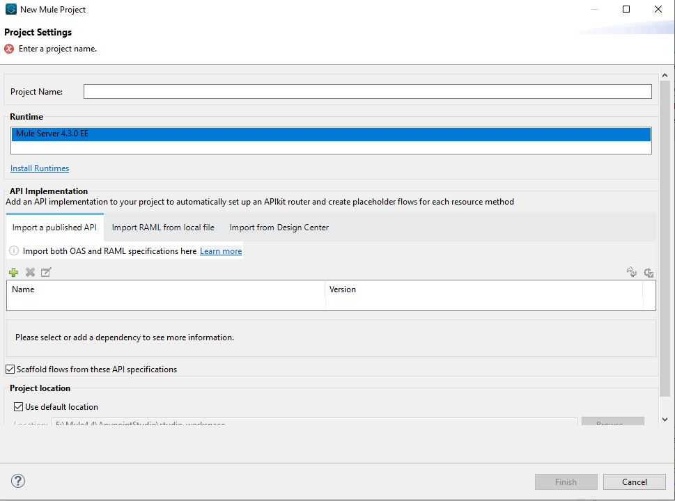

2) Name it: “triggers01” or any name you would like to use.

3) Once the project is created, let's create a properties file that will include the Salesforce connectivity information.

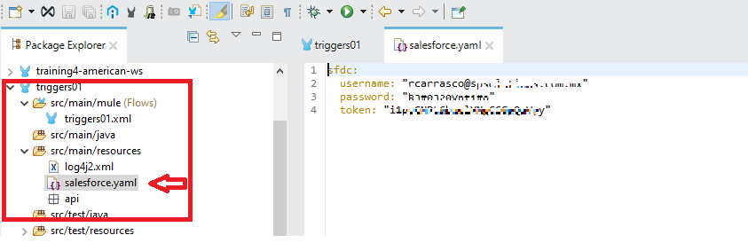

The token is generated via the developer.salesforce.com portal, as well as the user and password.

4) The properties (yaml) file needs to be located in the folder that is indicated in the previous image (`src/main/resources`).

5) Now let's create two entries in our Global Elements tab:

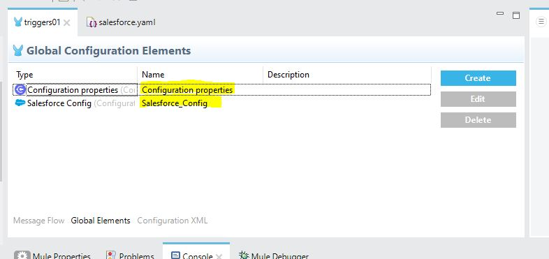

6) For the Salesforce Configuration, you should input this:

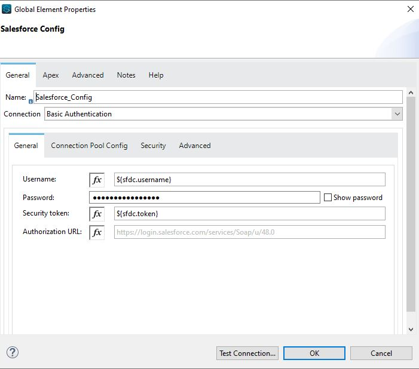

As you can see we have configured username, password and token. We’re getting the values from the properties file. It is a good practice to use this type of configuration. Once you typed it, click on Test Connection:

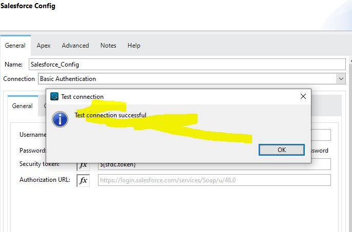

7) Now it’s time to create the flow. As we've previously mentioned, we will react to events. Therefore, we are not going to drag and drop HTTP listeners. We are going to drag and drop a Salesforce Connector capability.

8) Let's start with the On Create Event. But before that, make sure you have added the Salesforce Connector into your Mule Palette. Like this:

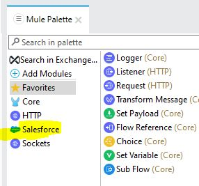

9) Now, let's add the On New Object. Please locate it, and drag and drop it in the Canvas:

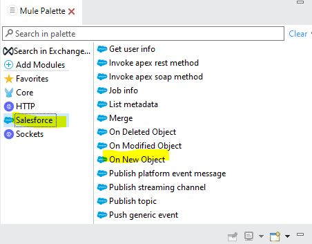

10) Now you should have this:

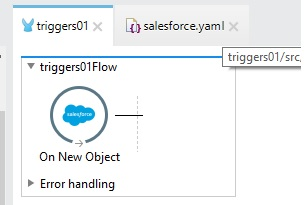

11) Repeat the same formula for these two events:

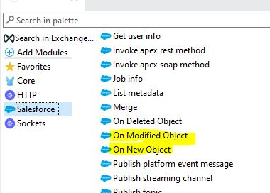

12) Drag and drop them into the canvas. And now you should have this:

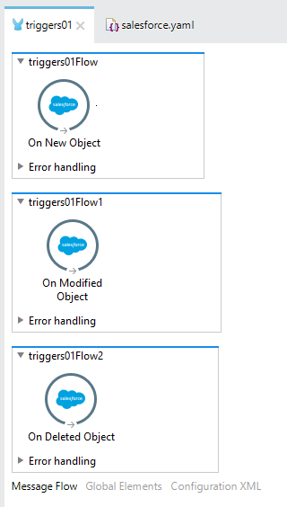

13) Now let's add a logger activity into the On New Object flow, and configure it like this:

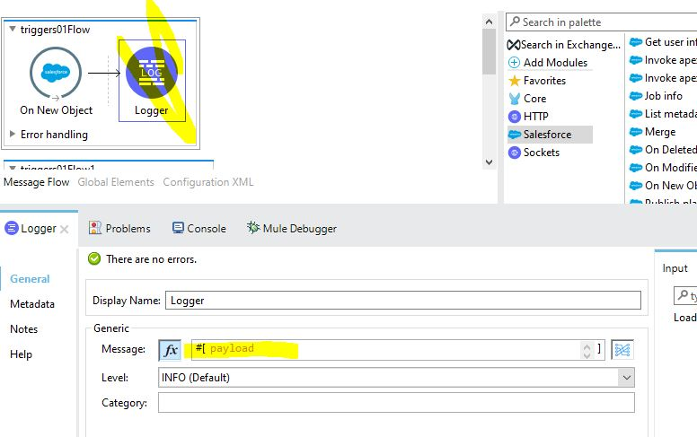

14) Repeat the same formula for the other two flows. Now you will have this:

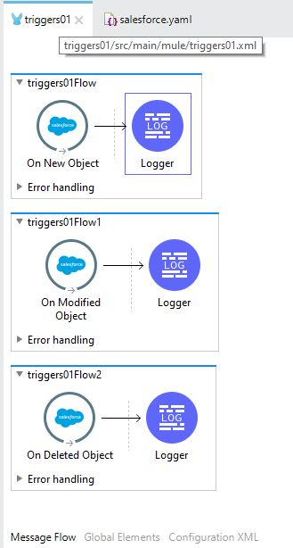

15) Now let's configure the three events. Let's start with the On New Object event. Double click the activity and configure it like this:

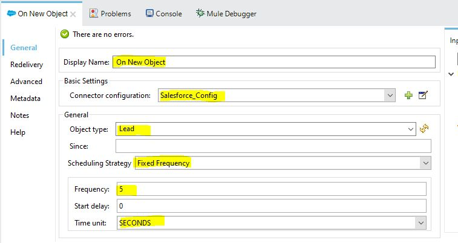

As you can see we've configured different elements:

- Display Name: It can be whatever you want.
- Connector Configuration: It should be already selected, since you created it in previous steps.
- Object Type: This is the entity to which you want to be informed if a new one is created, modified or deleted. In this case we are going to use Lead.
- Scheduling Strategy: It is the frequency to which we are going to get the event messages.
- Since: This is a key element because events in Salesforce are independent of the Connector. So, if you are already publishing events when you start the MuleSoft app, it will retrieve the messages that were created before. But if you choose a date, then only the events created after that date will be retrieved. So be careful with this field.
- Frequency: It is related to the Scheduling Strategy. In our case it will be every five seconds.
- Time Unit: In this case, seconds.

16) Now let's do the same thing for the On Modify and On Delete, like this:

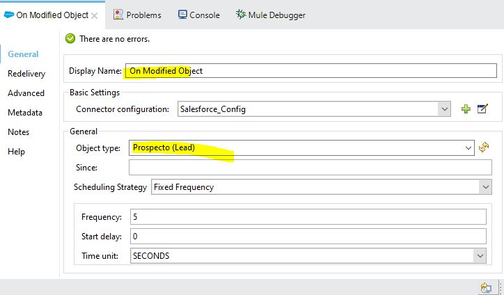

and

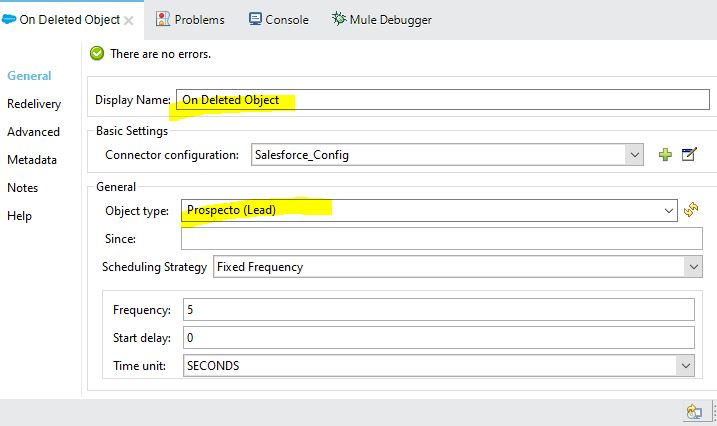

17) Now we are ready to test this. Right click your project and Run the project. The project should be in the DEPLOYED status. Like this:

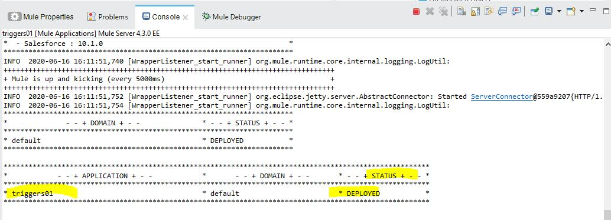

Now we are ready to create some Leads in Salesforce, and see how our MuleSoft application reacts to them.

## Triggering the Mule Flows

Go to https://salesforce.com and log in with your credentials. Look for the Leads tab:

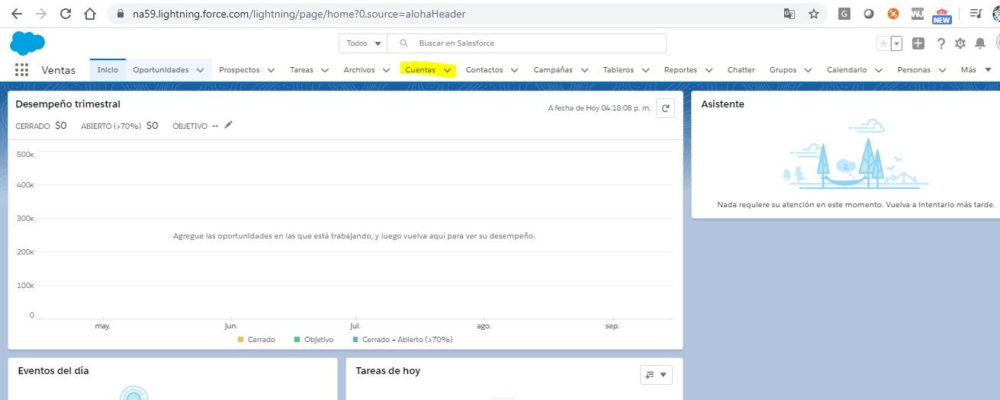

(Here you see it in Spanish, because my defaults are in Spanish. But in English it is “Lead”).

Let's create a new Lead:

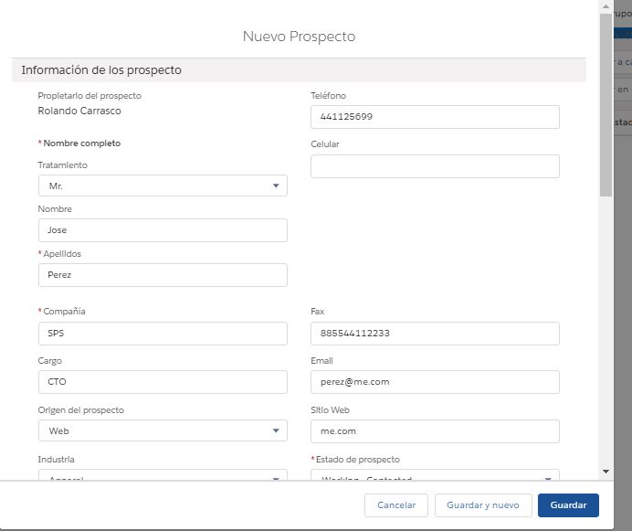

Just fill the necessary elements, and click create the Lead. After that, get back to Anypoint Studio, and see what was written in the log:

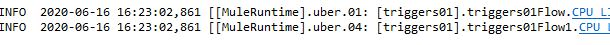

You have two new lines, and if you scroll to the right, you will see the details of the Lead you've created:

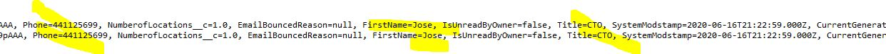

Why two?

Every time you create an object, it generates two events: one for creation, and one for modification.

Now let's test the modification event. Let's edit the Lead changing the contact email:

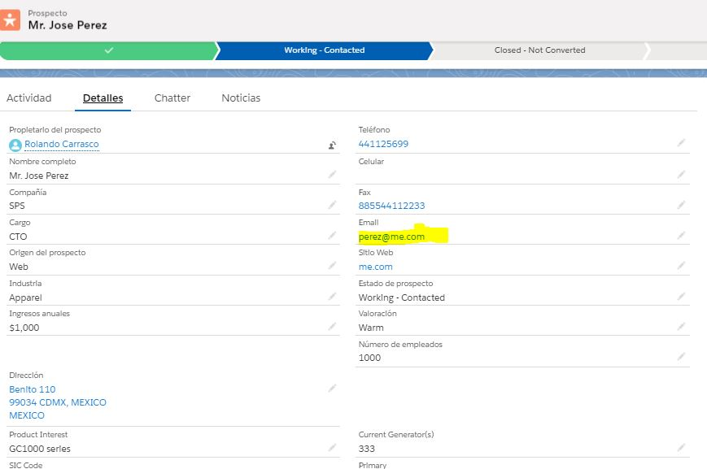

Let's edit the email address:

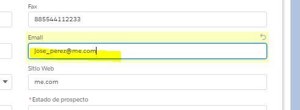

After you've edited, you will see a 3rd line in your log, where you can see the updated email address:

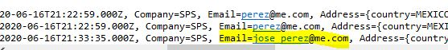

Pretty simple, right?

With this, you can change the perspective on how you can integrate Salesforce with other applications. The connector is very powerful and the events layer in Salesforce as well. And they are integrated, so you can do the math and conclude that this is a great ability within MuleSoft.
