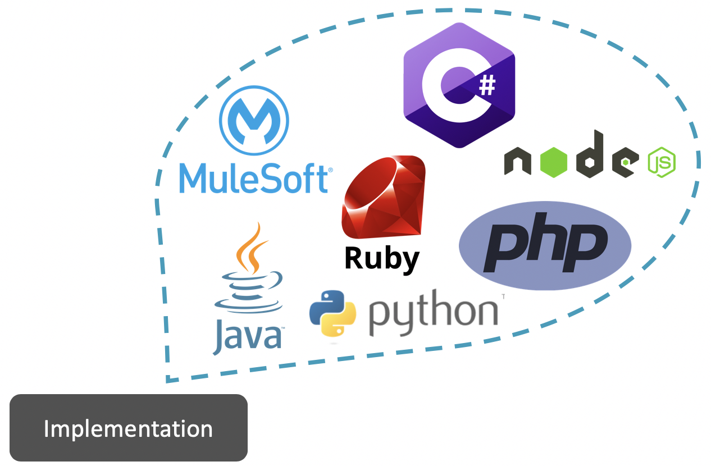

I know that the concept of an “API” can be a bit hard to understand. It’s such an abstract thing!

If you’re in technology, you probably have heard already about these APIs, but you may not fully understand what it means or what it is just yet. Hey, don’t worry. The same thing happened to me! It took me some time to really figure out what these are.

For this post, I’ll give you a simple explanation and a cool diagram for you to refer to whenever you get confused with the terminology.

## What *is* an API?

First of all, API is an acronym for Application Programming Interface. You can read the complete wiki definition [here](https://en.wikipedia.org/wiki/Application_programming_interface).

Now that the textbook definition is out of the way, let me start by stating that an API can be created in different programming languages or different technology tools. Let’s call the “body” of the API, the *Implementation*.

An API is composed of 4 specific aspects (plus the Implementation of the *actual* API).

- Inputs
- Operations
- Outputs
- Data Types

**1. Inputs**

The Inputs for the API are pieces of data or information that you can send to the Implementation.

**2. Operations**

This is where you define what you expect the API to do with the Inputs you will be sending to the Implementation.

**3. Outputs**

These are also pieces of data or information, but instead of *sending* these to the API (or Implementation), you will be *receiving* these *from* the API (or Implementation).

**4. Data Types**

The data or information that you send to the API and that you receive from it must be of some type. It can be numbers, words, an Excel file, a Java Object, a CSV file, a JSON or XML format, etc.

You can send, for example, some input numbers and tell the API which operation you expect it to process, and get some more numbers in return as the output. Maybe you send your name as an input, and you receive a “Hello” plus your name as the output. All these formats are the Data Types.

## Defining an API's Request and Response

**Request**

The combination of Inputs (along with their Data Types) and Operations is what we call a “Request.” In other words, everything that you send to the API or the Implementation is a Request (RQ).

**Response**

The Outputs from the API or Implementation, as well as their Data Types, are what we call a “Response.” Put simply, everything sent back from the API to you, the caller, is a Response (RS).

## Putting it all together

The Request is formed by the Inputs we want to send to the API. This includes their specified Data Types and the specific Operation that we want the API to process and return to us.

This Request is sent to the Implementation of the API, which is processed by the code, and then the Outputs with the specified Data Types are returned to us.

## Um… Ok… Not quite sure what an API is yet?

APIs are a very abstract concept, as I mentioned before, and I wouldn’t blame you if you went through this complete post and still felt confused as to what an API is. Not to worry, my friend! I thought of that too.

I wanted to have this explanation clarified first, so you could at least keep in mind this last diagram. Save this picture somewhere because you may need to re-reference it as you keep learning.

As you may have guessed from the title, this is only Part 1 of this series! We will continue to go on a journey through the wonders and philosophies of APIs. [Part 2](https://www.prostdev.com/post/understanding-apis-part-2-api-analogies-and-examples) will give you some analogies and examples of APIs. This way, you’ll end up with a better picture of this weird, but needed, concept.

Let me just finish up with a quick recap. You are allowed to forget what you learned; it happens to everyone! The important thing is to keep trying and don’t give up.

## Recap

- API is an acronym for Application Programming Interface.
- The “body” of the API is also called the *Implementation*.
- APIs are composed of Inputs, Operations, Outputs, and Data Types.
- The Request is what we *send* to the API: Inputs with their Data Types and Operations.
- The Response is what the API *returns* to us: Outputs with their Data types.

That’s it for now! You can subscribe to this blog to receive an email as soon as new content is published. You can also follow ProstDev on social networks to see more of our content. :)

*Prost!*

-Alex
