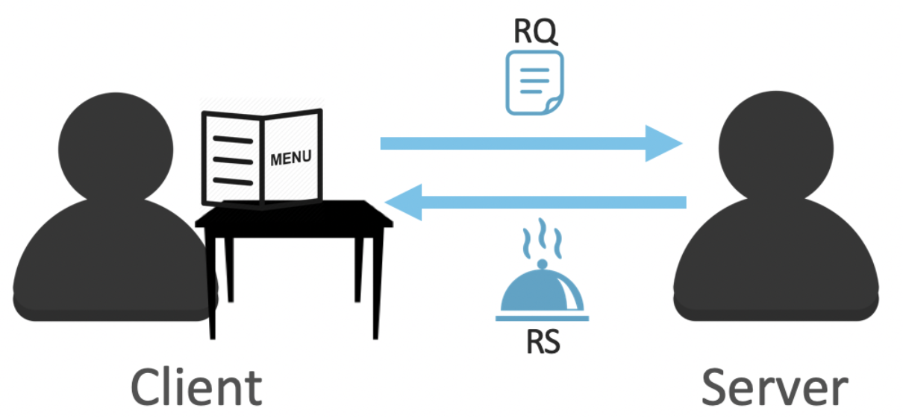
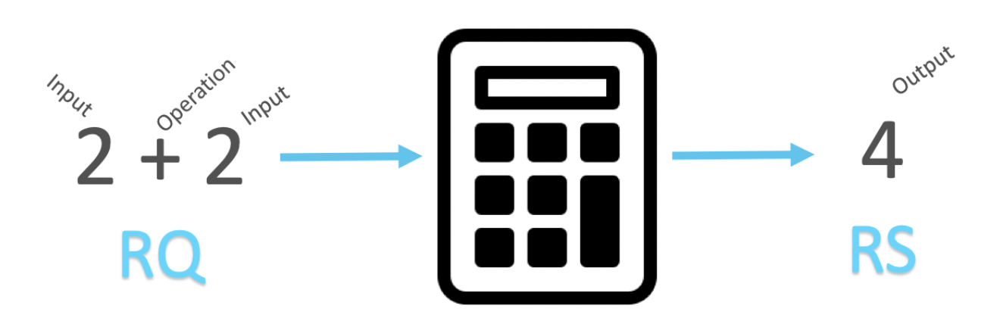
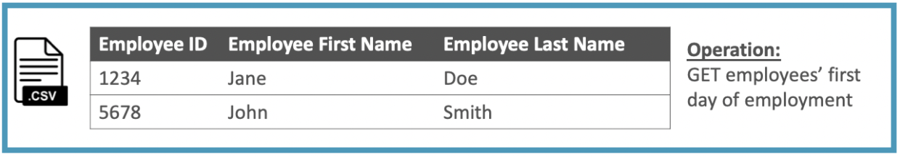
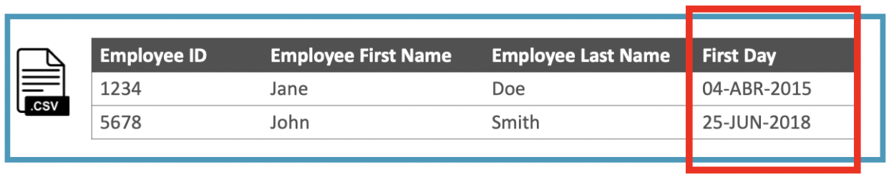
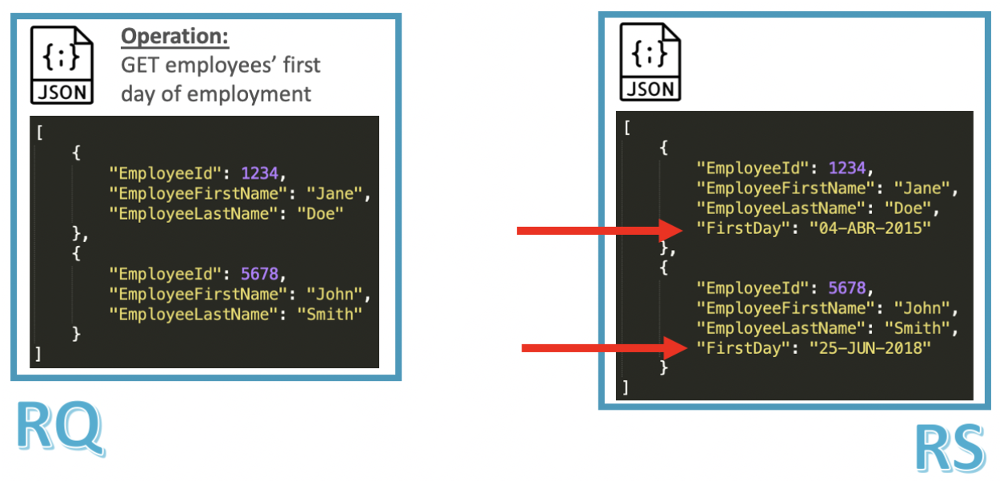

In Part 1 of this series, “[Understanding APIs (Part 1): What is an API?](https://www.prostdev.com/post/understanding-apis-part-1-what-is-an-api),” we learned about the acronym, the definition, the four aspects of an API, and how everything works together. We also defined this cute little diagram below. If you feel like you forgot some pieces, you can always go back and read the recap at the end for a quick summary.

When I started learning what an API was, it took me some time to really start understanding this concept. It can become so abstract! When I look at practical examples of applied technologies, it can really open my eyes to understanding a theory. In the case of APIs, looking at different examples helped me get a better idea of this concept.

This post will complement what you learned in Part 1. You will learn about some analogies and real-life examples of APIs to understand better what they are.

### API Analogies

Before I begin, I just want to get something clear: when you are using or *consuming* an API, you don’t really care about how the Implementation works. It doesn’t matter if the Implementation is built on Java, Python, or MuleSoft; it’s still going to give you the Response that you are expecting according to your Request.

You don’t care about what systems the API needs to call, if any, or if the API is using JSON or CSV as the internal Data Type. None of this is really visible to you anyways. You just want your Request to be processed and your Response to be returned.

**1. Restaurant**

Imagine you arrive at a restaurant. You sit in a chair and start looking at the menu. Then the server comes to ask for your order. You say that you want a hamburger because it was one of the choices that you selected from the menu. The employee goes to the kitchen, and someone cooks your meal. Sometime later, the server comes back with your hamburger.

*“How is this an analogy for an API?”*

You, the client, give a Request to the server: you want to receive a hamburger. The server does whatever needs to be done to deliver the order.

Then, you receive a Response with what you asked for: a hamburger.

Notice how I didn’t add the part of the server going to the kitchen, or the chef cooking your meal. This is because we only care about what our order was and what was delivered to us.

**2. Calculator**

Now, let’s say that a regular calculator is an API. You send a “2+2” Operation as a Request, hit the equal button, and receive a “4” as a Response.

Once more, you’re not interested in how the calculator processed this information; you just want an accurate response to the Inputs and Operation that you sent in the Request.

**Quiz**: What would be the Data Types in the RQ and RS in this scenario?

*The answer will be revealed in the next post.*

### API Examples

Now let’s see some examples of how APIs can be used in real-life scenarios.

**1. Human Resources API**

You started by being a customer at a restaurant, then a calculator user, and now you are the head of the Human Resources (HR) department at FictionalCorp. Hooray!

As the HR head manager, you obviously know how to use the HR API to process the company’s information regarding the employees. You want to check what the employees’ first day of employment at FictionalCorp was, and you already know that the HR API accepts Requests in the format of a CSV file. Your Request would look like this:

There’s a CSV Data Type, the Input information of the two employees (*we’re a startup, ok?*), and the Operation telling the API what to do with this data. You click “Send,” and off it goes!

Within seconds the API returns the Response with the information you requested:

It returns the same Data Type (CSV format) and an Output file that contains the same information you sent in the Request, PLUS, a new field called “First Day,” which contains each of the employees’ first day of employment at FictionalCorp.

You may not know if the API is connected to a Database or to an external system where this information is kept, but it returned what you requested in the first place, which is all you need.

What would happen if the RQ/RS was in a different format, you say? Well, this HR API also accepts the [JSON](https://www.json.org/json-en.html) Data Type. Here’s how that would look:

We have the same Inputs, same Operation, and same Output, but the Data Types for both the Request and the Response are different.

**2. Real-life APIs**

Do you want to see some actual APIs? Follow these links to see their documentation:

- [Twitter API](https://developer.twitter.com/)
- [Slack API](https://api.slack.com/)
- [Google Maps API](https://developers.google.com/maps/documentation)
- [Facebook APIs](https://developers.facebook.com/)

It’s ok if you don’t understand everything that you see in these pages. This is just to give you an idea of what real APIs look like.

## Recap

To recap, when you’re calling or *consuming* an API, you don’t really care about how the Implementation works; you just want your Request to be processed and a Response to be returned according to the Inputs and Operations that you sent in the RQ.

Stay tuned for Part 3 of this series if you want to know the answer to the quiz in the second analogy: the calculator. The question was: *What would be the Data Types for the RQ and RS in this scenario?*

I hope you are starting to get a better picture of what APIs are. Contact me or leave me some comments if you have any additional questions - I’m happy to help.

Keep learning and don’t give up!

*Prost!*

-Alex
